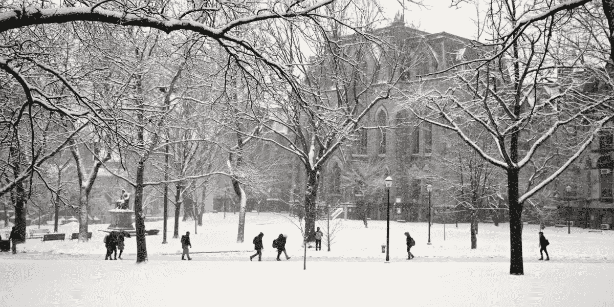
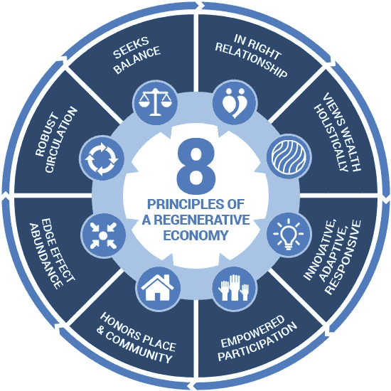
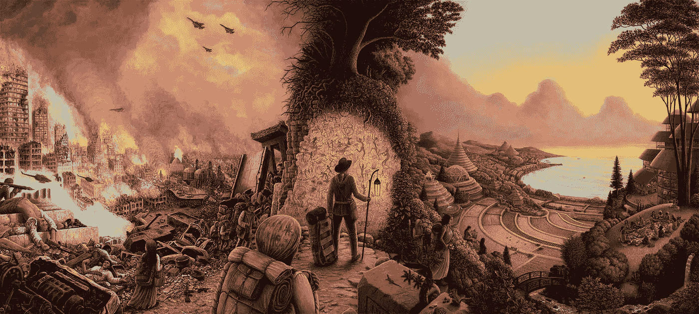
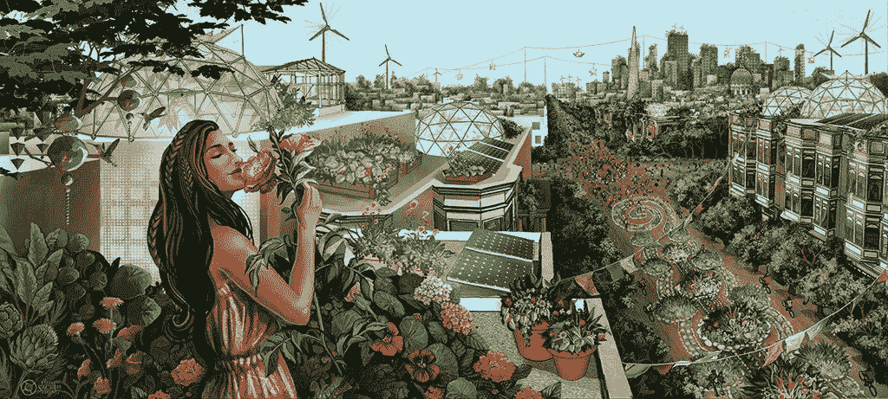
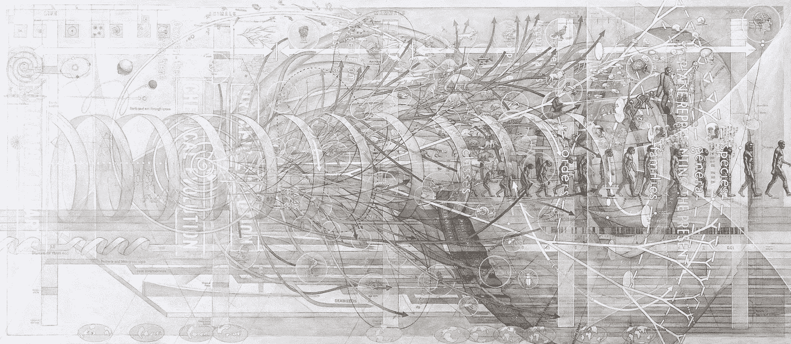
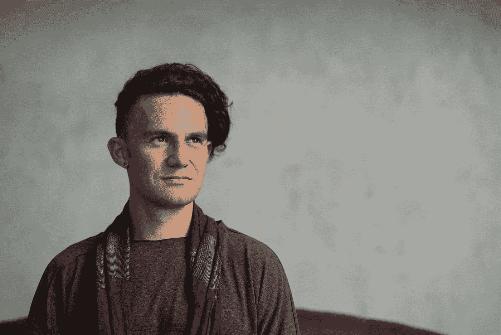

# 邀请沃顿商学院在⎈🗣转型时期的领导

> 原文：<https://medium.datadriveninvestor.com/inviting-whartons-leadership-in-a-time-of-transition-3ca10053fa9e?source=collection_archive---------10----------------------->

*这封信旨在成为沃顿社区和更广泛的商业世界中对社会最有影响力的机构之一的演变感兴趣的人们的* ***对话的开始和集合点*******商学院*** *。**

**如果您愿意参与对话，请填写此* [*快速表格*](https://docs.google.com/forms/d/e/1FAIpQLSfaSdtZaYIRN3qVsS6WU2vP2BsMg4ZNtmjWDd4c_I0NuTPojg/viewform?usp=sf_link) *，加入* [*沃顿智慧脸书集团*](https://www.facebook.com/groups/1514086118668798) *(如有加盟)，或者* [*直接与我联系*](mailto:andrewmurraydunn@gmail.com) *。我会很高兴也很荣幸听到你的想法和想法。**

*更新 3/6/21: [《宾夕法尼亚日报》发表了这篇文章的节略版](https://www.thedp.com/article/2021/03/upenn-wharton-business-school-new-model)！*

*亲爱的沃顿+现代商学院社区，*

*我( [Andrew Dunn](https://www.andrewmurraydunn.com/) W'12)，与沃顿商学院研究生和本科生项目的学生和校友一起，希望表达对商学院发展轨迹的关注，并共同探索一条大胆的前进道路。*

*在这个商学院教育史上最关键的时刻，我们看到了明确的机会，让我们展示应对我们时代复杂挑战所需的领导力，同时重新肯定沃顿作为高等教育创新和卓越象征的声誉。*

> *“这不仅仅是做好事。它是关于将好的东西整合到业务的核心，所以它不是无关紧要的，而是根本的。”沃顿商学院院长艾丽卡·詹姆斯*

**

# ***上升的时间***

*早在 2020 年的事件暴露出深刻的系统缺陷之前，就有一个[越来越多的声音](https://medium.com/zebras-unite/zebrasfix-c467e55f9d96)强调迫切需要一种与我们自己、彼此和地球相处的新方式。*

*在商界，我们已经看到员工们发起了抵制和罢工，T2 也在大型科技公司成立了工会。从[拉里·芬克](https://www.blackrock.com/corporate/investor-relations/larry-fink-ceo-letter?cid=ppc:CEOLetter:PMS:US:NA)到[雷伊·达里奥](https://www.linkedin.com/pulse/world-has-gone-mad-system-broken-ray-dalio/)到[马克·贝尼奥夫](https://in.finance.yahoo.com/news/davos-2020-salesforce-founder-capitalism-is-dead-181643945.html)的商业领袖们发表声明反对市场原教旨主义和无休止的增长。沃顿大学本科生[反对成功的标准](https://www.thedp.com/article/2019/11/jordan-williams-book-wharton-penn?utm_source=DP%20Headlines%20%26%20Breaking%20News&utm_campaign=bfda3b43b3-EMAIL_CAMPAIGN_2019_11_07_09_34&utm_medium=email&utm_term=0_370b4800ba-bfda3b43b3-353405745&fbclid=IwAR03zTliF9P9uMpwbrjAGBLSjFC6_hvVwmZzO2oJlTKdl71Vu6Skxrz0_Ro)。达沃斯论坛[解构商学院排名](https://grli.org/resources/2019-dialogue-at-wef-davos-on-business-school-rankings/?fbclid=IwAR1j58S_9bKBKCHDLC58U8a30PkO1mRDzt5NX0gLtPrkBERFjW6uLsNgsig)。哈佛商学院最热门的新课程是[重塑资本主义](https://www.businessinsider.com/harvard-business-school-professor-we-can-build-equitable-capitalism-2020-10)。*

*去年秋天，[多利益主体倡议完整性研究所的研究人员得出结论](https://www.msi-integrity.org/beyond-corporations/):*

> **“最重要和最具变革性的人权项目是一个在人权领域很少受到关注的项目:挑战公司本身并重新想象我们的经济企业。”**

**

*[*The Capital Institute*](https://capitalinstitute.org/8-principles-regenerative-economy/) *suggests the universal patterns and principles the cosmos uses to build stable, healthy, and sustainable systems throughout the real world can and must be used as a model for* economic-system *design (i.e. regenerative economics).**

*即使有远见的影响、可持续性、包容性、区块链和其他颠覆性项目在商业世界涌现，通过做好事来做好事的咒语*并没有滋养那种可以创造一个基于关怀、联系、治疗和平等的繁荣再生的未来的变化。**

*这是一个多层面的问题，牵涉到经济激励、个人心态、文化规范以及复杂而暴力的历史。*

*当我坐在那里询问在这个不确定的时期我该做什么时，我不断回想起与沃顿社区的许多利益相关者联系的网络特权，他们似乎有这个[不完整]难题的碎片。我们是社会企业家、影响力投资者、顾问、领导力教练、推动者。学生、工人、父母、老人、哲学家、现任和前任高管、教育家、律师、医生。*

*我们不想摧毁商学院。我们对大声疾呼、指责或犯错不感兴趣。我们希望在下一轮升级中提供帮助。我们看到沃顿社区有大量的机会崛起。我们希望从那些有能力改善系统的人那里召集领导。*

*这样做符合我们理性的自身利益和世界利益。我们希望成为自豪的校友，真诚地希望在有生之年支持我们的母校(校友对学术体系的满意度和当前校友对母校的参与度之间有着显著的正相关关系)，鼓励朋友、家人和追随者，在一个日益数字化和民主化的世界中，学位和人才的价值不仅仍然存在，而且正在以体面的方式上升。*

**

*[Mark Hensen](https://www.markhensonart.com/): New Pioneers*

# ***与任务重新连接***

*约瑟夫·沃顿的开创性[愿景](https://www.wharton.upenn.edu/history/)是让毕业生具备知识的广度和深度，成为*“国家的支柱，无论是在私人生活还是公共生活中。”**

*快进 Amy Gutman 总统的 [Penn Compact 2022](https://president.upenn.edu/penn-compact) 激励社区成员*“创新，彻底包容，并积极影响他们的地方、国家和全球社区。”**

*在一个日益复杂和不稳定的社会中，我们担心毕业生被剥夺了知识和智慧的多样性，没有为成为国家的强大支柱做好充分准备(国家似乎正在接受临终关怀)，缺乏必要的工具和意识来[推动社会超越常规](https://medium.com/@sexandstartups/labor-delivery-birthing-the-new-economy-d98b49b4b40d)或渐进变化到*深层变化*。*

> *沃顿商学院如何迎接这一时刻并以一种良好的方式适应，因为聚集的批评声音越来越大，声称按照当前的成功标准，越多的公司脱颖而出，文明就失去得越快？*

*幸运的是，沃顿商学院的领导层已经在考虑这个问题了。前沃顿商学院院长杰弗里·加勒特(Geoffrey Garrett)认为 *“要想成功，所有组织不仅需要不同的领导者，还需要全新的领导风格。”**

*而[市场营销学教授阿梅里克斯·里德评论道](https://knowledge.wharton.upenn.edu/article/the-new-philanthropists-more-sophisticated-more-demanding-and-younger/) *“学生们在说，‘我想成为行业领袖，但我不想出去追逐物质享受。我需要更深入的东西。除了通常的商业成功标准，我还需要自我实现。”**

*沃顿商学院院长艾丽卡·詹姆斯断言:“我们的竞争是自满，当你是最好的时候，很容易变得自满。因此，我希望在我的院长任期内做的一件事是，激励我们思考我们希望如何定义未来的商业教育，而不仅仅依赖于我们过去所做的事情。”*

*现在是 2021 年。疫情提供了一个独特的机会来重新评估我们正在走的道路。千禧一代开始继承所有这些制度。让我们一起努力来支持一个优雅的过渡。让我们庆祝我们已经走了多远。让我们诚实地看待指标、使命、文化和方法。让我们算算过去。忽视或漠视[发现学说](https://academiccommons.columbia.edu/doi/10.7916/d8-zgp1-6446)对我们现代经济、社会和政治体系的影响不再是可接受的。*

> *好吧，真正的谈话。一切照旧实际上是将整个事情推向自我终结。就像，人们都同意的事情，对吧？所以我们必须做一些完全不同的事情。解决方案不是火箭科学。他们只是没有被优先考虑或广泛推广。对于我们需要转变的方向，我们有一个相当好的想法。我们将不得不冒一些大风险。去适应。就像我们自古以来所做的那样。或者 GSB/HBS/哈斯会先做，我们跟着他们做😂*

*说真的。作为世界上最具影响力的机构之一，沃顿商学院培养出的领导者对其利益相关者的生活产生了巨大的影响，因此它有责任不断挑战自己，做得更好。是我们发挥全部潜力的时候了。否则我们到底在做什么？*

**

*[Jessica Perlstein](https://jessicaperlstein.com/): The Fifth Sacred Thing*

# ***邀请设想一个更美好的商学院***

*我们正在向所有感兴趣的沃顿利益相关者发出信号，表明我们有兴趣扩大这一对话，讨论在未来时代带来勇敢的领导力的机会。*

> *沃顿商学院正在经历一场快速的蜕变，这场蜕变激发了全球商业教育的发展，这也是人类在人类世得以生存和繁荣的最重要原因之一。*

*这是一个长期的招聘策略吗？*

*但是我们在采用曲线上还很早。改变需要时间。*

*因此，今天的主要目标是播种思想，引发对话，并与那些对多代人的可能性感到兴奋的人建立关系，并愿意尝试将更高的八度融入下一代商业领袖的教育经历中。*

*我们并不声称自己有答案，尽管我们感觉到我们与许多可能对这一共同努力有用的线索联系在一起。我们的社区有 100，000 人，他们有着不同的生活道路、价值观、能力和意识。我们很多人都在乎。我们在这里，找到彼此，并准备提供帮助。像 NYU 和剑桥这样的学校已经在像内部 MBA 和 T2 霍默顿变革者这样的项目上取得了进展。让我们用沃顿的聪明才智走到一起，找到跨学科的解决方案。我们需要的东西都有了。*

***我们感兴趣的高效行动类型示例包括:***

*   ***创建一个由不同沃顿社区成员组成的委员会**为机构的长期战略愿景做出贡献*
*   *发展一门 [**再生经济学**](https://capitalinstitute.org/8-principles-regenerative-economy/) **课程**并最终集中*
*   *与宾夕法尼亚大学积极心理学中心建立双学位项目，以扩大获得心理支持的途径*
*   *在校园招聘中为企业影响力创造进一步的边界*
*   ***改革大一的课程**包括下面列出的一些课程建议，以及目的发现、影子工作和为那些想从他们没有自主选择的生活道路中转移出来的人提供的优雅的下坡路*
*   *重新想象传统的成功衡量标准(比如 SAT/GMAT 分数和起薪)来包括个人幸福和成就感*
*   ***限制屏幕在课堂上的使用**，关键教育需求除外*
*   *扩展**校友导师计划，**特别关注利用走上不同道路的校友*
*   ***调整招生标准**选拔合作、自知、同情和同理心等品质*
*   *建立相当于*的读者拥护者* /特派员**对机构**的稳妥的声音批评*
*   *增加职业服务的能力，以**提供替代职业道路的建议***
*   *为计划创办公司的学生创建 [**希波克拉底誓言**](https://northstar.guide/ethicspledge)*

******

***[Mark Hensen](https://www.markhensonart.com): Venice of the North***

***其核心是核心课程。我们想挑战沃顿商学院，让它在本科生和研究生两个层次上彻底改革其关键内容，以更深入、更多样化和更全面的技能和意识来培训下一代领导者，我们预计这将是应对未来日益复杂的挑战所必需的。***

***不是把基本面扔掉，而是补充平衡。***

> ***我们需要问这样一个问题:社会对下一个马克·扎克伯格有什么要求？如果他们创造的任何东西都是他们价值观、偏见、故事和研究的表达，那么我们需要什么来支持那个人学习，以便他们能够更好地管理他们的创新，与地球上生命的福祉保持一致？***

*****扩充当前课程的领域示例:*****

*   ***新常态下的商业***
*   ***2051 年的商业***
*   ***反种族主义和反压迫***
*   ***系统思维***
*   ***与你生命的召唤相连***
*   ***情商***
*   ***作为商业领袖管理压力、倦怠和生活质量***
*   ***备选所有权、融资和治理结构***
*   ***人道技术专家的道路***
*   ***道德和企业家精神***
*   ***工作场所文化/人员管理/心理安全***
*   ***一部商业世界的人民史***
*   ***[甜甜圈经济学](https://doughnuteconomics.org/about-doughnut-economics)***
*   ***心态和世界观***
*   ***将古老而本土的智慧应用于现代商业***
*   ***领导力的新原型:包容、进化、以心为中心***
*   ***非暴力沟通***
*   ***发展心理学***
*   ***集体智慧和感知***
*   ***幸福经济***
*   ***Teal 组织***
*   ***弹性组织***
*   ***所以你想拯救世界？***

***我们还希望提升已经为这个升级的机构播下种子的努力的浪潮:***

*   ***[沃顿社会影响倡议](http://n.upenn.edu)***
*   ***[沃顿健康](https://www.facebook.com/whartonwellness/?ref=gs&fref=gs&dti=1514086118668798&hc_location=group)***
*   ***[沃顿公平、多元化和包容性小组](https://groups.wharton.upenn.edu/wedig/home/)***
*   ***[LGST 227:成功的文学](https://magazine.wharton.upenn.edu/issues/spring-2016/learn-to-define-your-true-success/)***
*   ***[MGMT 799:挑战时代的领导力](https://www.thedp.com/article/2020/11/penn-wharton-management-risk-class-covid-19)***
*   ***[宾夕法尼亚正念项目](https://www.pennmedicine.org/for-patients-and-visitors/find-a-program-or-service/mindfulness)***
*   ***[P3:目的、激情和原则](https://leadership.wharton.upenn.edu/p3/)***
*   ***[指导大学生的发展和教育](https://leadership.wharton.upenn.edu/guide/)***
*   ***[高管辅导和反馈计划](https://leadership.wharton.upenn.edu/ecfp/)***
*   ***[penndos](https://www.facebook.com/penndoes/?ref=gs&fref=gs&dti=1514086118668798&hc_location=group)***
*   ***[宾夕法尼亚大学蓬勃发展项目](https://faculty.wharton.upenn.edu/wp-content/uploads/2016/11/Penn-Program-for-Flourishing-Flyer-Final.pdf)***

***人们创造企业，创造社会。我们设想这样一个未来:未来的学生申请沃顿商学院，不是因为他们认为他们能够最快地赚到最多的钱，而是因为他们能够发展领导能力，以实现他们在公共生活中服务和丰富个人生活的最高表现。***

***学校竞争的是社会影响、爱和公正，而不是考试分数和起薪。在这里，沃顿商学院每年向世界释放数百名著名的领导者，激发创造力的复兴和一种新型企业的竞争，这种企业在这个充满活力的星球上满足所有人的需求。***

***我们看到了沃顿商学院可以采取的明确行动，将自己定位为历史上最具前瞻性和责任感的商学院，并感觉到有很多其他人在等待一个背景出现并贡献他们的天赋。***

***我们相信有无限的未开发的机会来更好地支持现在的学生和校友的个人和职业生涯。在我们强大的全球社区中，我们拥有一切我们需要的东西来实现这一目标。***

***我们是来帮助这个给予我们如此多的机构的。我们关心接下来会发生什么。我们被训练去发现一个好的市场机会。这是一个每个人都能赢的游戏💪🏼***

******

***[Casey Cripe](http://www.caseycripe.com/): Evolution***

# *****个人为什么*****

***我投入精力是因为我关心这个地方的未来。我很幸运有机会去探索不同的社区、想法和经历。我想知道我要扮演的角色之一是不是作为一座桥梁，在不常交流和协作的世界之间编织联系。***

***我理解世界的不稳定状态，欣赏我与有影响力的人的接近，并看到如何以全方位双赢的方式前进的独特可能性。很容易解构商业世界。我知道这方面的事情，但我更感兴趣的是重建。我有远见和精力将想法和人聚集在一起。***

***我在沃顿的本科经历也颇具挑战性:在课堂上难以集中注意力，经常质疑我的学位选择和职业选择，[沉溺于希腊生活](https://medium.com/@aandrewdunn/paying-my-debts-to-her-e5be285ff653)，沉湎于未来几十年不得不从事与我内心无关的工作的极度恐惧中。我迷失了，没有得到我需要的支持。我觉得有必要支持那些可能经历类似挑战的人。[在这里看到更多关于我为什么做这个和相关项目。](https://www.andrewmurraydunn.com/More-on-Why-I-m-Doing-This-786920f102b14ebab80fb60a28696c84)***

> ***许多学生用“佩恩脸”这个词作为一种口语，指学生在快乐和无忧无虑的成功的外表下隐藏他们持续的焦虑、抑郁、对失败的恐惧和疲惫的普遍做法— [**迷失方向指南 2020**](https://penndisorientation.wordpress.com/)***

***我的可取之处是企业家社区。从那时起，我就像旋风一样:创办公司，追逐纽约的快速生活，在印度和秘鲁寻找真相，为劳工组织惹上麻烦，开创一个新的人道技术产业，创办天使投资集团，质疑性别认同和资本主义，与活动家和新兴政治运动一起生活，试图拯救世界，这样我才能感觉完整。***

***这些经历让我谦卑，也让我接触到了多种多样的认知、存在和行为方式。通过我与 [Siempo](https://wefunder.com/siempo) 的合作，我试图为企业家精神塑造一个更加道德和包容的*什么*和*如何*。作为 JumpScale 的一名顾问，我与一个强大的生态系统联系在一起，这个生态系统支持组织的弹性和健康。通过 [Flexport](http://www.flexport.com/) 和 [One Nation](http://onenation.party) 我帮助设计和传播了前沿的领导力发展培训。去年，我召集了一批对资本有不同看法的投资者，并在 Nexus、家族办公室协会、Keep Families Giving 和 Strategic Impact 群组上发表演讲，讨论如何让财富与影响力和目标相一致。这些天来，我辅导/咨询那些准备好以新的方式在世界上创造价值的创业者。***

***我用一个故事里的故事来结束。在我们 2012 年的毕业典礼上，活动家 [Geoffrey Canada](https://hcz.org/about-us/leadership/geoffrey-canada/) 分享了一个[感人的愿景](https://www.youtube.com/watch?time_continue=1110&v=cTF1ytiR9gE&feature=emb_title)关于未来，我们班培养勇气来“为失败的团队而战”***

> ***我会和我的团队一起战斗下去，因为这是我们决定要做的。***
> 
> ***但这是我的幻想。不久的将来，有一天，我和我的团队将与黑暗势力作战。他们会试图逆转我们的进程。伤害我们的孩子。摧毁他们的灵魂。我突然意识到我已经无能为力了。反对我们的力量太强大了。失败就在眼前。***
> 
> ***我不会低头。我不会害怕。我会看着我的队伍的眼睛说:“如果这是最后一次，让我们战斗到底。”***
> 
> ***突然在我身后，我会听到巨大的轰鸣声。我会转过身去，看到一个最辉煌的景象。一支由准备更充分、更聪明、更强大的年轻战士组成的军队。他们从我身边蜂拥而过，一头扎进了战斗。***
> 
> ***真理、公平、自由、平等的敌人势均力敌，开始退却。***
> 
> ***我抓住几个年轻的战士，问他们:***
> 
> ***“你是谁？你从哪里来的？”***
> 
> ***他们说:“你不记得我们了吗？我们是宾大 2012 届的！”***
> 
> ***当我退居二线，让下一代去做我做不到的事情时，我意识到并没有失去一切。我们会赢的。***

***这次谈话有一种超现实主义的味道。我哭了。这似乎是一个悲剧性的邀请；这是一个我们可以放心地为那个标志性的时刻高兴地考虑的问题，在此之前，我们每个人都选择花费过去几年的时间来准备。但是他知道，通过在那个成熟的高峰时刻播下所有的种子，其中的一些种子有一天可能会绽放出美丽的花朵。***

# *****接下来的步骤*****

*   ***[**如果您想参与或被保持在循环中，请填写此快速表格**](https://docs.google.com/forms/d/e/1FAIpQLSfaSdtZaYIRN3qVsS6WU2vP2BsMg4ZNtmjWDd4c_I0NuTPojg/viewform?usp=sf_link) 。在 2021 年，我们希望召集不同的利益相关者进行对话，探索这里有什么(数字的，最终是物理的)。***
*   *****加入** [**沃顿智慧**](https://www.facebook.com/groups/1514086118668798) **脸书集团**(如果沃顿或者宾大附属的话)分享一下你对这个邀请的反应。这个小组成立于 2018 年，旨在汇集对个人成长感兴趣的校友，并将其与他们在世界上的工作相结合。我们在旧金山和纽约举行了面对面的聚会，并与大学生沃顿健康俱乐部组织了一个替代职业小组。***
*   *****给我写信**,邮箱:andrewmurraydunn，邮箱:gmail dot com，让我知道你的想法或安排一次有针对性的谈话。建立关系是我在这个阶段的首要目标。***
*   *****与沃顿商学院/宾夕法尼亚大学/商学院社区的其他人分享这个中等职位**。我们希望这些组织努力可以作为一个案例研究实验，最终可以为邀请其他机构、学术机构和其他机构的转型提供模板。***
*   ***思考一下你对一所更漂亮的商学院的愿景。开始与朋友、家人和同事交谈。你会改变什么？***

***感谢您的信任和关注，***

***–安迪·穆雷·邓恩&朋友公司***

***如果你喜欢这篇文章，请考虑鼓掌👏🏼(如果你非常喜欢，你可以鼓掌 50 次😂)***

******

***安德鲁(W'12)在道德技术、系统变革、影响力投资和个人发展的交叉领域担任发起人、桥梁编织者和思想领袖。***

***[网站](http://www.andrewmurraydunn.com)
[LinkedIn](https://www.linkedin.com/in/andrewmurraydunn) | [脸书](http://facebook.com/andrew.m.dunn/)
[推特](http://twitter.com/aandrewdunn) | [Instagram](https://www.instagram.com/andrewdunn/)***