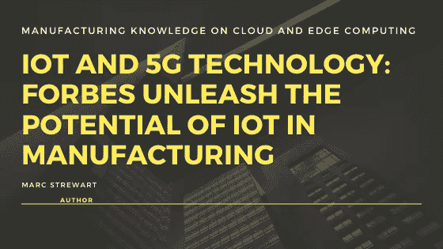

# 物联网和 5G 技术:福布斯释放制造业潜力

> 原文：<https://medium.datadriveninvestor.com/iot-and-5g-technology-forbes-unleash-the-potential-in-manufacturing-industry-9c45f2144251?source=collection_archive---------14----------------------->

[Manufacturing Knowledge on Cloud and Edge computing](https://straitsresearch.com/report/ai-in-iot-market)

**正在将物联网和 5G 技术**集成到其虚拟技术中的公司将能够在今天和未来实现其团队的目标，并在最新的动态商业企业环境中保持积极的优势。随着数十亿美元投入 5G 网络的开发，我们可以期待一波全新的可能性——所有这些都可能改变工业和制造业，带来经济繁荣和超连接性的新技术。

**5G 和物联网技术的未来发展趋势**

> 当两种技术结合使用时，可以为公司带来可观的价值。5G 网络在数据速度、延迟、效率、可靠性、功能和安全性方面为制造商提供了巨大的优势。该技术旨在像光缆一样快速可靠，并以更低的成本提供相同的容量，同时具有更大的灵活性。

与之前的 wi-fi 技术相比，5G 将改善移动宽带服务的运输，预计将引导一系列新的答案。完全基于人工智能的数字技能、独立操作、数字现实和无人机是将雇佣 5G 网络来提供巨大的生产力利润和促进创新的答案之一。

 [## 理解物联网

### 一个系统越开放，它就越有利于创新和产生信任。然而，当谈到开放系统时…

www.datadriveninvestor.com](https://www.datadriveninvestor.com/2019/09/28/making-sense-of-iot/) 

5G 提供了一个顶级的电信平台，在这个平台上可以认识到物联网的优势。物联网的采用速度很快，许多分析师预测在 5 年或更短的时间内，这些设备的投资将翻一番 1。物联网带来的诸多好处吸引了制造商:更少的设备停机时间、更好的产品质量、预测性维护和更明智的选择。

已经有一些系统可以帮助将物联网设备集成到整合的平台中，但是，5G 允许一些以前受到限制的用例，因为吞吐量和性能较低。在制造业中，由于振动、声音、温度等原因，无线技术的作用受到了限制。预计 5G 将推迟这些问题。

5G 对我们的生活和工作方式有很大的影响——它并不总是下载电影更快，而是如何**高速连接将有助于智能车辆、小工具和工厂**每秒钟在网络内交换大量统计数据。

它甚至可能推动新兴技术的采用，特别是物联网(IoT)，它已经准备好催化过去认可的连通性。经常讨论的“工业 4.0”实际上是通过工业物联网(IIoT) 实现的[商业市场的虚拟转变，以及生产过程中每一步的连接。](https://straitsresearch.com/report/industrial-iot-market)

**物联网是制造业的未来**

物联网已经启动了第四次工业革命的概念——新一轮的技术调整，旨在分散生产管理，并引发制造业的范式转变。在制造业，信息物理系统在生产方式和供应链内部提高生产率的能力是巨大的。

考虑自我管理的方法，智能产品可以采取纠正措施以避免损坏，人的组成部分可以机械地补充。这种技术已经存在，并可能推动**一些德国行业领袖所谓的第四次商业革命**——继蒸汽机、传送带以及最近的第一阶段 IT 和自动化技术之后，制造业对物联网产生了浓厚的兴趣，因为它提供了许多实时优势。

> 物联网和 5G 共同成为生产企业连接规划到销售系统所有层级的关键。

它们允许记录在多维生态系统中来回流动，使供应商、生产商和客户能够更动态地进行商业企业行为和决策。支持物联网的小工具收集大量事实，帮助生产商实现更高的产品质量、更明智的选择和更高的预见性维护。

> 印度的几家生产商已经在使用物联网来简化他们的交付链，因为他们的工厂在印度和国外都有大量的供应商。每天到来的各种发货需要同步到生产日程中，并跟踪到最后一次发货。这整个过程需要精确安排，这样整个工厂都可以通过智能设备实现物联网，跟踪每个员工和设备的位置。

**虽然这一代的优势巨大，但组织希望通过物联网网络的出现获得的快速概述包括:**
>在问题发生之前发现问题，例如，能力故障
>通过更密切地观察制造网络优化交付和降低价格
>通过适用的实时统计数据改进分析和决策
>在库存、生产、物流等领域实现规模效益。
>通过提前推出产品提高消费者忠诚度
>通过在整个制造过程中仔细监控物质和产品来预测问题并优化库存管理**最大限度地利用** [**物联网与云**](https://straitsresearch.com/report/cloud-robotics-market) **和边缘**

物联网会产生大量记录，云计算是处理这些记录的关键，甚至可以获得企业洞察力。基于云的完全答案为制造商以及分析能力提供了有效的事实库和事实保护。

云计算的另一个好处是提高了与开发人员的协作。他们能够远程保存和获取记录，同时根据运营周期需求处理工作负载。

[**将物联网纳入云**](https://straitsresearch.com/report/cloud-robotics-market) 同样可以将不同的植被和存储云加入到相当多的位置，在这个网络中使用人工智能可以帮助制造商抓住新的增长机会。制造商现在比以往任何时候都更渴望利用云来帮助他们的虚拟转型。对 facts 网络的智能处理可以为这种转变起到方向盘的作用，引领我们进入令人兴奋的数据敏捷时代。

如今，许多云服务提供商通过按使用付费的方式进行收费，因此客户无疑可以获得无限的资源，但只需为他们实际使用的资源付费。该版本旨在帮助中小型企业和初创企业避免过度配置其 it 基础设施，从而降低整体费用。

许多制作团队也开始实施 BYOD(自带个人设备)设施，这使员工能够灵活地在世界任何地方控制绘画。

除了云部署，我们还看到了部分计算的出现，以帮助需要最小处理延迟的关键任务运动。物联网基础设施开始向边缘过渡。此外，我们还看到记录中心正在从今天的“以中心为中心”的“记录中心”向不久的将来的“从方面到中心”的信息中心发展。

这可能有两个关键的组成部分，分配的一面或“本地”绘画发生的地方；核心 IT 是大部分业务运营工作发生的地方，不仅仅局限于统计中心，还包括 IT 雇主如何利用私有云、多云和混合云。我们相信迟早一切都会变成软件定义的，包括内部和云内部。

云必须观察中间事实的转变，并同样传播产品的可用性和广度，以到达网络的边缘。

> 客户正在寻求将认知度转向面向运营商的交付、摄入和运行模式。

企业正在考虑借助多种云环境来利用多种云技术，这些云环境提供了专门的功能，可以更好地满足特定工作负载、应用程序或服务的技术要求和商业企业级目标。

边缘计算是扩大物联网采用的一种非常经济的方式，因为边缘通常不是一个位置，在生产部门的情况下，可能会看到许多小型部署自动运行。
预计越来越多的制造企业将越来越多地采用面积计算，因为其易于使用、低延迟和价值节约，这将不再是遥不可及的事情。

**朝着智能未来的方向前进**

> 借助物联网，制造企业将变得越来越受信息驱动，云计算和区域计算将为他们的工作环境带来高度的'**智能**。

**智能企业将拥有对工厂流程和绩效的实时可见性**，从而允许制造商利用相关的最新信息来改进和提高运营。

虽然边缘计算对生产部门具有关键优势，但云仍有望处理海量记录工作负载，以加速预测分析、系统学习和合成智能。当以明智的配置部署时，辅助计算和云有能力为制造业创造动态的现代答案。

正在将**物联网和 5G 技术整合到其数字战略中的公司**将能够满足其当前和未来的业务需求，并在全新的动态企业环境中保持积极的收益。