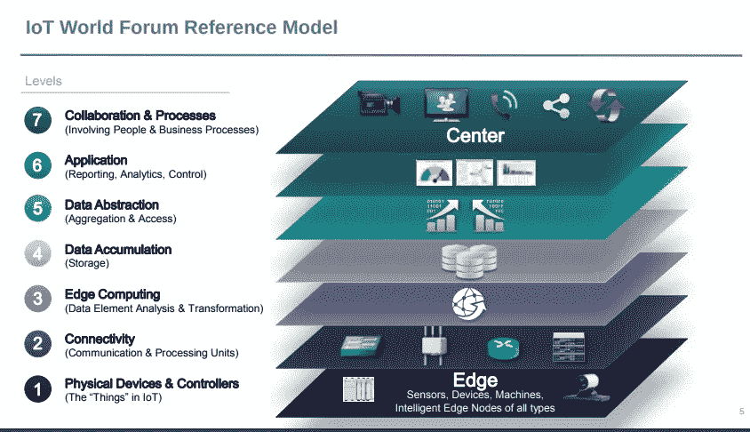
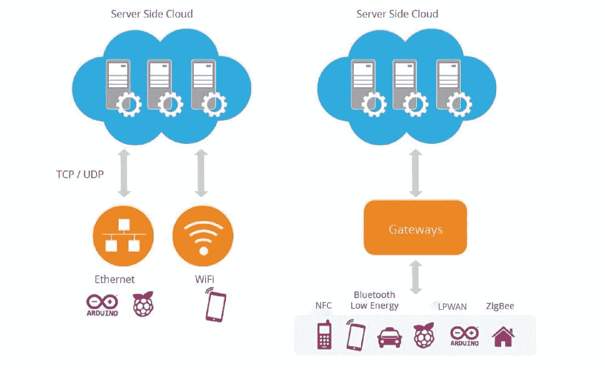
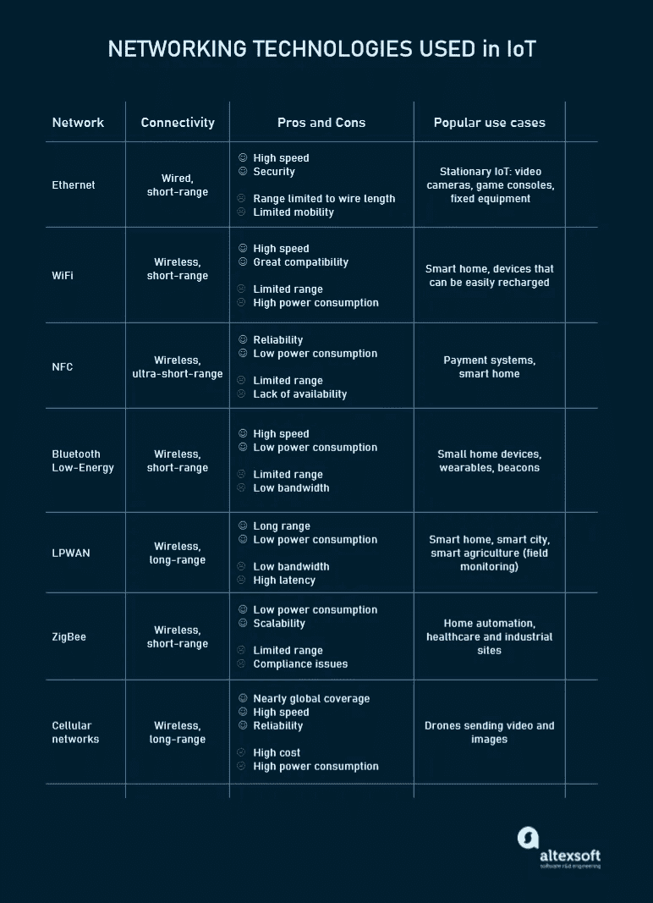
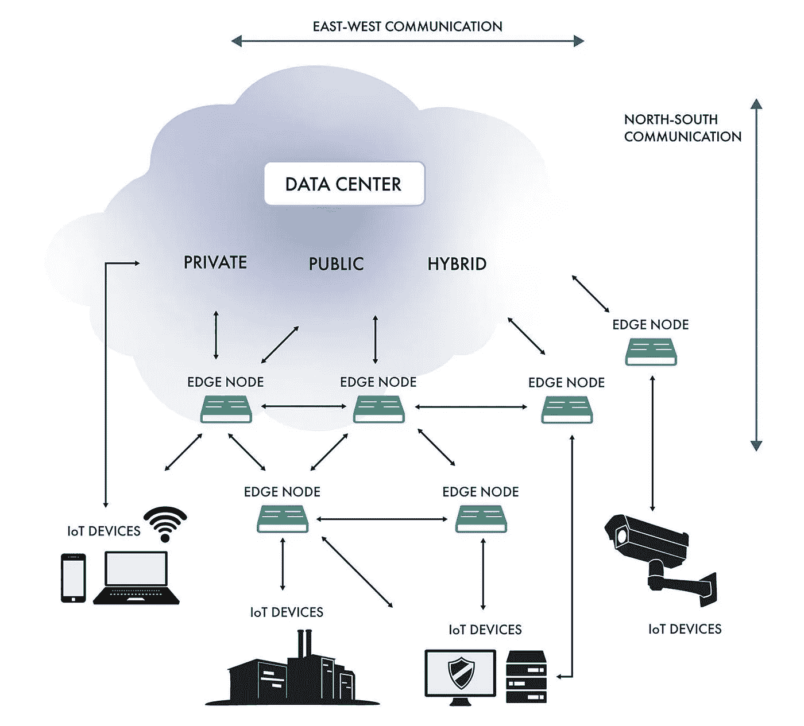

# 物联网架构:从物理信号到商业决策的路径

> 原文：<https://medium.datadriveninvestor.com/iot-architecture-the-pathway-from-physical-signals-to-business-decisions-35928752f90?source=collection_archive---------10----------------------->

物联网解决方案已经成为我们生活的一部分。从手腕上的智能手表到工业企业，互联设备无处不在。让*事物*为我们工作不再是科幻幻想。

你只需轻点智能手机屏幕或说一句话，就能立即得到结果。一扇门自动打开，一台咖啡机开始研磨咖啡豆，以制作一杯完美的浓缩咖啡，而你则收到基于数英里外传感器的最新数据的分析报告。

但是在你的命令和完成的任务之间，存在着一个庞大的、几乎看不见的基础设施，它涉及到多种元素和相互作用。本文通过物联网的架构逐层描述了物联网。让我们来看看幕后的日常魔术是如何运作的。

# 主要物联网构建块和层

在我们进一步讨论之前，值得指出的是，没有单一的、公认的物联网架构。根据特定的业务任务，它的复杂性和体系结构层的数量会有所不同。

比如 2014 年思科、IBM、英特尔在 2014 物联网世界论坛上推出的参考模型就有 7 层之多。根据思科论坛主办方[发布的官方新闻稿](https://newsroom.cisco.com/press-release-content?type=webcontent&articleId=1499853)，该架构旨在*“帮助培训首席信息官、IT 部门和开发人员部署物联网项目，并加速物联网的采用。”*

*The standardized architectural model proposed by IoT industry leaders. Source:* [*Internet of Things World Forum*](http://cdn.iotwf.com/resources/72/IoT_Reference_Model_04_June_2014.pdf)

但是，无论使用情形和层数如何，任何物联网结构的关键构建模块都是相同的，即:

*   **聪明的东西**；
*   **网络**和**网关**使低功耗设备(物联网中经常出现这种情况)能够进入大互联网；
*   **中间件或** [**物联网平台**](https://www.altexsoft.com/blog/iot-platforms/?utm_source=MediumCom&utm_medium=referral&utm_campaign=shared) 提供数据存储空间和高级计算引擎以及分析能力；和
*   **应用，**允许终端用户从物联网中受益并操纵物理世界。

*The skeleton of an IoT system.*

这些元素构成了任何物联网系统的主干，在此基础上可以开发有效的多层架构。最常见的是，这些层是:

*   **感知层**托管智能东西；
*   **连接或传输层**通过网络和网关将数据从物理层传输到云，反之亦然；
*   **处理层**利用物联网平台积累和管理所有数据流；和
*   **应用层**向最终用户交付分析、报告和设备控制等解决方案。

除了最基本的组件之外，本文还描述了三个附加层:

*   **边缘或雾计算层**在靠近边缘的地方进行数据预处理，物联网在这里收集新信息。通常，边缘计算发生在网关上；
*   **业务层**，业务根据数据做出决策；和
*   **安全层**包含所有其他层。

这些额外的组件通常被视为可选的，但仍然使物联网项目非常适合现代商业需求。

# 感知层:将模拟信号转换成数字数据，反之亦然

任何物联网系统的初始阶段都包含各种各样的“事物”或终端设备，它们充当现实世界和数字世界之间的桥梁。它们的形状和大小各不相同，从微小的硅片到大型车辆。根据功能，物联网可以分为以下几大类。

**传感器**如探针、量规、仪表等。它们收集温度或湿度等物理参数，将其转换为电信号，然后发送到物联网系统。物联网传感器通常很小，功耗很低。

**执行器**，将物联网系统的电信号转化为物理动作。致动器用于电机控制器、激光器、机械臂。

**与传感器和致动器连接或作为整体部件的机器和装置**。

值得注意的是，该架构对其组件的范围或位置没有任何限制。边缘层可以包括物理上放置在一个房间中的几个“东西”,也可以包括分布在世界各地的无数传感器和设备。

# 连接层:支持数据传输

第二层负责组成物联网基础设施的设备、网络和云服务之间的所有通信。物理层和云之间的连接通过两种方式实现:

*   直接，使用 TCP 或 UDP/IP 栈；
*   通过网关—硬件或软件模块执行不同协议之间的转换以及物联网数据的加密和解密。

*Two key models of connectivity between physical and cloud levels in IoT. Source:* [*WSO2*](http://wso2)

设备和云服务或网关之间的通信涉及不同的网络技术。

**以太网**连接静止或固定的物联网设备，如安全和摄像机、永久安装的工业设备和游戏控制台。

**WiFi，**最受欢迎的无线网络技术，非常适合数据密集型物联网解决方案，这些解决方案易于在小区域内充电和运行。连接到电网的智能家居设备就是一个很好的例子。

**NFC(近场通信)**支持两个设备在 4 英寸(10 厘米)或更短的距离内简单安全地共享数据。

**蓝牙**被可穿戴设备广泛用于短距离通信。为了满足低功耗物联网设备的需求，设计了蓝牙低功耗(BLE)标准。它只传输一小部分数据，不适用于大文件。

**LPWAN(低功耗广域网)**专为物联网设备打造。它以低功耗提供远程无线连接，电池寿命长达 10 年以上。该技术定期以小部分发送数据，符合智能城市、智能建筑和智能农业(田间监控)的要求。

ZigBee 是一种低功耗的无线网络，用于短距离传输小数据包。ZigBee 的突出之处在于它可以处理多达 65，000 个节点。它专为家庭自动化而设计，也适用于工业、科学和医疗场所的低功耗设备。

**蜂窝网络**提供可靠的数据传输和近乎全球覆盖。有两个专门为物联网开发的蜂窝标准。LTE-M(机器长期演进)使设备能够直接与云通信并交换大量数据。NB-IoT 或窄带 IoT 使用低频信道发送小数据包。

*Major networking technologies used in the IoT projects.*

一旦物联网解决方案的各个部分联网，它们仍然需要消息协议来跨设备和与云共享数据。物联网生态系统中最常用的协议有:

*   **DDS(数据分发服务)**直接将物联网事物相互连接，并连接到解决实时系统需求的应用程序；
*   **AMQP(高级消息队列协议)**旨在服务器之间对等的数据交换；
*   **CoAP(受限应用协议)，**为*受限设备*设计的软件协议——内存和功率受限的终端节点(例如无线传感器)。感觉很像 HTTP 但是用的资源更少；
*   **MQTT(消息队列遥测传输)**，一种轻量级消息协议，构建在 TCP/IP 堆栈之上，用于从低功率设备集中收集数据。

# 边缘或雾计算层:降低系统延迟

这一水平对于使物联网系统满足第五代移动网络或 5G 的速度、安全性和规模要求至关重要。新的无线标准承诺比目前的 4G 标准更快的速度，更低的延迟，以及处理更多连接设备的能力。

边缘或雾计算背后的想法是尽早处理和存储信息，并尽可能靠近其来源。这种方法允许在网络边缘本地分析和转换大量实时数据。因此，您节省了将所有数据发送到云服务所需的时间和其他资源。结果是减少了系统延迟，从而实现了实时响应和增强的性能。

*The scheme of communications between IoT devices, edge nodes, and cloud data centers. Source:* [*DesignNews*](https://www.designnews.com/automation-motion-control/edge-computing-key-industrial-automation-trend-2020)

边缘计算发生在网关、本地服务器或分散在网络中的其他边缘节点上。在这一级别，数据可以是:

*   评估以确定它是否需要在更高级别上进一步处理，
*   为进一步处理而格式化，
*   解码，
*   过滤，和
*   已重定向至其他目的地

总而言之，前三层看到的是动态的数据，因为它在不断地移动和变化。只有达到下一个级别，数据才最终处于静止状态，可供消费者应用程序使用。

 [## 规划和建立您的房地产业务|数据驱动的投资者

### 房地产行业是有史以来最受欢迎的五大职业之一。原因很简单。它确实…

www.datadriveninvestor.com](https://www.datadriveninvestor.com/2020/12/14/plan-and-build-your-real-estate-business/) 

# 处理层:使原始数据变得有用

处理层积累、存储和处理来自前一层的数据。所有这些任务通常通过物联网平台处理，包括两个主要阶段。

## 数据积累阶段

实时数据是通过一个 [API](https://www.altexsoft.com/blog/engineering/what-is-api-definition-types-specifications-documentation/?utm_source=MediumCom&utm_medium=referral&utm_campaign=shared) 捕获的，并被置于静态以满足非实时应用程序的需求。数据积累组件阶段是基于事件的数据生成和基于查询的数据消费之间的中转枢纽。

此外，该阶段定义了数据是否与业务需求相关，以及数据应该放在哪里。它将数据保存到各种存储解决方案中，从能够保存图像和视频流等非结构化数据的数据湖到事件存储和遥测数据库。总的目标是整理出大量不同的数据，并以最有效的方式存储。

## 数据抽象阶段

在这里，数据准备最终完成，以便消费者应用程序可以使用它来生成见解。整个过程包括以下步骤:

*   结合来自物联网和非物联网的不同来源的数据，包括 ERM、ERP 和 CRM 系统；
*   协调多种数据格式；和
*   通过数据虚拟化，将数据聚合在一个位置，或者使数据可以在任何位置访问。

类似地，在应用层收集的数据在这里被重新格式化以发送到物理层，以便设备能够“理解”它。

总之，数据积累和抽象阶段掩盖了硬件的细节，增强了智能设备的互操作性。此外，它们让软件开发人员专注于解决特定的业务任务，而不是钻研不同供应商的设备规格。

# 应用层:解决业务需求

在这一层，软件对信息进行分析，给出关键业务问题的答案。有数百种物联网应用程序，它们的复杂性和功能各不相同，使用不同的技术堆栈和操作系统。一些例子是:

*   设备监控软件，
*   简单互动的移动应用，
*   商业智能服务，以及
*   使用机器学习的分析解决方案。

目前，应用程序可以构建在物联网平台之上，这些平台提供软件开发基础设施，具有现成的数据挖掘、高级分析和[数据可视化](https://www.altexsoft.com/blog/data-visualization-tools-types-techniques/?utm_source=MediumCom&utm_medium=referral&utm_campaign=shared)工具。否则，物联网应用使用 API 与中间件集成。

# 业务层:实现数据驱动的解决方案

如果前几层生成的信息能够带来问题解决方案并实现业务目标，那么这些信息就会带来价值。新数据必须启动利益相关者之间的协作，而利益相关者反过来引入新的流程来提高生产率。

决策通常涉及到不止一个人使用不止一个软件解决方案。因此，业务层被定义为一个独立的阶段，高于单个应用层。

# 安全层:防止数据泄露

不言而喻，应该有一个安全层覆盖上述所有层。[物联网安全](https://www.altexsoft.com/blog/business/11-key-enterprise-iot-security-recommendations/?utm_source=MediumCom&utm_medium=referral&utm_campaign=shared)是一个值得单独撰写文章的广泛话题。这里我们将只指出不同级别的安全架构的基本特征。

**设备安全。**现代物联网设备制造商通常会在硬件和安装在其上的固件中集成安全功能。这包括

*   具有密钥的嵌入式 TPM(可信平台模块)芯片，用于端点设备的认证和保护；
*   防止未授权代码在通电设备上运行的安全引导过程；
*   定期更新安全补丁；和
*   物理保护，如金属屏蔽，以阻止对设备的物理访问。

**连接安全。**无论数据是通过设备、网络还是应用程序发送，都应该加密。否则，任何截获传输中信息的人都可以读取敏感信息。以物联网为中心的消息协议，如 MQTT、AMQP 和 DDS，可以使用标准传输层安全(TSL)加密协议来确保端到端的数据保护。

**云安全。**存储在云中的静态数据也必须加密，以降低将敏感信息暴露给入侵者的风险。云安全还涉及身份验证和授权机制，以限制对物联网应用的访问。另一个重要的安全方法是设备身份管理，以在允许设备连接到云之前验证设备的可信度。

好消息是，来自微软、AWS 或思科等大型提供商的物联网解决方案附带了预先构建的保护措施，包括端到端数据加密、设备认证和访问控制。然而，从最小的设备到复杂的分析系统，确保所有级别的安全总是值得的。

*原载于 AltexSoft tech 博客“* [*物联网架构:从物理信号到业务决策的路径*](https://www.altexsoft.com/blog/iot-architecture-layers-components/?utm_source=MediumCom&utm_medium=referral&utm_campaign=shared)

***访问专家视图—** [**订阅 DDI 英特尔**](https://datadriveninvestor.com/ddi-intel)*