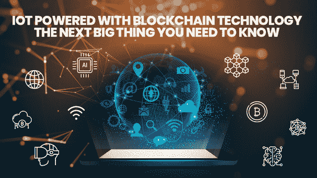
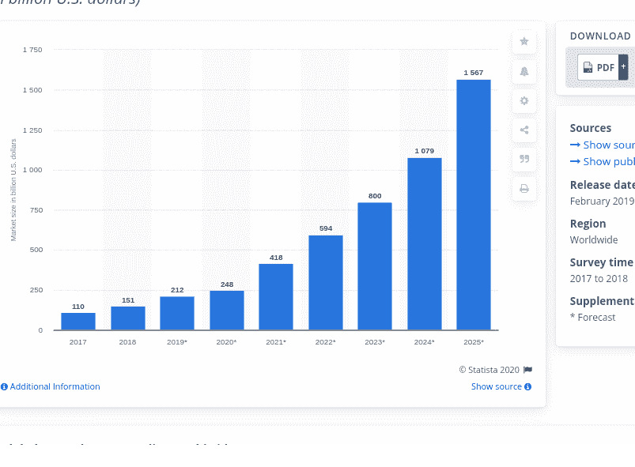
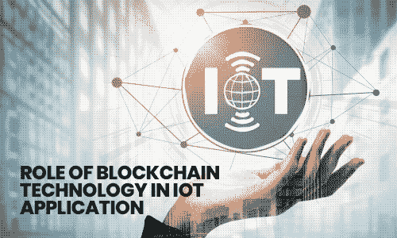
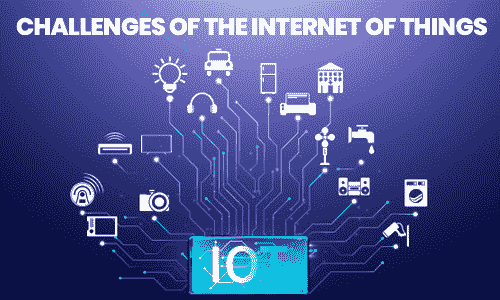

# 基于区块链技术的物联网:你需要知道的下一件大事

> 原文：<https://medium.datadriveninvestor.com/iot-powered-with-blockchain-technology-the-next-big-thing-you-need-to-know-74c98f7f4bfa?source=collection_archive---------5----------------------->

***在技术每四个小时都在发生变化的同时，人工智能、机器学习、物联网(IoT)和区块链已经成为 IT 领域强大的四大支柱。***

每一项技术都在以自己的方式改变我们生活的每一个阶段。由于这个原因，许多人都进退两难:是否有可能使用任何一种技术来解决其业务中不断增长的 it 挑战？然而，区块链作为一个基石组件，可以证明是一个非常有用和无与伦比的包，而编译它与物联网。

## **区块链和物联网概述**

在数字化时代，技术正迅速席卷全球，区块链的采用和增长相当缓慢。但是，这并不意味着它的应用范围有限且狭窄。它与人工智能和物联网一样强大和有益，但区块链在增强物联网方面发挥着重要作用。

来到 IoT，也是一脉相承。通过无线连接，物联网有能力将任何电子设备转换为智能设备。从空调到房屋的车库空间，物联网技术正在将大量日常物品带入数字时代，让它们变得更加智能。

我们举一个简单的智能手机的例子。随着物联网技术与智能手机的集成，人们正在通过智能手机看电影、听音乐、跟踪健康记录、计划旅行、与朋友互动等。

 [## 理解物联网

### 一个系统越开放，它就越有利于创新和产生信任。然而，当谈到开放系统时…

www.datadriveninvestor.com](https://www.datadriveninvestor.com/2019/09/28/making-sense-of-iot/) 

现在回到过去，当你只是用手机打电话和发短信的时候…那么是什么技术把你的普通手机变成了智能手机呢？是的，它被称为“物联网”，它改变了我们的生活方式和获取生活中的事物的方式。

> 此外，来自 Statista report 的预测称，到 2025 年，物联网(IoT)最终用户解决方案的全球市场预计将增长约 1.6 万亿。

**图片来源:**[**https://www . statista . com/statistics/976313/global-IOT-market-size/**](https://www.statista.com/statistics/976313/global-iot-market-size/)

专家和研究人员可能预计全球物联网市场规模将发生重大变化，但安全性和实施时间表问题可能会抑制物联网的宣传。因此，出于某些原因，区块链和物联网处于相似的位置，特别是在采用方面。

> 为什么不将这两种技术结合起来解决一些困扰他们的重大问题呢？

然而，这里的问题是，这两种技术(物联网和区块链)如何协同工作，并转变您企业的数字化存在？他们会有美好的未来吗？2021 年用区块链体现的 IoT 会不会做成一个致胜组合？我们这里有你所有疑问的答案。

> **内容亮点**

> **区块链技术在物联网应用中的作用**
> 
> **物联网的挑战**
> 
> **区块链作为物联网解决方案的潜在优势**

> 让我们深入了解每个概念的细节:

# **区块链技术在物联网应用中的作用**

我们都知道，物联网已经无缝地改变了我们现在和以前访问设备的方式。事实上，你可以很快感受到这项技术在每个领域的存在。物联网的使用案例几乎是无止境的，从允许患者保持健康的正确轨迹到支持全球的农业系统。但你们中的许多人都想知道，物联网是如何将物体转化为智能设备的？

> 在物联网中，有三种方法可以将对象转换为“更智能的对象”。我们来讨论一下:

*   **收集信息并转发的东西**

信息大部分是从传感器收集的，包括空气质量传感器、湿度传感器、运动传感器、温度传感器和光线传感器。这些基于环境的传感器收集信息来帮助你做出明智的决定。

*   **接收信息和动作的事物**

这些东西可以是任何设备，从智能可穿戴设备到智能电视，从电器到智能手机。

*   **既能帮助你做出正确决定的事情**

让我们用一个简单的例子来理解——基于物联网的农业系统，它配备了传感器来检测季节的正确温度，检查土壤的湿度水平，并让您知道作物需要多少水。

由于基于物联网的系统的功效主要取决于处理整个生命周期的信息数据。没有什么比**区块链**更安全、透明和快速地管理你的数据资源了。

如果你只是简单地认为区块链技术只是局限于创建一个去中心化的网络来记录和处理虚拟交易的原则，那么你需要深入挖掘并了解更多关于它的应用。

不可否认这一事实，它是基于一个去中心化的网络来进行虚拟交易的，但加密货币只是区块链技术应用的一个例子。相反，区块链有能力在未来改变互联网的未来。

此外，如果你注意到世界上主要的技术公司，当涉及到管理和存储数据和支付时，他们甚至是一个集中的机构。即使是脸书、优步等领先品牌也是如此。

> 然而，随着区块链在物联网中的实施，创建一个分散的系统来管理从传感器或设备收集的所有数据并降低数据被盗的风险有着巨大的空间。

区块链技术在 [**物联网应用**](https://www.xicom.biz/latest-thinking/internet-of-things/) 中最显著的作用就是让你的数据完全安全、真实、防篡改。另一方面，物联网的成功只取决于保持用户数据安全和机密的能力。将区块链用于物联网安全和隐私可以让物联网行业变得更好。

# **物联网的挑战**

在今天的世纪，物联网被认为是最重要的突破性技术之一，尽管如此，其中嵌入了微型计算机。通常，他们与廉价传感器和互联事物的网络一起工作，共同收集大量真实世界的信息。但是，故事发生了转折。所有的信息收集、处理和数据传播都由传统的通信技术监控。

简而言之，所有物联网模块都通过集中式云服务器进行设置、连接和管理。密集的企业数据将进入人们的生活，并引发严重的安全和数据隐私问题。

> 还没完呢！众所周知，每一件好事都有利弊。

## **物联网的特点:**

*   这些数据可用于向用户提供一系列复杂的个性化数据。
*   为您提供从农场到健康的实时信息。

## **物联网的挑战:**

*   嵌入微型计算机的物联网可以访问用户活动的虚拟传记，并确定生活方式和个人行为。
*   随着大多数第一代物联网设备缺乏基本的安全措施，物联网的隐私风险正在增加。
*   缺乏安全锁和对数据的集中控制加大了数据安全和隐私挑战的风险。

# **区块链作为物联网解决方案的潜在优势**

先说比特币这个直白的例子——用 [**区块链技术**](https://www.xicom.biz/latest-thinking/blockchain/) 管理的世界上最去中心化的数字货币。你知道这种虚拟货币背后的成功咒语是什么吗？

## **原因如下:**

*   点对点的通信模式，直接降低了云服务器的安装和维护成本。
*   消除在计算机上存储数据的需要。
*   在新交易的货币上，它被自动广播到整个网络。
*   所有矿工都可以验证交易历史，因为所有交易信息都已经传递到整个网络，无论您是购买还是出售货币。

> 区块链技术的以下显著特征可用于解决物联网中严峻的数据安全和隐私挑战:

**1。分散控制**

在管理物联网数据时，物联网应用开发公司最关注的是数据的集中控制。这就是区块链技术的由来，它创建了一个去中心化的模块，以确保在使用数据时的可扩展性和健壮性。在物联网中实施去中心化，可以简化整体数据处理，减少延迟。

**2。增强隐私**

使用区块链平台管理物联网设备是一个完美的解决方案，特别是在用户身份需要保密的使用情况下。

**3。增强安全性**

区块链技术不使用任何第三方网络或服务器来管理数据，而是使用对等通信模块，这实际上是物联网设备中所期望的。

通常，物联网生成的大部分数据都是非常私人的，例如您在日常生活中访问的智能家电或设备。这是需要与其他机器和服务共享的数据，以便对我们有用。然而，与此同时，这也增加了数据窃取攻击的风险。

今天，随着场景的变化， [**物联网软件开发公司**](https://www.xicom.biz/latest-thinking/internet-of-things/) 更喜欢通过区块链访问物联网数据，这意味着增加了一层安全，可以绕过黑客的风险，并确保强大的加密标准。

**4。带来物联网数据的透明度**

虽然数据交易发生在由众多组织拥有和管理的多个网络的多个设备之间，但创建透明度较低的数据池的可能性很大。这就是区块链根据设备跟踪的活动使用定义好的分类账来分离数据的地方。

> 如果有人试图出错或数据出现任何破损，区块链将自动识别薄弱环节，并实时采取补救措施。

# **结尾注释**

区块链和物联网技术都有望为未来行业做出巨大贡献。在物联网中实施区块链技术意味着消除集中控制，数据在需要时将更容易访问。其次，它减少了数据传输时间，并且在服务器故障的情况下不会影响您的业务活动。

由于这些原因，这两种技术都被各种行业广泛采用，包括公共和私营部门，以最小化数据安全性问题。

如需更多帮助，您可以联系 [**区块链应用开发公司**](https://www.xicom.biz/latest-thinking/blockchain/) ，这些公司致力于通过提高用户数据的安全性和隐私性，让所有拥有最新技术的公司在竞争中脱颖而出。