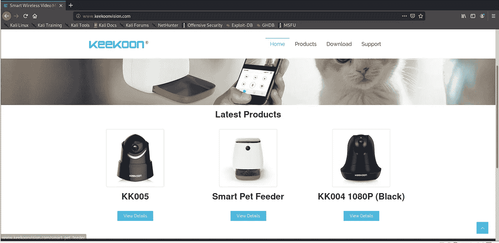
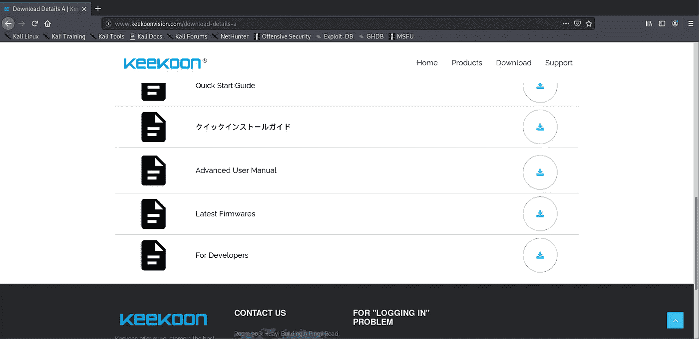
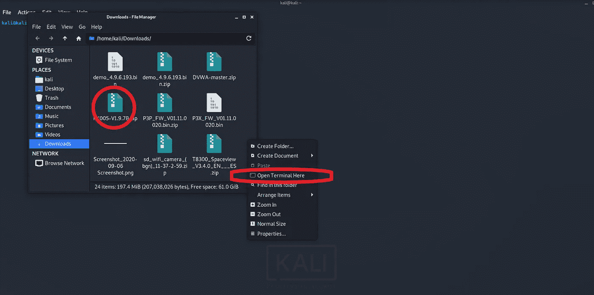
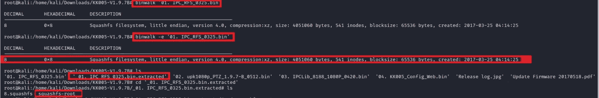
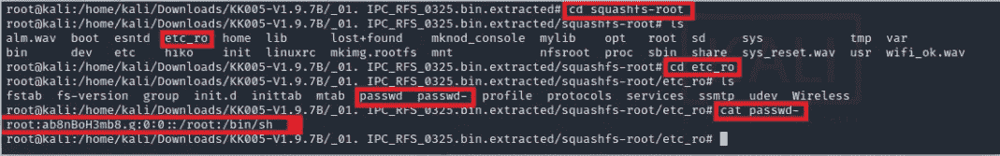
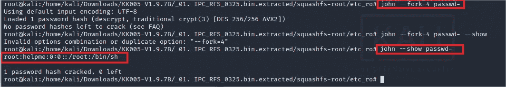
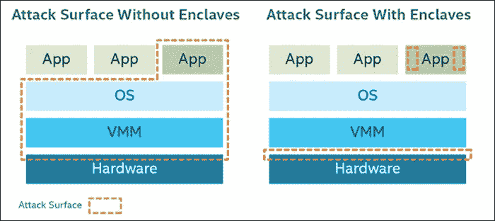
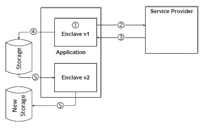
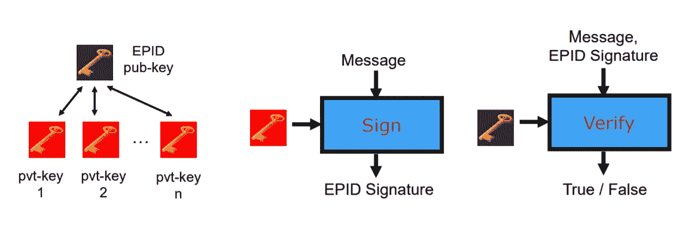

# 物联网安全:固件开发

> 原文：<https://medium.datadriveninvestor.com/iot-security-firmware-exploitation-8160028d8a2d?source=collection_archive---------1----------------------->

2016 年，[黑客在芬兰 Lappeenranta 的两个住宅公寓里呆了整整一周，破坏了他们的环境控制系统，包括恒温器。2018 年，一名黑客进入了美国一个家庭的](https://thehackernews.com/2016/11/heating-system-hacked.html)[婴儿监视器](https://www.washingtonpost.com/technology/2018/12/20/nest-cam-baby-monitor-hacked-kidnap-threat-came-device-parents-say/)，并威胁要绑架婴儿。如果这些还不够可怕的话，2019 年初，由于黑客获得了对[美敦力胰岛素泵](https://www.washingtonpost.com/health/2019/06/28/insulin-pumps-are-vulnerable-hacking-fda-warns-amid-recall/)的远程访问，该公司发布了安全警报。

近年来，我们已经看到融入我们日常生活的物联网设备数量大幅增加；然而，这些设备的可访问性和安全性似乎成反比。

随着空中和无线攻击的增加，安全专业人员正试图保护无线系统，并为用户提供相同的可访问性，但无线系统并不是攻击者可以用来危害系统的唯一漏洞。

# 固件和开发🔓：

固件是芯片上的软件；它在计算机的硬件级别上实现，用于向不同的硬件组件提供指令，并确保它们能够执行命令。固件形成了操作系统和特定设备的硬件之间的链接。固件的例子有 [BIOS](https://whatis.techtarget.com/definition/BIOS-basic-input-output-system#:~:text=BIOS%20%28basic%20input%2Foutput%20system%29%20is%20the%20program%20a,%2C%20keyboard%2C%20mouse%20and%20printer.) 或 [UEFI](https://whatis.techtarget.com/definition/Unified-Extensible-Firmware-Interface-UEFI#:~:text=Unified%20Extensible%20Firmware%20Interface%20%28UEFI%29%20is%20a%20specification%20for%20a,a%20computer%20is%20turned%20on.) 。

利用设备固件似乎不同于利用 OTA(空中下载)漏洞。

使固件利用变得危险的是 ***利用可以在设备完成引导过程之前开始。***

为简单起见，我们将尝试进入无线摄像机的固件，并尝试提取密码。

# 剥削的艺术🕵️:

> 如果你了解敌人，也了解自己，你就不必害怕百战百胜的结果。—《孙子兵法》

在网络安全中，渗透和利用，不论其领域(硬件、软件、固件等。)，遵循类似的方法:

**侦察→研究→应用→执行**

在这个过程中，首先要熟悉这个设备的基本知识，它能做什么，如何工作等等。第二部分侧重于更深层次的研究。这包括阅读设备文档、用户手册和关于设备可能存在的任何漏洞的研究论文。下一个自然的步骤是应用研究的信息提出攻击并执行它。

# 示范📷：

**侦察**

在我们计划的这一部分，我看着设备，试着学习一些基本知识。我们今天要用的设备是 Keekoon KK005 无线摄像头。这是一个典型的无线摄像头，具有一系列附加功能，在亚马逊上的零售价约为 36.99 美元。由于它在网上零售，它有一个网站的可能性很大。我做了一些搜索，最终发现了 Keekoon 网站。太棒了。让我们看看他们为我们准备了什么。

**研究**

在计划的这一部分，我们将了解更多关于该设备的信息，并查看我们可以在网上找到哪些文件和漏洞。幸运的是，这一部分并不困难，因为设备网站提供了最新固件的下载链接，所以用户可以让他们的设备保持最新。

这是为了提供可访问性而牺牲安全性的又一个例子。

如今，物联网和无线巨头发送固件更新的推送通知，并让用户登录以允许访问这些文件。

由于我还是网络和数据安全的新手，我的研究包括学习如何对固件进行逆向工程。

我通过注册一个基于电子邮件的(是的，他们会将文章和课件发送到你的电子邮件)物联网测试课程，阅读一些论文和观看一些 youtube 视频来做到这一点。如果你有兴趣了解更多，我会按照 [*这段视频*](https://www.youtube.com/watch?v=hV8W4o-Mu2o) 中提到并完成的许多步骤。

在做研究时，我注意到一些模式。许多无线摄像头和其他物联网设备使用 Linux 内核和 squashfs 文件系统。SquashFs 是一个压缩的 Linux 文件系统，可以压缩文件、目录等等。

我还注意到许多压缩文件使用。img 文件扩展名，用于表示[原始图像文件](https://www.winzip.com/win/en/img-file.html#:~:text=What%20is%20a%20IMG%20file,originals%20are%20lost%20or%20damaged.)。最后，我注意到有趣的东西，比如密码，通常存储在“etc”中。文件夹。

**申请&执行:**

一旦我下载了文件，我启动卡利，并开始工作。

1.  首先，我们必须找到并提取我们下载的文件:我通过简单地在下载中打开一个终端窗口来做到这一点(是的，我知道，我不是很有条理！！)

2.现在，我们必须查看目录中的文件，并将该文件解压缩，并放入解压缩后的文件夹中，以便能够浏览其内容

现在我们有一堆二进制文件；这是我们所期望的，所以让我们继续使用 [binwalk](https://www.refirmlabs.com/binwalk/#:~:text=Binwalk%20is%20an%20open%20source,for%20reverse%20engineering%20firmware%20images.) 来查看它们，看看它们是否值得提取。

3.在这一步，我们将查看二进制文件的内容，并提取任何有用的内容。

在提取文件系统并浏览目录后，我们能够找到 squashfs 文件系统。我们提取了 01 年的。IPC_RFS_0325.bin '目录，并用 cd 进入该目录，发现我们自己是一个解压缩的 squashfs 文件系统。太棒了。这将允许我们探索相机的根文件系统，并寻找密码散列。

4.我们找到并 cd 到“etc_ro”目录，并为自己找到一个密码散列！！

使用“cat”命令，我们读取“passwd-”文件的内容，并找到以下语法的散列:

**root:*hash*:0:0::/root:/bin/sh**

这告诉我们已经被散列的密码是用于用户名“root”的

5.解密散列并获得密码。(注:我之前已经解密了这个密码，所以这个过程会显示散列已经被加载和解密，但是如果密码之前没有被解密，那么像这样的弱密码最多需要 10 分钟才能被开膛手约翰破解)

john 告诉我这个散列以前已经被解密过了，所以我让 John 给我看一下“passwd-”文件的解密散列，我们得到了我们的解密密码“helpme”

# 简报和安全🔒：

这个演示背后的想法是向您展示，使用正确的工具，一个人可以在一个小时内解密和利用设备固件！！如果攻击者真的有动机，他或她甚至可能更改网络脚本并刷新您设备的固件，以提供对该设备的远程访问。

我相信，如果你能远程访问一台设备，那么其他人也能。这里有一些安全预防措施，你可以用来确保设备的最大安全性:

**固件更新&密码强度:**

*   这是已知的；固件越老越容易被黑，所以更新固件，确保你有最新版本。
*   跟上公司的更新；很多时候，该公司发布补丁和错误修复，这有助于保持固件和软件的安全和平稳运行；留意那些。其他时候，公司可能会警告用户其设备中最近发现的漏洞。
*   “ilovemelissa”不是一个好的密码。密码强度非常重要；解密算法从预先写好的单词列表中散列单词，并对照目标散列来测试该散列；密码越复杂，它出现在预先写好的单词列表中的可能性就越小。所以不要用“ilovemelissa”，而要用“1L0vEM3lI5S”。

**内置固件保护的硬件:**

作为用户，最好的办法是购买带有高级固件保护的硬件。**做你的研究**，你能做的最好的事情是保持与最近的发展和安全更新，知道有什么，这样你就可以比较它与你正在提供的由制造商优化的安全。像戴尔和英特尔这样的许多个人电脑公司已经开始在他们的系统中整合 [BIOS](https://www.dell.com/support/article/en-ca/sln317303/what-is-dell-trusted-device?lang=en) 和[引导验证](https://superuser.com/questions/1360485/what-is-the-difference-between-secure-boot-and-verified-boot/1361267#:~:text=Verified%20Boot%20strives%20to%20ensure,from%20an%20attacker%20or%20corruption.&text=In%20addition%20to%20verifying%20the,of%20integrity%20to%20the%20user.)。

# 高级和即将推出的安全开发解决方案🚀：

**安全防护扩展(SGX)**

SGX 是一种允许应用程序在自己的执行环境中执行和保护代码的方法。SGX 是有远见的，因为它拥有保护软件免受攻击的能力，即使 BIOS 和操作系统受到攻击，这意味着尽管攻击者完全控制了系统，应用程序数据仍将保持安全。这保护了用户可能拥有的任何“秘密”。从这个意义上说，秘密是指任何不打算让外界看到的东西。

对于物联网设备，这个秘密可能是您的孩子在物联网兼容软件上玩的视频流。SGX 的秘密通过建立飞地来保护。

Enclaves 是代码和数据的隔离存储区域，从 RAM 中保留，然后进行加密。这些存储区域是不可寻址的；因此，应用程序可以处理它的“秘密”,而不用担心被暴露。

**基于软件的证明**

基于软件的 SWATT 证明是一个正在讨论的检查修改和变更代码的过程。 [***SWATT 使外部验证者能够验证正在运行的系统的代码，以检测恶意插入或篡改的代码***](http://www.cs.cmu.edu/~arvinds/pubs/escar04.pdf) ***。***

Intel’s Idea For CPU Based Attestation And Sealing

这种想法的前身是使用特殊的硬件机制来验证系统上运行的代码，但硬件可能很昂贵，并且可能与许多遗留系统不兼容。

这就是为什么基于软件的方法被认为是解决这个问题的方法。你可以在这里阅读引用的研究论文[。该方案可用于物联网设备，以交叉检查系统文件，并确保没有代码被更改或插入。](http://www.cs.cmu.edu/~arvinds/pubs/escar04.pdf)

**增强型隐私 ID (EPID)**

EPID 是 DAA 或直接匿名证明的继承者。简单来说，[设备认证](https://globalplatform.org/insight-series-what-is-device-attestation/#:~:text=Attestation%20helps%20us%20to%20find,outright%20fakes%2C%20to%20be%20identified.)，类似于软件认证，帮助我们识别一个设备是否被篡改，是否过时，或者是否完全是假的。EPID 是一种签名方案，允许对硬件设备进行远程认证，同时确保设备的隐私。

它仅仅是一个具有更好撤销能力的 DAA 方案。在这个方案中，一个公钥对应许多不同的私钥。这些私钥都能够生成可以被公钥验证的签名。这项技术可以定制并用于允许远程连接功能的物联网设备，以增强安全性。

如果你有兴趣了解更多关于 EPIDs、SGX 和 SWATT 的信息，这里有一个 [blackhat 演示](https://www.blackhat.com/docs/us-14/materials/us-14-Weis-Protecting-Data-In-Use-From-Firmware-And-Physical-Attacks.pdf)，用相对简单的术语讲述了它们。

# 回顾和总结要点🔑 **:**

在本文中，我们讨论了:

*   易受攻击的物联网基础设施和设备的危险☠️
*   开发的艺术(侦察→研究→应用→执行 **)** 🥋
*   使用 Kali Linux 的开发演示💻
*   当前保护固件的方法💽
*   即将到来的先进技术⏭️

说了这么多，我们一定不能忘记，物联网设备是为了高效和小巧而优化的，因此在物联网设备中包装大量的这些安全措施可能会妨碍设备本身的目的。当我们等待物联网安全领域的技术发展时，我们必须保持耐心和积极主动，或者更好的是，我们可以成为推动变革和安全变得更好的人。