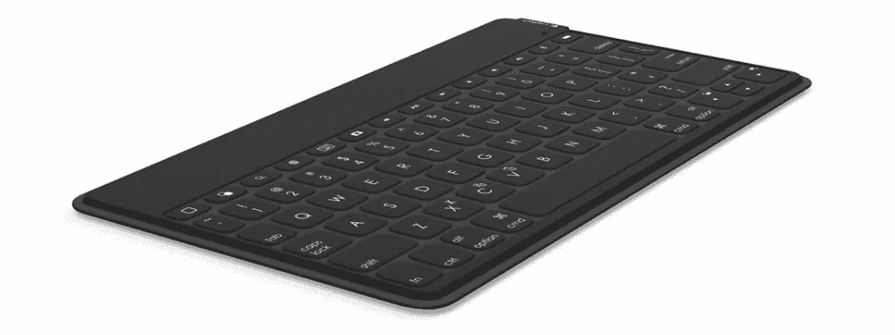
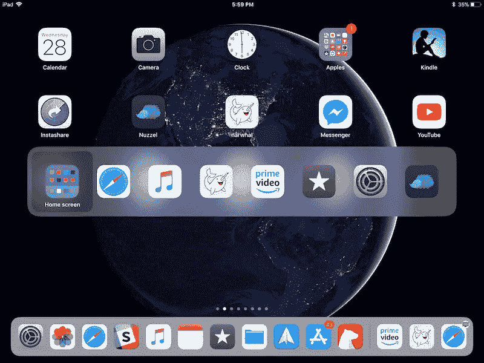

# 提高生产力的 iPad 快捷方式

> 原文：<https://medium.datadriveninvestor.com/ipad-shortcuts-to-boost-your-productivity-bd43f5f308c4?source=collection_archive---------15----------------------->

Photo by [bady qb](https://unsplash.com/@bady?utm_source=unsplash&utm_medium=referral&utm_content=creditCopyText) on [Unsplash](https://unsplash.com/s/photos/ipad-keyboard?utm_source=unsplash&utm_medium=referral&utm_content=creditCopyText)

如果你还没有在 iPad 上使用硬件键盘，那么你就错过了一个巨大的生产力提升。如果你有一个 iPad 键盘，而你没有使用键盘快捷键，那么你可能会错过更大的提升。不是所有的应用程序都有快捷键，但大多数都有。许多第三方键盘都内置了 inn 按钮，覆盖了许多全局操作系统快捷键，但没有特定于应用程序的快捷键。我用的是“Logitech Keys-To-Go”键盘，它非常便携，上面有内置的全局快捷键。如果你使用的键盘没有这些按钮(苹果智能键盘对开)，我会用 Safari 浏览器覆盖一些全局快捷键+快捷键。我不能涵盖第三方应用程序的所有快捷方式，但最后，我会描述如何轻松找到您的第三方应用程序的快捷方式。

Logitech Keys-To-Go

## 全局快捷方式

CMD + H 会带你回到主屏幕。但不会回到第一页。再次按 CMD + H 键，它将返回到第一页

CMD + Space 将打开 spotlight search，键入您的搜索标准，这将搜索应用程序、网络搜索和第三方应用程序搜索。Spotlight 几乎可以搜索你 iPad 上的任何内容。搜索完成后，使用箭头按钮进行导航。要更快地浏览 spotlight，请使用 CMD +箭头在结果的不同部分之间移动。

 [## 跑步摆脱疯狂:锻炼如何提高你的生产力|数据驱动的投资者

### 没有比锻炼更好的方式来开始一天的工作了。我试着一周至少做四天，在…

www.datadriveninvestor.com](https://www.datadriveninvestor.com/2018/10/23/running-to-get-rid-of-the-crazy-how-working-out-increases-your-productivity/) 

dock 已经成为 iPad 工作流程中更重要的一部分，具有分屏和多任务功能。你可以从 iPad 上的任何应用向上滑动，但 CMD + option + D 将帮助你做到这一点，而无需将手指从键盘上抬起。

CMD + tab 调出一个视图，以便在您最近使用的应用程序之间轻松导航

## Safari 快捷方式

如果你喜欢我，那么你的 safari 工作流程将主要是搜索、关闭标签页和在标签页之间切换。你可以输入网址。如果你想在另一个标签页中搜索，你可以很容易地打开另一个标签页。

如果你打开了很多标签页，并且想在它们之间切换，你可以按下 CMD + 1 来切换第一个标签页，按下 CMD + 2 来切换第二个标签页，以此类推。若要关闭标签页，请按下 CMD + W。如果您打开了许多标签页，并且想要关闭除了您所在的标签页之外的所有标签页，请按下 CMD + option + W。如果您想要在网站上后退一步，请使用 CMD +左箭头键，您不必到达 iPad 屏幕的顶部。如果你想再往前走，按 CMT +右箭头键。

如果你想在 safari 阅读模式下阅读一篇文章，按下 CMD + shift + R，并使用箭头键来上下导航。如果你的视力不是很好，你想看到更大的页面，你可以按缩放，但如果你按 CMD+plus，你会放大。如果你按下 CMD +减号，它将缩小，在任何时候，你都可以按下 CMD + 0 回到原来的大小。

## 所有其他键盘快捷键

我每天都使用 Safari 和 iPad 快捷键，但是有很多苹果应用和第三方应用使用键盘快捷键。如何找出其他应用程序中可用的键盘快捷键？只要按住 CMD 键，就会弹出一个窗口，显示这个应用程序的快捷键。在应用程序的特定视图中按住 CMD 按钮会为您带来不同的快捷方式。

开始使用快捷方式和快捷方式助手窗口，你将很快让它们进入你的工作流程。希望这能提高你的工作效率，就像我一样。