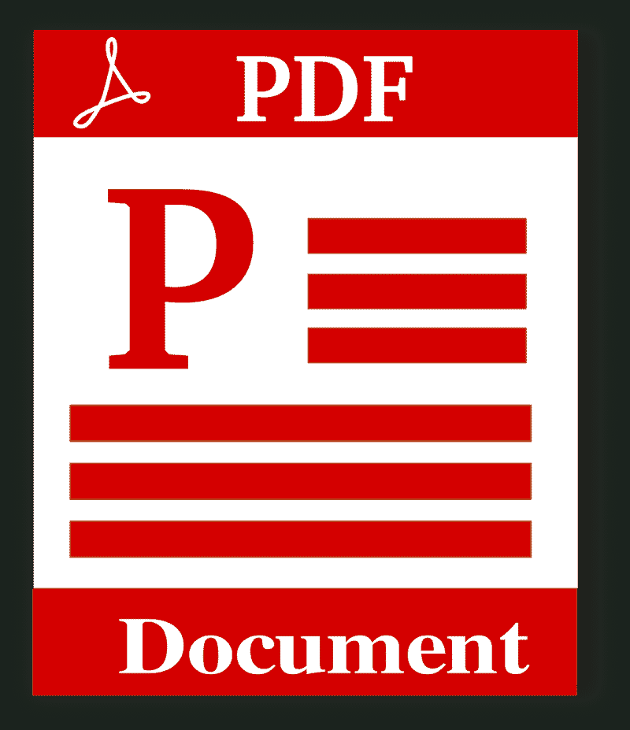

# Adobe 是对软件的价值投资吗？—市场疯人院

> 原文：<https://medium.datadriveninvestor.com/is-adobe-a-value-investment-in-software-market-mad-house-81a25eaf8a32?source=collection_archive---------5----------------------->

Adobe Inc .(纳斯达克股票代码:ADBE) 可能是软件领域最有价值的投资，也可能是估值最高的股票。值得注意的是，2020 年 1 月 16 日，市场先生将 Adobe 股票定价为 345.05 美元。

但是，Adobe 的 PDF 或者说[便携文档格式](https://marketmadhouse.com/is-adobe-a-value-investment-in-software/0001924%09%20%091)是有史以来最成功的数字产品之一。令人难以置信的是，Adobe [声称](https://www.adobe.com/about-adobe/fast-facts.html) Adobe 产品在 2018 年打开了 2.5 亿个 pdf。

此外，Adobe 声称其 Adobe 文档云在 2019 年处理了 80 亿次电子和数字交易。另外，Adobe 声称 Adobe Scan 是苹果 iOS 中最受欢迎的扫描应用程序，有 4000 万次下载和 1.8 亿次扫描。

 [## 数据驱动投资的兴起|数据驱动投资者

### 当 JCPenney 报告其 2015 年 2Q 的财务结果时，市场感到非常震惊。美国零售巨头…

www.datadriveninvestor.com](https://www.datadriveninvestor.com/2019/02/28/the-rise-of-data-driven-investing/) 

此外，用户已经从 Adobe Creative Cloud 下载了 3.76 亿次移动应用程序。此外，Adobe 声称世界上 90%的创意专业人士使用其标志性的 Adobe Photoshop 图像技术。

因此，Adobe 仍然制造一些世界上最广泛使用的软件应用程序。当前的 Adobe 产品包括 Adobe Stock、Adobe XD、InDesign 和 Illustrator。此外，Adobe Experience 云平台为视频和其他制作提供端到端产品。

# 土坯赚钱吗？

因此，Adobe 仍然是有史以来最成功的软件制造商之一。但是土坯赚钱吗？

答案是肯定的。 **Adobe(纳斯达克代码:ADBE)** 报告称，在截至 2019 年 11 月 30 日的季度中，收入为 29.92 亿美元，毛利润为 25.4 亿美元。此外，Adobe 报告同一季度的营业收入为 9.6993 亿美元，税后净收入为 8.5196 亿美元。

Stockrow 没有报告 Adobes 上个季度的现金流。然而，Stockrow 报告截至 2019 年 8 月 31 日的季度的期末现金流为 1.2614 亿美元，运营现金流为 9.2264 亿美元。

截至 2019 年 11 月 30 日，Adobe 拥有 41.77 亿美元的现金和短期投资。这一数字高于 2019 年 8 月 31 日的 36.51 亿美元。因此，Adobe 是一家现金充裕的公司，但我认为市场先生高估了它。

# Adobe 是收益投资吗？

我不认为 Adobe 是收益股，因为它自 2005 年以来没有支付股息。

然而，Adobe 可能是一只成长股，因为 Stockrow 估计 Adobe 在截至 2019 年 11 月 30 日的季度中收入增长率为 21.4%。有趣的是，Adobe 报告过去五个季度的收入增长率超过 20%。

例如，Adobe 在截至 2019 年 11 月 30 日的季度中收入增长率为 22.83%，在截至 2019 年 5 月 31 日的季度中收入增长率为 25%。因此，Adobe 是一家快速发展的公司。

然而，我认为市场先生高估了 Adobe，因为我在该公司的财务数据中看不到任何东西来证明 2020 年 1 月 16 日 345.05 美元的价格是合理的。

# Adobe 有什么未来？

奇怪的是，由于大量的潜在竞争，Adobe 的未来并不明朗。

例如，**苹果公司(纳斯达克股票代码:AAPL)** 首席执行官蒂姆·库克声称 App Store 在 2018 年 6 月拥有 2000 万注册开发者， *TechCrunch* [报道](https://techcrunch.com/2018/06/04/app-store-hits-20m-registered-developers-at-100b-in-revenues-500m-visitors-per-week/)。因此，苹果是 Adobe 的潜在竞争对手，因为这些开发商中的任何一家都可以创造出销量超过 pdf 或 Photoshop 的产品。

然而，Adobe 可以通过苹果公司通过应用商店销售其产品来赚钱。美国消费者新闻与商业频道[估计](https://www.cnbc.com/2020/01/07/apple-app-store-had-estimated-gross-sales-of-50-billion-in-2019.html)App Store 在 2019 年创造了 500 亿美元的销售额，因此这些应用可能是 Adobe 的一个利润丰厚的产品。重要的是，美国消费者新闻与商业频道声称，开发者从应用销售中获得 70%的收入。

对 Adobe 来说，一个更大的威胁是微软的 GitHub。GitHub [声称](https://octoverse.github.com/)2019 年有 1000 万开发者加入其 Octoverse。因此，GitHub 声称超过 4000 万开发者通过其平台提供软件。这些开发人员贡献了超过 4400 万个软件库。

GitHub 威胁着 Adobe，因为它允许开发者接触世界各地的客户。此外，GitHub 允许用户以易于安装的代码形式访问新产品。

# Adobe 会失去价值吗？

因此，Adobe 在当今软件市场的主要资产是其品牌。解释一下，几千万人知道并信任 pdf 和 Photoshop，并使用它们。

然而，Adobe 面临着不熟悉 Adobe 产品的年轻客户的挑战。我认为这些人会购买通过 GitHub 或 App Store 等网站销售的更便宜的替代品。

鉴于这种情况，我认为 Adobe 等老牌软件品牌将慢慢失去价值。反过来说，我觉得 Adobe 还会赚钱，还会再成长几年。

尽管如此，我认为投资者需要避免 Adobe(纳斯达克:ADBE)的股票，因为市场先生给它定价过高，而且它不提供股息。

*原载于 2020 年 1 月 16 日*[*【https://marketmadhouse.com】*](https://marketmadhouse.com/is-adobe-a-value-investment-in-software/)*。*