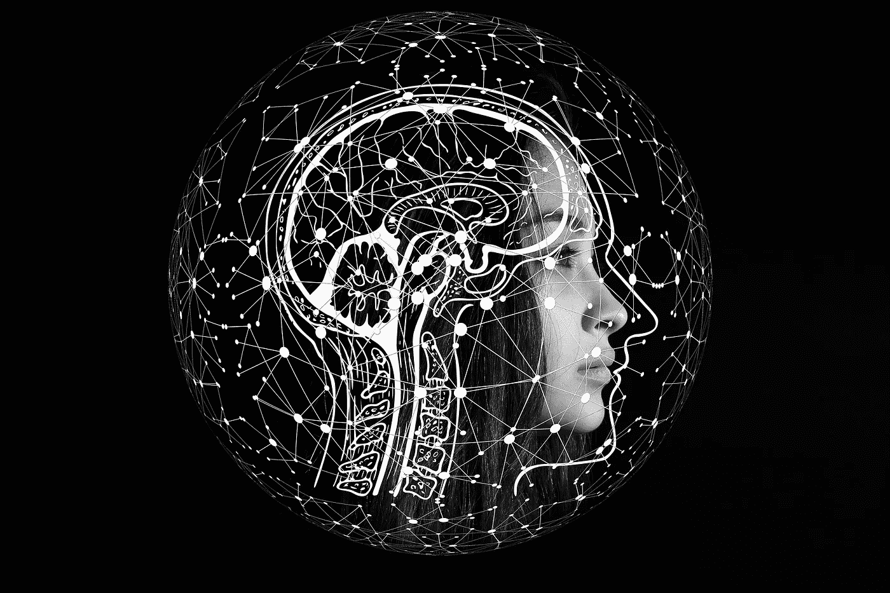
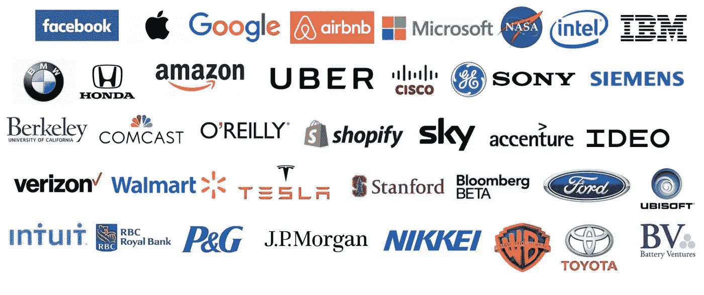

# AI 会改变世界吗？

> 原文：<https://medium.datadriveninvestor.com/is-ai-going-to-transform-the-world-fa61ed30d4f3?source=collection_archive---------10----------------------->

在这篇文章中，我将谈论什么是人工智能，以及它将如何影响世界？

随着人工智能(AI)站在改变世界和我们生活方式的最前沿，世界正在演变。人工智能正在呈指数级发展，尽管它似乎可以帮助改善世界，但许多人担心自己的工作会被人工智能抢走，或者担心人工智能会被制造出来。

但我相信，人工智能是一种祝福，它将成为世界领先的技术之一，可以推动世界变得更加美好。

# 什么是人工智能(AI)？

当大多数人听到人工智能这个名词时，他们通常首先想到的是机器人。这是因为大预算电影和小说编织了关于在地球上肆虐的人工智能机器的故事。但我认为这与事实相去甚远。

人工智能(AI)是指在机器中模拟人类智能，这些机器被编程为像人类一样思考和适应。

你看，我们不知道它，但几乎每次我们上网时，我们都很可能与人工智能或它的工作接触。当你搜索 YouTube 的视频时，人工智能会收集关于你的搜索和你点击的视频的信息，以便你下次打开 YouTube 时，它会根据你最近的搜索选择视频推荐给你。例如，它可以查看您观看的视频的标题，并在您的订阅源中找到标题相似的视频。

 [## 人工智能和监督资本主义|数据驱动的投资者

### 大科技，总是现在:人工智能推动的大科技，已经使购物，搜索，在你的…

www.datadriveninvestor.com](https://www.datadriveninvestor.com/2020/03/04/on-artificial-intelligence-and-surveillance-capitalism/) 

人工智能现在是一个非常热门的话题，事实上，2014 年，人工智能初创公司的投资超过 3 亿美元，比 2013 年增长了 300%。

以下是一些目前正在以某种方式、形态或形式使用人工智能的主要公司。

# AI 是如何工作的？

人工智能通过将大量数据与快速、智能的算法相结合来工作，允许软件从数据中的模式或特征中自动学习。

例如，您可以拥有每个运动球的数据和标签。先说它的大小或者重量。人工智能学习这些标签，如果你给它一个新球，人工智能可以使用它所学习的来预测你有什么样的球。

> **有 3 种主要的人工智能算法**

## 1.无监督学习

无监督学习是指人工智能从未标记的数据中学习，或者简单地说，你给人工智能的只是一堆没有排序的数据。想象一下，给一个孩子一堆不同颜色和大小的积木，你让他们把积木分类。很快，他们开始注意到块中的相似之处，并根据特征将其分类。那基本上就是无监督学习。

This image shows how unsupervised learning can divide data into clusters based on patterns it notices.

## 2.监督学习

监督学习是指给定一个算法**标签为**的数据进行学习。例如，你得到一堆照片**，上面有关于它们的信息**，然后你训练一个模型识别新照片。

监督学习问题可以进一步分为回归和分类问题。

*   **回归问题**是预测一个值(例如股票市场的变化)
*   **分类问题**是当你对数据进行分类时(例如垃圾邮件和非垃圾邮件的分类)

Classification is sorting the data while Regression is predicting the data

## **3。强化学习**

强化学习是训练机器学习模型做出一系列决策。这有点类似于无监督学习，因为它是从**未标记的数据**中学习。在强化学习中，一个人工智能面临着类似游戏的情况。给计算机一个游戏，只要计算机做对了，它就会得到“奖励”。它采用反复试验的方法来解决问题的每一步。

The AI makes an action in the world and this action is given feedback to tell the AI whether or not they made the right decision. It learns from its mistakes and gradually becomes better. This is how Alpha GO works.

现在，这些只是人工智能程序的主要算法。人工智能是一个广泛的研究领域，包括许多主要的子领域，如:

*   **机器学习**自动化分析模型构建。它使用来自神经网络、统计学、运筹学和物理学的方法来发现数据中隐藏的见解，而无需显式编程去寻找哪里或得出什么结论。
*   **神经网络**是一种机器学习，由相互连接的单元(如神经元)组成，通过响应外部输入来处理信息，在每个单元之间传递信息。该过程需要多次通过数据来寻找联系，并从未定义的数据中获取意义。
*   **深度学习**使用具有多层处理单元的巨大神经网络，利用计算能力的进步和改进的训练技术来学习大量数据中的复杂模式。常见的应用包括图像和语音识别。
*   **认知计算**是人工智能的一个子领域，致力于与机器进行自然的、类似人类的交互。使用人工智能和认知计算，最终目标是让机器通过解释图像和语音的能力来模拟人类的过程——然后连贯地做出回应。
*   **计算机视觉**依靠模式识别和深度学习来识别图片或视频中的内容。当机器可以处理、分析和理解图像时，它们可以实时捕捉图像或视频，并解读周围的环境。
*   **自然语言处理** (NLP)是计算机分析、理解和生成人类语言，包括语音的能力。NLP 的下一个阶段是自然语言交互，它允许人类使用正常的日常语言与计算机进行交流，以执行任务。

# 为什么 AI 这么重要？

我们不知道它，但人工智能已经帮助我们的生活变得更加容易，并增加了我们日常生活的便利性。

*   **搜索:**没有人工智能，你的搜索结果就不会个性化。很难找到你想要的信息或物品，甚至很难推荐你喜欢的音乐
*   **医疗保健:**人工智能应用为你提供个性化的药物和 x 光读数。人工智能个人保健助理还可以提醒你吃药、锻炼或吃得更健康。
*   欺诈:目前，人工智能实际上正在帮助你检测旨在窃取你的信息的欺诈性骗局，例如诈骗电子邮件。

在我们现在的日常生活中，我们的金融机构、法律机构、媒体公司和保险公司都在利用人工智能来帮助为你提供更方便的生活方式。从欺诈检测到自然语言处理和审查法律摘要，人工智能的范围非常广泛。

# 现在，AI 如何改变世界？

> 它将改变我们彼此之间的关系。我认为，它甚至会改变我们对人类意义的认知。 —大卫·科普林

人工智能在组织、政府、安全框架、能源和自然资源管理等方面的应用。，正在急剧上升。有明显迹象表明，越来越多的人承认人工智能给世界带来的解决方案。

让我们考虑一下为什么人工智能会让我们的生活变得如此简单的一个显而易见的原因:

*   **人工智能虚拟助手**

使用人工智能，人们将不必浪费时间来执行我们生活中的世俗任务。例如，有了个人人工智能，可能就不需要去杂货店或去约会了。你的人工智能助手知道该做什么，以及何时去做。

这不仅仅是人工智能改变世界的唯一原因。随着我们更好地开发人工智能，我们发现它以人类无法的方式思考。可以监控和处理海量数据的算法，比任何人类都更快地做出结论。从小事做起，比如优化交通模式以找出最佳路线，或者如何修复道路和重建高速公路，到更重要的事情，比如监控流行病和疾病，并在它们蔓延之前阻止它们。

我相信我们有无限的可能性去探索，可以完全改变我们的生活方式，我认为这是一个无限的可能性和机会的空白，人们应该抓住这些机会，让世界变得更好。

# 关键要点

*   人工智能(AI)处于改变世界和我们生活方式的最前沿。
*   人工智能是在机器中模拟人类智能，这些机器被编程为像人类一样思考和适应。
*   人工智能通过将大量数据与快速智能算法相结合来工作
*   有 3 种主要类型的人工智能算法
*   人工智能是一个广泛的研究领域，包括许多主要的子领域
*   最后，人工智能将**改变世界**

*感谢您阅读我的文章，如果您学到了什么或对我有任何反馈，欢迎对本文发表评论或鼓掌。* *如有任何问题，您也可以在*[*Linkedin*](https://www.linkedin.com/in/archie-shou-7488b3193/)*上给我发消息。*