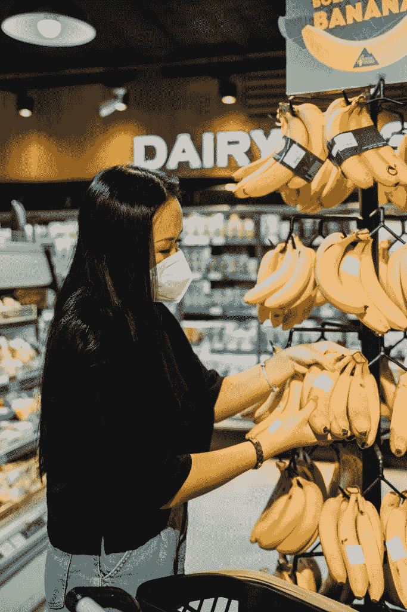
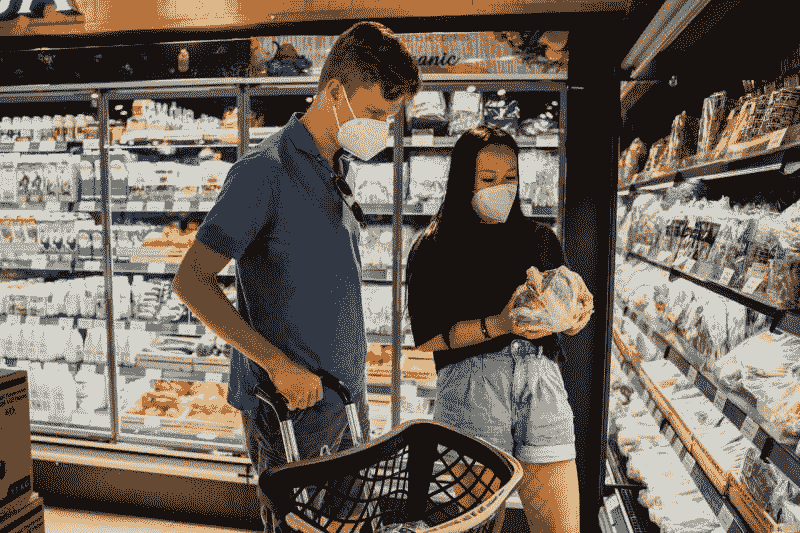
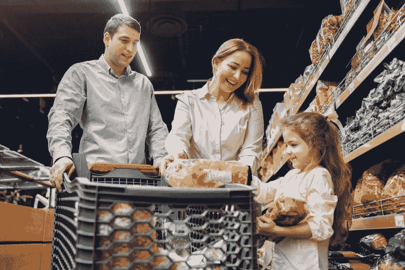
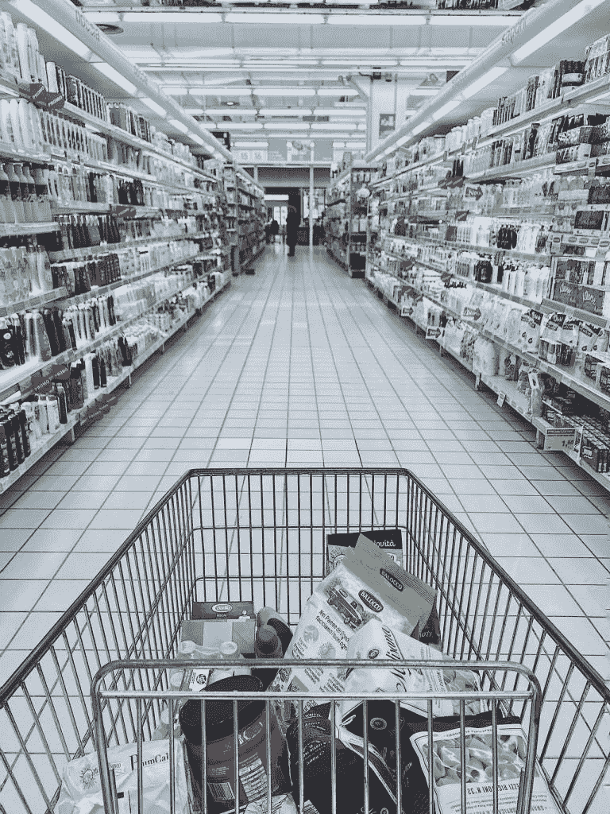

# 艾伯森食品杂货是价值投资吗？—市场疯人院

> 原文：<https://medium.datadriveninvestor.com/is-albertsons-a-value-investment-in-groceries-market-mad-house-91e8c216a614?source=collection_archive---------40----------------------->

艾伯特森公司可能是食品杂货的最佳价值投资。

解释一下，**艾伯森公司(ACI)** 声称在美国 34 个州和哥伦比亚特区[经营着 2200 多家超市。Albertsons 还声称经营着 23 个食品配送中心、20 个食品和饮料工厂、400 多个燃料中心和 1700 家药店。此外，Albertsons 在美国 15 大杂货市场中的 11 个市场提供送货上门服务。](https://marketmadhouse.com/is-albertsons-a-value-investment-in-groceries/On%20Wednesday%20afternoon,%20a%20thin%20line%20of%20U.S.%20Capitol%20Police,%20with%20only%20a%20few%20riot%20shields%20between%20them%20and%20a%20knot%20of%20angry%20protesters,%20engaged%20in%20hand-to-hand%20combat%20with%20rioters%20on%20the%20steps%20of%20the%20West%20Front.%20They%20struggled%20with%20a%20flimsy%20set%20of%20barricades)

Albertsons 经营 20 个超市品牌，包括 Safeway、Vons、Albertsons、Star、Lucky、Carrs、Shaws、Tom Thumb、Pavilions、Jewel Osco、Haggen 和 Amigos。因此，你可能是一个经常购买艾伯森产品的人，却没有意识到这一点。

然而，市场先生在 2021 年 1 月 26 日为艾伯森支付了 19.74 美元。此外，艾伯森的股价从 2020 年 6 月 26 日公司上市当天的 15.45 美元上涨。

# 艾伯森公司赚钱吗？

Albertsons(纽约证券交易所代码:ACI) 从其超市中赚钱。例如，截至 2020 年 11 月 30 日，Albertsons 报告的季度毛利为 45.09 亿美元，季度营业收入为 2.585 亿美元，季度收入为 154.09 亿美元。

然而，艾伯森的季度收入从 2020 年 8 月 31 日的 157.58 亿美元和 2020 年 5 月 31 日的 227.52 亿美元下降。同样，季度毛利从 2020 年 5 月 31 日的 67.71 亿美元和 2020 年 8 月 31 日的 45.75 亿美元下降。此外，季度运营收入从 2020 年 5 月 31 日的 9.718 亿美元和 2020 年 8 月 31 日的 5.62 亿美元下降。

因此，艾伯森公司赚了钱，但它在 2020 年赚的钱更少了。相反，艾伯森公司在 2020 年的收入增长令人印象深刻。例如，Stockrow 估计在截至 2020 年 5 月 31 日的季度中，Albertsons 的收入增长了 21.42%。收入增长于 2020 年 8 月 31 日降至 11.15%，于 2020 年 11 月 30 日降至 9.26%。

# 艾伯森公司产生了多少现金？

Albertsons (ACI) 产生一些现金。该公司报告称，截至 2020 年 11 月 30 日，季度运营现金流为 2.752 亿美元。

然而，季度经营现金流从 2020 年 5 月 31 日的 20.92 亿美元和 2020 年 8 月 31 日的 6.289 亿美元下降。同样，季度期末现金流从 2020 年 5 月 31 日的 20.65 亿美元降至 2020 年 8 月 31 日的 3.674 亿美元。

最后，在 2020 年 11 月 30 日，Albertsons 有 18.36 亿美元的现金和短期投资。现金和短期投资从 2020 年 5 月 31 日的 20.22 亿美元和 2020 年 8 月 31 日的 23.9 亿美元下降。

# 艾伯森是价值陷阱吗？

我认为艾伯森公司可能是一个价值陷阱，因为它只有少量现金。解释一下，价值陷阱可以是一家几乎不产生现金的廉价公司。

小额现金创造了一个价值陷阱，因为它们导致了低安全边际。具体来说，安全边际很低，因为该公司可能会耗尽现金，发行大量债券来为其运营融资。

我认为许多零售商；包括 [**、梅西百货**](https://marketmadhouse.com/how-fast-can-macys-m-die/) ，都是价值陷阱，因为它们产生的现金量很小。Albertons 是一个价值陷阱，因为它产生的现金数量有限。

然而，截至 2020 年 11 月 30 日，艾伯森的总资产为 263.19 亿美元，长期债务为 83.28 亿美元。因此，艾伯森斯有一些资产价值，但几乎没有现金。我不认为艾伯森公司能产生足够的现金来提供安全边际。

# 克罗格如何杀死艾伯森

**Albertsons (ACI)** 可能会经历未来的增长，因为它通过 Instacart 提供送货服务。然而，艾伯森公司将不得不在快递市场与亚马逊(Amazon)和沃尔玛(WMT)以及克罗格(KR)展开竞争。

沃尔玛、亚马逊和亚马逊正大举投资于杂货配送基础设施。 **Kroger (NYSE: KR)** 计划在美国[建立 10 个自动化客户履行中心](https://www.supermarketnews.com/online-retail/kroger-plans-10th-ocado-automated-warehouse) (CFCS)。

CFC 是自动化仓库，奥卡多集团(LON: OCDO) 机器人在这里拉取和包装杂货订单。Kroger management 希望在 2021 年初在俄亥俄州门罗开设该公司的第一家 Ocado CFC。

克罗格宣布的其他 Ocado CFC 地点包括马里兰州弗雷德里克。(35 万平方英尺)；威斯康星州普莱森特普雷里。(35 万平方英尺)；佛罗里达州格罗夫兰。(37.5 万平方英尺)；佐治亚州森林公园。(37.5 万平方英尺)；以及达拉斯(35 万平方英尺)，*超市新闻*报道。克罗格计划在密歇根州的罗穆卢斯建造一个 135，000 平方英尺的小型 CFC。

# 艾伯森能和克罗格竞争吗？

克罗格计划在太平洋西北部和西部增加 Ocado 氯氟化碳。*超市新闻*推测。每个 CFC 将支持 Kroger 的杂货交付；以及某个地区的 Instacart 或[优步的【优步】Postmates、](https://marketmadhouse.com/will-uber-uber-make-money-with-postmates/)等承包商。例如，Frederick 的 Kroger CFC 将支持 DC 华盛顿州的杂货交付。

此外，*超市新闻*报道，克罗格和奥卡多将在加速增长计划中开发微履行能力。微履行意味着扩大商店的杂货提货能力，既可以为 Instacart 送货服务，也可以为个人购物者服务。

我看不出艾伯森如何能与克罗格和亚马逊这样的自动送货业务竞争。因此，我认为克罗格/奥卡多联盟是艾伯森最大的威胁。我看不出艾伯森如何能与克罗格/奥卡多竞争。

对艾伯特森来说，最糟糕的噩梦将是克罗格/奥卡多收购 Instacart 或与 Instacart 合并。我认为 Kroger/Ocado/Instacart 的组合或联盟可以创造一个甚至亚马逊都无法与之竞争的杂货递送垄断。因此，我预测艾伯森可能会在某个时候卖给亚马逊(Amazon)。

# 艾伯森是好股票吗？

我认为艾伯森是一只糟糕的股票，是一个价值陷阱，因为它不支付股息。我建议投资者避开艾伯森公司，转而调查克罗格公司。

我喜欢 Kroger，因为 Ocado 联盟给了该公司巨大的增长潜力。特别是克罗格很便宜，市场先生在 2021 年 1 月 26 日花了 37.98 美元买下了它。此外，克罗格于 2020 年 11 月 12 日支付了 18 季度股息。

在最后的分析中，我认为克罗格而不是艾伯森在杂货股票的价值投资。

*最初发表于 2021 年 1 月 26 日*[*https://marketmadhouse.com*](https://marketmadhouse.com/is-albertsons-a-value-investment-in-groceries/)T22。