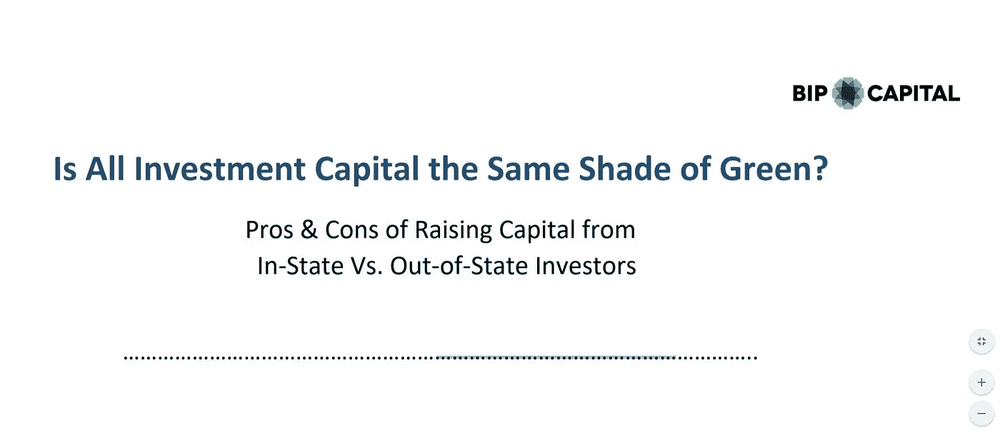

# 所有的投资资本都是绿色的吗？

> 原文：<https://medium.datadriveninvestor.com/is-all-investment-capital-the-same-shade-of-green-da73ce2088d3?source=collection_archive---------43----------------------->

Photo by [Markus Spiske](https://unsplash.com/@markusspiske?utm_source=medium&utm_medium=referral) on [Unsplash](https://unsplash.com?utm_source=medium&utm_medium=referral)

在今天发布的一项新研究中，BIP 资本挑战了这样一种误解，即接受州外资本可以为创始人带来更有吸引力的估值和更好的业务成果。这项名为 [**的研究“所有的投资资本都是一样的绿色吗？、**](https://www.bip-capital.com/wp-content/uploads/2020/09/Same-Shade-of-Green-9.24.20-FINAL.pdf) ”利用来自亚特兰大技术发展中心(“ATDC”)的数据，了解 2014 年至 2019 年 ATDC 孵化器项目中接受州内与州外股权提供商资本的公司的交易动态和结果。在这项研究中，“州内”代表包括居住在佐治亚州的投资者的公司，“州外”代表完全从佐治亚州以外的投资者那里筹集资金的公司。

 [## 将数据隐私转化为你的优势，重建消费者的信任:下一个投资前沿

### 疫情期间，抖音的使用量激增，全球约有 8 亿用户使用该平台…

www.datadriveninvestor.com](https://www.datadriveninvestor.com/2020/09/18/turn-data-privacy-to-your-advantage-and-rebuild-consumers-trust-the-next-investment-frontier/) 

具体来说，该分析着眼于八个因素:(1)初始支票大小；(2)初始估值；(3)稀释(由 1 和 2 产生)；(4)对运营速度的影响；(5)对后续融资的影响；(6)对经营成果的影响；(7)对长期价值创造的影响；(8)对预期权益价值的影响(包括 3、6 和 7)。

如果目前的市场看法是，接纳州外投资者会为创始人带来更具吸引力的估值和更好的业务成果，那么研究发现几乎没有证据支持这种看法。研究显示，接受本地资本的创始人:

1.  收到的初始支票大小约为一半
2.  收到的初始估价大约是估价的一半
3.  与(1)和(2)一致，经历了**更少的初始稀释**
4.  以较慢的烧钱速度执行
5.  更频繁地进行连续融资
6.  更频繁地实现退出，更少地倒闭
7.  随着时间的推移，达到了相似的企业价值观
8.  预期权益价值显著增加

简而言之，研究数据得出以下结论:

获得州内资本对创始人的好处是显而易见的，任何开始融资的人都应该考虑这一点；此外，接受州外资本的创始人放弃了更多的公司，承担了更大的企业失败风险，却没有任何好处(平均而言)。

进行这项研究的公开目标只是为了看看州外的资本是否真的“更环保”根据数据分析，至少对那些 ATDC 公司来说，情况并非如此。虽然一些创业公司可能能够以更高的估值从州外投资者那里获得更大规模的融资，但这一选择的后果可能会让他们面临更大的失败风险。

这些发现支持了 BIP 资本的理论，即早期的运营支持作为一个企业的规模可以让企业达到保证额外投资的里程碑。州外资本通常在初始分配时采取更“漫无目的”的方法，并且不接近企业在标准指标之外取得的进展，这表明如果企业在早期难以扩大规模，它将不会跟进。另一方面，州内资本投资者似乎采取了一种更谨慎的方式，投资小轮资本，紧跟投资，并在取得进展时跟进。

[**访问完整报告**](https://www.bip-capital.com/wp-content/uploads/2020/09/Same-Shade-of-Green-9.24.20-FINAL.pdf) 了解研究详情，包括其方法、数据集和其他发现。

*本文最初出现在作者的* [*博客*](https://www.bip-capital.com/blog/2020/09/new-bip-capital-study-is-all-investment-capital-the-same-shade-of-green) *上，经允许转载。*

## 访问专家视图— [订阅 DDI 英特尔](https://datadriveninvestor.com/ddi-intel)