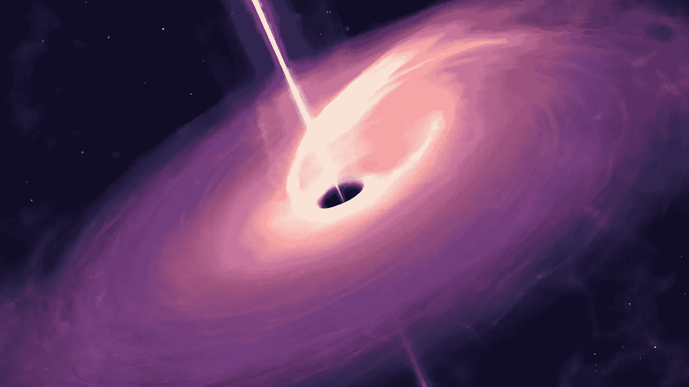
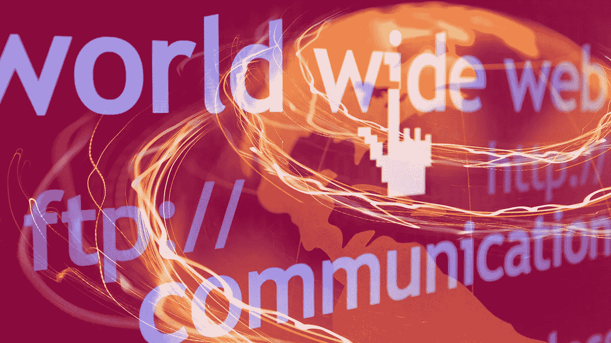
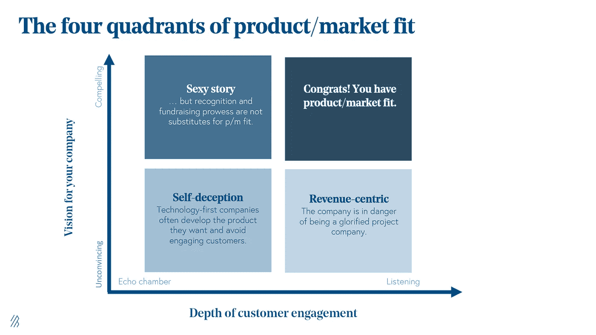

# 亚马逊是黑洞吗？

> 原文：<https://medium.datadriveninvestor.com/is-amazon-a-black-hole-728f2142acee?source=collection_archive---------11----------------------->

## 2020 年数字革命

## 亚马逊的 5 个决定性关键成功因素——第六个

All images are from Canva Pro

黑洞是一个令人兴奋的物体。天文学家说，它会吸收任何靠近它的东西，引力如此之强，以至于连光都无法出去。

因为光不能出去，所以黑洞是看不见的。黑洞有各种形式和大小，有些很小，有些超大质量。嗯，也许不是形式上的——但至少是尺寸上的。

小孔形成于宇宙之初，成熟后变大，形成超大质量黑洞。科学家有证据表明，我们银河系的中心是一个超大质量黑洞，一切都围绕着它。

这样的黑洞听起来像是自恋行为。这让我想起了一个笑话:自恋者需要做什么才能拧上灯泡？只是举着它，因为世界围绕着他转。

在《创业》中，Magazin [der Brutkasten，](https://www.derbrutkasten.com/amazon-okonomie-schwarzes-loch/) Michael Hirschbirch 做了这样的类比(只有德语版)。他把亚马逊比作黑洞，定义为经济的黑洞。

这将意味着整个经济都围绕着亚马逊，我认为亚马逊对杰夫·贝索斯很有吸引力，但它并没有描绘出我眼中的真实图景。

# 互联网技术

1993 年的我很迷茫——好吧，也许 2020 年的我依然迷茫或者比任何时候都迷茫——但 1993 年绝对是我记得自己迷茫开始的那一年。

我的父母让我进入一所商业学校，确保我接受良好的商业教育。

1993 年， [CERN 研究所](https://home.cern/news/news/computing/twenty-years-free-open-web)通知世界，他们的科学家发明的技术将免费提供。

这意味着每个人都可以免费使用它，这引发了我的第一个想法——当 CERN 免费赠送他们的发明时，他们怎么能资助他们的活动呢？

对我来说，作为一个年轻的商业巨头(有点夸张)，这是一个我不理解的举动。

我想象着决策者们坐下来进行严肃的商业讨论。财务总监声明——让我们出售技术或获得许可。另一个只是说——哦，闭嘴……我们把它捐给人类进步事业。

这一明智的慈善举动极大地改变了我们生活的世界。这是我们当今社会的决定性时刻之一。

杰夫·贝索斯是最早想到使用这种新颖的“免费”技术的企业家之一。

欧洲核子研究中心宣布互联网免费的那一刻，很可能是一个大爆炸的时刻。科学家说大爆炸起源于黑洞。

这并没有让亚马逊成为黑洞，而是让它的起源非常接近黑洞——这是欧洲粒子物理研究所决定放弃的决定性时刻。

> 免费互联网——一个大爆炸的时刻。

2020 年，互联网将成为我们经济的中心——它就像一个黑洞，让整个经济圈围绕着它。

1997 年——杰夫·贝索斯接受了一次采访，他在采访中谈到了改变生活、改变游戏规则的大爆炸事件，以及是什么创造了这样的事件。

以下是我在视频中的发现:

# 因素 1:杰夫·贝索斯做了功课

1994 年，年轻的杰夫·贝索斯坐下来，阅读了关于互联网潜力的第一份分析报告。与此同时，当他读到互联网每年增长 23，000%的研究时，他为一家对冲基金工作。

他很早就明白，大爆炸发生了，很快一切都将围绕着互联网组织起来——就像我们的星系围绕着它的中心，一个黑洞。

如果贝佐斯不能成为黑洞，26 年后，在我看来，至少他想在即将组织起来的新星系中拥有巨大的影响力。

他坐下来，列出了一张值得在网上销售的产品清单。他单子上的第一条是

> 书

**我们能从他身上学到什么:**

*   做你的功课，研究你想进入的市场
*   如果你没有市场经验，从内部学习，或者至少在市场全新的时候阅读研究报告。

Source: [Bessemer Venture Partners](https://www.bvp.com/atlas/the-product-market-fit-journey)

# 因素 2:产品符合市场

在他看来，书籍是最畅销的产品，非常适合在网上销售。他给出了第一个理由，即图书类别中的商品比任何其他产品类别都多。

早在 1997 年，全世界有 300 万本书在印刷。一个美好的宇宙，在 1995 年有着巨大的潜力。

1993 年以前我年轻的时候，爱看英文奇幻和科幻的书。在奥地利山区的一个小村庄里订购这些东西非常具有挑战性。

1995 年，当我搬到格拉茨时，我在大学上网，发现了 Amazon.com。我简直不敢相信我所看到的——所有我梦寐以求的书都在我的掌握之中。

我不记得我第一次从亚马逊订购的确切时间，但我经常这样做。当我在亚马逊网站上看到缺货订单时。我从 2000 年开始接受订单。我的书证明了 2000 年之前就已经有订单了。

书店是存在的，但互联网上没有。1994 年的电子商务——我相信杰夫·贝索斯发明了今天所谓的直运。

**我们能从他身上学到什么:**

*   始终将产品定位于能解决重大问题的市场。
*   就亚马逊而言，它让每个人都有可能全天候访问全球印刷书籍的完整列表
*   每个读者的梦想

# 因素 3:USP——物流

前端是一回事。从 2002 年开始看亚马逊的第一个网页…嗯，从那以后前端有了很大的改进。

在 1997 年关于 Amazon.com 的采访中，杰夫·贝索斯谈到了“几乎及时的库存”。他表示，亚马逊的库存中只有畅销书。40 万本其他畅销书存放在批发商处。每当亚马逊接到订单，他们就把书订购到他们的仓库，然后发货给客户。

一个普通的老式现实生活书店会把它留在那里。不是杰夫·贝索斯。

另外 100 万本书是早期的亚马逊在顾客有需要时直接从出版商那里订购的。有时需要几个星期。

杰夫·贝索斯走得更远。亚马逊在线目录中的剩余书籍已经绝版。通常，书店老板的回答是，“对不起，没货——买别的吧。”

每当顾客需要“绝版”书籍时，亚马逊就开始搜索这些书籍。

该公司开发了一个全球物流网络，以实现无论顾客下订单多少，都能将每本书送到顾客手中的愿景。

**我们能从他身上学到什么:**

*   最终，我们需要快速交付，并达到预期的质量。
*   控制价值链并保持其快速运转

# 因素 4:客户满意度

互联网是一个大爆炸的时刻，它可能创造了一个吸收所有经济物质的黑洞。

但是还有第二个。像亚马逊这样的公司从第一天开始就专注于一件事

> 客户满意度

让顾客的生活变得轻松。在 [1997 年的视频](https://www.youtube.com/watch?v=Y9fzC5pnNxw&t=120s)中，杰夫·贝索斯明确强调了为顾客创造难忘时刻的重要性。

他描述道，口碑是一家公司能从满意的客户那里获得的最好的广告，不需要进一步的广告宣传。

我清楚地记得我在格拉茨大学做的亚马逊案例研究。早期的一个，客户的旅程是简单的，很少的点击，项目被购买并在几天后到达。

亚马逊的高管们似乎以一种新的方式创造了“客户之旅”或“满意度”这一术语，这是互联网带来的第二个游戏规则改变者。

以前也很清楚，公司是为客户服务的，但在现实中，公司往往表现得像一个不需要太关心客户的垄断者。

放眼 2020 年的互联网，最大的成功故事是将客户需求作为其业务 DNA 的核心。苹果、亚马逊、谷歌、脸书或 Spotify，以及许多其他公司都做好了一件事，为客户的特殊需求服务。

**我们能从他身上学到什么:**

*   从结果开始。
*   客户真正需要什么？
*   你如何改进你的产品和服务，让顾客不想离开它？

 [## 取代你的风投？企业家的 5 条原则|数据驱动的投资者

### 在 Tau Ventures，我们建议所有企业家将融资过程中的勤奋过程视为双向的…

www.datadriveninvestor.com](https://www.datadriveninvestor.com/2020/11/29/replacing-your-vc-5-principles-for-entrepreneurs/) 

# 因素 5#:了解你的客户

在公司成立之初，Amazon.com 很少做平面广告。很快，杰夫·贝索斯决定只做在线广告。

为什么？

互联网上的一切都是可追踪的，这在 1995 年并不是一个明显的优势。像我的其他同龄人一样，在现实生活中生活了一辈子，每一个行动都很难追踪。

即使在自我发展阶段，跟踪日常事务也是一项艰苦的工作——手写日记或用打字机或电脑写的手稿。请记住，第一台真正有潜力成为每个家庭数字助理的电脑是在 1990 年以后才出现的。

杰夫·贝索斯很快意识到，借助互联网，广告活动是 100%可追踪的。在网站上放一个广告，顾客的行为可以很容易地被跟踪——嗯，那是 1995 年到 1997 年——在 2020 年的技术术语中不容易，但对那些了解现实生活中广告世界的人来说很容易。

当我在我的兄弟会做活动并分发传单时，我只能猜测活动中可能对传单有反应或没有反应的客人的百分比。我们用统计学来提出假设。在我的家乡，当我在一次活动中想要 100 个新人时，一个普通的传单活动的成功率是 1%，我需要分发 10，000 份传单。

然而，这只是统计数据。很可能会有 1000 人到场，或者一个也没有。我什么也分析不出来。

互联网上的竞选活动——今天，我确切地知道一封邮件何时被打开、阅读、点击发生在哪里、潜在顾客在哪里离开，以及她承诺在哪里买东西。

我可以很容易地找出模式，并学会更好地为顾客服务，创造更多快乐的时刻。

有些阴谋论者说是为了控制人民——我更多来自生活的积极面；数据有助于改善客户的生活。

**我们能从他身上学到什么:**

*   利用一切机会了解客户的需求
*   观察他们，问他们
*   此外，史蒂夫·乔布斯说，我们企业家需要为客户已经存在但可能还没有意识到的问题开发解决方案。

# 因素六:？？？？？？？？

就像第六感。布鲁斯·威利斯(Bruce Willis)有一部著名的电影——他似乎一直都在与环境互动，与人互动，并与他的客户——一个年轻的男孩——交谈。

最后，他发现有些事情不同了。

我在看《杰夫·贝索斯访谈》的时候有过这样的第六感。尤其是在第五分钟后，他说

> “这是第一天……这是电子商务的小鹰阶段”

他展示了第六要素，这基本上是每个公司的驱动力。每个企业家都有它，他们必须建立一些伟大的东西。

你可以在杰夫·贝索斯的演讲、史蒂夫·乔布斯的演讲、比尔·盖茨的演讲或埃隆·马斯克的演讲，或任何其他成功的企业家的演讲中看到这一点。

他们真的

> 热烈的

关于他们在做什么。

在采访中，杰夫·贝索斯从未谈及赚钱或成为世界首富。

他谈到了他在欧洲核子研究中心研究所的新技术中看到的巨大机会，他如何帮助客户利用这项技术，他想解决什么问题，以及他打算如何进一步改善客户的生活。

结果，他建立了一个价值 1.56 万亿美元的商业巨兽，并成为拥有 2000 亿美元净资产的人。

**我们能从他身上学到什么:**

*   找到你的激情
*   把它变成 200%专注于服务客户的业务。

亚马逊是黑洞吗？黑洞吸收物质；亚马逊正在为其客户创造新的有用的服务和产品。他们吸引和引进新颖有用的技术，帮助小企业主向世界销售他们的产品。他们扩展到了云，基本上也在做同样的事情。

亚马逊与黑洞有一些相似之处——尤其是形成银河系中心的黑洞。我想象银河系围绕黑洞旋转，使它成为保持星系运动的引擎。

这可能不是天文上的正确，但这是我对亚马逊在 2020 年世界经济中的角色的看法。杰夫·贝索斯帮助全世界利用互联网。他为许多企业家开辟了道路，对我们今天的社会产生了巨大的影响。

一个互联的世界，零成本通信，人、商品和服务触手可及…

自 1999 年以来，我是各行各业公司的执行官、顾问和教练。我专攻企业发展和金融，从种子轮到 IPO 级别，从 2006 年开始专注于生命科学。

[**加入我的邮件列表保持联系！**](https://mailchi.mp/5a50875fb5ea/newsletter)

# 读者:

 [## 什么是黑洞？

### 黑洞是空间中的一个地方，在那里引力非常大，甚至光都无法出去。

www.nasa.gov](https://www.nasa.gov/audience/forstudents/k-4/stories/nasa-knows/what-is-a-black-hole-k4.html)  [## 二十年的免费开放网络

### 1993 年 4 月 30 日，CERN 将万维网软件置于公共领域。CERN 发布了下一个版本…

home.cern](https://home.cern/news/news/computing/twenty-years-free-open-web)  [## 黑洞宇宙学

### 黑洞宇宙学(也称为史瓦西宇宙学或黑洞宇宙学模型)是一种宇宙学模型…

en.wikipedia.org](https://en.wikipedia.org/wiki/Black_hole_cosmology)  [## 银河中心

### 银河中心(或银河中心)是银河系的旋转中心；它是超大质量的黑色…

en.wikipedia.org](https://en.wikipedia.org/wiki/Galactic_Center#:~:text=The%20Galactic%20Center%20%28or%20Galactic,compact%20radio%20source%20Sagittarius%20A*.) 

## 访问专家视图— [订阅 DDI 英特尔](https://datadriveninvestor.com/ddi-intel)