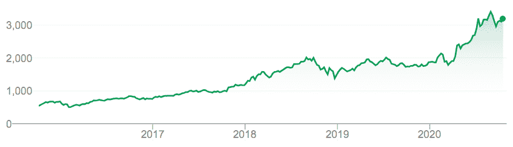
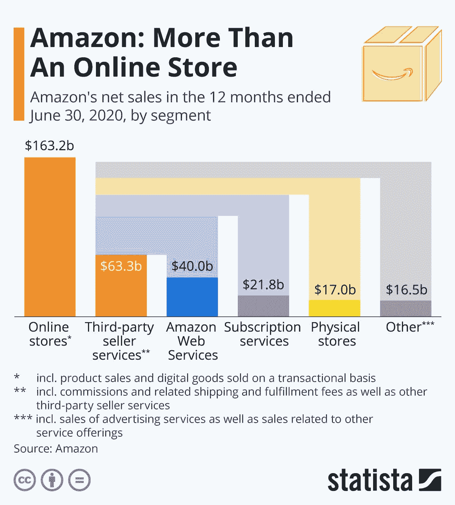

# 亚马逊是“不可避免的吗？”

> 原文：<https://medium.datadriveninvestor.com/is-amazon-inevitable-432313c367e3?source=collection_archive---------14----------------------->

## 今天，这个多元化且极具争议的网络商业巨头的未来会是怎样的？

Photo by [Christian Wiediger](https://unsplash.com/@christianw?utm_source=medium&utm_medium=referral) on [Unsplash](https://unsplash.com?utm_source=medium&utm_medium=referral)

亚马逊已经开始了历史性的奔跑。在商业历史的编年史上，很少有公司像 T2·杰夫·贝索斯领导下的亚马逊一样发展得如此之快和如此之大。从一个简单的在线售书的创新模式到成为一个跨许多业务线的多元化创新公司，亚马逊的故事是一个非凡的故事，为其股东创造了惊人的回报，特别是在最近 5 年(*见图 1:亚马逊股票表现，2015-2020*)。

**图 1:2015 年至 2020 年亚马逊股票表现**

最近，数据分析公司 [Statista](https://www.statista.com/) 整理了一份亚马逊当前收入流的图表分析(*见图 2:亚马逊:不止一个在线商店* **)** 。截至 2020 年 6 月 30 日的 12 个月期间，亚马逊的营业收入总计 3218 亿美元。这意味着收入同比增长 27.66%。然而，亚马逊收入流的构成可能会让今天的许多人感到惊讶，因为亚马逊的核心业务——通过 Amazon.com 网站的第一方销售——约占一半(51%)。亚马逊剩下的一半收入来自亚马逊运营的各种增长部门，包括:

*   第三方卖家服务:633 亿美元
*   亚马逊网络服务:400 亿美元
*   订阅服务:218 亿美元
*   实体店:170 亿美元
*   其他:165 亿美元。

 [## 这么说一家大型风投基金正在投资你的初创公司？4 实际考虑|数据驱动的投资者

### 首先，恭喜你。融资总是需要努力的，一个大的风险投资基金当然是一个大的…

www.datadriveninvestor.com](https://www.datadriveninvestor.com/2020/08/09/so-a-big-vc-fund-is-investing-in-your-startup-4-practical-considerations/) 

**图 2:亚马逊:不仅仅是一个在线商店**

**来源:** [Statista](https://www.statista.com/) ，[亚马逊:不止一个在线商店](https://www.statista.com/chart/15917/amazon-revenue-by-segment/)，2020 年 9 月

# 分析

作为一名战略管理教授和顾问，人们真的只能对亚马逊近年来的增长和轨迹感到惊讶(是的，希望他大量投资亚马逊股票！).该公司做了一件在商业史上很难做到的事情，即在其发展到巨大规模的同时保持创新和敏捷。随着亚马逊涉足越来越多与其核心业务有一些协同效应的领域，它正在寻找——然后执行——似乎只会提高其价值的战略，同时为其似乎不断扩大的客户群提供更多价值。

亚马逊已经实现了面向消费者的公司的梦想——它们变得不可或缺，有些人会说……借用灭霸的话，“不可避免”冠状病毒时代的过去六个月表明，亚马逊凭借其全套服务和平台，几乎每天——在某些情况下，每小时——已经成为我们许多人生活的一部分。然而，在他们目前所做的一切中，似乎有一种协同作用——是的*逻辑*:

*   他们的亚马逊网络服务是[利用他们最初为消费者业务建立的云能力](https://www.wsj.com/articles/amazon-has-long-ruled-the-cloud-now-it-must-fend-off-rivals-11578114008)的一种方式；
*   随着第三方卖家[扩大亚马逊上向消费者提供的商品](https://www.hbs.edu/faculty/Publication%20Files/amazon_2018-06-05_4a83c515-af0c-4366-9fba-8fb059d0b4f6.pdf)的范围和深度；
*   他们的订阅服务将顾客与亚马逊越来越紧密地联系在一起；
*   随着他们进入实体独立商店和杂货店(通过他们[收购全食](https://www.digitalcommerce360.com/2019/06/21/how-amazons-whole-foods-acquisition-changed-the-grocery-industry/))；和
*   随着他们在[配送和运输](https://digiday.com/retail/amazon-expanding-shipping-logistics-services/)(包括空中和地面)方面的大量投资，他们能够更好地为客户服务，并将这些服务保留在内部。

总的来说，亚马逊似乎已经采取了所有正确的措施，将自己定位为当今消费者几乎所有东西的首选——是的，成为公司和消费者今天会面的目的地是不可避免的。

Photo by [Hello I'm Nik 🎞](https://unsplash.com/@helloimnik?utm_source=medium&utm_medium=referral) on [Unsplash](https://unsplash.com?utm_source=medium&utm_medium=referral)

从分析师的角度来看，该公司目前似乎已经取得了优越的竞争地位，其唯一真正的竞争对手是沃尔玛，其地位和影响力足以挑战其主导市场地位。虽然沃尔玛肯定已经进行了大量投资来提高其在线能力，并证明了作为一个大公司竞争对手，沃尔玛几乎和亚马逊一样灵活，但他们似乎对亚马逊的竞争举措更加敏感(例如，该公司[最近进入订阅服务](https://www.cfo.com/strategy/2020/09/walmart-to-launch-subscription-service-this-month/))。沃尔玛是——并将继续是——亚马逊的强大竞争对手，它可能会继续在实体零售业中占据主导地位，尤其是在主要连锁店和小型零售商今天都在继续为生存而挣扎的时候，这场斗争只会因疫情及其给我们所有人带来的经济挑战而加剧。然而，我们越来越多地看到的是双轨零售环境，亚马逊正在扩大其在网络空间的主导地位，沃尔玛正在建立其在实体零售领域的成功，但这两个巨头在彼此的主要“空间”中的交叉竞争越来越多。尽管如此，正如沃尔玛有雄心勃勃的在线增长目标，亚马逊有雄心勃勃的实体零售增长目标，这两家公司都没有野心——或者甚至没有资源——在他们的“本土”环境中超越对方——至少在未来十年或更长时间内没有。

那么目前亚马逊真正的*战略威胁有哪些呢？很快，有人会说该公司面临的威胁主要是由于其规模，这意味着它的威胁在很大程度上是亚马逊成功的产物。历史一次又一次地表明，当公司发展得如此之快、如此之大时，它们会变得越来越难以管理(想想大型汽车公司的阵痛，不仅在美国，在全球也是如此)。今天，随着企业管理系统和数据分析的大幅改进，人们可以认为亚马逊可以避免——或者至少减轻——管理如此规模的企业所带来的许多问题。然而，正如操纵任何大型车辆比操纵小型车辆更困难一样(即房车与汽车或超级油轮与小型船只)，历史证明，凭借这些大型企业创造的“组织惯性”,改变一家大型公司的路线充其量是困难的，在许多情况下也是不可能的。未来，亚马逊是否以及如何做到这一点将是一个关键的压力测试，也是一个关键的成功因素。*

Photo by [Bryan Angelo](https://unsplash.com/@bryanangelo?utm_source=medium&utm_medium=referral) on [Unsplash](https://unsplash.com?utm_source=medium&utm_medium=referral)

亚马逊目前面临的另一个真正的外部威胁来自监管方面。虽然联邦政府在过去十年左右的时间里一直不愿意对任何大公司提起反垄断诉讼，尤其是在科技领域对 T2 提起反垄断诉讼，但政治潮流总有可能会转向，诉讼可能会成为现实。随着即将到来的选举看起来越来越有可能[在总统和国会层面带来华盛顿控制权的变化，反垄断行动可能成为亚马逊非常现实的担忧和威胁。尽管任何此类行动都将持续数年——而且很可能会遭到亚马逊的强烈反对并在法庭上打官司，但早期的传言已经凸显了“大型科技公司”尤其是亚马逊的反垄断担忧。尽管亚马逊的任何“拆分”都可能是未来十年的商业故事，无论拆分是自发的还是政府强加的，但这种举动最终完全有可能对新出现的公司以及股东和消费者都有利。从历史上看，从长远来看，这种拆分——在电信和其他领域——](https://www.rollcall.com/2020/06/29/what-full-democratic-control-of-washington-could-mean-in-2021/)[确实对所有人都有利。因此，亚马逊的拆分也有可能——有可能——这样做，尽管任何这样的举动都可能是多年以后的事情。](https://www.theverge.com/2018/9/6/17827042/antitrust-1990s-microsoft-google-aol-monopoly-lawsuits-history)

最后，亚马逊是一块迷人的手表。该公司的未来确实不确定。然而，至少在短期内，该公司对我们所有人的影响、影响力和影响力很可能是不可避免的，对投资者和消费者都是如此。

# 和我一起在媒体上写作

想开始自己的写作之旅吗？想通过发布自己创作的文章来更好地建立个人品牌？考虑今天和我一起在媒体上写作，并使用这个链接:[https://davidwyld.medium.com/membership](https://davidwyld.medium.com/membership)。这样做，你将帮助支持我的写作，因为我收到你的媒介会员费的一部分。

 [## 通过我的推荐链接加入 Medium—David Wyld

### 作为一个媒体会员，你的会员费的一部分会给你阅读的作家，你可以完全接触到每一个故事…

davidwyld.medium.com](https://davidwyld.medium.com/membership) 

# 关于大卫·怀尔德

大卫·怀尔德*([dwyld@selu.edu](http://dwyld@selu.edu/))是路易斯安那州哈蒙德市[东南路易斯安那大学](https://www.southeastern.edu/)的战略管理教授。他是管理顾问、研究员/作家、出版商、执行教育家和经验丰富的专家证人。*

**大卫·怀尔德的社交媒体链接:**

*   上[脸书](https://www.facebook.com/david.wyld)
*   上 [LinkedIn](https://www.linkedin.com/in/david-wyld-4923707/)
*   在[推特上](https://twitter.com/GoodAdvicePub)

## 访问专家视图— [订阅 DDI 英特尔](https://datadriveninvestor.com/ddi-intel)