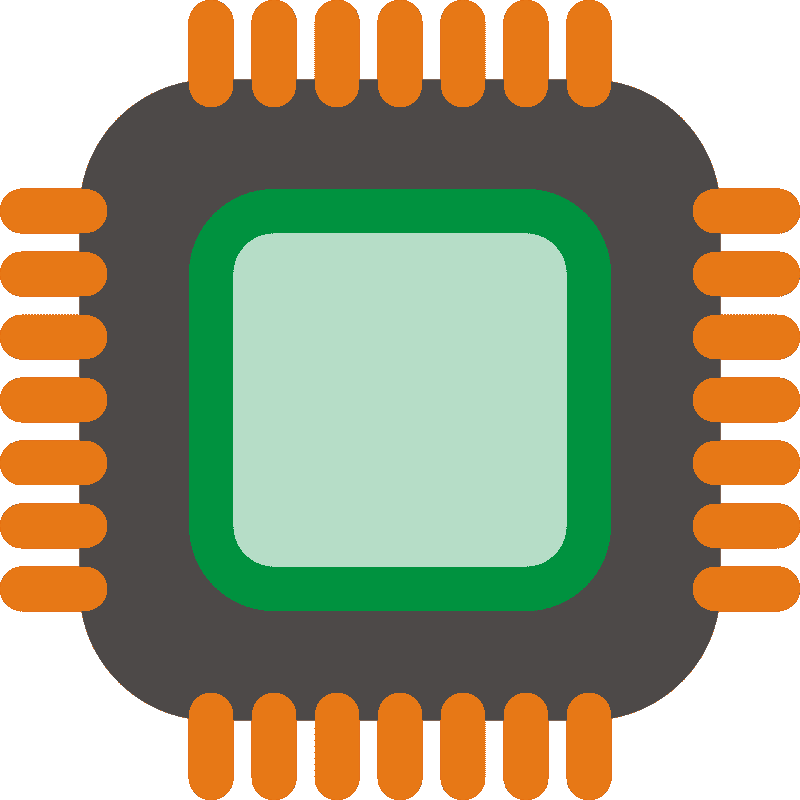
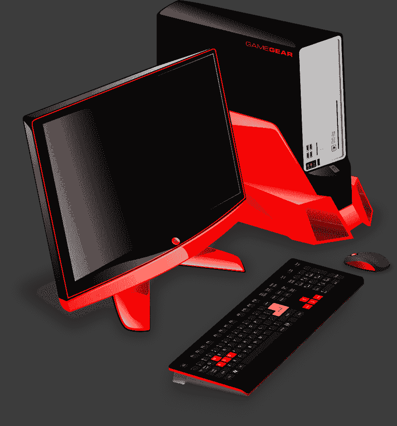
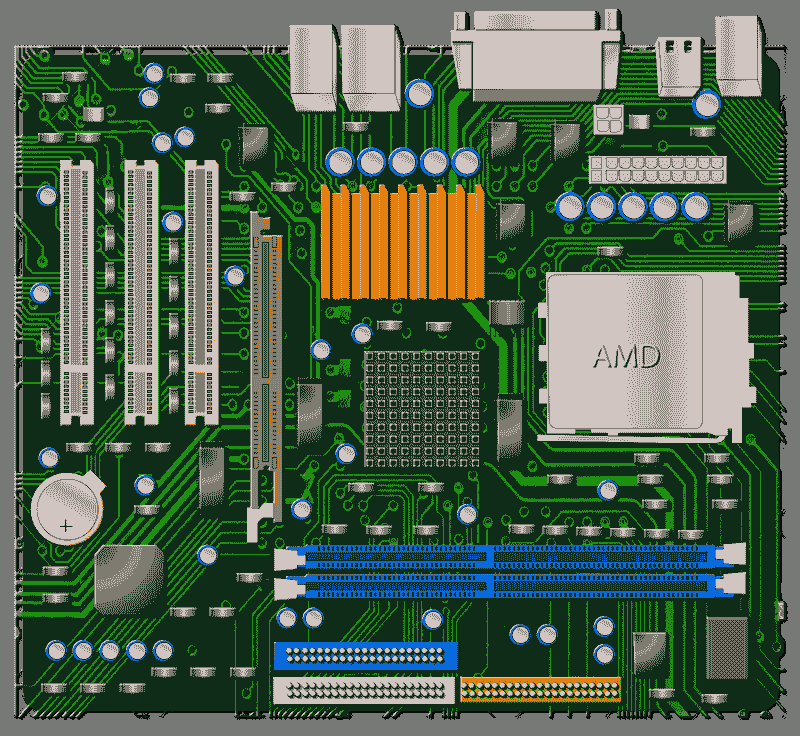
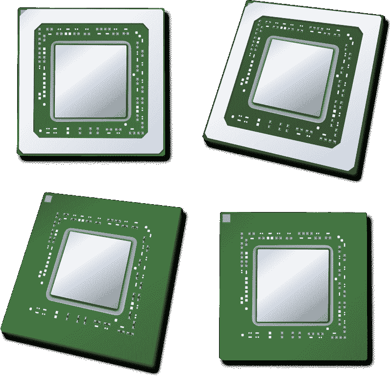

# AMD 从游戏中赚钱了吗？—市场疯人院

> 原文：<https://medium.datadriveninvestor.com/is-amd-making-money-from-gaming-market-mad-house-f1e5c17d4d99?source=collection_archive---------13----------------------->

芯片和处理器制造商 AMD 今年表现出色。2020 年，**AMD**股价从 2020 年 1 月 2 日的 49.10 美元涨到 2020 年 11 月 24 日的 85.07 美元。

我认为市场先生对 AMD 感兴趣的原因很容易理解。 **AMD(纳斯达克股票代码:AMD)** 比竞争对手**英伟达(纳斯达克股票代码:NVDA)** 便宜。2020 年 11 月 24 日，市场先生支付了 518.31 美元购买尼维达(NVDA)的股票。

由于游戏越来越受欢迎，投资者喜欢英伟达和 AMD。与 NVIDIA 类似， [AMD 制造许多游戏产品](https://www.amd.com/en/shop/us/Desktops?f%5B0%5D=graphics_processor%3AAMD%20Radeon%20RX%205500%20XT&f%5B1%5D=graphics_processor%3AAMD%20Radeon%20RX%205700&f%5B2%5D=graphics_processor%3AAMD%20Radeon%20RX%205700%20XT)，包括处理器、笔记本电脑、显卡、嵌入式芯片、服务器解决方案和动力系统。

# 冠状病毒如何促进 AMD

特别是，AMD 锐龙台式机处理器为远程工作人员和游戏玩家提供了巨大的处理能力。详细来说，我认为 AMD 因为冠状病毒而处于一个奇妙的位置。

首先，数百万人冠状病毒让数百万游戏玩家呆在家里，除了游戏之外无事可做。因此，许多人会升级他们的游戏技术。

其次，数百万人在家工作，他们中的许多人将需要更多的处理能力。建筑师、会计师、工程师、设计师、软件工程师、网站设计师、交易员、艺术家、视频游戏设计师和动画师只是可以在家工作的专业人士中的一部分——如果他们有一台带强大处理器的台式机的话。

# 远程工作如何帮助 AMD (AMD)

例如，盖洛普估计，2020 年 10 月，33%的美国工人总是远程工作。

此外，25%的美国人说他们有时远程工作。另外，三分之二的远程工作人员希望继续远程工作。因此，如果盖洛普是正确的，58%的美国人远程工作。

当冠状病毒再次激增时，这些数字可能会增加。盖洛普估计，2020 年 4 月，51%的美国人在远程工作。

因此，数千万人可能需要强大的处理器，而他们的雇主可以为此买单。我认为组织会为强大的处理器买单，因为他们希望他们的公司继续经营下去，继续赚钱。

例如，一家投资银行可以继续交易，如果它的银行家家里有高速处理器的电脑。因此，投资银行作为一个强有力的激励，为每个银行家购买一台具有强大处理器的电脑。

同样，视频游戏设计师、电影制作人和动画制作人可以在家里用快速图形处理器工作。建筑师可以在家里用快速处理器设计建筑或房屋。

# AMD 不断增长的市场

游戏已经成为最大和最有潜力的娱乐领域之一。例如，Statista 估计，2020 年亚太地区将有 15 亿游戏玩家。

据 Statista 估计，2020 年，亚太地区游戏玩家在视频游戏上的支出为 783 亿美元。此外，Statista 估计，2018 年三个月内，全球平均游戏玩家在游戏上的支出为 123 美元。因此，Statista 估计，2018 年游戏玩家平均每年在游戏上花费 492 美元，接近 500 美元。

值得注意的是，Statista 估计，到 2023 年，全球游戏玩家人数将增长至 30 亿。Statista 估计 2020 年全球有[27 亿游戏玩家](https://news.gallup.com/poll/321800/covid-remote-work-update.aspx)。此外，Statista 估计，2018 年有 66%的美国人玩游戏，这一比例比 2013 年的 58%有所增长。

因此，AMD 为世界上最受欢迎的爱好制造人们需要的组件。此外，这种爱好越来越受欢迎。

# AMD 惊人的收入增长

我认为 AMD 的收入增长支持了我的论点，即游戏和在家工作的增加推动了处理器的销售。

Stockrow 估计，在截至 2020 年 9 月 30 日的季度中，AMD 的收入增长率为 55.52%。季度收入增长率从 2020 年 6 月 30 日的 26.19%和 2020 年 3 月 31 日的 40.41%上升。然而，AMD 以 2020 年 12 月 31 日 40.41%的季度收入增长率开始了 2020 年。

 [## 吸引我还是激怒我:游戏化将主宰世界|数据驱动的投资者

### 不要只想着游戏。想想我们整个生活世界的游戏化。网飞已经认为游戏是一个更大的…

www.datadriveninvestor.com](https://www.datadriveninvestor.com/2020/10/01/engage-me-or-enrage-me-gamification-will-run-the-world/) 

2020 年，AMD 的季度收入从 2019 年 12 月 31 日的 21.27 亿美元增长到 9 月 30 日的 28.01 亿美元。此外，AMD 报告的季度收入在 2020 年 3 月 31 日为 17.86 亿美元，在 2020 年 9 月 30 日为 19.32 亿美元。

因此， **AMD (AMD)** 在疫情期间经历了显著的增长，这就是成长型投资者购买它的原因。

# AMD 赚多少钱？

2020 年 9 月 30 日，AMD(纳斯达克股票代码:AMD) 报告季度毛利为 12.3 亿美元。季度毛利从 2020 年 12 月 31 日的 9.49 亿美元和 2020 年 6 月 30 日的 8.48 亿美元增长。

令人印象深刻的是，AMD 的季度营业收入从 2020 年 6 月 30 日的 1.73 亿美元增长到 2020 年 9 月 30 日的 4.49 亿美元。相比之下，AMD 的季度营业收入从 2019 年 9 月 30 日的 1.86 亿美元增长到 2019 年 12 月 31 日的 3.48 亿美元。2020 年，3 月 31 日季度营业收入降至 1.77 亿美元。

2020 年 9 月 30 日，AMD 报告季度运营现金流为 3.39 亿美元。季度运营现金流从 2019 年 12 月 31 日的 4.42 亿美元下降到 2020 年 3 月 31 日的-6，500 万美元和 2020 年 6 月 30 日的 2.43 亿美元。

# AMD 能产生多少现金？

然而， **AMD (AMD)** 在 2020 年 9 月 30 日报告了-4 . 79 亿美元的季度末现金流。期末现金流并不像听起来那么糟糕，因为 AMD 在同一天报告了-2.69 亿美元的季度融资现金流。这意味着 AMD 支付了 2.69 亿美元的债务。

AMD 从 2020 年开始，截至 2019 年 12 月 31 日的季度末现金流为 3.09 亿美元，到 3 月 31 日上升到 13.34 亿美元。因此，AMD 可以产生大量的现金。

因此，AMD 在 2020 年 9 月 30 日报告了 17.11 亿美元的现金和短期投资。现金和短期投资从 2019 年 12 月 31 日的 15.03 亿美元上升到 2020 年 6 月 30 日的 17.75 亿美元。

AMD 的价值在 2020 年有所增长。AMD 报告的总资产在 2019 年 12 月 31 日为 60.28 亿美元，到 2020 年 9 月 30 日增至 70.23 亿美元。

# AMD 与 NVIDIA (NVDA)

与**英伟达(NVIDIA)相比，AMD 仍然很小。【2020 年 9 月 30 日，英伟达报告的现金和短期投资为 101.39 亿美元，总资产为 248.81 亿美元。**

此外，Stockrow 估计英伟达在截至 2020 年 10 月 31 日的季度中收入增长率为 [56.8%。英伟达报告季度收入为 47.26 亿美元，季度毛利为 29.6 亿美元，季度营业收入为 13.98 亿美元。](https://stockrow.com/NVDA/financials/income/quarterly)

此外，NIVIDA 在 2020 年万圣节当天报告了 12.79 亿美元的季度运营收入。然而，英伟达报告称，2020 年 10 月 31 日的期末现金流为-122.2 亿美元。相反，NVDIA 报告 2020 年 3 月 31 日的期末现金流为 154.94 亿美元。

因此，NVIDIA 是一家利润丰厚的公司，可以产生大量的现金。然而，英伟达与更便宜的 AMD(纳斯达克股票代码:AMD) 有许多相似之处。

# 英伟达是游戏领域的寡妇和订单股

然而，我认为英伟达是一只比 AMD 好得多的股票。值得注意的是，AMD 不支付股息，因此它没有给普通人提供安全边际。

相反，英伟达将在 2020 年 12 月 3 日支付 16₵股息。总体而言，英伟达股票在 2020 年 11 月 20 日提供了 64₵年度股息和 0.12%的股息收益率。

如果你想买游戏和处理器领域的孤儿寡母股票，英伟达仍然是你的选择。然而，如果你想要一只处理器和游戏领域的廉价成长股，AMD 值得研究。

*原载于 2020 年 11 月 24 日 https://marketmadhouse.com**的* [*。*](https://marketmadhouse.com/is-amd-making-money-from-gaming/)

## 访问专家视图— [订阅 DDI 英特尔](https://datadriveninvestor.com/ddi-intel)