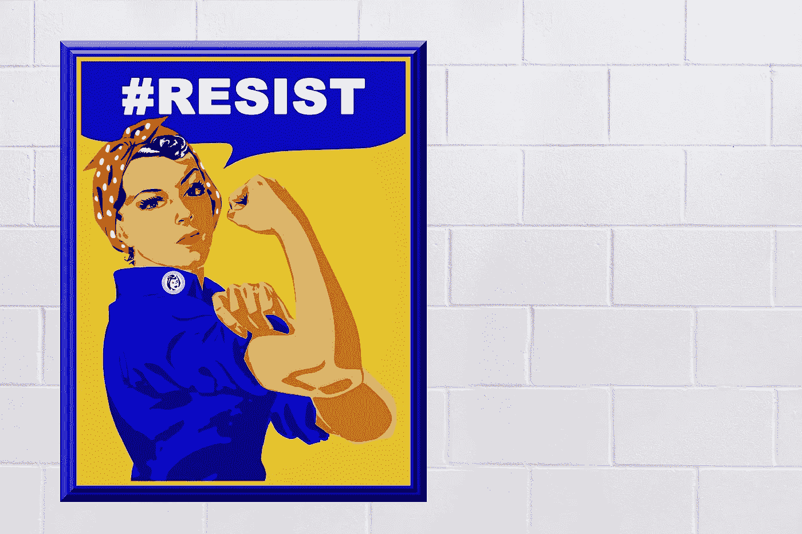

# 美国正处于崩溃的边缘吗？

> 原文：<https://medium.datadriveninvestor.com/is-america-on-the-brink-of-collapse-5f3c217c3336?source=collection_archive---------7----------------------->

## 冠状病毒的爆发可能是压倒骆驼的最后一根稻草

[Jackie Ramirez](https://pixabay.com/users/ParentRap-2161438/?utm_source=link-attribution&utm_medium=referral&utm_campaign=image&utm_content=2155203)

封锁导致了全美各地的抗议活动。武装抗议者甚至聚集在密歇根州首府，要求 T2 结束封锁措施。抗议者认为封锁侵犯了他们的公民权利，但抗议象征着比侵犯公民权利更有害的东西。他们是一个濒临崩溃的破碎社会的象征。

封锁对美国经济产生了破坏性影响。在过去的两个月里，3600 万人申请失业，这是自 20 世纪 30 年代大萧条以来的最高水平。美国并不是唯一感受到冠状病毒经济愤怒的国家。英格兰银行估计英国的失业率可能会翻倍，经济可能会萎缩 14%。从全球来看，我们正在进入一个经济波动的时期。

让美国与众不同的是，美国政府不再为它所管辖的人民的利益而工作，而是为公司的利益而工作。这种政府对其公民责任的背叛导致了社会基础的腐蚀。在这种环境下，新冠肺炎导致的经济崩溃可能是压倒骆驼的最后一根稻草，让美国跌落悬崖。点燃了已经酝酿多年的民间动乱。

美国是怎么走到这一步的？答案在于“让美国再次伟大”的尝试。

## 让我们让美国再次伟大

罗纳德·里根在 1980 年总统竞选中的压倒性胜利建立在“让美国再次伟大”的口号之上。他的总统任期从此改变了美国的面貌。

里根经济计划(被称为里根经济学)的核心要素之一是放松对市场的管制。里根蔑视大政府，相信自由市场。他认为对商业的管制越少越好。随之而来的是许多公共产业的私有化。

Ronald Reagan’s 1980 Presidential campaign slogan: ‘Let’s Make America Great Again’

建立在新自由主义原则基础上的里根经济学。放松监管的理念是，解放企业，让它们做自己最擅长的事情，由此产生的财富会慢慢流向社会。我们都享受着自由市场的果实，所以新自由主义的口号是这样的。

里根为新自由主义者通过公司利益接管美国政治奠定了基础。事实上，自由市场并没有从政府强加的“枷锁”中解放出来，而是受到了有利于企业利益的操纵。保守政策建立了一种结构，在这种结构中，涓滴效应更像是[涓滴效应](https://www.theguardian.com/commentisfree/cifamerica/2011/feb/07/ronald-reagan-republicans)。确保赢家永远不变。

## 美国噩梦

里根经济学的另一个影响是个人权力凌驾于社会之上的观念。更少的政府给人们更多的自由和能力来控制他们的生活和创造他们的财富。里根坚持美国梦的价值观，这是美国精神的核心。

将庆祝美国梦作为个人追求的问题在于，它鼓励了激烈的竞争。按照设计，大多数人必须为少数人工作，才能享受他们的劳动成果。

对个人的赞美已经转化为自大萧条以来从未有过的[收入不平等。美国收入最高的 0.1%的人与收入最低的 90%的人价值相当。这不是意外。这是为了让财富掌握在少数人手中而进行的协调一致的系统性努力的结果。](https://inequality.org/facts/income-inequality/)

当富人越来越富的时候，美国每天晚上有 50 万人无家可归。[3800 万美国人](https://www.census.gov/library/publications/2019/demo/p60-266.html)生活在贫困线以下，[2700 万美国人](https://www.theguardian.com/us-news/2019/sep/10/number-of-uninsured-americans-up-for-first-time-since-obamas-election)没有医疗保险。贪吃的财富和极度的贫困之间的差距反映了一个优先考虑的不是社会，而是强大的企业精英的系统。

## 企业统治

美国已经变成了一个公司统治的国家，在这里，决策都是围绕着公司利益的。这种结构中隐藏着贪婪和少数人的私利。

政府的基础是满足它所治理的社会的需求。但在美国的企业制度中，这种关系已经被切断。

没有什么比私人监狱现象更能说明这一点了。监狱系统的私有化在里根执政期间就开始了(你猜对了)。关押犯人符合这些私人监狱的利益。降低犯罪率是任何社会成功的基础，但这与他们想要的恰恰相反。

在这些私营公司从高犯罪率中获益的决策中，从来没有考虑过社会的需求。一个公司能从社会失败中获得多少利润。

这个决定在道德上是有问题的。最糟糕的是，它代表了一个与人民完全脱节的腐败政府。

专注于企业利益的政府的一个不良后果是人民和政府之间信任的破裂。人们不信任在健康的民主社会中作为人民代表的机构。

信任是一个正常运转的健康社会的基石，也是一种社会粘合剂。另一方面，不信任具有腐蚀性影响，可能导致社会崩溃。

美国的公司统治导致了信任的侵蚀。在这种背景下，个人脱离了政治体系。以至于 2016 年总统选举中最大的[投票群体(超过 1 亿人)](https://www.theguardian.com/us-news/2017/jan/18/american-non-voters-election-donald-trump)是那些选择根本不投票的人。

## 崩溃的边缘

选民幻想破灭，不平等现象猖獗，政府被企业影响力腐化，美国是一个摇摇欲坠的体系。唐纳德·特朗普是企业完全掌控美国政治的象征。他的“让美国再次伟大”的运动是服用了类固醇的里根经济学。

美国的[抵抗](https://resist.org/)运动是适可而止的象征。这代表了从公司手中夺回国家的决心。让政治家负起责任，结束淹没华盛顿的腐败。带回美国濒临失去的民主。政治家再次成为选举他们的人民的代表。而不是出价最高者的代表。

冠状病毒的爆发可能是一个分水岭。超过 20%的失业率[随时都会引起恐慌。但在一个被如此多的社会问题困扰的系统中，它可能被证明是将美国推向内乱的催化剂。](https://inequality.org/facts/income-inequality/)

随着社会压力的增加，它正在创造一个随时可能沸腾的不满、怨恨和沮丧的熔炉。

种瓜得瓜种豆得豆。美国政府为了公司利益而忽视了社会。它背弃了赋予它权威和合法性的对人民的责任。只需要一个火花，几十年来积累的挫败感就会爆发出来。

*阅读原文，在*[*transformatise.com*](http://www.transformatise.com/)订阅更多文章