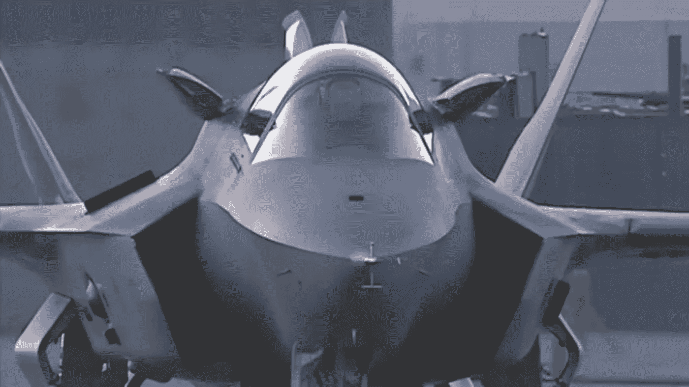
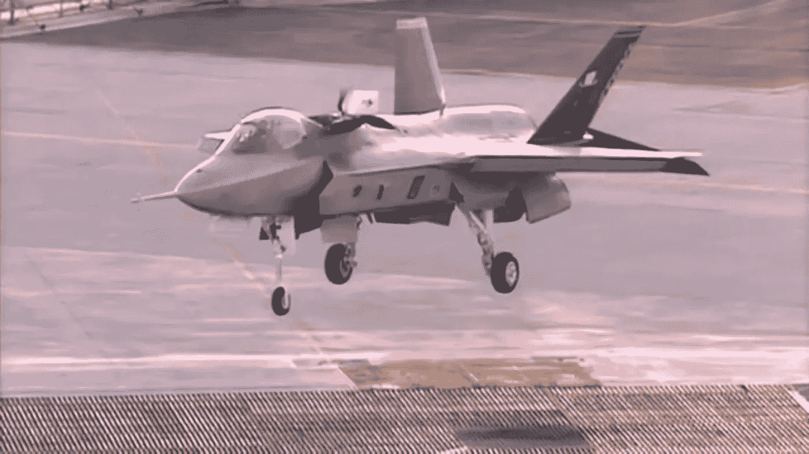
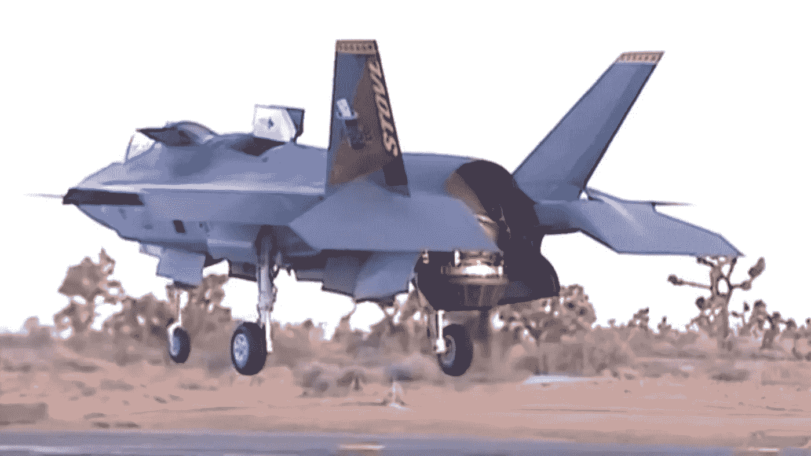
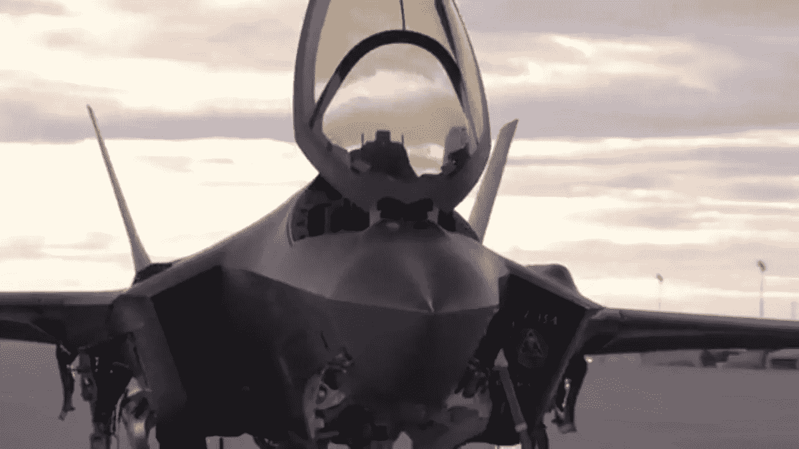

# 美国 1 亿美元的第五代战斗机——F-35 真的值吗？

> 原文：<https://medium.datadriveninvestor.com/is-americas-100-million-5th-generation-fighter-jet-f-35-really-worth-it-49a154128224?source=collection_archive---------3----------------------->

## 联合攻击战斗机(JSF)计划下的 F-35 闪电 II 战斗机是人类历史上最昂贵的防御和武器系统。但是，对于采购和终生运营成本来说，1.5 万亿美元真的值得吗？

T 美国国防部[历史上最大的采购](https://www.cnbc.com/2019/10/29/lockheed-martin-costly-f-35-program-gets-biggest-pentagon-contract-yet.html)是 F-35 闪电 II，其不同版本适合美国空军、海军和海军陆战队的需求。国防部预计将采购总共 3000 架 F-35，而盟国预计将采购数百架，其中八个国家是美国的成本分摊伙伴。

PHOTO: Lockheed Martin

洛克希德·马丁公司的 F-35 闪电 II 是一种多变体、多用途的第五代战斗机，结合了先进的隐身、战斗机速度和敏捷性、完全融合的传感器信息、网络使能操作和先进的持续能力。它是空军第四代战斗机 F-16 的替代品。

美国从未吸取 B-2 计划失败的教训，仍在努力改进其先前的隐形技术，包括 F-22 猛禽和 F-117 夜鹰，这是一种可以取代美国海军 FA-18 的舰载战斗机，可能会接受英国 AV-8B 鹞式战斗机垂直着陆的挑战——将所有这些先进能力纳入一架飞机从来都不是容易和廉价的项目，除了其节约成本措施的目标外，该计划甚至更加复杂和昂贵。这些飞机是作为美国空军、海军和海军陆战队的合资企业在一架飞机上开发的，根据各军种的需求定制了不同的变体——该计划被命名为联合攻击战斗机(JSF)，其目标是生产下一代战斗机，可以取代美国军队及其盟友的战斗机和对地攻击能力的飞机。

与美国空军专用飞机 F-22 猛禽不同，F-35 将在商业上可用，联合攻击战斗机项目是麦克唐纳·道格拉斯公司、洛克希德·马丁公司、诺斯罗普·格鲁曼公司和波音公司之间的竞争，但只有洛克希德公司和波音公司继续开发样机作为竞争的决赛选手，两者都渴望赢得有史以来最大的国防合同。

> Frost & Sullivan 航空航天、国防和安全行业负责人布拉德·柯伦(Brad Curran)对《国家利益》表示:“有些人说 F-35 不值得花费这么多钱，因为如果它们拥有同等的计算机、传感器和武器升级，更便宜的传统平台也可以充当战斗机和攻击机的角色。”。
> 
> “其他人说，只有 F-35 具有速度、机动性、隐身和灵活性的组合，才能在今天的战斗机和防空威胁中生存和获胜，”柯伦补充说。

# 所以洛克希德最终赢得了合同，现在呢？

[洛克希德·马丁](https://www.cnbc.com/2019/10/29/lockheed-martin-costly-f-35-program-gets-biggest-pentagon-contract-yet.html)用其提升系统给联合攻击战斗机项目演示者留下深刻印象，以增加 [X-35B 短距起飞和垂直着陆(STOVL)](https://www.f35.com/in-depth/detail/how-it-works-f-35b-hover#:~:text=The%20LiftFan%C2%AE%20is%20mounted,for%20a%20pure%20hover%20mode.) 的可靠性。

PHOTO: Lockheed Martin

在正常飞行期间，发动机推力再次从单个排气喷嘴排出，但当演示开始时，X-35B 能够像变形金刚一样发生变化——飞机顶部和底部的补丁显示了两个反向旋转的风扇，这是由劳斯莱斯专利的轴驱动[升力风扇推进系统](https://www.rolls-royce.com/products-and-services/defence/aerospace/combat-jets/rolls-royce-liftsystem.aspx)和一个在短距起飞/垂直着陆模式下可以旋转 90 度的发动机实现的。*罗尔斯·罗伊斯将 F-35 发动机转包给普惠&公司，为闪电 II* 提供升力系统，机翼下的另外两个小门打开，露出两个控制飞机机动的额外排气口。当飞机开始向下旋转时，由飞机后部的 3 轴承旋转模块(3BSM)产生的喷嘴将开始旋转，并将喷气发动机的剩余推力从水平转换到垂直。然而，升力风扇在推进系统上经历了[部件故障](https://www.pogo.org/investigation/2020/07/spare-us-the-f-35-parts-mismanagement/)，同样的问题困扰着英国 AV-8B 鹞式 II——升力风扇在垂直着陆过程中起着关键作用，因为它在稳定和控制方面的作用。

PHOTO: Lockheed Martin

但是洛克希德·马丁公司的原型机最大的特点是其垂直着陆和超音速飞行的能力——这正是联合攻击战斗机项目所寻求的能力。使 F-35B 闪电 II 成为英国 AV-8B 鹞式 II 的一个有价值的继承者，这种飞机价值相当于今天的 3900 万美元。

F-35 有三种型号，每一种都是根据美军不同部门的需求量身定制的。F-35A 是为美国空军定制的，设计用于从常规跑道起飞，使其能够废弃海军陆战队型号 F-35B 所需的重型设备。海军陆战队不像海军那样在大型航空母舰上作战。接下来是 F-35C，它旨在满足海军的要求——其机翼比其姐妹型号大 40%,起落架更重更强，这两者都是从航空母舰上成功降落和起飞所必需的，而不需要像 F-35B 那样的垂直推进，更大的机翼不仅使 F-35 拥有三种型号中最大的燃料容量，而且在较慢的速度下也能提供更好的升力。F-35C 还采用了折叠翼尖，以允许飞机占据船内有限的空间。

> 三种变体的这些扩展已经成为三个不同军事分支的项目成本膨胀的巨大来源。

# 为什么 F-35 是所有飞机中最怕的？

武器战争的理想类比是，“谁先看到，谁先开枪”，但 F-35 闪电 II 不是这种情况，F-35 如此先进的最大因素是其机载传感器和隐身技术，这使该飞机在竞争中脱颖而出。不同于历史上的任何其他飞机，传感器和计算机制导系统的速度已经与飞机的用户界面集成，同时与整个部队共享情报。

## 驾驶舱安装的红外玻璃窗是蓝宝石，一种非常昂贵的宝石。

它是一台短波红外和高清电视，包含飞机的红外成像和跟踪设备，这被称为**光电瞄准系统(EOTS)** —它提供了一个多功能系统，用于精确的空对空和空对地瞄准能力。来自传感器的成像数据可以与来自地面传感器的其他数据一起输入飞行员的头盔，这已经通过增强现实技术得到了增强，并为飞行员提供了虚拟的情景意识，它还允许飞行员直接从飞机上看，而无需戴夜视镜。

PHOTO: Lockheed Martin

另一方面，探测只是其战斗力目标的一步，不被探测同样重要。融入隐形技术是另一个挑战，也很可能是成本意外上升的原因。要明确的是:隐形并不能使飞机隐形，但它会延迟敌人的发现。

高度先进的下一代 F-35 是人类引进的所有战斗机的组合，因为它具有[转换能力](https://www.lockheedmartin.com/en-us/products/f-35/f-35-capabilities.html)，这就是为什么 F-35 是所有飞机的继承者并与众不同的亮点。

## VLO 隐形

由于从第一天起就设计了隐身，F-35 具有无与伦比的躲避敌人探测和进入竞争空域的能力。

## 武器能力

F-35 以隐形构型在内部携带武器，或者在总载重量超过 18000 磅的允许环境中在外部携带武器。

## 超音速和大航程

普惠 F135 是世界上最强大的战斗机发动机。在 1.6 马赫的速度下，F-35 是一种远程超音速战斗机，即使内部武器和燃料齐全。

## 传感器融合

F-35 的先进传感器融合创建了一个单一的战场综合图像，大大提高了意识，生存能力和杀伤力。

## 网络支持的操作

F-35 充当信息和通信网关，与地面、海上和空中资产共享其作战图像。

## 电子战系统

先进的电子战能力，可定位/跟踪敌军、干扰雷达和破坏攻击。

## [的 F-35 项目](https://news.yahoo.com/cost-f-35-stealth-fighters-010000537.html?guccounter=1&guce_referrer=aHR0cHM6Ly93d3cuZ29vZ2xlLmNvbS8&guce_referrer_sig=AQAAAMplVmR2SJbEOMEojz25cfOCPFel03CB6LAK49MuXgAtFodf0lilAk0JBQB3smcqWxl23GdmLyysATjfNCZUFccCu8qAwfblkgk6es6GsRSlyOYek94AbmughvIASa9C1jVyiTtHp9tV_br57iygY7Yn1kJR2sy7lKvJ0iD3RW9c#:~:text=%22Experienced%20Air%20Force%2C%20Navy%2C,35%20is%20worth%20the%20cost.%22)因其不断膨胀的成本而饱受批评，这是不可否认的事实。然而，由于不断增加的费用，不断的延误和故障，以及高昂的运营成本，闪电号很可能会在未来很长一段时间内与其前身并肩作战。