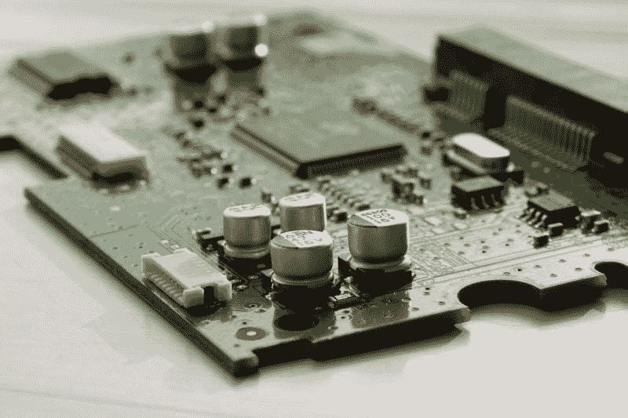

# 应用材料赚钱吗？—市场疯人院

> 原文：<https://medium.datadriveninvestor.com/is-applied-materials-making-money-market-mad-house-bb39210d6599?source=collection_archive---------8----------------------->

许多人认为，设备制造商如**应用材料公司(纳斯达克代码:AMAT)** 是价值投资。相反，应用材料公司在 2020 年赚钱更少。

例如，应用材料公司的季度收入从 2020 年 1 月 31 日的 41.62 亿美元下降到 2020 年 4 月 30 日的 39.57 亿美元。此外，应用材料公司同期的季度毛利从 18.58 亿美元降至 17.49 亿美元。

 [## 投资区块链前要问的三个简单问题(也是一个困难的问题)|数据…

### 现在是了解区块链的最佳时机。不同货币之间的增长率，比如…

www.datadriveninvestor.com](https://www.datadriveninvestor.com/2020/03/12/three-simple-questions-and-one-difficult-one-to-ask-before-investing-in-a-blockchain/) 

然而，Stockrow 认为应用材料的收入增长率从截至 2020 年 1 月 31 日的季度的 10.9%增长到最后一个季度的 11.81%。应用材料的收入增长率从 2019 年 10 月 31 日的-0.13%上升至 2020 年 1 月 31 日的 10.9%。

因此，应用材料公司正在经历高收入增长，但赚钱更少。因此，应用材料公司赚了更多的钱，因为它的收入在增长。

# 应用材料公司赚钱越来越少

然而，在 2020 年 1 月 31 日至 2020 年 4 月 30 日期间，应用材料的季度运营收入从 10.42 亿美元降至 9.32 亿美元。此外，应用材料公司的季度普通净收入同期从 8.92 亿美元下降到 7.55 亿美元。

此外，应用材料的经营现金流从 2020 年 1 月 31 日的 9.87 亿美元下降到 2020 年 4 月 30 日的 6.35 亿美元。相比之下，应用材料公司同期的期末现金流从 34.24 亿美元降至 19.72 亿美元。

此外，同月，应用材料融资现金流从-5.3 亿美元上升至 11.72 亿美元。因此，应用材料公司产生的现金越来越少。相比之下，应用材料公司的投资现金流从 2020 年 1 月 31 日的-1.62 亿美元上升至 2020 年 4 月 30 日的 1.65 亿美元。

有趣的是，我认为应用材料公司借了更多的钱。在过去的两个季度中，应用材料公司融资产生的现金从-5.3 亿美元增长到 11.72 亿美元。融资产生的现金表明申请材料借入了多少资金。

# 应用材料公司有更多的现金

值得注意的是，应用材料公司有更多的现金可用。应用材料公司的现金和短期投资从 2020 年 1 月 31 日的 39.6 亿美元增长到 2020 年 4 月 30 日的 57.04 亿美元。

我认为应用材料公司是一家现金充裕、安全系数高的公司。我相信应用材料公司有很高的安全边际，因为它的增长率和它产生的现金。

# 应用材料是好股票吗？

**应用材料公司(纳斯达克股票代码:AMAT)** 比**英伟达(纳斯达克股票代码:NVDA)** 便宜。

例如，市场先生在 2020 年 5 月 29 日为 AMAT 支付了 56.36 美元。令人惊讶的是，市场先生在同一天以 354.27 美元的价格购买了一股 NVDA 股票。然而，英伟达和应用材料都是芯片制造商。

不同之处在于专门研究图形处理器单元(GPU)以及机器人和人工智能(AI)运行的芯片。同时，[应用材料](http://www.appliedmaterials.com/automation-software)制造各种非性感产品，包括太阳能电池、半导体、显示器和自动化软件。

此外，游戏和流媒体视频在 NVIDIA 的图形处理器上运行。因此，应用材料具有一些价值投资特征。

相反，应用材料公司的股价在 2020 年已经缩水。具体而言，2020 年 1 月 2 日，AMAT 原油价格为 62.20 美元。这一价格在 2020 年 3 月 20 日跌至 37.99 美元，但在 2020 年 5 月 23 日升至 54.39 美元，在 2020 年 5 月 29 日升至 56.34 美元。

因此，AMAT 为冠状病毒经济崩溃提供了一些保护。然而，价格显示市场先生对应用材料的信心有限。

# 应用材料公司是好的分红股票吗

硬件股受价值投资欢迎的一个原因是，与大多数科技股不同，它们会派息。

例如，**应用材料公司(NASDAQ: AMAT)** 在 2020 年 5 月 20 日支付了 22₵股息。到 2020 年，1₵的股息将会增长。应用材料公司于 2020 年 2 月 18 日支付了 21₵股息。

Dividend.com 将两年的股息增长归功于应用材料公司。总体而言，截至 2020 年 5 月 29 日，应用材料支付的股息收益率为 1.56%，年化 88₵支付率为 23.10%。

因此，应用材料是一个很好的业务增长的廉价股息股票。我认为，寻找廉价、安全、有红利的技术投资的投资者需要调查应用材料。

*原载于 2020 年 5 月 29 日 https://marketmadhouse.com***。**