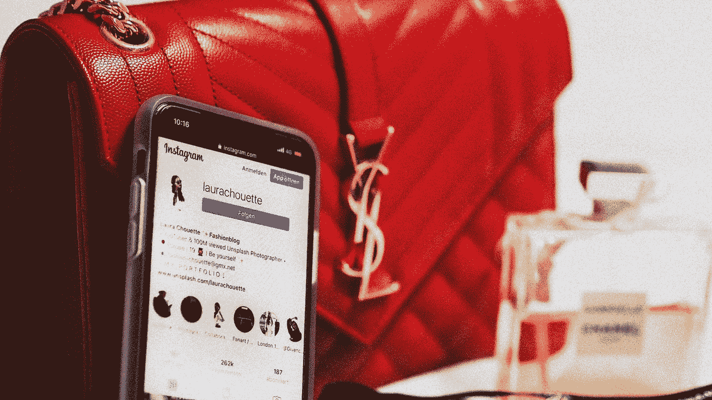

# 更大、更快、更好……真的更好吗？

> 原文：<https://medium.datadriveninvestor.com/is-bigger-faster-better-actually-better-e02a11a9d587?source=collection_archive---------13----------------------->

Photo by [Laura Chouette](https://unsplash.com/@laurachouette?utm_source=medium&utm_medium=referral) on [Unsplash](https://unsplash.com?utm_source=medium&utm_medium=referral)

## 我想知道为什么我们需要更好的？

不要误解我，我知道对更大、更快或更好的需求是进步和进化的主要动力，否则我们就不会有飞机、汽车或我们认为理所当然的医学奇迹。

我说的是我们每一两年为自己购买的消费品，比如笔记本电脑、手机、电视或者(谁买得起)汽车。

关于手机:它们的价格令人难以置信，超过 1000 美元，具有各种功能，如 3000 万像素，500 GB 的存储内存，非接触式支付或 5g 网络。

请告诉我一些事情:你上一次在比你的手机、平板电脑、笔记本电脑或电视屏幕更大的东西上看 3000 万像素的照片是什么时候？这些 3000 万像素实际上会照在几英尺宽的东西上，你可以看到它们捕捉到的所有细节。

 [## 为什么我们投资 Totient，也就是人工智能如何帮助我们生产抗癌药物和 Covid | Data…

### 9 月 10 日，一家人工智能驱动的药物研发公司宣布与……建立关键合作伙伴关系，从此悄然出现

www.datadriveninvestor.com](https://www.datadriveninvestor.com/2020/09/13/why-we-invested-in-totient-aka-how-ai-can-help-us-produce-drugs-against-cancer-and-covid/) 

你知道吗，FB 实际上会缩小你的照片，这样它们会加载得更快。如果你真的去一个发布真实尺寸照片(所有 3000 万像素)的网站，即使在 4G、5G 或 Wi-Fi 上，每张照片实际上也需要几秒钟才能加载，而在 FB 上，它们是即时加载的。你什么时候真的在手机 500 GB 的内存里看了上个假期拍的上百张照片？

你知道吗，你应该定期备份你手机上的文件，以避免你永久损坏或放错地方造成的损失。那么你真的需要所有这些 500Gb 的内存吗？

你什么时候最大限度地使用了你的手机？我指的是比 FB、Instagram、YouTube 或网页浏览更多的东西？你什么时候真正创造了让你赚钱的内容？

如今，手机可以做很多事情，但它永远不会取代专用相机、图形编辑电脑甚至游戏。一个 3000 万像素的 DSLR 相机将有如此多的选择，照片的质量将比任何严肃的摄影师都好得多，甚至不会考虑手机上的相机进行内容创作。

如果你想编辑图像、声音或视频，你的 PC 或笔记本电脑有这么多(更好的)选项，相比之下手机实际上就相形见绌了，你不会考虑用它来做这个。

你可以说手机是一个“移动解决方案”,它可以做很多事情，但从来没有达到只有专门的东西才能达到的质量。想象一下:你更信任谁来给你修车？一个可以修理任何汽车，但需要一段时间(可能会犯一些错误)的人，还是一个在你的汽车品牌或型号方面是专家，并且能够以三倍的速度更好地修理它的人？

因此，如果你从来没有真正看到过你用手机摄像头拍摄的所有细节，如果你没有真正看到过你拍摄的所有照片，你只会在 Instagram、脸书、Youtube 或一些充斥着商业广告的手机游戏上使用它，而这些商业广告正变得越来越难以享受。那你为什么要把所有的钱都花在一些只能做一半质量的东西上，而你可以用一些专用于手头任务的东西来创造比手机更好的内容。

我知道你会说电池可以用更长时间，安全性更高，新东西保证不会很快坏掉，或者它有更鲜艳的颜色或更好的屏幕。但是手机将在几年内被淘汰，因为他们将制造新的、更好的、更快的手机，并且比以往有更多的选择。

我认为这一切的错误在于虚荣，我们的虚荣。我们已经到了这样一个地步，我们竞相拥有所有最新的东西，只是为了比下一个排队的人更好，但却没有实际用途。所有淹没我们的商业广告都想要我们的血汗钱，并且会不择手段。他们会利用我们的心理来对付我们，让我们买下一个我们实际上可能不需要或不使用的最好的东西。

我的祖父曾经说过，在你买任何东西之前，想想你会用它来做什么，它真的比你已经拥有的更好、更快、更有能力吗？投资真的有价值吗？还是因为对你的邻居或朋友吐口水？他确实生活在一个不同的时代，那里的东西被使用了很长一段时间，它们是固定的，而不是被替换的，实际上对它们有价值。

**进入专家视角—** [**订阅 DDI 英特尔**](https://datadriveninvestor.com/ddi-intel)