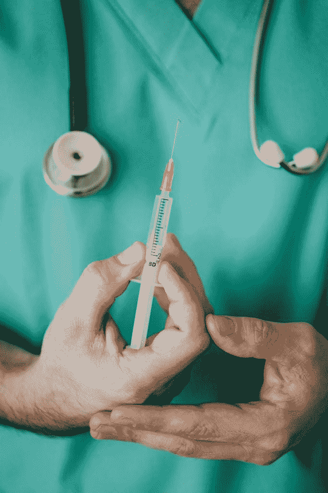
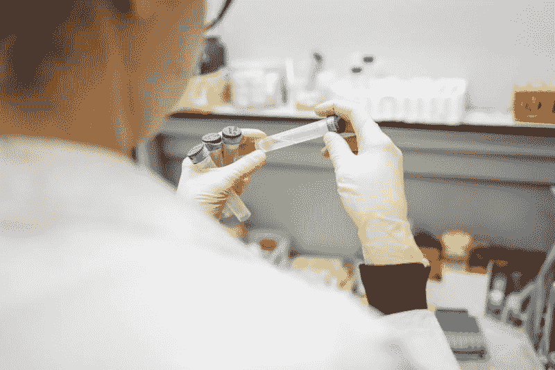
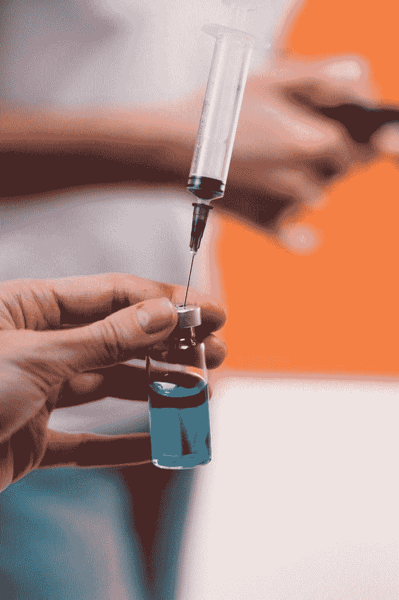
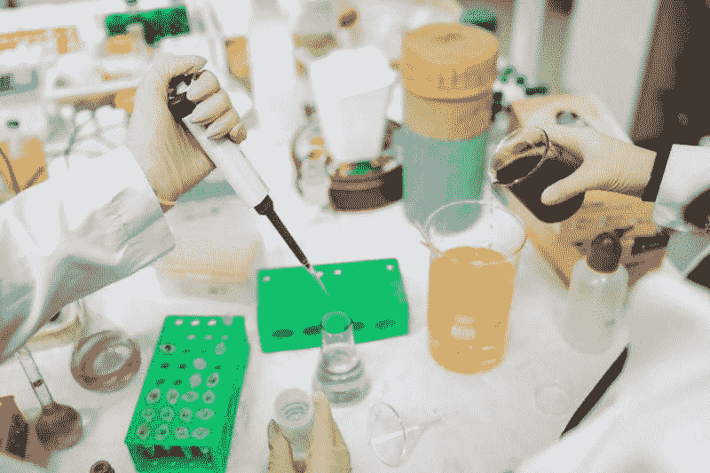

# BioNTech 赚钱了吗？—市场疯人院

> 原文：<https://medium.datadriveninvestor.com/is-biontech-making-money-market-mad-house-ce16c5329c4f?source=collection_archive---------10----------------------->

许多投资者对 BioNTech (NASDAQ: BNTX) 感到好奇，因为 BioNTech 和 **Pfizer Inc. (NYSE: PFE)** 正在测试一种可能的冠状病毒疫苗。

为了解释这一点，辉瑞和 BioNTech 正在检查一种基于 BNT162 mRNA 的疫苗的第一阶段测试数据，一份新闻稿[透露](https://www.pfizer.com/news/press-release/press-release-detail/pfizer-and-biontech-announce-early-positive-data-ongoing-0)。目前，该项目正在测试四种实验性疫苗。

每种疫苗都使用抗原来增强人体对新型冠状病毒病毒的免疫力。新型冠状病毒；或者是新冠肺炎病毒导致了冠状病毒。BNT162 计划是美国联邦政府开发冠状病毒疫苗的曲速项目的一部分。

# BioNTech 和 Pfizer 可以生产 10 亿剂新冠肺炎疫苗

据《纽约时报》 [报道](https://www.nytimes.com/interactive/2020/science/coronavirus-vaccine-tracker.html)，2020 年 7 月 1 日，BioNTech 和辉瑞声称 BNT162 疫苗第一阶段测试的所有志愿者都产生了新冠肺炎抗体。抗体的产生是疫苗发挥作用的标志。

泰晤士报披露，BioNTech 与辉瑞和中国制药商复星医药合作开发了 mRNA 疫苗。这三家公司声称，到 2020 年底，他们可以制造数亿剂 BNT162 疫苗，到 2021 年底，可以制造多达 10 亿剂 BNT162 疫苗。

因此，BioNTech 和它的合作伙伴可以生产销售十亿剂药物，政府将用税收购买。此外，我认为政府会强迫人们使用疫苗。

# 强制接种即将到来

由于冠状病毒的死亡率，政府将强制人们使用疫苗。

例如， [Worldometers 估计](https://www.worldometers.info/coronavirus/)2020 年 7 月 4 日，冠状病毒在印度导致 610 人死亡。此外，Worldometers 计算冠状病毒在同一天造成美国 172 人死亡，巴西 155 人死亡，俄罗斯 168 人死亡，智利 141 人死亡，墨西哥 654 人死亡。

我认为这些数字将迫使政府使用任何必要的手段为公民接种疫苗。例如，军方可以将未接种疫苗的人集中到集中营。

然而，他们会立即释放任何接种疫苗的人。政治家们将采取这样的措施来避免灾难，如 2020 年 7 月 7 日世界计量机构估计的 133，755 例美国冠状病毒死亡。

强制冠状病毒疫苗接种将有利于 BioNTech，因为它可以开发冠状病毒疫苗。因此，BioNTech 可以从强制接种疫苗中赚钱。

# 什么是 BioNTech？

[**BioNTech SE**](https://investors.biontech.de/)**—ADR(NASDAQ:BNTX)**是一家德国公司，开发和销售癌症和其他疾病的个体化疗法。

虽然 BioNTech 的重点是癌症，但他们可以将其技术用于其他目的，包括疫苗。为了阐述许多尖端的癌症治疗方法，重新编程免疫系统来杀死癌细胞。因此，BioNTech 开发并销售[免疫疗法](https://www.cancer.gov/about-cancer/treatment/types/immunotherapy)。

类似地，疫苗对免疫系统进行重新编程，以抵抗病毒和疾病。因此，他们可以在疫苗中使用 BioNTech 的技术。BioNTech 可以开发疫苗，因为疫苗是免疫疗法。

美国人对 BioNTech 很感兴趣，因为它的股票在纳斯达克的交易代码是 BNTX。

# BioNTech 赚钱吗？

截至 2020 年 3 月 31 日，BioNTech 报告了 6539 万澳元的季度运营亏损和 5890 万澳元的共同净亏损。

然而，这些数字似乎涵盖了 2019 年 9 月 30 日至 2020 年 3 月 31 日期间。因此，亏损可能是 6 个月的时间，而不是 3 个月的季度。

相反，BioNTech 报告称，在 2020 年 3 月 31 日，其季度收入为 3052 万美元，季度毛利为 2407 万美元。因此，BioNTech 亏损，但它可以产生毛利。

有趣的是，BIoNTech 可以产生一些现金。BNTX 报告称，截至 2020 年 3 月 31 日，季度末现金流为 4.982 亿美元。这一数字比 2019 年 9 月 30 日的 1.9498 亿美元有所增加。

# BioNTech 正在产生现金吗？

相反，BioNTech 报告 2020 年 3 月 31 日的运营现金流为-6033 万美元。因此，BioNTech 的运营没有产生现金。

相反，BioNTech 正在通过债务和投资筹集资金。例如，BioNTech [报告称](https://investors.biontech.de/news-releases/news-release-details/biontech-raise-usd-250-million-private-placement)在 2020 年 6 月 29 日从[淡马锡控股](https://www.temasek.com.sg/en/index)获得了 2.5 亿美元的私募投资。

BioNTech 的新闻稿透露，私募投资包括四年期强制性可转换票据。这意味着 BioNTech 必须在四年内支付淡马锡。

除私募外，截至 2020 年 3 月 31 日，BioNTech 还有 5.001 亿美元的现金和短期投资。

# 生物技术是一种投机投资

我认为 **BioNTech (NASDAQ: BNTX)** 是一种投机性投资，因为没有证据表明它的免疫疗法赚钱。然而，市场先生不同意。

市场先生于 2020 年 7 月 2 日以 63.27 美元购买了 BNTX 股票，并于 2020 年 7 月 7 日以 69.34 美元购买了 BioNTech 股票。这一数字从 2020 年 1 月 2 日的 38.50 美元开始增长。此外，BioNTech 的股价在 2020 年 3 月 18 日达到 92 美元的高点。

因此，人们对 BioNTech 很感兴趣，因为它可以开发冠状病毒疫苗。此外，癌症仍然是一个日益严重的问题。

事实上，国际癌症研究机构(IARC) [估计](#:~:text=According to estimates from the,9.5 million cancer deaths worldwide.)2018 年全球新增癌症病例 1700 万例，癌症死亡 950 万例。此外，IARC 预测，到 2040 年，这些数字将增长到 2750 万癌症病例和 1630 万癌症死亡。

# BioNTech 是一支值得关注的股票

因此，BioNTech 产品的市场不断增长。因此，如果你正在寻找具有增长潜力的制药股，BioNTech 是值得研究的。

然而，我认为对于寻求从冠状病毒疫苗中获利的普通投资者来说， [**、辉瑞**](https://marketmadhouse.com/will-pfizer-make-money-from-a-coronavirus-vaccine/) **(纽约证券交易所代码:PFE)** 是更好的股票。例如，辉瑞将在 2020 年 7 月 30 日支付 38₵股息，而生物技术公司不支付股息。因此，你可以从辉瑞获得收入，但不能从 BioNTech 获得收入。

归根结底，我认为生物科技是值得关注的股票，而不是价值投资。

*原载于 2020 年 7 月 7 日 https://marketmadhouse.com**的* [*。*](https://marketmadhouse.com/is-biontech-making-money/)