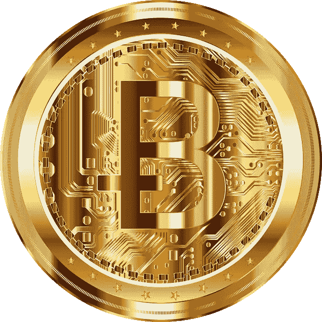
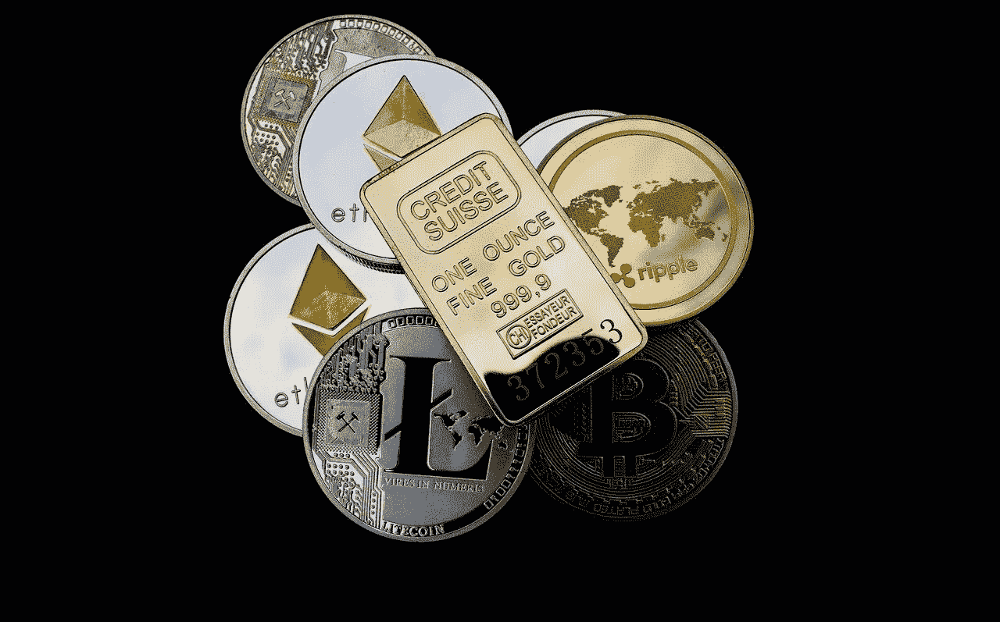

# 比特币达到“黄金”数字了吗？

> 原文：<https://medium.datadriveninvestor.com/is-bitcoin-attaining-the-gold-figure-1b813f4338aa?source=collection_archive---------31----------------------->

[Source](https://pixabay.com/vectors/bitcoin-digital-currency-4130319/)

作为加密领域的新手，在你理解区块链技术的概念之前，你可能已经把比特币视为“数字黄金”。让加密货币可以交易，并将其整合到类似于数字化黄金的交易平台上，引发了黄金、比特币和加密货币之间的长期比较。无可争议的是，比特币是这种比较的主导者。

在之前的一篇文章中，我重申了比特币和正常黄金的悬殊；

> *等一下，我们似乎已经偏离了最初的想法，而且这种偏离随着时间的推移而加剧，虽然比较可能是一项非常有趣的工作，但当被比较的概念之间存在一些密切的相似性时，这种比较就更有意义了。如果我们没有偏离最初的想法，或者如果我们花几分钟仔细思考这两个概念，我们就会意识到黄金和比特币之间的巨大差异，以及为什么比较这两者似乎有点愚蠢。*

比特币(和大多数其他加密货币)代表了当代金融和管理技术的一种抵消，这种技术是由寻求改变金融部门、管理部门和许多其他生活领域工作方式的个人开发的。为加密货币提供动力的区块链技术提供了一个具有更高透明度的分布式账本系统，该系统希望分散一些决策过程，将权力转移给大多数人，并提高应用它们的任何领域的生产率。

在我看来，将一场技术革命与一种几乎和人类一样古老的奢侈金属相提并论，将成为当代最愚蠢的比较之一，而且这种比较将持续很长时间，不会产生任何切实的成果。

然而，比特币的技术使其成为价值储存手段……主要是。比特币被困在一种相当古老的技术中，这仍然是我倾向于以太坊和其他雄心勃勃的“狗屎硬币”的主要原因。

好吧，我想我们不可能总是对的，这一次，比特币最大主义者的最大宣传正在成为现实…

杰克·多西的 square capital 宣布他们已经向比特币投资了 5000 万美元。多尔西一直公开表示他对“阿尔法”加密货币的热爱，他将比特币描述为“经济赋权的工具”。就在几天前，全球最大的支付公司 PayPal 宣布，他们将通过加密货币钱包向超过 3.5 亿用户和商家提供比特币。

[source](https://pixabay.com/photos/cryptocurrency-gold-bar-concept-3423267/)

Square capital 对比特币的投资有幸成为新闻，但随着比特币继续成长为我们戏称的“价值储存库”，许多公司正在将大量资金转换成比特币。

在类似但不太受欢迎的新闻中；Mode Global Holdings 将其现金储备的 10%投资于比特币，这相当于约 815，000 美元(兑换时约为 66.7 BTC)。Mode Global Holdings 因此成为英国首家将比特币作为投资策略一部分的上市公司。

据传闻，罗斯柴尔德投资公司的投资组合中也有超过 230 个比特币。事实是，投资比特币的公司实际上比记录的数量要多得多。投资者在比特币上的命运与日俱增，尽管加密货币具有显著的波动性，但他们不再“害怕”将资金转移到比特币上。这个数字甚至有望变得更大。

Altcoin 投资者将他们的资金投入 altcoin，希望项目的技术或营销突破能够推动价值上升，并为他们带来利润。体面的 altcoin 项目在这方面做得很好。很多山寨币在技术上比比特币更先进；然而，它们尚未获得“价值储存库”的声誉，比特币很好地描绘了这一形象。

黄金还是比特币？随机投资者将很难做出选择。像杰克·多西这样聪明的投资者会轻易向数字黄金投资 5000 万美元。像杰克这样的投资者正在增加。古老的黄金将永远在老投资者中流行，像彼得·希夫一样老…哈哈。

时代在变，新时代视比特币为未来，真金已经过时了。替代币保留了其技术“进步者”的形象，而比特币继续其实现“数字黄金”数字的旅程。