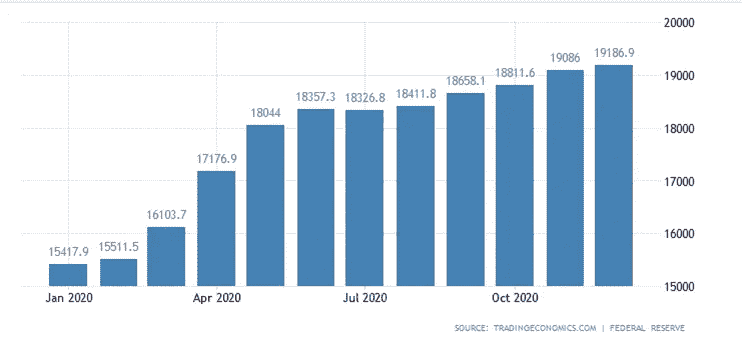

# 比特币死了吗？又来了？？

> 原文：<https://medium.datadriveninvestor.com/is-bitcoin-dead-again-be22429b7d7b?source=collection_archive---------1----------------------->

## 加密货币的未来会是什么样子

Photo by [Dmitry Demidko](https://unsplash.com/@wildbook?utm_source=unsplash&utm_medium=referral&utm_content=creditCopyText) on [Unsplash](https://unsplash.com/s/photos/bitcoin?utm_source=unsplash&utm_medium=referral&utm_content=creditCopyText)

自 2009 年诞生以来，比特币就面临着持续不断的愤世嫉俗者，他们宣称比特币已经死亡或过时。据[99bitcoins.com](https://99bitcoins.com/bitcoin-obituaries/)称，自 2010 年以来，比特币已经被宣布死亡 396 次，其中最多的“死亡”发生在 2017 年，当时许多投资者开始购买加密货币，主要是因为担心错过机会。自 2021 年初以来，比特币已经“死亡”了 4 次，每次都是在大幅下跌后发生的。虽然它仍然是一种相对较新的资产，加密技术仍处于成长阶段，但可以肯定地说，它将继续存在。

当任何一种资产快速增长，并在不到 3 个月的时间内增值超过 500%时，自然会有大量的散户投资者试图从中获利。这正是比特币在 2017 年发生的事情。机构投资者和听从他们建议的媒体试图通过将 FUD 加入这一快速增长中来“杀死”比特币。随着比特币不够成熟，它经历了一段时间的快速修正。不管这种调整如何，到 2018 年底，每枚硬币的价格仍高于 2017 年 11 月牛市之前的价格。然后，它稳定在 10，000 美元左右的价格关口，并一直保持这一位置，偶尔上涨和下跌，就像任何高度波动的资产一样。三年后，在 2020 年底，比特币经历了一轮不同类型的牛市，这次是由大公司和大机构投资者推动的。

想象一下，在 2017 年底购买比特币，并支付了历史最高价(19783 美元)，经历了一段时间的多次上涨和下跌，最终在 2021 年 1 月以大约 4 万美元的价格出售，最近在埃隆·马斯克宣布特斯拉购买了价值 15 亿美元的 BTC 后，比特币的价格高达 4.8 万美元。这将在 3 年内净收益超过 120%。即使是表现最好的股票也不能保证同样的收益。然而，大多数人并没有在历史高点买入，而是实现了更高的收益。我想说的是，比特币和加密货币不可避免地会进入我们的日常生活。如果 BTC 价格在 2021 年继续上涨，并在 2010 年结束时达到 50 万美元，我不会感到惊讶。你看，作为价值储存手段的比特币有一个重要元素——稀缺性，因为比特币的总供应量仅限于 2100 万枚。比特币不仅供应有限，它还拥有货币的其他重要特征，例如可分性——1 亿个 satoshi 等于 1 个比特币*(把 Satoshi 对 BTC 想象成便士对美元)*。

这是什么意思？在今天的美国，总货币供应量约为 19.2 万亿美元(M2)。想象一下只有 2100 万美元流通。在这种情况下，1 美元相当于今天的 913，619 美元。按照目前的美元供应增长率，到 2021 年底，我们应该会看到大约 23 万亿美元。

Source: Federal Reserve; [**Tradineconomics.com**](https://tradingeconomics.com/)

当然，这并不意味着每一美元都在寻求购买比特币，然而随着受欢迎程度的提高，随着主流零售商越来越多地接受比特币，到 2029 年底，比特币可以轻松达到每枚 50 万美元。去年，对比特币的需求激增，主要来自了解美国货币政策后果的大型企业。一些大型 BTC 控股公司包括:

*   著名的商业分析平台 MicroStrategy 已经将比特币作为其主要储备资产。不仅是 Microstrategy 在 BTC 持有超过 24 亿美元，他们的首席执行官迈克尔·塞勒说他每秒钟购买[1000 美元的比特币](https://decrypt.co/52276/michael-saylor-was-buying-1000-in-bitcoin-every-second)。Saylor 的持股目前价值超过 11.25 亿美元。MicroStrategy 正在寻求让[其他公司](https://decrypt.co/53853/microstrategy-wants-to-help-more-corporations-buy-bitcoin)投资比特币；2021 年 2 月，他们将举办[面向企业的比特币](https://www.microstrategy.com/en/resources/events/world-2021/bitcoin-summit?CID=7014W0000014yhJQAQ)，这是一门在线课程，旨在让企业掌握这种加密技术。
*   **特斯拉和埃隆·马斯克**——“首席泵官”埃隆·马斯克公开支持比特币已经有一段时间了，1 月 8 日他宣布特斯拉将向比特币投资 15 亿美元，这代表了他们总现金持有量的 15%。紧接着这个消息，比特币已经增长到超过 48000 美元。
*   **Galaxy Digital Holdings —** 数字资产、加密货币和区块链技术领域的多元化金融服务和投资管理创新者。他们称自己为“密码和机构世界之间的桥梁”。根据目前的硬币价格，他们的资产接近 10 亿美元。
*   **Ruffer Investment Company—**总部位于伦敦的资产管理公司[Ruffer Investment Company](https://www.ruffer.co.uk/)持有他们在 BTC 总持股量的 2.5%左右。他们总共购买了 4.5 万辆 BTC，购买时价值约 8.7 亿美元，现在价值约 14 亿美元。
*   **灰度数字大盘基金—** 该基金目前持有比特币、[以太坊](https://decrypt.co/crypto-news/ethereum)、[比特币现金](https://decrypt.co/crypto-news/bitcoin-cash)和[莱特币](https://decrypt.co/crypto-news/litecoin)，其中持有份额最大的是比特币(截至【2021 年 1 月 81.6%)。他们价值 7100 英镑的 BTC 目前价值略高于 2 亿美元。

上述公司只是最近加入比特币的几个大玩家。虽然没有数据证明其他公司的参与，但可以肯定地说，并不是所有的 BTC 持有者都公开宣布了他们的购买。随着采用的深入，更多的公司将变得更加渴望加入比特币持有者的俱乐部。

**美国银行现在支持企业客户之间的加密货币支付。**

区块链技术已经用于传统银行系统，包括国际支付。一些美国银行现在开始创建自己的基于区块链的系统，包括数字货币，以实现企业客户之间的加密货币支付。

据[摩根大通](https://www.jpmorgan.com/global/news/digital-coin-payments)称，截至 2019 年 2 月，他们已经成功测试了 JPM 硬币，这是他们新的数字硬币的原型。

另一家美国银行 Signature Bank 在获得纽约州监管机构批准后，于 2018 年底为其客户推出了一个总部位于区块链的支付系统。根据 [Coindesk](https://www.coindesk.com/already-live-signature-bank-is-moving-millions-on-a-jpmorgan-like-private-dollar-backed-cryptocurrency) 的说法，已经有大约 100 个商业客户使用它来相互发送每天数百万美元的加密货币支付。Signature 的加密货币支付网络使用与美元挂钩的稳定币，并在基于以太坊的专有区块链上运行。

所有比特币死亡的消息都是为了以更低的价格进入，并能够以尽可能低的成本采用这项技术。每当比特币“奄奄一息”的时候，加密信徒就会试图购买更多的比特币。缓慢但肯定的是，比特币正在成为一种储存价值的方式，而不仅仅是一种投机资产。不管它的价格如何，它会一直留在这里。随着越来越多的公司和银行开始接受加密货币，BTC 价格只会上升。

你有 BTC 吗？你准备好迎接一个有新基础货币的世界了吗？

*   ***本文不包含财务建议。内容仅供娱乐和参考，您不应将任何此类信息或其他材料理解为投资、金融或其他建议***

**阅读更多:**

 [## 比特币将如何改善人类的未来

### 成为一级文明

medium.com](https://medium.com/datadriveninvestor/how-bitcoin-will-improve-the-future-of-human-race-4d4acbf730c5)  [## 2M 用户如何做空压榨$GME

### 大 FOMO 的故事和 2021 年的推测

medium.com](https://medium.com/datadriveninvestor/how-2m-users-short-squeezed-gme-38616c91da54)