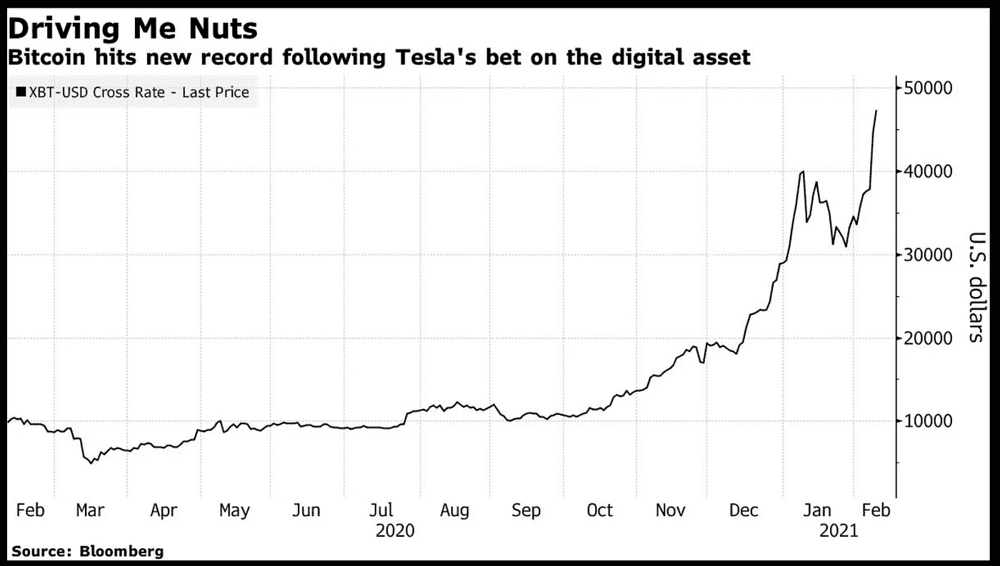

# 比特币正在成为主流吗？

> 原文：<https://medium.datadriveninvestor.com/is-bitcoin-going-mainstream-50e0e93c81bb?source=collection_archive---------10----------------------->

## 特斯拉刚刚购买了 15 亿美元的比特币——BTC 的下一步是什么……

Photo by [Thought Catalog](https://www.pexels.com/@thought-catalog-317580?utm_content=attributionCopyText&utm_medium=referral&utm_source=pexels) from [Pexels](https://www.pexels.com/photo/woman-holding-two-coins-2228570/?utm_content=attributionCopyText&utm_medium=referral&utm_source=pexels)

比特币最近经常出现在新闻中。对于我们这些旁观者来说，我们是不是错过了什么？对于那些买入的人来说，他们是在许愿还是祈祷？

有什么大惊小怪的？

让我们深入研究一下，从特斯拉开始。

# **特斯拉押注比特币……**

2 月 8 日周一的一条大新闻是[特斯拉披露了在比特币上的 15 亿美元赌注。这一行动促使比特币的价格在周二飙升至 48，000 美元(1 月初还不到 30，000 美元)。](https://www.bloomberg.com/news/articles/2021-02-09/tesla-s-bitcoin-bet-won-t-be-followed-by-others-jpmorgan-says)

Bitcoin price chart from Bloomberg (web image used per Fair Use Doctrine)

2020 年底，特斯拉拥有[193.84 亿美元](https://www.sec.gov/Archives/edgar/data/1318605/000156459021004599/tsla-10k_20201231.htm#ITEM_8_FINANCIAL_STATEMEMTS_SUPPLEMENTAR)的现金和现金等价物。现在，不到 10%的资金流入了比特币。在最近提交给美国证券交易委员会的 10K 文件中，特斯拉表示:

> “……我们希望在不久的将来开始接受比特币作为我们产品的一种支付形式，但要遵守适用的法律，并且最初是在有限的基础上，我们可能会也可能不会在收到后清算。…"

我们可以想象比特币在特斯拉内部至少有两种用途。一种是作为投资来提高他们的现金回报。另一种是作为公司现金，以方便国际消费者和商业交易。

ARK Invest 的塔莎·基尼认为，使用比特币将会减轻特斯拉在处理许多不同且经常波动的国际货币时的一些风险。她指出，其他几家公司已经将部分公司现金转换为比特币，特斯拉正在企业用户中追随加密货币的趋势。

# **其他购买比特币的公司……**

除了特斯拉，还有许多其他公司在购买数字货币。

[Paypal 于 2020 年 10 月宣布](https://finance.yahoo.com/news/bitcoin-hits-2020-high-paypal-allows-cryptocurrencies-platform-160511168.html)其客户可以购买、持有和出售加密货币。这包括比特币、以太币、比特币现金和莱特币。

Paypal 拥有 3.46 亿活跃账户，被全球 2600 万商家使用。

Paypal 的故事有一个有趣的转折，即商家在支付时不会收到虚拟硬币，而是像美元这样的普通货币。

去年 10 月，就在 Paypal 发布前不久，Square 还宣布在其现金应用中增加了 4709 个比特币，总额达 5000 万美元。

【Twitter 和 Square 的首席执行官杰克·多西一直是比特币的支持者，他在 2018 年表示:

> “……世界最终将有单一货币，互联网将有单一货币。我个人相信会是比特币……”

早在 2018 年，Square 就已经推出了用现金进行比特币交易的 App。

因此， [Twitter](https://finance.yahoo.com/news/twitter-thought-holding-bitcoin-not-162128634.html) 最近刚刚宣布，它正在考虑在其公司金库中持有比特币:

> “……我们可能会考虑是否会在交易时将美元转移到比特币，或者我们是否希望我们的资产负债表上有比特币来完成交易……”

比 Paypal 和 Square 加起来还要大的 Visa 公司已经采取了几项有利于加密货币的举措。这些措施包括推出 Visa- [品牌的](https://decrypt.co/47104/best-bitcoin-debit-cards)比特币信用卡和借记卡，以及投资安克雷奇等加密货币公司。

[万事达卡](https://www.mastercard.com/news/perspectives/2021/why-mastercard-is-bringing-crypto-onto-our-network/)不想落后，宣布计划支持
“直接在我们的网络上选择加密货币”。他们进一步补充说:

> “……这是一个巨大的变化，需要做大量的工作。我们将根据我们的数字货币原则，非常慎重地考虑我们支持哪些资产，这些原则侧重于消费者保护和合规性……”

或许比特币最大的企业买家之一是一家名为 [MicroStrategy](https://decrypt.co/47061/public-companies-biggest-bitcoin-portfolios) 的公司，这是一个商业分析平台，目前持有 71079 枚数字硬币，价值超过 30 亿美元。

因此，特斯拉无论如何都没有在这里开辟新的领域。他们正在追随一批先锋公司。但这并不是一个特别广泛的趋势。

# **其他大公司呢…**

[公司金融的观察家](https://www.nytimes.com/2021/02/09/business/will-other-companies-follow-teslas-lead-and-load-up-on-bitcoin.html)感觉大部分公司不会跟随特斯拉和 MicroStrategy 进入比特币。财务主管对他们的资本非常保守，更喜欢安全、流动性强的投资。

一个很好的例子是[通用汽车](https://seekingalpha.com/article/4404995-general-motors-co-gm-ceo-mary-barra-on-q4-2020-results-earnings-call-transcript)。首席执行官玛丽·巴拉回应了关于特斯拉拥有比特币和通用汽车计划使用加密货币的问题:

> “……首先，我们没有任何投资比特币的计划，所以就此打住。我们会对此进行监控和评估。如果将来客户对它有强烈的需求，没有什么能阻止我们这样做……”

[摩根大通&公司](https://www.bloomberg.com/news/articles/2021-02-09/tesla-s-bitcoin-bet-won-t-be-followed-by-others-jpmorgan-says?utm_content=business&cmpid=socialflow-twitter-business&utm_medium=social&utm_source=twitter&utm_campaign=socialflow-organic)认为比特币的波动性会阻止大多数大公司像特斯拉一样将比特币加入资产负债表:

> “……主流企业财务主管会效仿特斯拉的观点的主要问题是比特币的波动性……”

# **消费者呢……**

[Fast Company](https://www.fastcompany.com/90212831/basically-no-one-is-using-bitcoin-to-buy-things)2018 年的一篇文章阐述了比特币作为货币的基本问题:

> “……由于比特币过去便宜得多，人们意识到他们当时花了现在价值数千美元的钱购买廉价商品。价格暴涨暴跌如此之多，不可能知道比特币用户是否得到了公平的对待……”

比特币价格上涨如此之快，今天的大多数人可能都不想使用比特币实际买东西。他们更喜欢使用普通货币(比特币所有者戏称其为“法定货币”)来买东西，并保持他们的加密货币升值。

比特币是一种数字货币([加密货币](https://en.wikipedia.org/wiki/Cryptocurrency))，其中的单个硬币存储在一个被称为区块链的强大保护和联网的计算机数据库中。比特币的价值并不与黄金或猪肚等任何实物资产挂钩。比特币的价值也不像大多数投资那样与未来现金流挂钩。

这些事实是我们在市场上看到的两个基本缺陷的基础。

第一个根本缺陷是特斯拉和其他公司使用比特币进行交易的计划。没有人想用他们的金鹅去换牛奶和鸡蛋，或者一辆马上贬值的汽车。与人们可能购买的汽车和其他资产不同，比特币最近的价格已经迅速升值。

第二个根本缺陷是将比特币作为一种投资。今天的加密货币是一种数字构造，其价值纯粹是投机性的。这就是经典的[更大的傻瓜](https://www.investopedia.com/terms/g/greaterfooltheory.asp)理论。每个傻瓜都购买一些比特币，希望在不久的将来，更大的傻瓜会以更高的价格购买。就像房地产泡沫一样。记得吗？

这是一个会以泪结束的故事。

非常感谢大家的阅读。请分享！也感谢[约翰·格里斯沃尔德](https://medium.com/u/8bb90f2d02dc?source=post_page-----50e0e93c81bb--------------------------------)在我之前关于特斯拉购买比特币的帖子中指出了消费者的观点:

 [## 大空头大人物出手比特币打赌

### 迈克尔·伯里瞄准了特斯拉的比特币赌注…

medium.com](https://medium.com/predict/big-short-big-shot-shoots-big-df36469ca8af)