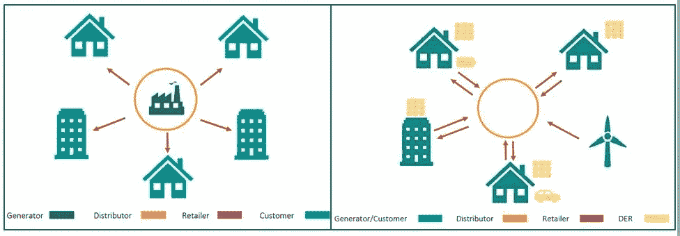

# 区块链技术是 IIoT 安全困境的解决方案吗？

> 原文：<https://medium.datadriveninvestor.com/is-blockchain-tech-the-solution-to-iiot-security-dilemmas-5676e75e9768?source=collection_archive---------12----------------------->

工业领域的数字化转型和 IT 与 OT 的融合给基础设施安全带来了巨大挑战。这包括电网、核电站、石油钻塔、监控和数据采集(SCADA)系统，以及传统上默默无闻的工厂和场所的机器。

虽然物联网提供了关键的数据洞察力，但这也意味着系统容易受到网络攻击，网络级保护是不够的。处理数据带来了巨大的挑战，从数据生成、传输和存储到控制数据访问、分析和多方共享。为了应对这些挑战，组织需要新的工具、流程和网络安全架构。

作为回应， [Xage Security](https://xage.com/) 通过分散式结构独特地解决了 IIoT 安全性问题，从核心到边缘保护连接到 IIoT 的每个设备、应用和人员。Xage 的客户包括公用事业公司和美国空军。他们解决方案的关键是区块链技术。我采访了首席执行官邓肯·格林伍德以了解更多信息。

# 遗留设备和网络安全问题

他解释说，传统的工业场所过去缺乏有意义的安全保障。“他们真的只是依赖于高安全性的网络，并且有大量的机器没有密码或者依赖于纯文本协议。过去的核心外围方法开始崩溃。”这些产品中的许多都包含较旧的遗留设备，例如从未嵌入安全机制的机器。正如邓肯指出的

> *“当那些系统被设计的时候，并没有预想到它们会像今天这样共享。所有这些威胁的程度都不像今天这样。因此，保护这些被引用的传统系统是 Xage 的一个重要组成部分。”*

# IIoT 中区块链保护安全的起源

2017 年，Xage Security 推出了第一个也是唯一一个用于工业运营的区块链保护安全结构。从那时起，Xage 在其平台上开发了第一个防篡改系统和第一个适用于所有工业操作和设备的通用访问控制。这种分层系统支持跨结构的多个同时更新，而不管位置或连接性如何，并且是世界上第一个受区块链保护的安全性。正如邓肯详述的:

“我们开发了一种安全结构，用于工业运营。多个软件节点分散在操作中。并且节点相互通信以帮助保护彼此。例如，如果我们持有传感器的密码，我们将获取该密码并将其分散在各个节点上，这样，即使攻击者成功侵入了某个节点，他们也无法窃取该密码或窃取 set a 密码。他们必须同时损害大多数节点，这非常难以做到。”

去年，Xage 推出了 Xage 执行点(XEP)。“它实际上是为那些自身没有安全性的设备和机器提供安全性。XEP 作为过滤器位于这些机器的前面，并从结构的其余部分获取指令。因此，如果有人试图访问前面有 XEP 的机器，XEP 将检查该结构——此人的身份验证是否正确，因此他们已经登录？他们是否被授权访问系统？”因此，它有效地创建了单点登录，通过人工和 M2M 应用程序对所有系统进行有管理的访问。

在跨各种垂直行业实施新产品时，Xage 发现了一个新的资源不足的挑战。Duncan 解释说，“我们不仅想保护机器，还想为机器产生的数据提供复杂的保护。”

Xage 最近推出了[动态数据安全](https://www.globenewswire.com/news-release/2020/03/31/2009281/0/en/Xage-Introduces-New-Security-Offering-to-Protect-Data-Sharing-From-the-On-Site-Operation-to-the-Cloud-Across-Suppliers-Customers-and-Internal-Operations.html)。这一新产品增强了防篡改数据的安全性，支持在多个系统、多个位置和多方之间安全、动态地共享数据。DDS 系统还可以支持来自数据源的数据散列、签名和加密。此外，它还在 Xage Fabric 中存储安全元数据。使用该系统还意味着跨结构和所有其他可能使用数据的地方安全地复制数据。

组织可以确保从运营地点到云、跨供应商、客户和内部运营的数据安全性，从而为收入、可持续性、运营效率、生态系统合作和技术创新创造新的机会。

# 区块链意味着 p2p 能源交易的数据完整性

一个很好的使用案例是在能源交易中开发一个过渡能源系统，允许相邻的建筑相互交流和出售能源。尽管 P2P 能源交易已经试验成功，但它面临着多重挑战，邓肯解释道:

> *“电压表是真的吗？它是如何校准的，我们知道校准的完整性吗？我们知道来自它的音高和实际产生的音高是一样的吗，还是有人编造出来的？所以有那种机器级别的完整性，一直到这个建筑真的同意和那个建筑交易吗？还是有人发明了这个命令？如果这是一个真实的交易，它背后的物理过程是否真的发生了——它是否传递给了那个交易？*
> 
> *所以这是一种多层次的整体性问题。事实证明，这是物理机到业务流程的整合是多个行业中非常常见的模式。这在能源交易中非常明显，在石油、天然气和供应链应用中也很明显。”*

数字化转型的关键是围绕数据重新定义运营流程和业务关系。过去人们通过隔离来实现工业安全。现在，我们正在将这一领域扩展到合作伙伴、客户和供应商——“一个物流客户在构建仓库时，可能会有数千名参与者参与数据访问。人们需要精确到单个机器和单个数据流的控制，这样才能安全地实现共享、多位置和实时多方合作。”。

Xage 建立在公司原有的身份和访问管理安全架构之上，涵盖数据和数据流。每个数据生产者都可以选择谁可以消费数据。

# 低延迟数据处理

我有兴趣看看 Xage 的 DDS 在延迟方面是如何工作的，因为该解决方案旨在支持多个位置的数据处理。邓肯解释道:

“典型工厂的本地生产系统可能有 15 毫秒的延迟预算。实际的认证动作非常非常快，不到十分之一毫秒。因此，我们实际上可以在工厂车间本地完成身份验证。你可以在工厂车间里放一层布料。另一层在边缘，另一层在云上。

然而，工厂车间的织物可以是 100%自主的，因此它可以实时做出每一个需要做出的决定。然后在闲暇时，它会通过我们更高层的更广泛的结构回放那些决定。因此，如果基于本地投票在本地做出决定，如果后来证明这是一个错误的决定，可能有人在本地破坏了您的系统，然后这将被较高层检测到，在较低层中连接的交易将被反转并替换为新值。因此，分层支持使延迟非常低的应用程序能够在需要时在本地做出决策。"

*最初发表于*[*【https://dzone.com】*](https://dzone.com/articles/is-blockchain-tech-the-solution-to-iiot-security-d)*。*