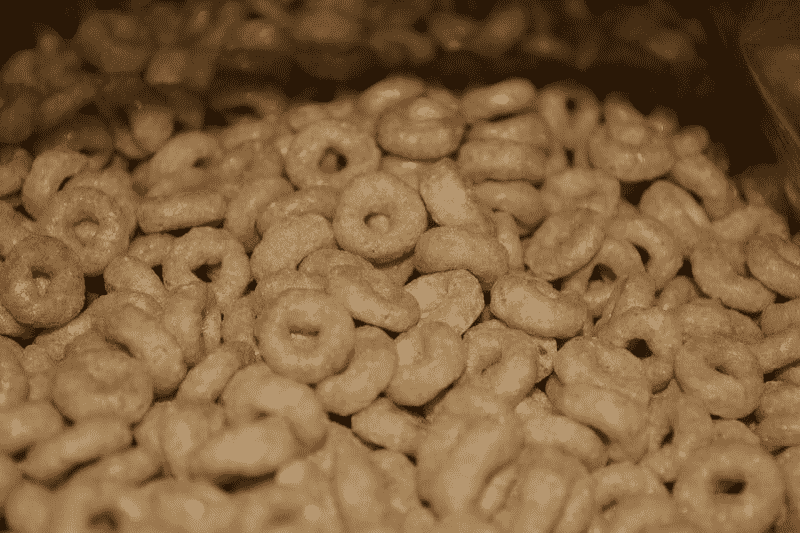

# 通用磨坊的谷类早餐注定要失败吗？—市场疯人院

> 原文：<https://medium.datadriveninvestor.com/is-breakfast-cereal-doomed-at-general-mills-market-mad-house-adafd04d4b68?source=collection_archive---------10----------------------->

低现金流、不断变化的零售格局和不断变化的电视观看习惯可能会毁灭通用磨坊公司(纽约证券交易所代码:GIS)。

这家谷物制造商报告了 8.845 亿美元的运营现金流，5.914 亿美元的净收入，以及截至 2019 年 11 月 30 日的季度末现金流。然而，通用磨坊的季度运营现金流从 2019 年 8 月 31 日的 5.721 亿美元增长至 2019 年 11 月 30 日的 8.845 亿美元。

因此，通用磨坊从谷物销售中获得的现金很少。早餐麦片；另一方面，仍然是一种受欢迎和有利可图的产品。统计学家[估计](https://www.statista.com/outlook/40090100/109/breakfast-cereals/united-states)2019 年，美国人平均消费 6.5 公斤谷类早餐。

# 通用磨坊能从早餐麦片中赚钱吗？

此外，Statista 估计，2019 年早餐谷物业务的人均收入增长了 2.1%，达到 474.2 亿美元。

相反，通用磨坊上个季度的收入仅增长了 0.22%。此外，截至 2019 年 8 月 31 日的季度，通用磨坊的收入萎缩了-2.23%。

因此，通用磨坊的市场份额可能正在萎缩。然而，据 MTO 新闻[报道](https://mtonews.com/the-top-10-selling-cereals-in-the-united-states)，通用磨坊仍然生产美国十大早餐麦片中的四种。那些谷类食品是麦片、蜂蜜果仁麦片、幸运符和肉桂吐司。

因此，**通用磨坊(纽约证券交易所股票代码:GIS)** 拥有强大的品牌稳定性。这也包括 Wheaties、Fiber One、Chex、Kix、Cascadian Farm、Total 和 Trix。通用磨坊的其他强势品牌包括:皮尔斯伯里，哈根达斯，安妮丝，李柏特，穆尔格伦，食物应该味道不错，Bugles，Gardetto 的，自然谷，Progresso 汤，绿色巨人，和 Yoplait。

# 通用磨坊食品杂货业务

因此，通用磨坊在食品杂货业的零售灾难中有很大的风险敞口。

例如，通用磨坊依靠克罗格(纽约证券交易所代码:KR) 这样的杂货商向消费者交付产品。值得注意的是，Kroger 在 2019 年 10 月 31 日报告了 0.51%的季度收入增长。

因此，每当顾客开始从 Instacart 或亚马逊 Prime 购买杂货时，通用磨坊就可能会损失收入。解释一下，消费者想要从肉桂吐司转变为更便宜或更健康的谷物品牌，只需在 Instacart 上点击一下。

然而，同一位顾客可能会在克罗格或西夫韦超市冲动购买肉桂吐司。特别是，通用磨坊可能会失去其最有力的广告工具超市货架。解释一下，许多人购买谷类等舒适食品是因为他们在超市货架上看到它。

目前，盖洛普[估计](https://news.gallup.com/poll/264857/online-grocery-shopping-rare.aspx) 11%的美国人说他们在 2019 年 8 月每月在网上订购杂货。相比之下，盖洛普估计 89%的美国人仍然不在网上订购食品。另外，19%的美国人告诉盖洛普，他们从网上订购的食品中挑选。

# 亚马逊如何威胁通用磨坊

在线杂货店购物可能会爆炸，因为 57%的美国人[告诉](https://www.digitalcommerce360.com/2019/07/11/82-of-us-households-have-a-amazon-prime-membership/)消费者情报研究合作伙伴，他们在 2019 年 7 月在**亚马逊(纳斯达克代码:AMZN)** 购物。

此外，消费者情报研究伙伴(Consumer Intelligence Research Partners)估计，拥有亚马逊会员的美国家庭数量从 2019 年 1 月的 1.01 亿增加到 2019 年 7 月的 1.05 亿。此外， *Digital Commerce 360* 声称，2019 年 7 月，美国 1.27 亿家庭中有 82%拥有 Prime 会员。

对于像通用磨坊这样依赖传统品牌的公司来说，亚马逊 Prime 的受欢迎程度是有问题的。需要澄清的是，通用磨坊的大多数客户在通用磨坊无法控制的平台上进行大部分购物。

此外，越来越少的美国人在看通用磨坊公司用来推销其产品的广告。例如， *TechCrunch* [声称](https://techcrunch.com/2019/01/15/nielsen-16m-u-s-homes-now-get-tv-over-the-air-a-48-increase-over-past-8-years/)在 2018 年 5 月，只有 14%的美国家庭通过无线电视观看。详细地说，2018 年 5 月，美国 1.27 亿家庭中只有 1600 万家庭在看广播电视。

# 为什么美国人不再看通用磨坊的广告

从积极的方面来看，尼尔森估计，可以观看广播电视的美国家庭比例从 2009 年 5 月的 9%增长到 2018 年 5 月的 14%。消极的一面是，许多家庭已经从有线或卫星电视转向流媒体视频。

**在& T (NYSE: T)** 承认其 DirectTV 和 U-Verse 电视订阅业务在 2019 年第三季度损失了 120 万订户，*市场疯人院* [声称](https://marketmadhouse.com/att-makes-money-and-loses-customers/)。与此同时，Statista [估计](https://www.statista.com/statistics/250937/quarterly-number-of-netflix-streaming-subscribers-in-the-us/)网飞在 2019 年第三季度在美国拥有 6062 万付费用户。

此外，CNET [报道](https://www.cnet.com/news/disney-plus-more-than-10-million-people-signed-up/)迪士尼+在 2019 年 11 月推出时拥有超过 1000 万订户。此外，Statista [估计](https://www.statista.com/statistics/250937/quarterly-number-of-netflix-streaming-subscribers-in-the-us/) Hulu 在 2029 年 5 月拥有 2690 万付费用户。

因此，大多数美国人现在从无商业广告的流媒体视频中获得大部分或大部分的视频娱乐。因此，通用磨坊无法向数千万美国家庭宣传其产品。例如，现在可能有数以百万计的孩子从未见过幸运符小妖精。

在这种情况下，数百万美国人将对通用磨坊失去品牌忠诚度。相反，这些消费者会去买麦片。或者点他们看到的最便宜的麦片。这种发展的一个影响是，美国人比以往吃更多的谷类食品，但购买更少的盒装麦片和小麦。

# 通用磨坊赚钱了吗？

**通用磨坊(NYSE: GIS)** 还在赚钱；然而。Generals '报告称，2019 年 8 月 31 日的季度毛利为 13.29 亿美元，2019 年 11 月 30 日为 15.69 亿美元。

此外，通用磨坊于 2019 年 11 月 30 日报告季度收入为 44.21 亿美元。这些收入从 2019 年 8 月 31 日的 40.03 亿美元增长。

此外，通用磨坊的季度营业收入从 2019 年 8 月的 6.624 亿美元增长到 2019 年 11 月的 8.112 亿美元。此外，通用磨坊的税后收入从 2019 年 8 月的 5.067 亿美元增长到 2019 年 11 月的 5.665 亿美元。

通用磨坊赚了更多的钱，但保留了一部分。通用磨坊在 2019 年 11 月 30 日拥有 5.602 亿美元的现金和短期投资。这一数字比 2019 年 8 月 31 日的 5.048 亿美元有所增加。

因此，尽管零售业和电视业遭受了令人难以置信的破坏，通用磨坊公司还是赚了钱。这将导致许多人把通用磨坊称为价值投资。

# 通用磨坊是价值投资吗？

我认为市场先生在 2020 年 1 月 2 日将通用磨坊的价格定在了 52.21 美元。我认为通用磨坊定价过高，因为它报告的现金流很低。

然而通用磨坊的股票提供了一些收入。通用磨坊将于 2019 年 1 月 9 日支付 49₵股息。令人印象深刻的是，通用磨坊已经支付了 15 年的股息。Dividend.com[报道](https://www.dividend.com/dividend-stocks/consumer-goods/processed-and-packaged-goods/gis-general-mills/)总体而言，通用磨坊的股票在 2020 年 1 月 2 日提供了 3.69%的股息收益率，1.96 美元的年化股息，60.87%的派息率。

归根结底，**通用磨坊(NYSE: GIS)** 是一只没有价值特征的好股息股。股东可以从通用磨坊赚钱，但在当今不断变化的商业环境中，这种股票的所有者将承担巨大的风险。

*原载于 2020 年 1 月 2 日 https://marketmadhouse.com***。**