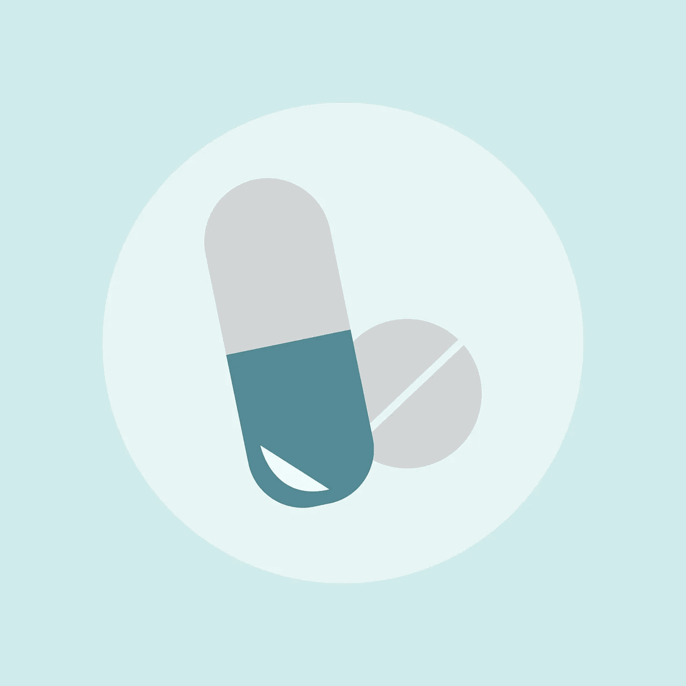
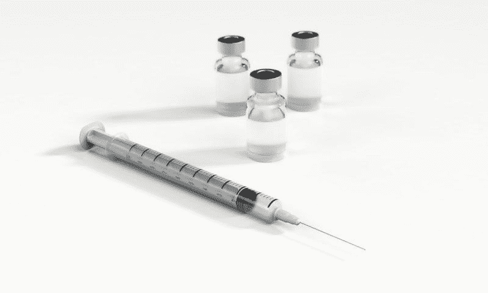
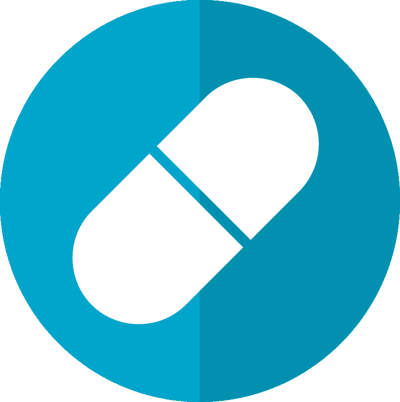
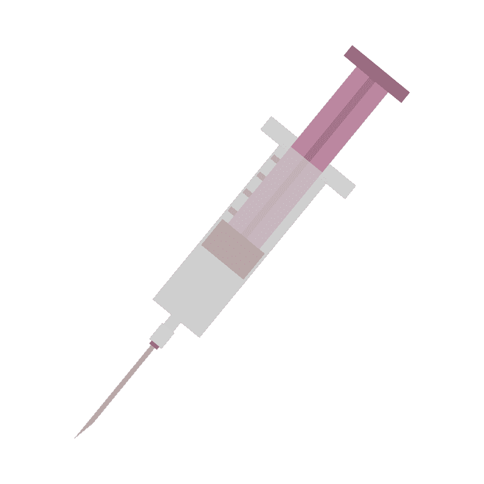
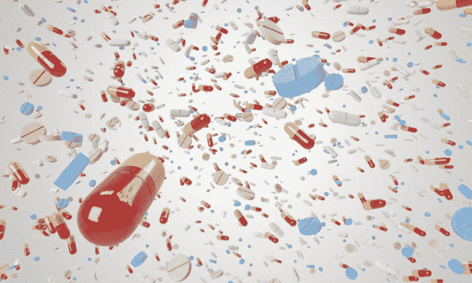

# 百时美施贵宝赚钱了吗？—市场疯人院

> 原文：<https://medium.datadriveninvestor.com/is-bristol-myers-squibb-making-money-market-mad-house-54b1d00925c9?source=collection_archive---------26----------------------->

百时美施贵宝(BMY 纽约证券交易所)的季度收入在一年内几乎翻了一番。为了解释这一点，百时美施贵宝报告称，2019 年 3 月 31 日的季度收入为 59.2 亿美元。2020 年 3 月 31 日，这一数字增至 107.81 亿美元。

因此，斯托克罗认为 BMY 在截至 2020 年 3 月 31 日的这个季度的[收入增长率](https://stockrow.com/BMY/financials/income/quarterly)为 82.11%。然而，大部分收入增长可能来自百时美施贵宝[去年对 Celgene](https://news.bms.com/press-release/corporatefinancial-news/bristol-myers-squibb-completes-acquisition-celgene-creating-le) 的收购。

这次收购增加了百时美施贵宝的赚钱能力。例如，百时美施贵宝的季度毛利从 2020 年 3 月 31 日的 40.96 亿美元增长到 2020 年 3 月 31 日的 71.19 亿美元。

相反，百时美施贵宝的收入正在崩溃。例如，百时美施贵宝报告的季度营业收入从 2019 年 3 月 31 日的 19.79 亿美元下降到一年后的-3.04 亿美元。此外，百时美施贵宝的季度共同净收入从 2019 年 3 月 31 日的 17.10 亿美元降至 2020 年 3 月的-7.75 亿美元。

 [## 中风的教训——我们能选择更好的医疗保健方式吗？数据驱动的投资者

### 2020 年 7 月 5 日星期天，我父亲患了出血性中风，严重瘫痪了他的右侧身体和语言。他是一个…

www.datadriveninvestor.com](https://www.datadriveninvestor.com/2020/07/26/lessons-from-a-stroke-can-we-choose-our-way-into-better-healthcare/) 

# 百时美施贵宝有多少现金？

有趣的是，**百时美施贵宝公司(纽约证券交易所代码:BMY)** 正在产生更多的现金。例如，百时美施贵宝报告称，2019 年 3 月的季度运营现金流为 13.9 亿美元，2020 年 3 月增长至 38.94 亿美元。

引人注目的是，在 2020 年 3 月至 2019 年 3 月的 12 个月中，百时美施贵宝的期末现金流增长了一倍多。具体来说，百时美施贵宝报告的季度末现金流为 73.35 亿美元，一年后增至 162.46 亿美元。

令人印象深刻的是，百时美施贵宝的现金和短期投资同期增长了一倍多。BMY 在 2019 年 3 月 31 日报告了 87.64 亿美元的现金和短期投资。一年后，即 2020 年 3 月 31 日，现金和短期投资增至 183.22 亿美元。

因此，百时美施贵宝是一家现金充裕的公司，正在积累更多的现金。最后，百时美施贵宝的价值要大得多。例如，BMY 在 2019 年 3 月 31 日拥有 348.34 亿美元的总资产，在 2020 年 3 月 31 日拥有 1292.85 亿美元的资产。

# 百时美施贵宝是一只令人印象深刻的成长型股票

我认为百时美施贵宝是一只很好的成长股，因为它在过去的一年里增值巨大。

例如，BMY 的股票价值从 2020 年 7 月 24 日的 43.23 美元增长到 2020 年 7 月 23 日的 59.87 美元和 2020 年 7 月 29 日的 58.70 美元。此外，我认为百时美施贵宝有很高的安全边际，因为它能产生大量的现金。

此外，百时美施贵宝(纽约证券交易所代码:BMY)支付丰厚的股息。例如，BMY 股票在 2020 年 7 月 2 日支付了 45₵季度股息。该股息于 2019 年 9 月 11 日来自 41₵。

总体而言，BMY 股票在 2020 年 7 月 29 日提供的年度股息为 1.80 美元，股息收益率为 3.01%。此外，Dividend.com 将百时美施贵宝一年的股息增长归功于它。因此，如果你在寻找一只安全的成长型股票，百时美施贵宝值得一试。

# 百时美施贵宝是什么？

[百时美施贵宝](https://www.bms.com/)是美国最古老的制药公司之一，成立于 1887 年。

今天，百时美施贵宝拥有大量处方药。因此，百时美施贵宝销售的产品由政府和保险公司买单。众所周知，在大多数国家，政府通过单一付款人健康保险支付大多数处方药。

例如，在美国，Medicare 部分为许多退休人员支付 75%的处方药费用。此外，许多美国人有支付大多数处方药的私人健康保险计划。

# 21 世纪的价值投资

然而，医疗保险覆盖面存在漏洞，包括臭名昭著的“覆盖缺口”或“甜甜圈洞”。在覆盖缺口中，医疗保险仅覆盖 35%的品牌药费用和 56%的非专利药费用。

尽管如此，大多数人还是会为处方药付钱，因为他们热爱活着和健康。因此**百时美施贵宝** **(纽约证券交易所:BMY)** 销售人们需要的产品和由保险或政府支付的产品。

此外，百时美施贵宝可能很快就会获得巨额联邦贷款。美联社报道，伊士曼·柯达公司将获得 7 . 65 亿美元的联邦贷款。

美联社透露，柯达将把这笔钱用于扩大其在纽约罗切斯特和明尼苏达州圣保罗的工厂，以生产仿制药的关键成分。美国国际发展金融公司提供贷款是因为美国工业不能生产足够数量的药物成分。

因此，百时美施贵宝可以获得巨额联邦贷款用于药品生产。值得注意的是，**百时美施贵宝(纽约证券交易所代码:BMY)** 在第二次世界大战期间为美国军方生产了大量的青霉素和其他药物。因此，联邦政府可以让百时美施贵宝成长，赚更多的钱。

鉴于这些现实，百时美施贵宝可能是 21 世纪的一项重大价值投资。

*原载于 2020 年 7 月 29 日*[*【https://marketmadhouse.com】*](https://marketmadhouse.com/is-bristol-myers-squibb-making-money/)*。*

**访问专家视图—** [**订阅 DDI 英特尔**](https://datadriveninvestor.com/ddi-intel)