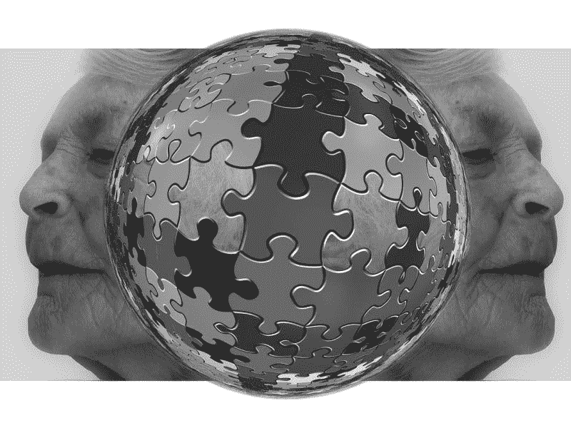

# 巴菲特对 Biogen 的看法正确吗？—市场疯人院

> 原文：<https://medium.datadriveninvestor.com/is-buffett-right-about-biogen-market-mad-house-d0657defd389?source=collection_archive---------16----------------------->

沃伦巴菲特正在押注伯克希尔哈撒韦公司(纽约证券交易所代码:BRK)。B) 可以从美国人口老龄化导致的痴呆症发病率上升中赚钱。

**解释一下，伯克希尔哈撒韦公司(纽约证券交易所代码:BRK。A)** 支付 1.92 亿美元收购 **Biogen Inc .(纳斯达克代码:BIIB)**0.4%的股份 2019 年第四季度，*市场内部人士* [报道](https://markets.businessinsider.com/news/stocks/warren-buffett-backs-kroger-biogen-adds-2-billion-market-caps-2020-2-1028909931)。Biogen 开发治疗神经系统疾病，如阿尔茨海默氏病和其他形式的痴呆症。

Biogen 正在开发 aducanumab，这是一种治疗老年痴呆症的实验性药物。然而，一些批评家指责 aducanumab 不起作用，Ted Whitford 在统计新闻上声称。惠特福德是一名前 Biogen 研究员，他质疑该公司的研究结果。

# Biogen 如何从阿尔茨海默病中获利？

Aducanumab 是一种研究药物。医生不能在美国或任何其他国家开出研究药物的处方。然而，Biogen 公司已经要求美国美国食品药品监督管理局(FDA)批准 Aducanumab 上市，一份新闻稿[指出](https://biogenalzheimers.com/)。

 [## 算法交易的机器学习|数据驱动的投资者

### 当你的一个朋友在脸书上传你的新海滩照，平台建议给你的脸加上标签，这是…

www.datadriveninvestor.com](https://www.datadriveninvestor.com/2019/01/30/machine-learning-for-stock-market-investing/) 

Biogen 声称，如果获得批准，aducanumab 可能成为减少早期阿尔茨海默病临床衰退的第一种疗法。aducanumab 的市场可能是巨大的；因为老年痴呆症协会估计有 580 万美国人患有老年痴呆症。此外，医疗保险可以支付大多数美国老年痴呆症患者的药物。

解释一下，[医保](https://www.medicare.gov/)；联邦单一付款人健康保险计划覆盖了大多数 65 岁以上的美国人。哥伦比亚广播公司新闻[估计](https://www.cbsnews.com/news/alzheimers-disease-the-facts/)老年痴呆症的平均诊断年龄为 80 岁。因此，美国的纳税人将为美国的大多数 aducanumab 治疗买单。

我怀疑巴菲特认为 FDA 会批准 aducanumab 用于美国。这可能有助于 Biogen 从阿尔茨海默病中赚钱。

# Biogen 赚了多少钱？

**Biogen(纳斯达克股票代码:BIIB)** 正在赚钱。这家制药商在 2019 年 12 月 31 日报告了 32.24 亿美元的季度毛利。

令人印象深刻的是，Biogen 的季度总收入为 36.71 亿美元。此外，在截至 2019 年 12 月 31 日的季度，这些收入以 4.11%的速度增长。

因此，Biogen 报告 2019 年 12 月 31 日的季度营业收入为 17.77 亿美元，共同净收入为 15 亿美元。此外，Biogen 报告称，截至 2019 年 12 月 31 日，季度运营现金流为 19.6 亿美元，季度投资现金流为 7084 亿美元，期末现金流为 5698 亿美元。

# Biogen 是一家现金充裕的公司

巴菲特喜欢 Biogen，因为它是一家现金充裕的公司。例如，Biogen 在 2019 年 12 月 31 日拥有 44.75 亿美元的现金和短期投资。

Biogen 的现金从 2018 年 12 月 31 日的 35.8 亿美元和 2019 年 9 月 30 日的 44.37 亿美元增加。因此，Biogen 的业务产生了大量现金，而且这些现金还在增加。

我认为 Biogen 具有很大的价值，因为它在 2019 年 12 月 31 日报告的总资产为 227.34 亿美元。然而，我认为市场先生严重高估了 2020 年 2 月 18 日 **Biogen(纳斯达克代码:BIIB)** 每股 337.10 美元。

# Biogen 不支付股息

我认为 Biogen 对普通人来说是一只糟糕的股票，因为它不支付股息。此外，我认为 Biogen 在混乱和陷入困境的美国医疗保健市场有很大的敞口。

巴菲特对 Biogen 的思考很容易解读。沃伦叔叔认为医疗保健是一个可以赚大钱的增长行业。

“我们有一个 3.4 万亿美元的产业；这相当于联邦政府每年筹集的资金，基本上对这个系统感觉很好，”巴菲特[告诉雅虎！2018 年金融。此外，巴菲特估计医疗保健占美国经济的 18%。](https://www.cnbc.com/2019/03/18/warren-buffett-says-theres-enormous-resistance-to-change-healthcare.html)

因此，我认为巴菲特认为他可以通过投资医疗类股票赚很多钱。Biogen 的收购；特别是，巴菲特认为美国人口老龄化将使制药公司能够赚钱。

# 巴菲特如何投资全民医保和公共选择

记住，山姆大叔为老年人的医疗保健买单。此外，像美国参议员伯尼·桑德斯(I-Vermont)这样的政治家正在努力推动全民医疗保险和公共选择。

解释一下，全民医保可以是一个欧洲风格的单一支付者医疗保健系统，它将为大多数美国人支付大部分医疗费用。此外，公共选择可能是一个新的政府健康保险系统，将覆盖大多数美国人。

不同的是，[公共选择](https://www.kff.org/health-reform/issue-brief/10-key-questions-on-public-option-proposals/)将成为现有健康保险计划的替代方案。桑德斯的[全民医保](https://www.commondreams.org/news/2020/02/15/sanders-applauds-new-medicare-all-study-will-save-americans-450-billion-and-prevent)提案可能会禁止大多数私人健康保险。

不管怎样，联邦政府将为大多数美国人支付大部分医疗费用。因此，对大多数美国人来说，用于医疗保健的资金几乎是有限的。

归根结底，医疗保健是一个增长行业，巴菲特投资是为了从中赚钱。然而，我认为普通人需要避免 Biogen 和调查**。B)** 。

我相信普通投资者需要看看伯克希尔哈撒韦公司，因为它是一家高度多元化的公司，拥有大量现金。所以伯克希尔的安全边际很高，一般人都需要。

*原载于 2020 年 2 月 18 日 https://marketmadhouse.com**[*。*](https://marketmadhouse.com/is-buffett-right-about-biogen/)*