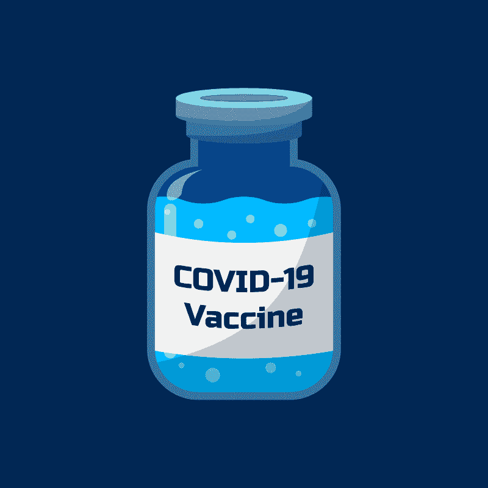

# 巴菲特对默克(MRK)的看法正确吗？—市场疯人院

> 原文：<https://medium.datadriveninvestor.com/is-buffett-right-about-merck-mrk-market-mad-house-6d1b9cac81a1?source=collection_archive---------10----------------------->

伯克希尔哈撒韦公司(纽约证券交易所代码:BRK。B) 看好**默克(MRK)** 。巴伦斯估计，沃伦·巴菲特的公司[在 2020 年 11 月拥有这家历史悠久的制药公司的 2240 万股](https://www.barrons.com/articles/warren-buffett-berkshire-hathaway-apple-stock-sale-buys-pfizer-merck-51605566361)。

伯克希尔拥有**默克&公司**是因为[癌症药物 Keytruda](https://seekingalpha.com/article/4392875-buffett-buys-merck-and-you-should-too?utm_medium=email&utm_source=seeking_alpha&mail_subject=xpeng-is-fairly-priced-hold-the-stock-buy-the-dips&utm_campaign=nl-investing-ideas&utm_content=link-1) ，*现金流王国的* Jonathan Weber 推测。 [Keytruda 或 Pembrolizumab 是一种用于癌症免疫治疗的“人源化抗体](https://en.wikipedia.org/wiki/Pembrolizumab)”。医生使用 Keytruda 治疗黑色素瘤、肺癌、头颈癌、霍奇金淋巴瘤和胃癌。

癌症治疗在美国是一项日益增长的业务。国家癌症研究所估计，2020 年美国将有 180.7 万新增癌症病例。

# 癌症是一个有利可图的行业

此外，2020 年，前列腺癌和结肠直肠癌占美国男性诊断的所有癌症的 43%，占美国女性诊断的所有新癌症的 50%。此外，美国国家癌症研究所估计，医生将在一生中诊断出 39.5%的美国癌症患者。

令人不安的是，癌症是一个有利可图的行业。美国国家癌症研究所估计，2010 年美国人在癌症治疗医疗支出上花费了 1374 亿美元。该研究所估计，这些支出在 2018 年增长到 1508 亿美元。

国际癌症研究机构估计，2018 年全球新增癌症病例 1810 万例。这些数字可能会在 2040 年上升到 2950 万。

# 默克公司是制药行业的反向投资者

**默克(MRK)** 可以用 Keytruda 之类的药物套现所有那些癌症。然而，默克的股价从 2020 年 1 月 2 日的 92.04 美元跌至 2020 年 12 月 4 日的 81.94 美元，再跌至 2020 年 12 月 8 日的 83.18 美元。

我认为默克的股价下跌是因为它没有冠状病毒疗法。然而，数百万人仍在患癌症。因此，默克是对制药行业的反向投资。

此外，默克的长期前景可能好于竞争对手，如**辉瑞(PFE)** ，因为新冠肺炎疫苗可以终结冠状病毒疫情。*纽约时报*估计在 2020 年 12 月 5 日[有 87 种临床前冠状病毒疫苗](https://marketmadhouse.com/is-buffett-right-about-merck-mrk/Merck%20can%20cash%20in%20on%20all%20that%20cancer%20with%20drugs%20such%20as%20Keytruda.)。令人惊讶的是，研究人员正在临床试验中对其中的 58 种疫苗进行人体测试。

# 没有冠状病毒，默沙东能赚钱吗？

重要的是，13 种疫苗正在进行大规模的效力测试，当局已经批准了 7 种疫苗的早期或有限使用,*时报*声称。CNET 声称，辉瑞(PFE)公司在 2020 年可以生产 5000 万剂冠状病毒疫苗，在 2021 年可以生产 13 亿剂疫苗。

CNET 指出，辉瑞的竞争对手 Moderna (MRNA)声称，它可以在 2020 年生产 2000 万剂疫苗，在 2021 年生产 5 亿到 10 亿剂疫苗。因此，我们可以有足够的疫苗在 2020 年让 25 亿人对冠状病毒免疫。我认为这将结束疫情，如果那些傲慢的说法是真的。

因此，像 [**吉利德科学公司**](https://marketmadhouse.com/can-gilead-sciences-nasdaq-gild-make-money-from-coronavirus/) 这样的公司可能会在冠状病毒治疗上亏损。Gilead 可能在 remdesivir 上赔钱，因为冠状病毒不会感染任何人。

 [## 10 月份投资的最佳股票|数据驱动型投资者

### 根据最近的回报，这些股票在 10 月份及以后会有不错的表现。随着市场看到一点…

www.datadriveninvestor.com](https://www.datadriveninvestor.com/2020/10/19/the-best-stocks-to-invest-in-october/) 

# 默沙东赚钱了吗？

默克公司(MRK) 在 2020 年 9 月 30 日提供了一些令人印象深刻的财务数字。

这些财务数据包括 125.51 亿美元的季度收入、90.7 亿美元的季度毛利和 32.3 亿美元的季度收入。这些数字高于 2020 年 6 月 30 日的季度收入 108.72 亿美元、季度毛利 77.13 亿美元和季度运营收入 32.12 亿美元。

在冠状病毒之前，默克公司发展迅速。斯托克罗估计，在截至 2020 年 3 月 31 日的季度中，默克的收入[以 11.47%](https://stockrow.com/MRK/financials/income/quarterly) 的速度增长。然而，季度收入增长在 2020 年 6 月 30 日降至-7.55%，在 2020 年 9 月 30 日降至 1.24%。

# 默克公司产生了大量的现金

默克公司从其业务中产生现金。默克公司报告，截至 2020 年 9 月 30 日，季度运营现金流为 21.73 亿美元。然而，默克公司报告 2020 年 9 月 30 日的期末现金流为负-37.46 亿美元。

值得注意的是，默克公司的季度运营现金流为负，因为它支付了巨额债务。默克公司报告 9 月 30 日的融资现金流为 38.51 亿美元，这意味着默克公司支付了 38.51 亿美元的债务。

默克公司可以产生大量的现金。默克报告称，截至 2020 年 3 月 31 日，季度末现金流为 74.6 亿美元。截至 2020 年 6 月 30 日，季度末现金流降至 36.87 亿美元。

因此，默克公司在 2020 年 9 月 30 日有 73.56 亿美元的现金和短期投资。现金和短期投资从 2020 年 6 月 30 日的 111.03 亿美元。

# 默克有什么价值？

**默克公司&MRK**在 2020 年 9 月 30 日提供了 898 亿美元的总资产。总资产从 2020 年 6 月 30 日的 906.15 亿美元下降到 2020 年 3 月 31 日的 849.13 亿美元。

我认为默克是一只优秀的分红股票，因为它将在 2020 年 1 月 8 日支付 65₵的季度股息。该股息将于 2020 年 10 月 7 日从 61₵上调。总体而言，默克在 2020 年 12 月 8 日提供了 2.60 美元的远期年化股息，年化股息收益率为 3.17%。

归根结底，我认为巴菲特关于**默克(MRK)** 的说法是对的。这家公司的股票很便宜，而且股息很高。如果你想要赚钱的制药股，你需要调查默克公司。

*原载于 2020 年 12 月 8 日 https://marketmadhouse.com**[*。*](https://marketmadhouse.com/is-buffett-right-about-merck-mrk/)*

## *访问专家视图— [订阅 DDI 英特尔](https://datadriveninvestor.com/ddi-intel)*