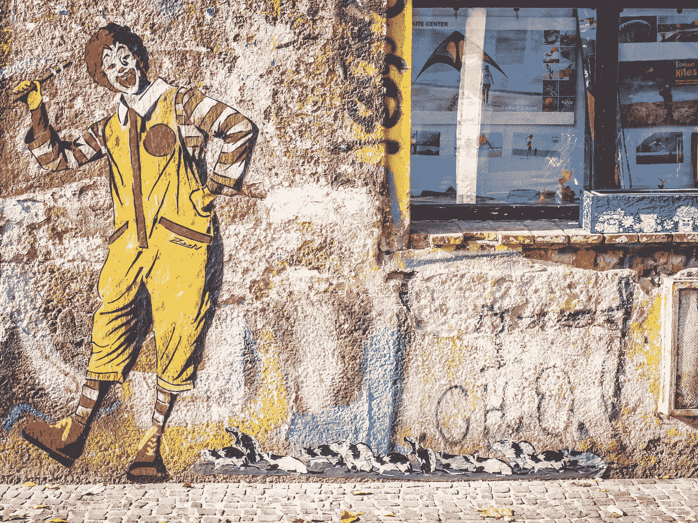
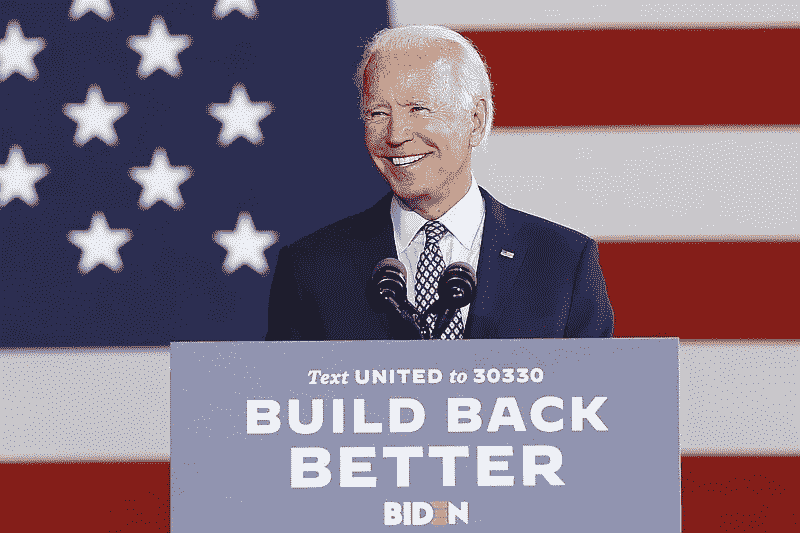
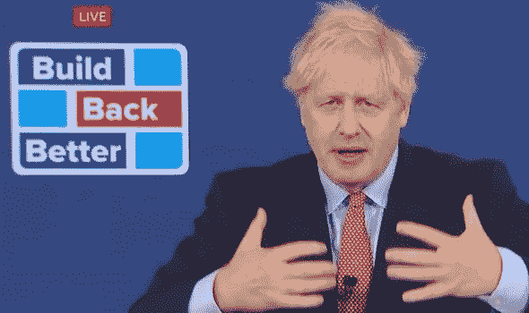

# 资本主义正在拯救我们吗？

> 原文：<https://medium.datadriveninvestor.com/is-capitalism-saving-us-right-now-373320eee733?source=collection_archive---------5----------------------->

## 谁在为我们的权利而战？不是政客。

Photo by [Leipzig Free Tours by Dirk Pohlers](https://unsplash.com/@leipzigfreetours?utm_source=unsplash&utm_medium=referral&utm_content=creditCopyText) on [Unsplash](https://unsplash.com/s/photos/capitalism?utm_source=unsplash&utm_medium=referral&utm_content=creditCopyText)

是只有我，还是有想要开业的企业主，以及想要离开他们的家并为商品和服务付费的顾客，是推动抵制一个正在侵犯我们权利的国家的主要力量？

我说的不仅仅是打开他们生意的权利。我说的是更大范围内的人权基础。

我不一定是资本主义的大力支持者；但我对自由市场了解得足够多，知道某些东西确实有用，我认为现在我们看到一些东西正在变得更好。

你可能会问这样一个问题，资本主义究竟在拯救我们什么或谁？

人们想要自由，人们想要能够挣钱，因为生活需要钱，现在想要自由也需要钱。

许多人没有意识到全球正在努力压制我们的人权。几位世界领导人和其他有影响力的人士公开表示，Covid 是[对社会做出一些重大改变的绝佳机会](https://time.com/collection/great-reset/5900763/lily-cole-covid-19-opportunity/)。他们中的一些人通过呼吁[大重置](https://www.weforum.org/great-reset/)或[第四次工业革命](https://www.weforum.org/agenda/2016/01/the-fourth-industrial-revolution-what-it-means-and-how-to-respond/)来谈论它。

这是对利益相关者资本主义和技术官僚政治的推动，它与我们目前的权利不相容，也与社会主义或共产主义不是一回事。

“大重置”是由世界经济论坛(WEF)发起的一系列范围广泛的全球性倡议，旨在改变我们生活和社会契约的方方面面。这大多是在绿色借口下进行的，并被贴上“可持续发展目标”之类的标签。但你不必是反环保主义者，也能从字里行间看出这些目标背后的独裁主义和法西斯主义。

乔·拜登的口号是“重建得更好”。拜登任命约翰·克里(John Kerry)为气候沙皇，克里作为“议程贡献者”完全支持 WEF，他在 WEF 的“伟大重置”播客中谈到了这一点。事实上，克里说，他不仅认为大重置(Great Reset)将在[发生](https://thehill.com/opinion/energy-environment/528482-john-kerry-reveals-bidens-devotion-to-radical-great-reset-movement)，而且它“将以超出许多人想象的速度和强度发生”

有趣的东西。

贾斯廷·特鲁多[也在](https://m.youtube.com/watch?v=n2fp0Jeyjvw)号上，我最近听到他谈论加拿大新的[旅行限制](https://apnews.com/article/cananda-coronavirus-travel-21d1685b076a62025326b0eb4441cd9c)，只有某些机场开放，人们需要自费约 2000 美元进行检疫，甚至可能被带到政府机构进行检疫。我希望我是在开玩笑。就连看似民粹主义的英国鲍里斯·约翰逊(Boris Johnson)也加入了进来。

这些人想要改变资本主义，无论他们称之为资本主义的重置或重启，还是其他什么术语，他们都在谈论将我们所有人转移到“利益相关者资本主义”，这个定义听起来不错，但实际上是社团主义和法西斯主义的混合。

关键是这些人真的试图改变我们所知道的生活，我认为资本主义或者至少自由市场是驱使人们保留我们的自由和生活方式的真正原因。

一方面，他们试图通过第四次工业革命向我们推销一个高科技乌托邦，用无人机随时运送我们需要的任何东西，但另一方面，克劳斯·施瓦布谈到人们需要降低对未来几年的期望。

人们谈论的是平等的结果而不是平等的机会，考虑到我们拥有的人口，知道美国使用了多少资源，我们不得不猜测，为了实现他们的目标，生活水平的妥协大约是 75%。抱歉，在无人机送货和 [TaaS](https://amp.benzinga.com/amp/content/15824983) (运输即服务)的世界里，我看不到这一点。

此外，一旦价格最终降到合理水平，人们就会想让 T2 拥有他们的电动汽车。他们不会想简单地到处“优步”——这是他们的“[共享经济](https://link.medium.com/8I2W1TlAHdb)的设想。

企业不是因为自由市场的失败而关闭，而是因为政府让他们关闭，现在他们缺乏收入，可悲的是，许多企业将永远关闭。

这些愚蠢的政策会让我们失去大约 50%的中小企业。多代企业就这样消失了。更不用说大量的失业。

因此，所有希望敞开大门全面运营的企业家、企业主和员工，以及所有希望生活恢复正常的顾客，这些人都试图通过推动商业重新开始，最终保护我们和我们的权利。

这些企业主正在反击破坏他们生计的不公平规则——他们是抵御更大范围侵犯我们权利的第一道防线。如果 10 年后我们还有言论自由，这些人就是你需要感谢的人。

我相信，由于生活成本的原因，我们国家需要更高的工资，但如果有一种肯定的方法可以杀死那些活着通过 Covid 的剩余中小企业，那就是迫使他们支付他们无法支付的工资。

但是对于大玩家，财富 500 强公司，他们可以继续运营，对吗？因为他们有足够的影响力来实施社会和市场变革，他们有雄厚的政府救助资金来维持他们的运转。简而言之，他们可以帮助故事继续下去，并找到从中获利的方法。他们不能指望夫妻店这样做，所以他们必须成为经济受控破坏的一部分。

毕竟，如果我们不绝望，我们永远不会接受他们提出的世界。

有一点是清楚的——Covid 可能对人没有那么致命，但我认为它的首要目标是杀死资本主义。每一个商店老板都站出来反抗他们的市长和州长，每一群人都拒绝听从警察的命令而离开，我认为这是自由市场的反击。

我们可能没有真正的自由市场，就像我们最近在华尔街看到的 [GameStop saga](https://thehill.com/policy/finance/536212-reddit-traders-cause-wall-street-havoc-by-buying-gamestop) 一样，这只是一个例子，当然美国版的资本主义也远非完美。但是，不管你喜欢与否，它可能只是帮助你将你的权利保留得更久一点的东西。

*你可能喜欢的其他文章:*

 [## 我们未来的权利取决于权力下放

### 需求非常明确——我们必须立即建立新的系统

medium.com](https://medium.com/the-capital/our-future-rights-depend-on-decentralization-c884e2f1e16b)  [## 大重置的利益相关者资本主义是任人唯亲的兴奋剂

### 滑向社团主义

medium.com](https://medium.com/datadriveninvestor/the-stakeholder-capitalism-of-the-great-reset-is-cronyism-on-steroids-bd7de1aa362a)  [## 你准备好应对实时通胀了吗？

### 美联储的下一步行动是直接从你的钱包里拿钱

medium.com](https://medium.com/datadriveninvestor/are-you-ready-for-real-time-inflation-aba9f62e9d6)