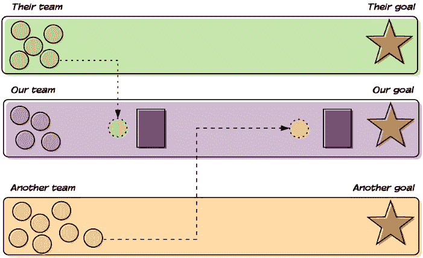
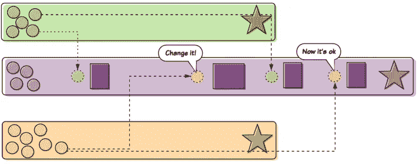

# 协作总是一件好事吗？

> 原文：<https://medium.datadriveninvestor.com/is-collaboration-always-a-good-thing-4316fe9037a4?source=collection_archive---------5----------------------->

## 你说我们是合作的…我说我的团队经常被封锁

Photo by [Zdeněk Macháček](https://unsplash.com/@zmachacek?utm_source=medium&utm_medium=referral) on [Unsplash](https://unsplash.com?utm_source=medium&utm_medium=referral)

我永远也忘不了我突然想到的那次会议。

那不是很久以前的*太*了，虽然我不太确定*有多*长。我不记得那天是星期几…也许是星期二？感觉就像是星期二。老实说，虽然我知道我们正在计划一个项目，但我不确定*具体是什么*项目。

但我记得我们四个人坐在那里，计划那个项目。“我们需要安排一次与安全团队的初次会面，”我们的经理说。“得到初步批准。稍后，我们需要与他们一起安排最终审批审核。我们还需要确定财务团队什么时候可以见面来检查我们的设计。我们还需要与平台团队一起安排时间，以获得他们的批准。”

“咻！那有很多会议，”他带着试探性的微笑结束了讲话。“不过没关系。协作很好。”

“是的，”我们其余的人异口同声地说，像一个宗教派别的成员一样点着头，毫无疑问地背诵一些古老的经典。*协作良好。*”

但在我内心深处，我知道等待我们的是什么。本该是一个简洁、快速的项目，却变成了一个又一个的障碍。等待组织中的各种人找到时间与我们见面。可能会被送回去返工我们的项目，之后我们需要等到更多的会议可以安排。

而这时候我就开始疑惑:*协作* ***总是*** *好吗？*

在回答这个问题之前，我们先从更简单的开始:*什么是***协作？在网上搜索一下，你会发现这个问题的答案非常复杂。但它们都围绕着人们一起工作的理念。更重要的是，协作包括人们朝着一个共同的目标努力。**

**

*Photo by [Morgan McKnight](https://unsplash.com/@morganspoker?utm_source=medium&utm_medium=referral) on [Unsplash](https://unsplash.com?utm_source=medium&utm_medium=referral)*

*让我们举一个简单而清晰的协作例子: *crew* 。Crew 是一种划船运动，你会在与常春藤联盟学校或军事学院相关的电影中看到(那些看过[《社交网络》](https://www.imdb.com/title/tt1285016/)的人可能会记得[文克莱沃斯兄弟划船队](https://www.rowingrelated.com/2010/10/i-row-crew-rowing-in-social-network.html))。船员包括偶数个划手(通常是 8 个)，统一划桨来推动船(即*外壳*)穿过水。船员由坐在后面的舵手领导。*

*Crew 是协作的一个很好的例子，因为船员们显然是在一起工作。划手们齐心协力划桨，使船在水中前进。舵手正在领导和激励划手，操纵船壳，策划全体船员的整体比赛。*

*此外，船员们有一个明确的目标，他们正朝着这个目标努力:为了赢得比赛，尽可能快地将船驶过水面。*

## *工作时一起划船*

*Crew 就是一个简单的例子。但是同样的原则也适用于工作场所。为了有效地合作，我们的团队成员应该有相同的目标。这个目标可能是暂时的；例如，为我们的一些客户解决一个问题。或者它可能是长寿的；例如，垂直旋转新产品。*

*团队的所有成员都应该朝着这个目标共同努力。当然，在工作场所，我们的团队成员可能会更加多样化。*

# *在许多情况下，合作已经破裂*

*假设我们团队的目标是设计和构建一个新的软件。然而，该公司对任何此类项目都有许多要求。在开发和部署这样的软件之前，我们需要通过审查，并获得整个组织中许多其他团队的批准。*

*当这些团队也有自己的目标时，问题就出现了。例如，安全团队中的任何人都不会与我们设计、构建和部署软件的目标有任何关联。当然，该团队的部分职责可能是对正在开发的新软件进行评审。但是具体到我们的项目……它的时间表、时间表和截止日期？呃。他们有时间的时候会去做的。*

## *“合作”又是什么意思？*

*不幸的是,“协作”这个词的意思已经被借用了。在今天的许多组织中，“协作”已经成为“来自组织不同部分的一群人聚在一起交谈”的意思*

*换句话说，许多公司认为自己“高度协作”，因为他们的员工经常需要与一群不同的人交谈才能完成任何事情。*

*当然，那些人大概是在那些时间里*在工作*，他们是*在一起*，所以我们可以说他们是在“一起工作”然而，更难争辩的是，那些人总是有相同的目标。相反，来自组织不同部分的人聚在一起经常属于不同的团队，而团队又有他们自己不同的目标。*

*让我试着用图表来说明。在这里，我们有我们的团队。我们也有团队成员，我们有目标。理论上，我们的团队和它的目标之间唯一的事情就是我们需要做的工作。*

**

*理论上是这样。事实上，这种情况很少发生。特别是在一个“高度协作”的组织中，比如我们一直在描述的组织，我们将依靠其他团队的成员来实现我们的目标。然而，这些团队有他们自己的目标。因此，我们被阻塞了，直到另一个团队的成员有时间和我们一起工作。*

**

*Same total amount of work for our team, but we can’t do most of it until members of other teams are freed up to work with us.*

*有点扫兴，是吧？嗯，可能会变得更糟。由于那些其他团队的成员既不熟悉我们的项目，也不一定投资于它，他们可能不理解或不同意我们的解决方案。*

*就其本身而言，这很好。据推测，他们是基于自己的特殊视角或专业知识被引进的。但他们一开始并没有参与。因此，这种观点/专业知识不会出现在我们团队的初始工作中。因此，根据他们的角色(例如，如果我们需要他们的批准),我们可能会被送回去重做我们的解决方案。*

**

*将这一效果乘以我们需要会见的整个组织中的人数，嗯…我们曾经完成任何项目都是一个奇迹！*

*但是，嘿…我们在合作，对吗？*

# *那么，我们如何有效地合作呢？*

*回想一下，我们提到过团队协作的两个组成部分:*

*   *人们在一起工作*
*   *那些人正朝着一个共同的目标努力*

*但是在整篇文章中，您可能已经注意到了团队协作的第三个同样重要的组成部分。当我们依靠某人来实现*我们的*目标……但是某人有他们自己的*目标在努力实现的时候，合作就会破裂，并成为一个阻碍因素。**

*因此，为了有效的团队协作，我们可以添加以下组件:*

*   *一个目标所依赖的每个人都在朝着那个目标努力*

*回到我们的船员示例，回想一下，一个典型的船员可能由八名划手组成。这八项都是成功参赛的必要条件。如果我们的第七名划手正在朝着其他目标努力——比如说，为团队购买新桨——当比赛开始时，我们需要等到他完成任务并返回团队才能参加比赛……这很难说是成功的秘诀。*

*当然，这个例子看起来很荒谬。这是应该的。但就是这么多机构来运作的。*

*相反，团队应该围绕实现团队目标所需的人员来组建。乍一看，这似乎有悖常理。毕竟，许多公司都有“横向”或“职能”部门，由具有相同技能或关注点的员工组成。这些部门可能包括法律部门(由律师和擅长处理法律事务的人组成)；设计(由 UX 和平面设计师组成)；前端、后端和移动工程师(由…嗯，你懂了)。*

*那很好。但是为了完成一个特定的项目——为了实现一个特定的目标——我们应该组建一个团队，由完成这个项目所需要的任何人组成。团队可能是短命的——比方说，如果我们正在解决客户一直在经历的问题。或者它可能无限期地存在——例如，如果我们推出一个新的产品线。*

*换句话说，如果我们的目标包括满足公司的安全需求，那么安全部门的某个人应该与我们合作。如果我们的项目有很强的法律成分，那么我们的团队应该包括来自法律部门的代表。如果我们的项目涉及到为我们的网络或软件产品创建一个新的图形界面，那么我们最好有一个设计师专门负责我们的项目。*

**

*有点出名的 Spotify 已经用他们的[小队模型](https://blog.usejournal.com/restructuring-teams-to-achieve-more-with-spotifys-squad-framework-a-case-study-eda14c5b62e3)将这种方法编成了法典。我们所说的团队，Spotify 称之为“小队”。小队是为了实现特定的目标而组建的。必然地，团队是跨学科的，由任何需要达到目标的人组成。*

*当然，有些部门可能会相对人手不足。例如，对于工程来说，拥有比合法成员多几个数量级的成员并不罕见。这就是现实…这很好。这只是意味着我们的团队可能会有一个兼职的法律代表。但是该代表和团队的其他成员一样，都致力于实现团队的目标。*

## *合作是好的…如果这是真正的合作*

*像其他很多词一样(包括“讽刺”……[非常感谢，阿兰妮斯·莫利塞特](https://artsbeat.blogs.nytimes.com/2008/06/30/isnt-it-ironic-probably-not/)！)“协作”已经被误用了。在许多组织中，这意味着一个群体中的人依赖于另一个群体中的人。*

*然而，为了真正的合作，我们必须确保当我们有一个目标要实现时，需要实现该目标的每个人都一起努力来实现它。*

*到那时，我们可以围坐在一起，真正认同“协作是好的”*

# *资源*

*   *【https://blog.jostle.me/blog/why-collaboration-is-important *
*   *[https://en.wikipedia.org/wiki/Collaboration](https://en.wikipedia.org/wiki/Collaboration)*
*   *[https://hickorycrew.org/what-is-crew/](https://hickorycrew.org/what-is-crew/)*
*   *[https://www.aiim.org/What-is-Collaboration](https://www.aiim.org/What-is-Collaboration)*

*喜欢这个故事？想多读点？只需[在此订阅](https://dt-23597.medium.com/subscribe)即可将我的最新故事直接发送到您的收件箱。*

*你也可以支持我和我的写作——并获得无限数量的故事——通过[今天成为媒体会员](https://dt-23597.medium.com/membership)。*