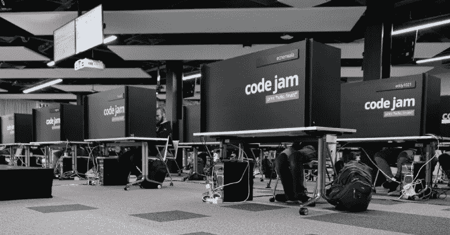

# 竞技编程是好是坏？

> 原文：<https://medium.datadriveninvestor.com/is-competitive-programming-good-or-bad-806f84ed4ed?source=collection_archive---------6----------------------->

ICPC 2019 World Final

你们中的一些人可能已经知道了竞争性编程(简写为 CP)，而你们中的一些人可能从未听说过这个术语。竞争性编程是一项脑力运动，参与者需要编写一个程序，在有限的时间内解决明确定义的问题。这些问题大多与数据结构、算法、数学和逻辑有关。很多这种竞争性的程序员把 CP 当成一项运动。除了象棋或者电竞(电子游戏)选手，没有其他区别。刺激你肾上腺素的时间滴答声是 cp 变得有趣和有竞争力的原因。当你成功提交程序时，绿色的“已接受”状态就相当于 1998 年迈克尔·乔丹在对阵爵士队的第六场比赛中的压哨球。

许多像我一样不熟悉竞争性编程的人经常会问这样的问题，比如竞争性编程有什么好的？对你有什么好处？为什么它在亚裔群体中如此受欢迎，尤其是在印度？

# 赞成的意见

*   做 CP 帮助你准备 FAANG 等各大公司的编码面试。面试中通常会问的问题通常是容易到中等程度的 CP 问题。对于一个一直在做竞技编程的人来说，问题一般都比较难，这也是为什么你能看到顶级 CP 选手最终出现在这些公司的原因。在 CP 有时间限制的情况下，你更有可能在技术面试中按时练习解决问题的技巧。
*   这是可以在你的简历中突出的东西。许多这样的公司从竞争对手那里雇人，比如谷歌代码堵塞、T2、Facebook 黑客杯和 T4 的 ICPC ACM。
*   能胜任大学录取(只申请中专)。全世界高中最大的 CP 竞赛之一是[信息学奥林匹克竞赛(IOI)](https://ioinformatics.org/) 。如果你在奥林匹克竞赛中名列前茅，这对名牌大学的录取几乎是一个巨大的推动。如果你在奥林匹克竞赛中获得奖牌，有些大学保证录取你。
*   CP 的一部分在于，它不仅教会你速度，还教会你准确性。

示例:

*   [Leetcode](https://leetcode.com/contest/) 大赛每提交一份错误的参赛作品将被罚 10 分钟到 **5** 分钟。如果你完成了 30 分钟的所有问题，但由于提交错误，你重新提交了四次代码，你的总时间将被扣除 20 分钟。所以从技术上讲，你的最后时间是 50 分钟，而不是 30 分钟。
*   TopCoder 竞赛有三个阶段的挑战:编码阶段、挑战阶段和系统测试阶段。编码阶段是一个有 75 分钟时间限制的常规竞赛。挑战阶段是最有趣的部分。每个参赛者都有机会在 15 分钟内挑战任何其他参赛者提交的功能。如果竞争对手在挑战中成功，他们将获得分数，但获得挑战并成功的人将失去所有分数。最后一个阶段是系统测试阶段，该阶段适用于所有尚未被成功质疑的提交。换句话说，计算机测试回合。如果 Topcoder 系统测试发现一个有缺陷的提交，提交该提交的竞争者将失去该提交的所有奖励点。([了解更多信息](https://tco20.topcoder.com/competition-overview/algorithm/algorithm-rules))

# 骗局

*   你对库/框架了解不多，也从未体验过实际经验，而这正是当今大多数真正的编程工作所做的。
*   图像处理、机器学习、人工智能、系统设计、密码学这些从来没有在这样的编码比赛中使用过。然而，这些计算机科学的话题很方便，经常在大公司使用。
*   专注于快速解决简单问题的坏习惯；然而，这并不适合所有人。有些人可能会认为，他们可能会比同龄人养成更好的习惯，因为在压力下调试的经历迫使他们编写他们能够理解的代码。

Google Code Jam

我对 CP 是好是坏的看法是**竞争性编程并不适合所有人**。CP 适合那些准备工作面试，把解决算法、数据结构、逻辑和数学当作爱好/运动的人。很少有竞争力强的程序员把 CP 变成终身事业。大多数顶级 CP 参赛者最终都为学校(博士/研究)或顶级 piers 公司工作。另一方面，不是 CP 顶级选手也不是世界末日。有很多方法可以让你在编程方面做得更好，并在就业市场上找到工作；举几个例子:贡献开源项目，掌握破解编码面试书，以及构建有利可图的项目/库/框架。如果你真的对编程充满热情，计算机编程中会有你喜欢的主题和领域，这可能是你的使命。

以下是一些对 CP 有用的链接:

 [## 竞争性编程辩论-红绿代码

### 以下哪项陈述最能描述您对竞争性编程的看法？例句-2:它对人体有害

www.redgreencode.com](https://www.redgreencode.com/the-competitive-programming-debate/)  [## 命令表

### 警告！时区设置不正确。请重新加载页面。

clist.by](https://clist.by/)  [## 主页-竞争性编程算法

### 这个项目的目标是翻译奇妙的资源 http://e-maxx.ru/algo 提供的描述…

cp-algorithms.com](https://cp-algorithms.com/)  [## lni shan/awesome-竞争性编程

### 令人敬畏的竞争性编程、算法和数据结构资源的精选列表。创建的目的是…

github.com](https://github.com/lnishan/awesome-competitive-programming)  [## 竞争性编程的 5 个职业好处

### 马克西姆·布兹达洛夫是《如何赢得编码竞赛:冠军课程的秘密》的作者之一，他曾经参加过最后一次…

blog.edx.org](https://blog.edx.org/5-career-benefits-of-competitive-programming/)  [## USACO 常见问题

### 我叫 Darren Yao，目前是 USACO 白金部门(美国排名前 200 位)的一名竞争对手。我也是作者…

达伦-姚. gitbook.io](https://darren-yao.gitbook.io/darren-s-blog/usaco-faq)