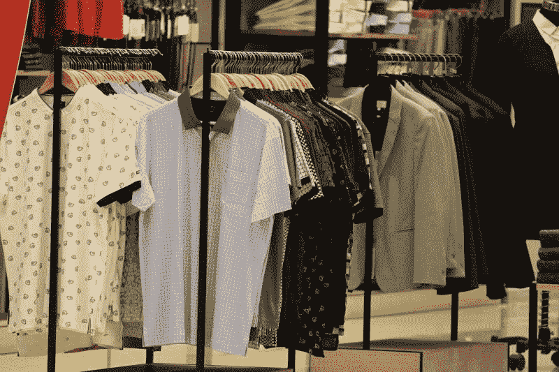
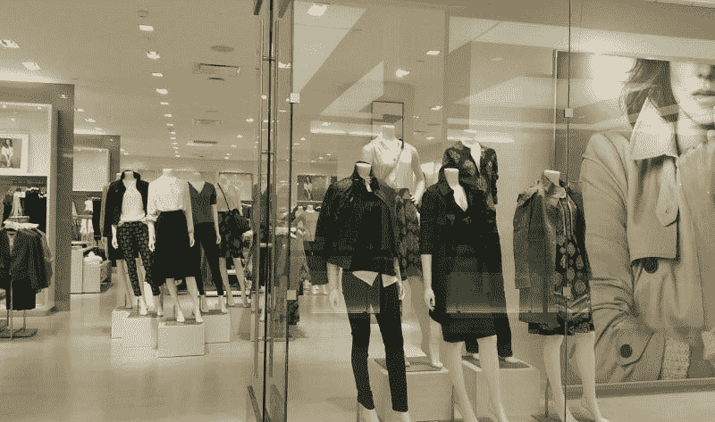
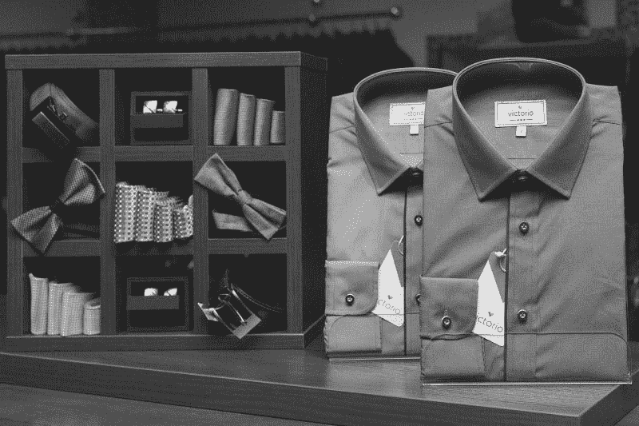
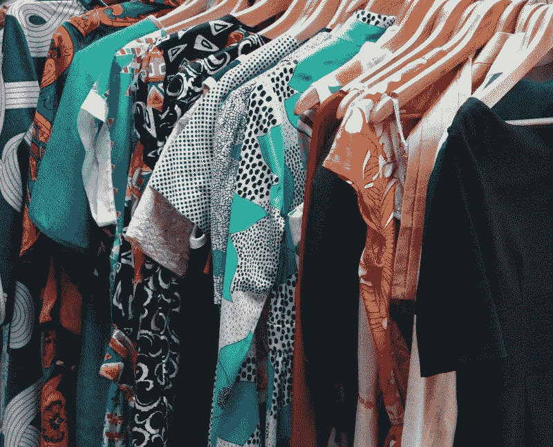
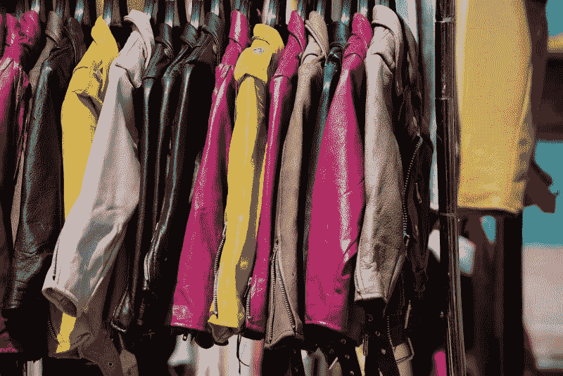

# 冠状病毒正在杀死诺德斯特龙吗？—市场疯人院

> 原文：<https://medium.datadriveninvestor.com/is-coronavirus-killing-nordstrom-market-mad-house-fd63ebbe2689?source=collection_archive---------15----------------------->

诺德斯特龙百货公司(纽约证券交易所代码:JWN) 在百货公司业务中的奇迹结束了。

Nordstrom 计划关闭 16 家大型百货商店，以节省资金并在疫情生存下来。因此，全线**诺德斯特龙(纽约证券交易所代码:JWN)** 百货商店的数量将从 117 家下降到 101 家。

重新开放 Nordstrom 的其余商店将需要昂贵的冠状病毒安全措施，雅虎！金融。这些措施包括口罩，社会距离，更多的清洁，改造整理室，改变营业时间，路边服务，以及对退货和试衣间更严格的控制。

重要的是，Nordstrom 关闭 16 家商店的一个原因是获得 1.5 亿美元来支付冠状病毒预防措施所需的费用。索赔。

# 诺德斯特龙是死于冠状病毒吗？

在冠状病毒出现之前，[**Nordstrom**](https://marketmadhouse.com/why-is-nordstrom-making-money/)**Inc .(纽约证券交易所代码:JWN)** 是两个百货商店成功故事之一。另一个成功的故事是底层折扣店 [**TJX 公司**](https://marketmadhouse.com/tjx-shrinks-and-makes-more-money-at-the-same-time/) **(NYSE: TJX)** 。

Nordstrom 和 TJX(纽约证券交易所代码:TJX) 都成功地利用了收入不平等。为了解释这一点，Nordstrom 的市场面向不断增长的上层阶级，而 TJX 的销售对象是手头拮据的工人阶级。

利用收入不平等赚钱的商业模式是一个很好的模式，因为美国的贫富差距正在扩大。例如，经济政策研究所(EPI)的数据显示，1979 年至 2015 年间，美国收入最高的 1%人群的收入增长速度是收入最低的 90%人群的五倍。

EPI 声称，Nordstrom 在最近几十年赚了更多的钱，因为只有收入最高的员工才能拿到工资。与此同时，EPI 声称，1979 年至 2017 年间，美国最顶层 0.1%的人的收入增长速度比底层 90%的人快 15 倍。

 [## 如果资本主义失败了，那么还有什么选择呢？数据驱动的投资者

### 在当前政治领域的修辞之旅中，我们都可以面对面地接触到流行词汇，如…

www.datadriveninvestor.com](https://www.datadriveninvestor.com/2020/03/16/if-capitalism-is-a-failure-then-what-is-the-alternative/) 

此外，EPI 估计，1979 年至 2018 年期间，高收入者的工资增长速度是美国工资中位数的四倍。因此，诺德斯特龙的潜在顾客有更多的现金来购买昂贵的衣服、香水和珠宝。

# 冠状病毒能让诺德斯特龙变强吗？

奇怪的是，冠状病毒可以让 Nordstrom 变得更强大，更有利可图。澄清一下，Nordstrom 可以关闭大型的、古老的、昂贵的、赔钱的传统百货商店。

特别是，Nordstrom 可以退出像 Westfield Annapolis 和 Colorado's 这样的垂死的购物中心。值得注意的是，84，000 熨斗商店是 20 岁。此外，Flatirons 不在博尔德，这是一个富裕的城市，大多数人都在**亚马逊(纳斯达克代码:AMZN)** 购物。

关闭 Flatirons 和 Paseo Neuvo 商店等恐龙商店可能会让 Nordstrom 有钱投资于其较小的 Nordstrom Local 和 Nordstrom Rack 概念。 [Nordstrom Local](https://marketmadhouse.com/why-is-nordstrom-making-money/) 是一家相邻的小商店，购物者可以在这里取网上订单。Nordstrom 计划在西好莱坞和纽约市等富裕的城市地区开设本地商店。

# 诺德斯特龙的冠状病毒机遇

[Nordstrom Rack](https://www.nordstromrack.com/) 是一家受欢迎的折扣店，类似于 TJX 的品牌。Nordstrom 通过向破产但雄心勃勃的人低价出售奢侈品，从收入不平等中攫取利润。

冠状病毒可能会让诺德斯特龙有机会关闭数十家大型百货商店，并转型为折扣店和在线零售商。由于 J. Crew 和 True Religion 等零售商的离开，Rack 和 Local 将会有许多空置的商店。

新冠肺炎疫情也让诺德斯特龙有机会走出商场，进入更便宜或时尚的地方。例如，Nordstrom Local 可以在时尚、城市社区或休息时间营业。与此同时，货架可以搬进空荡荡的购物中心。

然而，Nordstrom 面临着许多顾客在亚马逊而不是在百货商店购物的危险。尤其是害怕冠状病毒的老年顾客，现在都在网上购物。百货公司就靠这种需要隔离的老顾客。

# 诺德斯特龙赚钱了吗？

**Nordstrom(纽约证券交易所代码:JWN)** 在冠状病毒来到北美之前就已经在赚钱了。

具体来说，在截至 2020 年 1 月 31 日的季度中，Nordstrom 的收入为 45.37 亿美元，毛利为 16.53 亿美元。此外，Nordstrom 在同一天报告了 2.98 亿美元的运营收入和 1.92 亿美元的共同收入。

此外，Nordstrom 报告了 6.67 亿美元的运营现金流和 3.66 亿美元的上一季度运营现金流。因此，诺德斯特龙的业务可以产生一些现金。

# 诺德斯特龙的债务和机会

相反，Nordstrom 在 2020 年 1 月 31 日有 8.53 亿美元的现金和短期投资。因此，诺德斯特龙几乎没有保留它所赚的现金。

冠状病毒可以通过让诺德斯特龙关闭大型百货商店来帮助纠正这个问题。因此，Nordstrom 可以通过消除对大量员工和大型商店的需求来降低劳动力和房地产成本。

Nordstrom 需要降低成本，因为截至 2020 年 1 月 31 日，其长期债务为 45.51 亿美元，流动负债为 35.2 亿美元。解释一下，Nordstrom 可能会因为商店关门而难以偿还债务。

# 诺德斯特龙有什么价值？

在冠状病毒之前，Nordstrom 具有一定的价值和较低的安全边际。Stockrow Nordstrom 上个季度的收入增长率为 1.118%。

然而，在此之前的四个季度，收入增长一直在萎缩。具体而言，Nordstrom 报告 2019 年 10 月 31 日的季度收入增长率为-2.03%，2019 年 7 月 31 日为-4.79%，2019 年 4 月 30 日为-3.31%，2019 年 1 月 31 日为-4.64%。

此外，愿意关闭 40 家无利可图的商店表明诺德斯特龙有能力做出生存所必需的艰难决定。不幸的是，没有迹象表明 Nordstrom 拥有这些领导人在冠状病毒中生存所需的资源。

# 诺德斯特龙的低安全边际

因此，我认为诺德斯特龙的增长能力和安全边际都很低。我认为诺德斯特龙比大多数人想象的更容易崩溃。

因此，诺德斯特龙公司 2020 年 3 月 9 日支付的 37₵季度股息可能会消失。在这种情况下，我认为 Nordstrom 不再是一项价值投资。

总体而言，2020 年 5 月 12 日，Nordstrom 股票的股息收益率为 8.64%，年化派息为 1.48 美元，派息率为 659.53%。因此，许多投资者会认为诺德斯特龙是一个优秀的股息股票。

# 为什么诺德斯特龙会倒闭

我的建议；然而，要远离诺德斯特龙(纽约证券交易所代码:JWN) 股票，因为它可能会崩溃。事实上，我预测诺德斯特龙的股票可能很快会跌破市场先生在 2020 年 5 月 12 日支付的 16.16 美元。

诺德斯特龙的运气可能会耗尽。我认为投资者需要避开 Nordstrom，直到这家零售商证明自己能够从冠状病毒中恢复过来。

*原载于 2020 年 5 月 12 日***。**