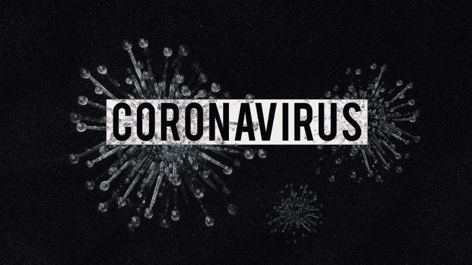
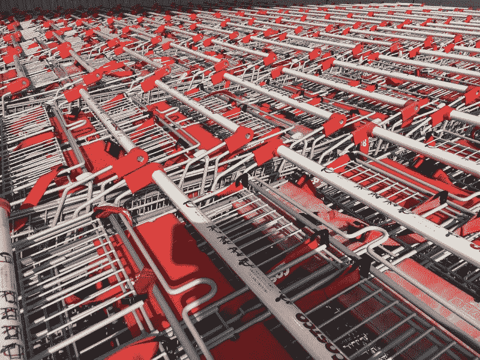
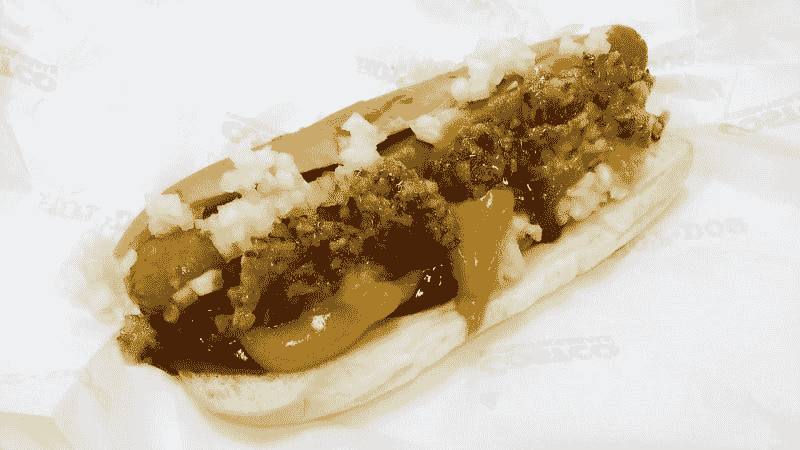

# 好市多批发公司是应对衰退的最佳股票吗？—市场疯人院

> 原文：<https://medium.datadriveninvestor.com/is-costco-wholesale-the-perfect-stock-for-a-recession-market-mad-house-15ee56f2a37f?source=collection_archive---------25----------------------->

查理·芒格[最喜欢的](https://finance.yahoo.com/news/charlie-munger-buys-more-costco-155946219.html) **好市多批发公司(纳斯达克股票代码:COST)** 可能是应对经济衰退的完美股票。

目前，好市多提供不断增长的收入、不断增长的毛利和丰厚的股息。此外，好市多在持续的冠状病毒恐慌等危机中也能茁壮成长。新闻报道显示，由于冠状病毒，惊恐的购物者正在从东海岸到西海岸挑选好市多商店。

例如， [SILIVE](https://www.silive.com/news/j66j-2020/03/98bdf96be55749/shoppers-rush-to-costco-in-wake-of-coronavirus-it-looks-like-the-end-of-the-world-in-there.html) 在当局报告了纽约市自治市的新冠肺炎·弗留斯案件后，发现斯塔滕岛好市多外有人排队。此外，好市多的首席财务官理查德·加兰蒂声称，由于冠状病毒，二月份的销售额增加了。

加兰蒂告诉分析师，需求如此之大，好市多将限制顾客可以购买的某些商品的数量。加兰蒂在 2020 年 3 月 5 日说:“成员们向我们寻求各种与准备和处理病毒有关的物品，如货架马厩、干燥的杂货、清洁用品、Clorox 和漂白剂、水、纸制品、洗手液、消毒湿巾、消毒剂、健康和美容辅助用品。”

 [## 算法交易的机器学习|数据驱动的投资者

### 当你的一个朋友在脸书上传你的新海滩照，平台建议给你的脸加上标签，这是…

www.datadriveninvestor.com](https://www.datadriveninvestor.com/2019/01/30/machine-learning-for-stock-market-investing/) 

# 好市多赚了多少钱？

此外，好市多正从这些销售中获利并不断增长。例如，好市多 2020 年 2 月 29 日报告的毛利为 50.16 亿美元。

重要的是，Stockrow 让好市多在截至 2020 年 2 月 29 日的季度收入增长率达到 10.39%。因此，好市多的毛利从 2019 年 11 月 30 日的 48.07 亿美元增长至 2020 年 2 月 29 日的 50.16 亿美元。此外，好市多的收入从 2019 年 11 月的 370.4 亿美元增长到 2020 年 2 月的 390.7 亿美元。

因此，好市多在 2020 年 2 月 29 日报告了 12.66 亿美元的季度营业收入和 9.31 亿美元的共同净收入。这些数字比 2019 年 11 月 30 日的 10.61 亿美元和 8.44 亿美元有所增加。

相比之下，好市多的现金和短期投资从 2019 年 11 月的 100.2 亿美元降至 2020 年 2 月的 87.15 亿美元。不幸的是，好市多没有公布上个季度的现金流数据。

# 好市多保持增长

好市多的生态系统不断发展壮大。例如，Statista [估计](https://www.statista.com/statistics/718406/costco-membership/)全球好市多会员数量从 2018 年的 9430 万增长到 2019 年 11 月的 9850 万。

而且好市多在美国运营了 543 个仓库，在加拿大运营了 108 个仓库，在墨西哥运营了 39 个仓库，在英国运营了 29 个仓库，在韩国运营了 16 个仓库，在日本运营了 26 个仓库，在台湾运营了 13 个仓库，在西班牙运营了 2 个仓库，在中国运营了 1 个仓库，Statista [估算](https://www.statista.com/statistics/284431/number-of-costco-warehouses-2013-by-country/)2019 年运营了 11 个仓库。此外，好市多在冰岛和法国各有一个仓库。

因此，好市多去年在全球运营了 779 个仓库或俱乐部。相比之下，**沃尔玛(纽约证券交易所:WMT)**2019 年在全球运营了 11766 家门店，Statista [估计](https://www.statista.com/statistics/256172/total-number-of-walmart-stores-worldwide/)。

然而，沃尔玛报告称，截至 2020 年 1 月 31 日的季度收入为 1416.71 亿美元。与此同时，**好市多(纳斯达克股票代码:COST)** 在 2020 年 2 月 29 日报告了 390.7 亿美元的季度收入。

好市多投资者关系公司声称，2019 年，好市多商店的平均销售额为 1.05 亿美元。因此，好市多是最赚钱的零售商之一。

# 查理·芒格对好市多的看法正确吗？

沃伦·巴菲特的密友查理·芒格在 2019 年 10 月 24 日拥有 165，736 股**好市多批发公司(纳斯达克股票代码:COST)** 股票，雅虎！财务[估算](https://finance.yahoo.com/news/charlie-munger-buys-more-costco-155946219.html)。此外，芒格于 2019 年 10 月 22 日购买了更多好市多股票。

此外，**伯克希尔哈撒韦公司(纽约证券交易所代码:BRK。b)**2020 年 2 月 25 日拥有 430 万股好市多股票，雅虎财经！[报告](https://finance.yahoo.com/news/complete-berkshire-hathaway-portfolio-001848019.html)。所以，巴菲特对好市多的喜爱不亚于他的朋友芒格。

此外，**伯克希尔哈撒韦公司(纽约证券交易所代码:BRK。b)**2020 年 2 月 25 日拥有 430 万股好市多股票，雅虎财经！[报道](https://finance.yahoo.com/news/complete-berkshire-hathaway-portfolio-001848019.html)。所以，巴菲特对好市多的喜爱不亚于他的朋友芒格。

我认为芒格和巴菲特对好市多的看法是正确的。这家公司在混乱和灾难时期成长并赚钱。可悲的是，我认为好市多的业务可能会增长，因为未来十年飓风和流行病等灾难的数量将会增加。

我认为由于气候变化，飓风和火灾的数量会增加。与此同时，由于全球旅行的增加，流行病的数量可能会增加。

# 好市多美妙的红利

我认为市场先生在 2020 年 3 月 16 日将好市多批发公司(NASDAQ: COST)的价格定得过高，为 293.56 美元。

然而，好市多仍然支付其美妙的股息。例如，好市多在 2020 年 2 月 6 日支付了 65₵季度股息。因此，好市多在 2020 年 3 月 16 日支付的股息收益率为 0.86%，年化股息为 2.60 美元，派息率为 29.66%。

Dividend.com[报道](https://marketmadhouse.com/is-costco-wholesale-the-perfect-stock-for-a-recession/#tm=3-comparison-center&r=ES%3A%3ADividendStock%3A%3AStock%23COST--NASDAQ&only=meta%2Cdata%2Cthead)好市多的股息在过去 16 年里一直在增长。因此，好市多的股息在 2007-2008 年的经济大崩溃中保持增长。因此，我认为好市多是一支抗衰退的股票。

尽管我认为它定价过高，但我认为好市多是应对衰退的好股票，因为它的安全边际很高。如果你正在寻找一只安全的股票来帮助你度过下一次衰退，**好市多(纳斯达克代码:COST)** 可能是一个不错的选择。

*原载于 2020 年 3 月 16 日 https://marketmadhouse.com**[*。*](https://marketmadhouse.com/is-costco-wholesale-the-perfect-stock-for-a-recession/)*