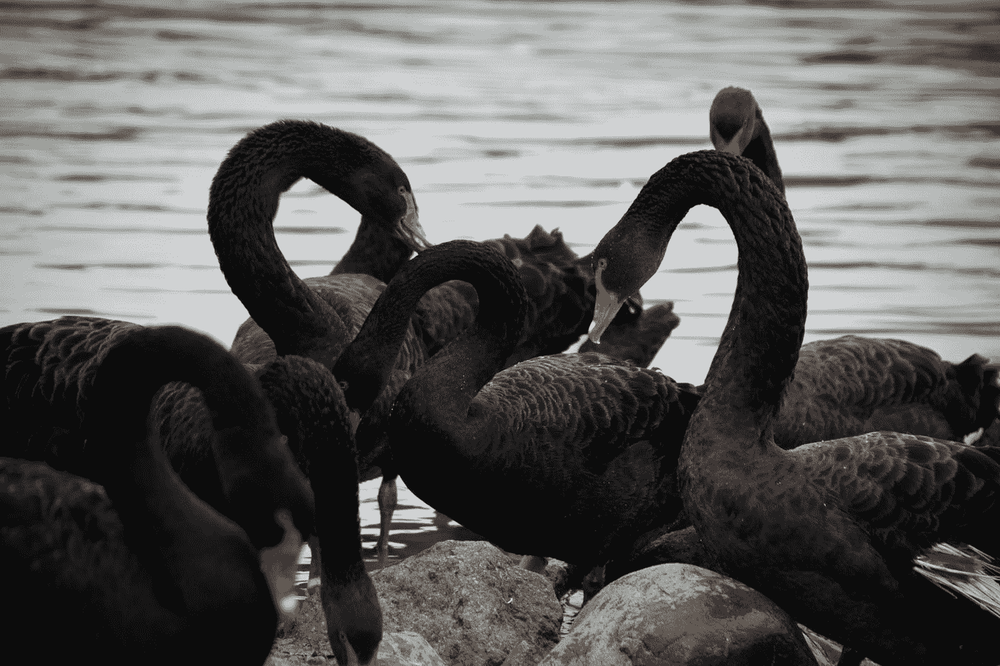

# 新冠肺炎是黑天鹅事件吗？

> 原文：<https://medium.datadriveninvestor.com/is-covid-19-a-black-swan-event-3d7ecd0d77d9?source=collection_archive---------22----------------------->

## 布莱克&普尔受到的冲击最大。

Photo by [Yuting Liu](https://unsplash.com/@yutinghuhu?utm_source=medium&utm_medium=referral) on [Unsplash](https://unsplash.com?utm_source=medium&utm_medium=referral)

我们的政府或任何大公司有类似疫情的计划吗？

> 请不要自欺欺人，称这是一个**黑天鹅事件。绝对不是！**

有许多关于这种事件可能性的预先警告，并且许多这些警告都带有在这种事件发生之前需要做好准备的建议。

比尔·盖茨做了一个关于流行病的 TED 演讲，世界卫生组织发出了警告。我们的联邦政府有计划，但是忽视了他们，或者解散了他们的工作是为这种类型的紧急情况做准备的团体。

制造疫苗和研究流行病的主要制药公司怎么样？似乎没有人准备好迎接一个他们已经得到了无数预警的事件。

经济上处于不利地位的人受到的打击最大，既有感染，也有收入损失。雪上加霜的是，恢复最慢的工作岗位主要由那些最不能错过薪水的人填补。

这些工人主要从事不能远程操作的职业。例如，食品服务工作、维护和清洁工作以及护士和医院清洁人员等医疗服务提供者都需要由现场人员来完成。

这些都是至关重要的工作，没有它们，我们的经济将会比现在更糟糕。在某些情况下，就像在医院工作一样，没有这些工人他们就无法工作。

对我来说，这是一个巨大的失败，因为我们没有做好准备，对改变世界的事件的可能性熟视无睹。这与许多人对气候变化和全球海平面上升的心态是一样的。

这些事件和对它们的反应是以下方面的完美例子:

**认知偏差**——被定义为在判断中偏离规范或理性的系统性模式。人们从他们对周围事件的感知中创造了他们自己的“主观社会现实”。这是客观思维的一种局限，是由于人脑倾向于通过过滤个人经验和偏好来感知信息而造成的。

常态偏差— 我们倾向于相信，在短期内，未来看起来会和现在差不多。由于这种趋势，我们大大低估了灾难袭击我们的可能性和后果。

**注意力偏差—** 让我们更加关注那些我们认为最能引起情感投入的事件，而忽略那些不会引发我们情感的事情。

许多企业和一些政府机构都有应对极端暴风雪、洪水、重大火灾和飓风等快速变化事件的计划。他们在企业责任的各个领域都有经过交叉培训的高管，如果需要的话，他们可以在异地工作。

不幸的是，即使在有计划的情况下，这些计划也被忽视或被证明是不充分的。例如，卡特里娜飓风或哈维飓风造成的休斯顿洪水。

**像气候变化和流行病这样缓慢发展的事件需要深思熟虑的方法，预先计划是必须的。因对行为经济学的研究而获得诺贝尔奖的丹尼尔·卡内曼将人类思维分为两部分:**

第一部分是本能的战斗或逃跑反应，这在几千年前的大草原上对我们很有用，但在对付像疫情这样缓慢移动的**事件时就不那么好用了。**

第二部分涉及理性的计划和行动。这就是我们应对气候变化和/或疫情需要实施的思维类型。

由于缺乏预先计划，企业和政府都以第一部分的思维对疫情做出了反应，这解释了我们从政府和企业的领导人那里得到的脱节的反应。

政府正在推动人们重返工作岗位。尽管如此，对于服务企业的所有者来说，两个主要问题仍然存在，“如果我重新开始我的业务，但没有人或只有很少的客户出现，会发生什么？如果我的一些客户生病了，并将他们的病归咎于我和我的业务，会发生什么？”

在零售领域，问题是:“如果疫情在 10 月底或 11 月初爆发，圣诞节销售季节会发生什么？”

根据流行病学家和经济学家的说法，疫情的影响将持续到 2022-23 年，甚至可能持续到 2025 年。我们，作为公民和我们的经济，将永远不会回到仅仅几个月前被认为是正常的状态。

幸运的是，我只问问题。我不需要提出解决方案。华盛顿在开关上睡着了，错过了一些应对这一威胁的好机会，这还不够糟糕，但大企业呢？这些拿着高薪的高瞻远瞩的 CEOS 人在哪里？似乎没有人有一致的计划。

在我的下一篇文章中，我会提出一些我们需要去适应这种新常态的方法。像往常一样，如果你有任何问题，你可以给我发邮件或者在下面的回复中留下。