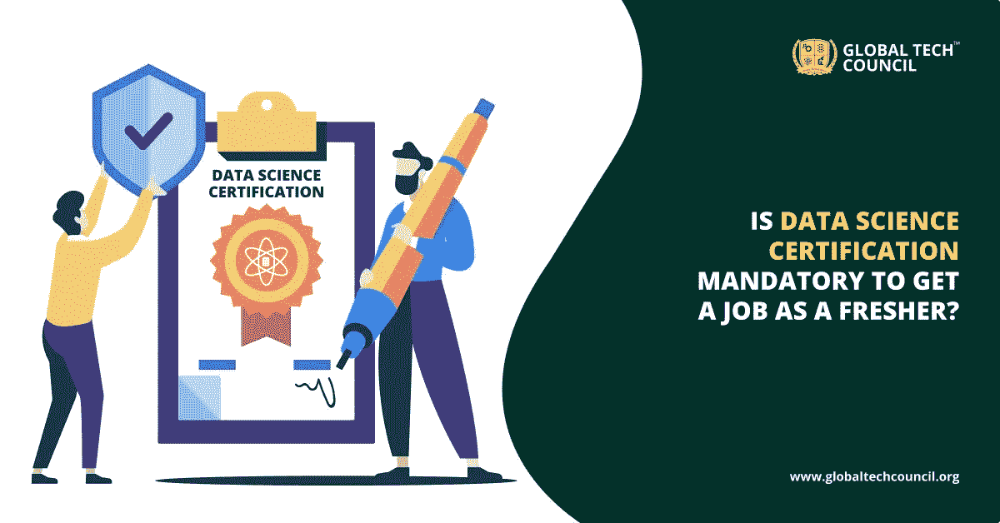

# 数据科学认证对于大一新生找工作是强制性的吗？

> 原文：<https://medium.datadriveninvestor.com/is-data-science-certification-mandatory-to-get-a-job-as-a-fresher-104c86d73ea4?source=collection_archive---------15----------------------->

选择正确的课程和发展正确的技能是攀登职业成功阶梯的关键。大量的发展轰炸了我们的世界，数据似乎是每一个发展的驱动力。数据为王，说得很贴切。有消息称，与以前相比，我们今天生成的数据量增加了数倍。现在对数据科学认证项目的需求更高了。许多个人甚至职业人士都选择了最好的在线数据科学课程。因此，问题来了，为什么对数据科学专家有这么大的需求。我们来探讨一下为什么 [**数据科学认证**](https://www.globaltechcouncil.org/data-science/certified-data-science-developer/?utm_source=Article%20Submission&utm_medium=Off%20Page%20k&utm_campaign=24%2F08%2F2020) 必不可少？

## **为什么选择数据科学认证是强制性的？**

**提升技能是关键-** 让数据科学成为任何技术极客必修的学习领域的一个关键原因是，大多数公司现在都在寻找懂技术和知道如何实施技术的人。由于大部分工作依赖于数据，一个拥有数据科学认证的人比那些刚刚入门的人有更多的发展前景。

**市场需求-** 数据科学认证成为热门选择的另一个原因是市场对数据科学认证的巨大需求。数据科学是每个公司都关注的最热门的技能之一。无论你是在职专业人士还是刚刚开始职业生涯，最好的在线数据科学课程将为你提供所有知识和信息，使你保持最新并领先于他人。

此外，从 2014 年到 2017 年，大数据领域的工作岗位增长了 106%。这种巨大的增长表明对 [**大数据专家**](https://www.globaltechcouncil.org/big-data-analytics/certified-bigdata-expert/?utm_source=Article%20Submission&utm_medium=Off%20Page%20k&utm_campaign=24%2F08%2F2020) 的需求，这些数据科学专家可以将关于数据科学的可操作知识运用到他们的业务运营中。

 [## 一瞬间学会数据科学！？数据驱动的投资者

### 在我之前的职业生涯中，我是一名训练有素的古典钢琴家。还记得那些声称你可以…

www.datadriveninvestor.com](https://www.datadriveninvestor.com/2020/07/23/learn-data-science-in-a-flash/) 

根据麦肯锡全球研究所的研究，美国预计将缺少 190，000 名数据科学家和 150 万名具有丰富数据科学知识的经理。所有这些数字都表明，这一领域对数据科学专家的需求很大。此外，数据科学是一个未来将继续发展的领域。因此，拥有这个领域的知识也能巩固你的职业发展，保证工作安全。

**更好的报酬**——如果你是一名大一新生，并期待选择一个正确的职业选项，你必须考虑 [**最佳在线数据科学课程**](https://www.globaltechcouncil.org/data-science/certified-data-science-developer/?utm_source=Article%20Submission&utm_medium=Off%20Page%20k&utm_campaign=24%2F08%2F2020) 。首先，作为一名新生，你有很多机会去探索这个领域。其次，网络课程容易追求；你也可以同时继续这些课程以及其他学习计划。

而且，作为一个应届生，你必须把赌注压在给你成长和高薪的领域；数据科学两者都有。这项技术在工业的不同领域都有应用。这意味着数据科学专业人员面前有不同领域的工作机会。

## **最佳在线数据科学项目。**

有了这些优势和增长前景，我相信你一定想知道什么是最好的在线数据科学项目？全球技术委员会是你应该探索的平台。

这是一个著名的在线门户网站，提供数据科学认证计划、大数据和数据分析。这些认证课程是根据行业不断变化的需求设计的，因此使本课程更加面向行业。无论你是一名大一新生，还是愿意在数据科学领域大展拳脚的人，这些数据科学认证课程都将帮助你掌握这一领域。

对数据科学专家的快速增长的需求使其成为一个受欢迎的职业选择，但只有一个优秀的学习平台才能给你一个正确的开始，全球技术委员会的角色就来了。成功完成本课程后，您将有资格加入任何精英行业。

此外，全球技术委员会提供其他课程，如机器学习，人工智能，网络安全。所以，你也可以通过这些课程提升自己的技能。

## **结论**

未来对数据科学认证人员的需求将会增加。数据是制定公司战略的基础，选择正确的学习平台会给你的职业生涯图带来正确的提升。

在数据科学领域开始职业生涯没有先决条件，但是，关于统计的知识和技术意识将帮助您轻松理解这些概念。像全球技术委员会这样一个好的学习平台一定会帮助你成为这个领域的专家。

如果你也希望成为这个不断增长的行业的一部分，现在是时候报名参加由 [**全球技术委员会**](https://www.globaltechcouncil.org/?utm_source=Article%20Submission&utm_medium=Off%20Page%20k&utm_campaign=24%2F08%2F2020) 举办的在线数据科学认证计划了。

**访问专家视图—** [**订阅 DDI 英特尔**](https://datadriveninvestor.com/ddi-intel)