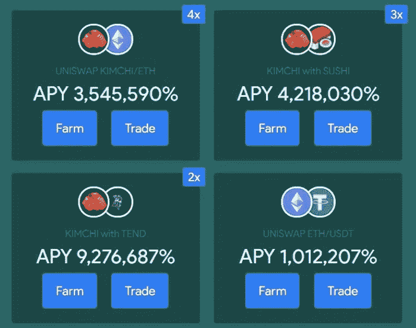
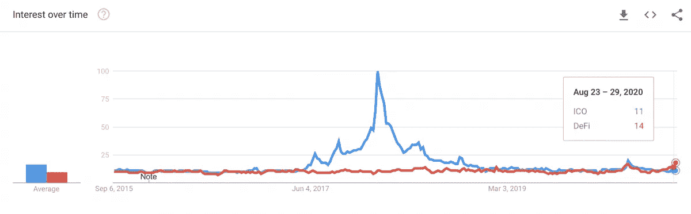

# DeFi 有 ICO 泡沫那么大吗？

> 原文：<https://medium.datadriveninvestor.com/is-defi-as-big-as-the-ico-bubble-517140738c77?source=collection_archive---------11----------------------->

事情发展到什么地步了？

分散融资(DeFi)创造了创新的做市形式。最著名的是，UniSwap 的自动做市商(AMM)模型创造了一种为新项目筹集资金的新途径。他们不再需要经历首次硬币发行(ICO)。现在，他们可以通过在首次流动性发行中出售硬币来直接筹集资金(ILO)。这是新项目使用新令牌和以太创建流动性池的地方，允许 AMM 协议为新密码创建市场。这样，任何人都可以购买代币，而无需成为合格的投资者。

《AMM 议定书》使高产农业成为可能。现在，许多参与者不断地在不同的流动性池之间转移资产，以获得更高的利息。这是什么刺激了 DeFi 市场。寿司、热狗、泡菜等“食物”代币和其他愚蠢的命名资产吸引了农民的注意力。这些农民能够获得超过 1000%的利息，至少在地毯从他们脚下被偷走之前。许多类似的项目最终都被创作者自己毁掉了。一旦代币达到天文数字的水平，最大的持有者就开始获利并抛售手中的股票。例如，热狗于 9 月 2 日推出，短短几小时内价格飙升至 6000 美元。早期采用者开始销售，并创造了价格的自由落体。五分钟内不到 1 美元。

 [## 如何在不牺牲孩子或财务的情况下安全理智地离婚|数据驱动…

### 在美国，七月是以孩子为中心的离婚月。作为 cdfaⓡ的专业人士，我可以向你保证，从长远来看…

www.datadriveninvestor.com](https://www.datadriveninvestor.com/2020/07/28/how-to-divorce-safely-and-sanely-without-sacrificing-your-children-or-your-finances/) 

**德-谁？**

虽然加密领域的人非常清楚 DeFi 一直在上升，但生活在传统金融领域的人不知道正在发生什么。谷歌趋势显示了 ICO 热潮有多活跃，而 DeFi 远远没有达到这些数字。

Google search interest for DeFi and ICO

要么 DeFi 有更多的发展空间，要么我们需要更多的人进入加密领域。认为 DeFi 是泡沫的论点是由于 DeFi 应用锁定的总价值(TVL)急剧增加了 1300%。DeFi 中的 TVL 比 ICOs 在 2018 年第一季度筹集的 54 亿美元高出 66%。

分散式交易所(dex)正在挑战集中式交易所的日交易量。不交易 dex 的交易公司对此并不担心，但交易这两种类型的公司看到了它的长期增长潜力。这告诉我们，大多数人，甚至在密码领域，都缺乏 DeFi 能力的知识。总部位于新加坡的基金*三箭资本*的首席执行官说，“DeFi 是一个递增和可持续的趋势，而 ico 不是，”这证实了 DeFi 才刚刚开始的想法。

**进入专家视角—** [**订阅 DDI 英特尔**](https://datadriveninvestor.com/ddi-intel)