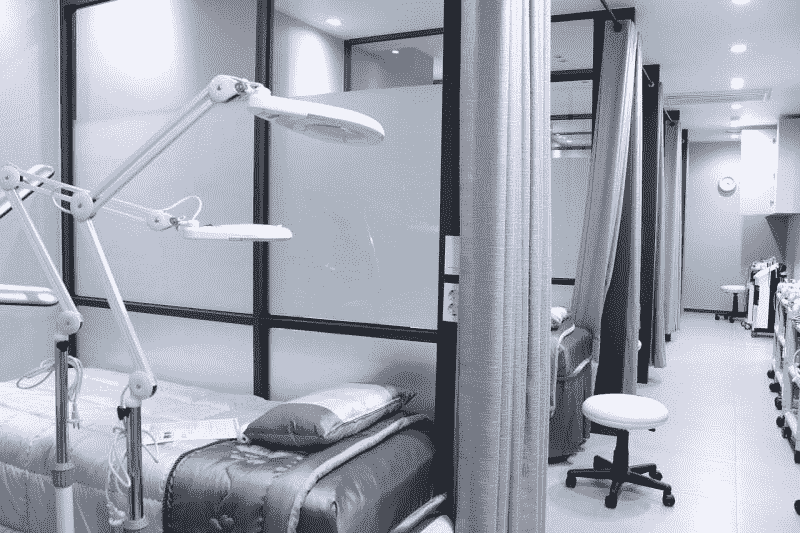
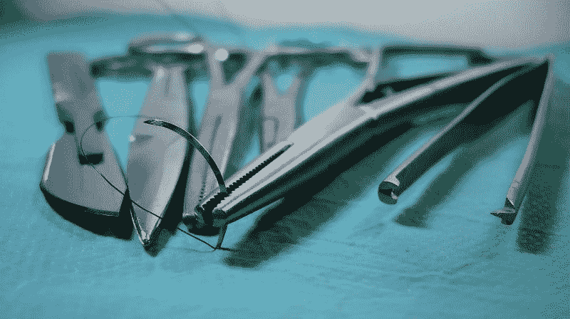
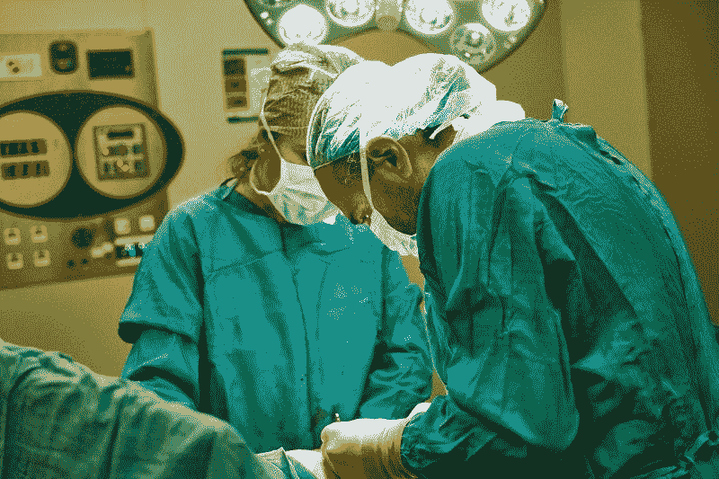
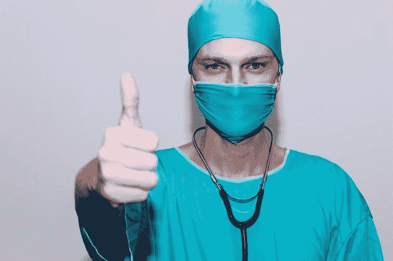

# 德美科技(DMTK)赚钱了吗？—市场疯人院

> 原文：<https://medium.datadriveninvestor.com/is-dermtech-dmtk-making-money-market-mad-house-a57c5050d77?source=collection_archive---------29----------------------->

德美科技(DermTech)已经成为增长最快的股票之一。例如，DermTech 的股价从 2020 年 12 月 11 日的 11.49 美元上涨到 2020 年 12 月 28 日的 25.75 美元。

奇怪的是，DermTech 成功的基础是一种悲剧性的疾病，黑色素瘤或皮肤癌。股价爆炸是因为**derm tech Inc .(NASDAQ:DMTK)**在 2020 年 12 月 21 日推出了一款可以诊断黑色素瘤的[贴纸。](https://seekingalpha.com/article/4395740-dermtech-stickers-to-diagnose-cancer)

详细来说， [DermTech 的智能贴纸从皮肤上的斑点中提取皮肤细胞](https://dermtech.com/)。医生将带有细胞的智能标签发送到 DermTech 的基因实验室。

# 皮肤科技公司如何利用皮肤癌赚钱

在基因实验室，DermTech 的专利程序测试样本中与黑色素瘤相关的两个基因。如果基因实验室检测到这些基因，医生可以进行其他测试。

希望 DermTech 的智能贴纸可以减少外科活检的需要。在活组织检查中，外科医生切下一块皮肤进行测试。理想情况下，DermTech PLA 贴纸速度更快，侵入性更小，痛苦更少，而且更便宜。

皮肤癌可能是一个有利可图的行业。DermTech 估计，患者和保险公司每年在 350 万到 400 万例癌症手术活检上花费 30 亿美元。

DermTech 声称其黑素瘤[测试比传统活检看起来近 1 万倍。此外，DermTech 的测试检查了一整颗痣的信息，因此与传统的活检相比，它不太可能遗漏黑色素瘤。](https://dermtech.com/)

# 皮肤技术如何拯救生命

美国癌症协会声称，DermTech 的测试可以挽救生命，因为黑色素瘤占皮肤癌病例的 1%,但却是大多数皮肤死亡的原因。

美国癌症协会估计，2020 年，医生将诊断出大约 100，350 名美国人患有黑色素瘤。令人恐惧的是，2020 年将有大约 6850 名美国人死于黑色素瘤。

随着人口老龄化，黑色素瘤病例的数量可能会增加。美国癌症协会估计，黑色素瘤诊断的平均年龄是 65 岁。

# 德美科技不断增长的市场

人口研究局估计，65 岁以上的美国人数量可能从 2018 年的 5200 万增长到 2060 年的 9500 万。

2018 年，约有 16%的美国人 65 岁，这一比例将在 2060 年上升至 23%。此外，美国癌症协会报道，黑色素瘤是年轻人，尤其是年轻女性最常见的癌症之一。

因此，我认为皮肤技术的测试市场将会越来越大。随着年龄的增长，人们在户外的时间越来越长，穿的衣服越来越少，更多的人需要进行皮肤癌检测。DermTech 可以提供测试。

黑色素瘤检测可以挽救生命，因为局部黑色素瘤的癌症存活率更高。局部意味着癌症没有扩散到它开始的皮肤之外。如果他们将黑色素瘤定位，医生就更容易切除或治疗这种疾病。

黑色素瘤检测可以挽救生命，因为局部黑色素瘤的癌症存活率更高。局部意味着癌症没有扩散到它开始的皮肤之外。如果他们将黑色素瘤定位，医生就更容易切除或治疗这种疾病。

 [## 收盘，但没有雪茄-股票市场目标在停滞的 COVID 救济中创新高|数据驱动…

### 专家聊天程序:一个协作市场，在这里人们可以和能够解决他们问题的专家聊天。是……

www.datadriveninvestor.com](https://www.datadriveninvestor.com/2020/08/18/close-but-no-cigar-stock-market-targets-record-highs-amidst-stalled-covid-relief/) 

# 真皮科技赚钱吗？

德美科技(DermTech)亏损，盈利潜力不足。2020 年 9 月 30 日，DermTech 报告季度运营亏损-940 万美元。

2020 年，德美科技的季度运营亏损从 2019 年 12 月 31 日的-512 万美元增长。同样，2020 年 9 月 30 日，DermTech 报告的季度毛利为-250，000 美元。季度毛利从 2020 年 6 月 30 日的-600，000 美元上升到 2020 年 3 月 31 日的 350，000 美元。

此外，DermTech 的收入很少。2020 年 9 月 30 日，DermTech 报告季度收入为 136 万美元。季度收入从 2019 年 12 月 31 日的 159 万美元下降。

同样，德美科技报告 2020 年 9 月 30 日季度现金流为负 816 万美元。季度经营现金流从 2020 年 12 月 31 日的-608 万美元。

# 为什么投资者会购买真皮科技

因此，2020 年 9 月 30 日，DermTech 报告的季度末现金流为-4648 万美元。类似地，德美科技报告 2020 年 3 月 31 日的季度融资现金流为 60.12 美元。然而，2020 年 9 月 30 日的 104 万美元融资现金流表明德玛科技偿还了债务。

DermTech 的价值很小。截至 2020 年 9 月 30 日，现金和短期投资为 5 153 万美元，总资产为 5 702 万美元。这些小数字会让很多人疑惑，投资者为什么要买**德美达(DMTK)** ？

我认为令人难以置信的收入增长水平吸引了人们来到真皮科技公司。例如，Stockrow 估计 [DermTech 的收入在截至 2020 年 9 月 30 日的季度增长了 140.06%](https://stockrow.com/DMTK/financials/income/quarterly) 。

同样，截至 2020 年 6 月 30 日的季度，德美科技的收入增长了 37.46%，截至 2020 年 3 月 31 日的季度增长了 161.24%。德美科技在截至 2019 年 12 月 31 日的季度中，2020 年的收入增长率为 147.89%。

在我看来，市场先生在 2020 年 12 月 28 日高估了德美科技 25.75 美元的价值。我认为投资者需要避开 DermTech，尽管它在增长，因为这家公司不赚钱，几乎没有价值。我的建议是，在管理层证明它能赚钱之前，不要买 DermTech。

*原载于 2020 年 12 月 28 日***。**

## *访问专家视图— [订阅 DDI 英特尔](https://datadriveninvestor.com/ddi-intel)*