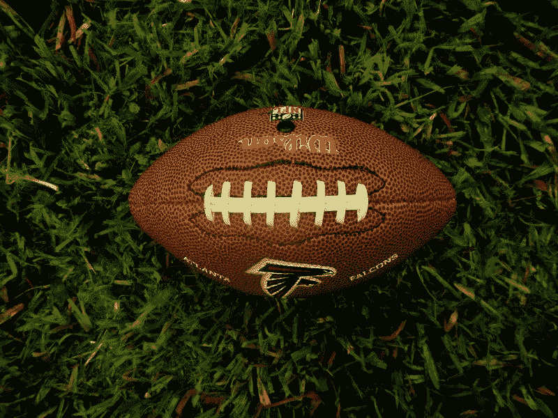
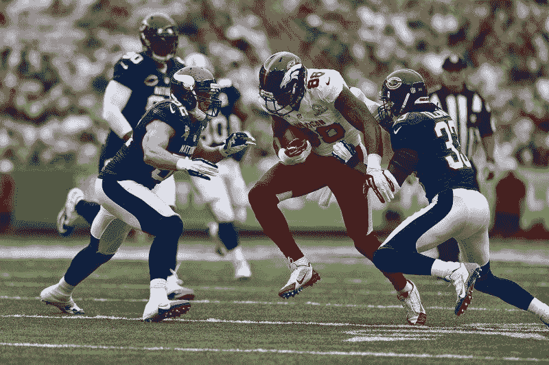
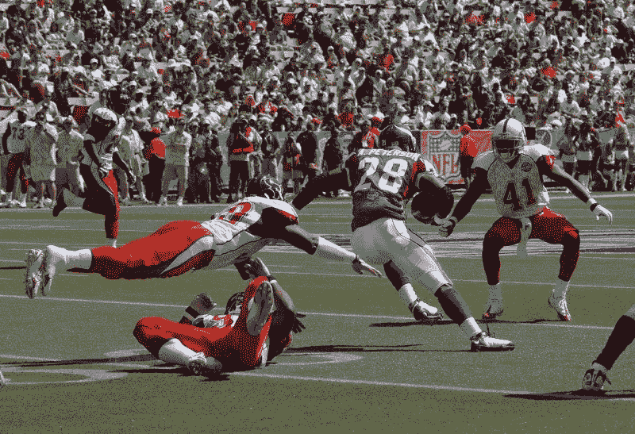
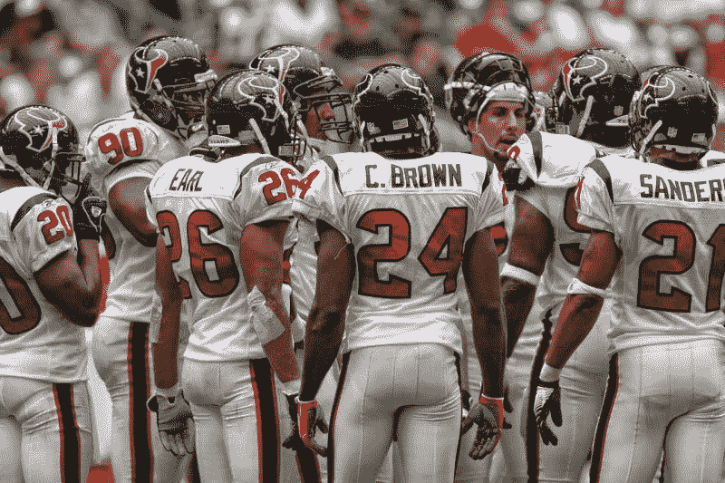
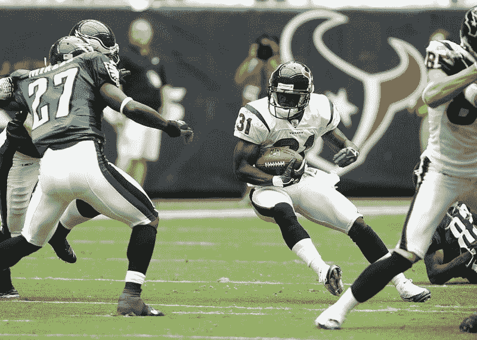

# DraftKings 赚钱了吗？—市场疯人院

> 原文：<https://medium.datadriveninvestor.com/is-draftkings-making-money-market-mad-house-e40ce485d062?source=collection_archive---------4----------------------->

由于美国 18 个州和哥伦比亚特区已经将体育博彩合法化，人们对体育博彩的兴趣越来越大。

因此，**draft kings Inc .(NASDAQ:DKNG)**的股票从 2020 年 1 月 2 日的 10.68 美元上涨到 2020 年 9 月 15 日的 49.44 美元和 2020 年 9 月 17 日的 53.11 美元。市场先生打赌美国会接受体育博彩合法化。

然而， *Axios* 报道称，美国人口最多的三个州抵制赌博。值得注意的是，体育博彩合法化在美国人口最多的三个州中的两个州失败了:加利福尼亚和佛罗里达。美国最大的州加利福尼亚州 2019 年有 3951 万居民。

此外，佛罗里达州，全国第三大州；2019 年有 2147.8 万居民。这些状态之一；德克萨斯州是美国人口第二多的州，2019 年有 2899.6 万居民。因此，我估计有 8998.4 万居民的三个州反对体育博彩立法。

# 哪些州将体育博彩合法化？

然而，许多州可能很快会将体育博彩合法化。Axios 称，具体来说，四个州(北卡罗来纳州、田纳西州、弗吉尼亚州和华盛顿州)的立法机构已经通过了体育博彩合法化的法案。此外，还有 9 个州(夏威夷、堪萨斯、路易斯安那、马里兰、马萨诸塞州、内布拉斯加州、俄亥俄州、南达科他州和佛蒙特州)的体育博彩合法化。

体育博彩合法化的 18 个州是:阿肯色州、科罗拉多州、特拉华州、伊利诺伊州、印第安纳州、爱荷华州、密歇根州、密西西比州、蒙大拿州、内华达州、新罕布什尔州、新泽西州、纽约州、新墨西哥州、俄勒冈州、宾夕法尼亚州、罗德岛州和西弗吉尼亚州。然而，体育博彩合法化的努力在 12 个州失败了:阿拉巴马州、阿拉斯加州、亚利桑那州、加利福尼亚州、康涅狄格州、佛罗里达州、佐治亚州、肯塔基州、缅因州、明尼苏达州、密苏里州和怀俄明州。

最后， *Axios* 声称已经有七个州进行了体育博彩立法；爱达荷州、北达科他州、俄克拉荷马州、南卡罗来纳州、德克萨斯州、犹他州和威斯康星州。这些状态之一；德克萨斯州是美国人口第二多的州，2019 年有 2899.6 万居民。因此，我估计有 8998.4 万居民的州会抵制体育博彩立法。

# 有多少美国人会赌体育

然而，美国人对体育博彩的兴趣很高。例如，美国国家橄榄球联盟(NFL)估计[3810 万(15%)](https://marketmadhouse.com/is-draftkings-making-money/Idaho,%20North%20Dakota,%20Oklahoma,%20South%20Carolina,%20Texas,%20Utah,%20Wisconsin) 美国成年人表示他们将在 2019 年 9 月押注 NFL 比赛。

有趣的是，24%的美国人表示，如果赌博合法且方便，他们可以在 NFL 上下注。此外，39%自称“狂热 NFL 粉丝”的人表示，他们计划在 2019-2020 NFL 赛季下注。

与此同时，NFL 估计，在赌场体育博彩上下注的美国人数量从 2018 年的 570 万增加到 690 万。最后，美国博彩协会声称，这个名字可以从广泛的合法体育博彩中每年赚取 23 亿美元。

 [## 在新冠肺炎时代:体育领域的巨大转变|数据驱动的投资者

### 昨晚在朋友的办公空间看了 UFC 战夜 170。在一个充满活力的氛围中…

www.datadriveninvestor.com](https://www.datadriveninvestor.com/2020/03/27/in-the-age-of-covid-19-a-seismic-shift-in-sports/) 

# NFL 需要合法化的体育博彩

NFL 有强烈的动机接受体育博彩，因为 *Morning Consult* 估计 75%的人更有可能观看他们下注的比赛。因此，我认为体育博彩可以帮助 NFL 的收视率下降。

例如，据 Deadline 报道，2019 年至 2020 年，NFL *周日夜橄榄球*赛季首播的收视率下降了 [23%。详细来说，2220 万人观看了 2019 年周日晚上足球赛季揭幕战，但一年后只有 1481 万人收看。](https://deadline.com/2020/09/rams-nfl-sunday-night-football-ratings-down-cowboys-nbc-60-minutes-1234576202/)

因此，NFL 需要采取行动扭转其收视率下降的趋势，否则将面临没有广告商或电视合同的未来。然而，NFL 在 2020 年 9 月 10 日与冠状病毒延迟的 NBA 和 NHL 季后赛竞争。

# 体育书籍能拯救体育吗？

因此，美国的体育联盟有强大的动力支持和推动赌博合法化。此外，团队和联盟可以与体育书籍和更好的合作伙伴。

例如，一份新闻稿透露，澳大利亚体育图书 PointsBet 将赞助科罗拉多大学博尔德分校的体育活动。详细来说，代理[IMG](https://cubuffs.com/news/2020/9/8/general-cu-pointsbet-announce-corporate-partnership.aspx)学院；该公司代表科罗拉多大学与 PointsBet 签署了一份为期五年的赞助协议。

类似的交易可以弥补职业球队电视收入的损失。此外，与联盟和球队的独家交易可能是体育博彩公司的利润中心；如 **DraftKings (DKNG)** 及其竞争对手。

# 体彩能赚钱吗？

[据*合法体育博彩*称，2019 年，美国合法体育博彩](https://marketmadhouse.com/is-draftkings-making-money/#:~:text=Sportsbooks%20across%20the%20country%20have,%24750,000,0000%20in%20losing%20bets.&text=The%20total%20money%20wagered%20at,revenue%20from%20bettors'%20losing%20wagers.)的赌注超过 110 亿美元。此外，合法的美国体育书籍在 2019 年创造了 7.5 亿美元的收入。

此外， *Legal Sports Bettin* g 估计，集体每月体育博彩首次超过每月 10 亿美元，2019 年接近 20 亿美元。最后，*合法体育博彩*估计 2020 年美国合法体育博彩将首次超过 200 亿美元。

因此，在美国，合法的体育博彩有着巨大的市场。DraftKings(纳斯达克股票代码:DKNG) 凭借其梦幻般的运动体验，在开发该市场方面处于有利地位。但是 DraftKings 赚钱了吗？

# DraftKings 赚钱吗？

目前， **DraftKings (DKNG)** 亏损。例如，DraftKings 报告称，2020 年 6 月 30 日的季度运营亏损为-1.6044 亿美元。该经营亏损从 2020 年 3 月 31 日的-72，000 美元和 2019 年 9 月 30 日的-25，000 美元增长。

令人难以置信的是，DraftKings 的运营亏损超过了 2020 年 6 月 30 日报告的 7093 万美元的季度收入。然而，DraftKings 在同一天报告了 2360 万美元的季度毛利。

此外，DraftKings 的业务；体育博彩和梦幻体育太新了，Stockrow 没有提供它的收入增长估计。此外，DraftKings 报告 2020 年 6 月 30 日季度净亏损-2.306 亿美元。

# DraftKings 有多少现金？

此外，DraftKings 报告 2020 年 9 月 30 日运营现金流为负 1.3423 亿美元。DraftKings 本可以借 15.01 亿美元。

具体来说，DraftKings 在 9 月 30 日报告了 15.01 亿美元的季度融资现金流。融资现金流显示了一个公司从融资中产生了多少钱。

Draftkings 报告 9 月 30 日的期末现金流为 12.44 亿美元。此外，截至 2020 年 6 月 30 日，Draftkings 拥有 13.76 亿美元的现金和短期投资。因此，Draftkings 有钱利用新的合法化博彩市场。最后，DraftKings 报告 2020 年 6 月 30 日的总资产为 25.16 亿美元。

我的结论是，市场先生在 2020 年 9 月 15 日把 DraftKings 公司的股价高估到了 48.21 美元，因为该公司没有盈利。目前，我认为 DraftKings 只是一个利用新的合法化体育博彩市场的商业计划。

因此，我建议投资者远离选秀大会，直到体育博彩在美国广泛合法化。在那之前，Draftkings 只是一个商业计划。

*原载于 2020 年 9 月 17 日*[*【https://marketmadhouse.com】*](https://marketmadhouse.com/is-draftkings-making-money/)*。*

**访问专家视图—** [**订阅 DDI 英特尔**](https://datadriveninvestor.com/ddi-intel)