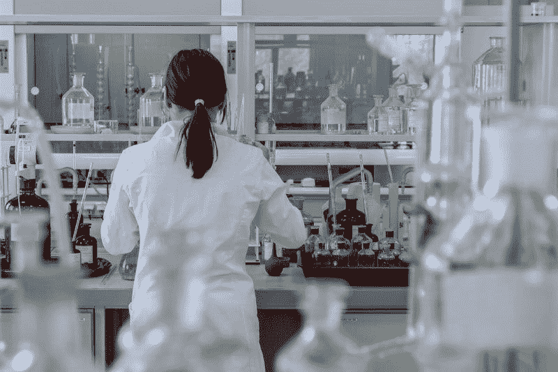
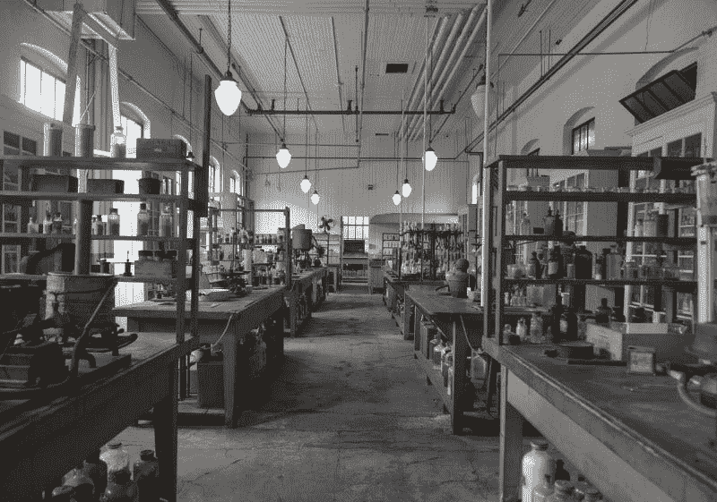
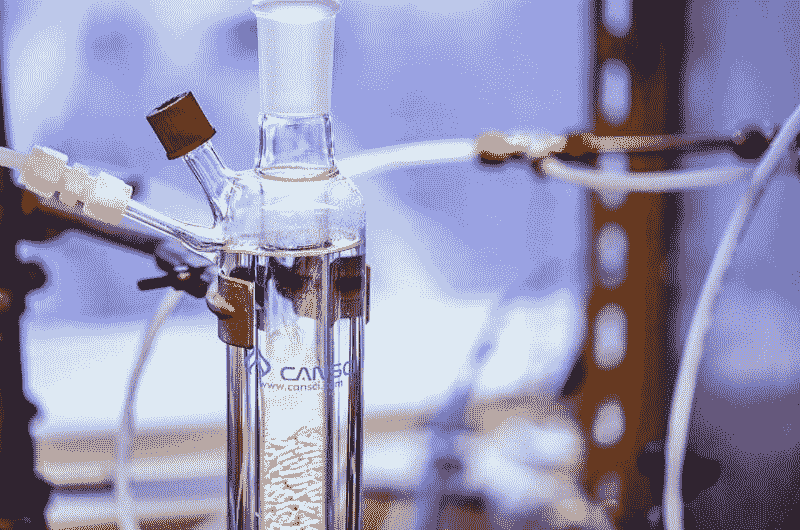
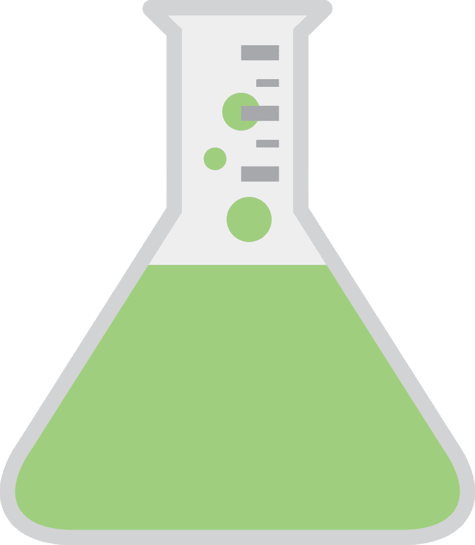
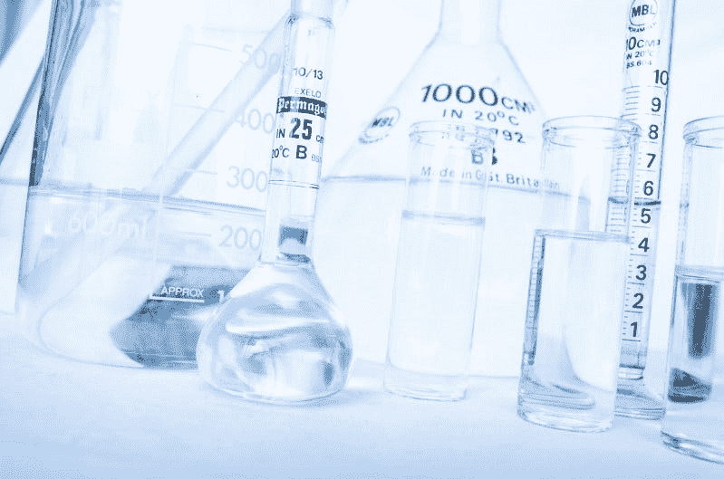
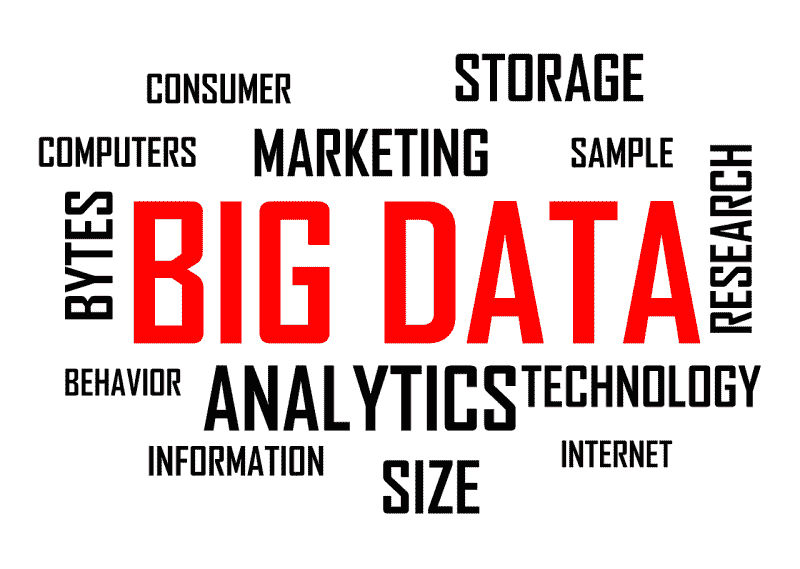

# 杜邦靠化工赚钱吗？—市场疯人院

> 原文：<https://medium.datadriveninvestor.com/is-dupont-making-money-from-chemicals-market-mad-house-a609bb1f60dc?source=collection_archive---------8----------------------->

杜邦公司是美国历史最悠久的公司之一。

他们于 1802 年成立了杜邦的前身[杜邦](https://en.wikipedia.org/wiki/DuPont)。最初的 E. I. du Pont de Nemours 公司是以火药制造商起家的。在 20 世纪，杜邦公司发明了氟利昂、尼龙、特氟隆、诺梅克斯、凯夫拉尔和氯丁橡胶等著名的材料和化学品。

然而，今天的杜邦是 2017 年杜邦、陶氏和科特瓦合并以及随后分拆的结果。奇怪的是，杜邦最近又剥离了陶氏和科特瓦。

 [## 数据驱动投资的兴起|数据驱动投资者

### 当 JCPenney 报告其 2015 年 2Q 的财务结果时，市场感到非常震惊。美国零售巨头…

www.datadriveninvestor.com](https://www.datadriveninvestor.com/2019/02/28/the-rise-of-data-driven-investing/) 

# 杜邦赚钱了吗？

今天的杜邦在赚钱，但问题严重。令人难以置信的是，斯托克罗[估计](https://stockrow.com/DD/financials/income/quarterly)在截至 2019 年 12 月 31 日的季度，杜邦的收入缩水了 90.71%。

相比之下，杜邦在 2019 年新年前夕报告了 17.86 亿美元的季度毛利。该毛利低于 2019 年 9 月 30 日的 18.95 亿美元。

此外，杜邦公司报告 2019 年 12 月 31 日的营业收入为 4.12 亿美元，共同净收入为 1.76 亿美元。因此，尽管收入缩水，杜邦公司仍在赚钱。

没有上一季度的运营现金流。然而，杜邦公司报告的营业现金流为 8.82 亿美元，9 月 30 日的期末现金流为 4.56 亿美元。

因此，截至 2019 年 12 月 31 日，DuPoint 拥有 15.4 亿美元的现金和短期投资。这一数字低于 2019 年 9 月 30 日的 21.13 亿美元。

# 杜邦是价值投资吗？

鉴于这些数字，我认为杜邦是一项价值投资。杜邦是一只价值股，因为它价格便宜，能产生现金。2020 年 2 月 6 日，市场先生支付了 53.81 美元购买杜邦股票。

因此，杜邦很便宜，现金给了它一个安全边际。此外，杜邦公司支付股息。

杜邦公司于 2019 年 11 月 27 日支付了 30₵季度股息。此外，杜邦公司于 2019 年 7 月 27 日支付了 1.141 美元的高额股息。

总体而言，2020 年 2 月 6 日，Dividend.com 给予杜邦公司的股息率为 2.22%，年化派息为 1.20 美元，派息率为 30.5%。在这种情况下，我认为杜邦是一个很好的股息股。

# 基础产业是价值投资吗？

杜邦等基础行业股票提出了一个有趣的问题。这个问题就是基础产业在当今高科技世界中的价值投资。

毕竟，杜邦赚的钱远远少于科技巨头，如 Alphabet(纳斯达克股票代码:GOOG) 。 **Alphabet(纳斯达克代码:GOOGL)** 在 2019 年 9 月 30 日报告了令人难以置信的 1211.77 亿美元的现金和短期投资。

Alphabet 和杜邦很相似，因为它们都为一个经济体提供原材料。杜邦为 20 世纪的经济提供了原材料；即化学品和塑料。Alphabet 为今天的经济提供了原材料:数据。

# 数据比化学物质更有价值

Alphabet 的现金显示，数据远比化学品更有利可图。Alphabet 赚更多钱的一个原因是它的基础设施要便宜得多。杜邦公司需要购买原材料来制造化学品或塑料，并将它们运送给客户。

Alphabet 无需支付任何费用来制作数据，并获得其大部分基础设施；免费的互联网。Alphabet 拥有大量数据中心形式的基础设施。然而，Alphabet 从其他人建立的网站、内容和数据中心获取大部分数据。

例如，谷歌从网站和广告中收集数据。与此同时，YouTube 从其他人创作并发布的视频中获取数据，而 Alphabet 无需支付任何费用。

# 大数据是价值投资吗？

所以，或许 Alphabet、**、微软(纳斯达克:MSFT)** 、**、脸书(纳斯达克:FB)** 、**亚马逊(纳斯达克:AMZN)** 这样的数据收割机才是今天真正的价值投资。

澄清一下，这些公司从大数据中获利。例如，美国消费者新闻与商业频道[报告](https://www.cnbc.com/2020/01/30/aws-earnings-q4-2019.html)称，亚马逊网络服务在 2019 年第四季度从网络托管中创造了 99.5 亿美元的收入。与此同时，脸书从社交媒体收集数据，微软从 GitHub 等公用事业公司收集数据。

例如，亚马逊在 2019 年 9 月 30 日拥有 434.01 亿美元的现金和短期投资。此外，截至 2019 年 12 月 31 日，脸书拥有 588.85 亿美元的现金和短期投资。最后，微软在 2019 年新年前夕有 1342.53 亿美元的现金和短期投资。

我认为大数据是一种价值投资，因为它现金充裕。这为大数据提供了传统行业所缺乏的巨大安全边际。在这种情况下，我在想，传统行业是不是因为缺少现金，所以还能生存下去。

# 工业能生存吗？

一个相关的问题是，投资者可能会抛售工业股票，因为它们不如大数据安全。因此，工业可能很难吸引投资者，这给政府带来了问题。

工业创造；比大数据更多的工作。从长远来看，我认为这种情况会迫使美国政府效仿中国的榜样。在中国，政府资助工业发展。

解释一下，工业缺乏现金可能会迫使联邦政府贷款给工业。此外，经济形势可能会迫使山姆大叔对工业进行直接现金投资。

我认为这两项政策都不会受欢迎；在美国，这在政治上可能是不可能的。一个更激进的想法是对大数据征税，以资助工业发展。这个想法可能会受到工薪阶层选民的欢迎，但对自由主义者来说却是一个诅咒。

归根结底，我预测传统工业公司如**杜邦(NYSE: DD)** 的衰落和大数据的崛起将导致一场政治危机。相反，我认为杜邦是价值投资，因为它便宜，股息高，能产生现金。

【https://marketmadhouse.com】原载于 2020 年 2 月 6 日**。**