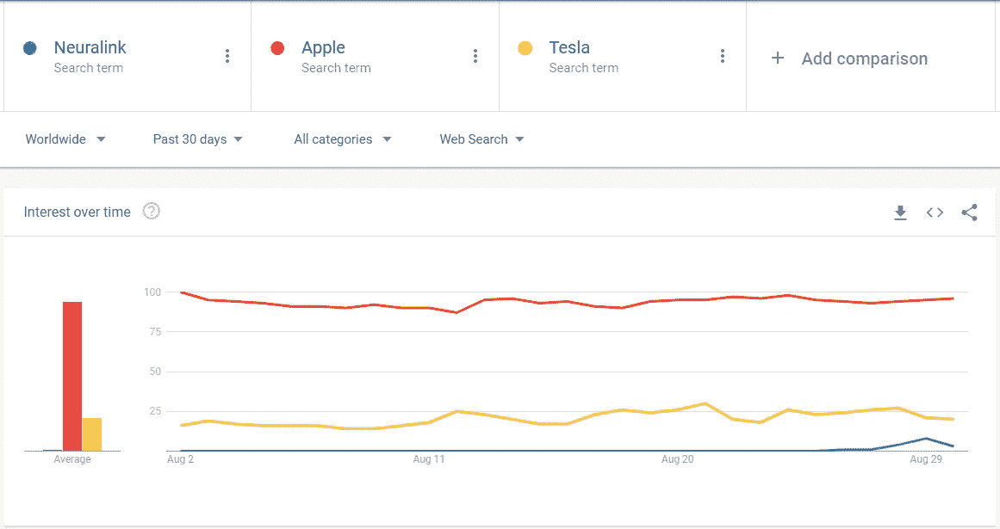

# 埃隆·马斯克的 Neuralink 是“潘多拉生物圈”的先驱吗？—不尽然！

> 原文：<https://medium.datadriveninvestor.com/is-elon-musks-neuralink-the-harbinger-of-a-pandoran-biosphere-not-really-1af1ca4acb08?source=collection_archive---------16----------------------->

## 技术

## 一条蛔虫有 300 个神经元，神经元之间有 7000 个连接。我们仍然不明白它的大脑是如何工作的。我们的大脑有 860 亿个神经元和 1000 亿个连接。Neuralink 的设备有 1024 个电极。这概括了我们的立场。

Photo by [h heyerlein](https://unsplash.com/@heyerlein?utm_source=medium&utm_medium=referral) on [Unsplash](https://unsplash.com?utm_source=medium&utm_medium=referral)

euralink 是一家神经技术公司，由埃隆·马斯克创立，试图制造一台可以将细电极穿入大脑的缝纫机。几天前，它展示了它的第一次演示，几乎没有引起任何轰动(查看下面的图表)。理应如此。

Google trends plot for the search term ‘Neuralink’ versus Tesla and Apple, for the last 30 days.

让我们回顾一下事态发展。这个演示基本上表明我们可以无线传输猪的大脑信号，它的鼻子和运动信号。它还显示了信号和肢体运动之间的相关性，据称是准确的。Neuralink 还展示了它的“缝纫机”,它能够进行外科手术，目前正在协助外科医生，但预计未来将完全自主。

 [## 为市场注入资金——FAANG 继续依靠永久牛市能源|数据驱动的投资者

### FAANG 股票在 FDA 对 COVID 等离子治疗紧急放行的消息下拉高了市场。经过一周的…

www.datadriveninvestor.com](https://www.datadriveninvestor.com/2020/08/24/injection-for-the-market-faang-continues-to-ride-that-perma-bull-energy/) 

此外，Elon Musk 回答了关于这些产品应用的问题。其中一个问题是，我们能否在未来保存和回放记忆。埃隆·马斯克回答说“*是的*”。

让我们给一些想象的空间，看看各种可能性。通过能够无线连接大脑，我们从根本上改变了我们与世界互动的方式，包括机器、人类和动物。莱克斯·弗里德曼在他的 Youtube 播客上列出了一系列可能性。

想象一下，100 年后，一个少年在学习和芒努斯·卡尔森下一盘棋，他活着的时候，通过和他的大脑进行交互——*数字化*使用像 Neuralink 这样的技术。几个小时后，和卡尔森和卡鲁阿纳队比赛？国际象棋将成为一项团队运动，也许，我们可以再次开始击败人工智能。

我们可以通过互联网连接，直接从一个大脑到另一个大脑交换概念。类似于詹姆斯·卡梅隆在他的电影《阿凡达》中描绘的潘多拉星球。此外，学习一项技能相当于下载它，就像电影《黑客帝国》中尼奥在几秒钟内学会驾驶直升机一样。演讲将是多余的和穴居人。随着克隆的成功，我们基本上可以建立成功科学家的大脑农场，创造力将被产品化。所有关于黑镜系列或者科幻小说的奇思妙想。

现在让我们检查一下现实。让我们从我们对大脑的了解程度开始。蛔虫微小的大脑中有 300 个神经元和 7000 个神经元之间的连接。我们仍然不明白它是如何工作的。我们的大脑有 860 亿个神经元和 1000 亿个连接。Neuralink 的设备有 1024 个电极。这很好地概括了我们在实现这些美好梦想的过程中所处的位置。

核磁共振成像仪的广泛使用花了将近 40 年的时间。无数的临床试验，事故，死亡和数百万美元后，我们有了一台工作的机器。我们仍然需要几十年的时间来开发疫苗和药物，并且在对抗艾滋病毒和癌症方面仍然不成功。1918 年的西班牙疫情流感花了 2-3 年才平息，而在 100 年后的 2020 年，我们遏制疫情病毒的速度有多快？

Neuralink 是一个简单的实验，是朝着许多神经科学家已经研究了几十年的牵强目标迈出的一小步。即使是帮助截瘫患者过正常生活的第一个应用，也需要数年的研究和数十次的失败。更重要的是，Neuralink 的演示并不新鲜。请看神经科学家格雷格·盖奇在 Ted 演讲中的演讲:

一个完全非侵入性和安全的程序，结果更令人鼓舞。如果 Neuralink 正在构建一些新颖和开创性的东西，如果他们再等几年，展示一个更好的演示，他们会对自己有更多的好处。它会创造更多的兴奋，并为类似的人工智能创业公司提供更多资金。

政治家、商人、记者和作家是社会的催化剂。科学家、技术专家和工程师是真正的建筑材料。埃隆马斯克(Elon Musk)似乎已经转向了前一类。对于这笔分期付款，他相当失望。

## 阿西莫夫是一位科幻作家。很棒的一个！埃隆·马斯克，你应该是一名技术专家。好心，坚守岗位。让小说有它自己的空间。

**进入专家视角—** [**订阅 DDI 英特尔**](https://datadriveninvestor.com/ddi-intel)