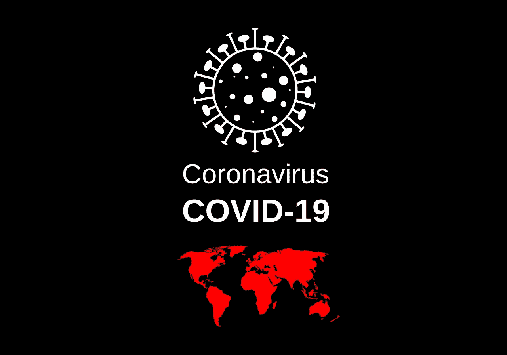

# 伊利礼来公司赚钱了吗？—市场疯人院

> 原文：<https://medium.datadriveninvestor.com/is-ely-lilly-and-co-making-money-market-mad-house-ebbc263b1678?source=collection_archive---------16----------------------->

拥有 144 年历史的美国制药公司**伊利礼来公司(纽约证券交易所代码:LLY)** 因一项实验性冠状病毒治疗而引起关注。

伊利礼来公司正在养老院进行一项针对新冠肺炎的实验性抗体药物的 3 期试验。雅虎！新闻报道[伊利礼来公司正在冠状病毒感染的护理院测试 LY-CoV555 i](https://news.yahoo.com/eli-lilly-testing-whether-novel-102543273.html) n 志愿者，这些护理院是我们英国朋友的护理院。

伊利礼来声称，它可能会在 2020 年底前寻求政府对 LY-CoV555 的批准。伊利礼来公司的研究人员通过克隆从冠状病毒感染中康复的人的抗体创造了 LY-CoV555。希望 LY-CoV555 将使人们对新冠肺炎免疫。

美国消费者新闻与商业频道报道，美国国家卫生研究院(NIH)正在[进行两项 LY-CoV555](https://www.cnbc.com/2020/08/04/coronavirus-us-begins-2-trials-testing-eli-lillys-coronavirus-antibody-drug.html) 的试验。一项试验将在有轻度至中度冠状病毒症状的人身上测试 LY-CoV555。另一个将测试因冠状病毒住院的人。三期试验的目标是观察 LY-CoV555 患者是否可以回家康复。

# 伊利礼来能靠冠状病毒赚钱吗？

冠状病毒治疗是一个成长中的行业。2020 年 8 月 5 日，Worldometers 记录了美国 40，964 例新冠状病毒病例和 1，057 例新冠肺炎死亡病例。

伊利礼来声称，它可能会在 2020 年底前寻求政府对 LY-CoV555 的批准。伊利礼来公司的研究人员通过克隆从冠状病毒感染中康复的人的抗体创造了 LY-CoV555。希望 LY-CoV555 将使人们对新冠肺炎免疫。

因此，在 2020 年 8 月 3 日，LY-CoV555 有 65，750 个潜在用户。因此，对 LY-CoV555 或类似产品的需求越来越大。

此外，政府将支付大多数冠状病毒治疗费用。因此，伊利礼来将获得 LY-CoV555 的报酬。例如，美国保守的川普政府将[支付未投保的新冠肺炎患者的治疗费用](https://www.washingtonpost.com/health/trump-administration-says-it-will-pay-hospitals-for-treating-uninsured-covid-19-patients/2020/04/22/3df5fbb4-84b5-11ea-878a-86477a724bdb_story.html)，*《华盛顿邮报》称*。

 [## 冠状病毒疫情正在重塑区块链吗？该技术如何帮助应对该病毒|数据…

### 当前的冠状病毒疫情已经严重影响了区块链和加密货币行业的方方面面…

www.datadriveninvestor.com](https://www.datadriveninvestor.com/2020/07/15/is-the-coronavirus-pandemic-reshaping-blockchain-and-how-can-the-tech-help-tackle-the-virus/) 

# 伊利礼来赚钱了吗？

伊利礼来(纽约证券交易所代码:lly)正在赚钱。伊利百合报告称，截至 2020 年 6 月 30 日，季度毛利为 42.77 亿美元，收入为 54.99 亿美元。

然而，这些数字比 2020 年 3 月 31 日的季度收入 58.6 亿美元和季度毛利 46.45 亿美元有所下降。此外，伊利礼来的季度营业收入从 2020 年 3 月 31 日的 15.9 亿美元降至 2020 年 6 月 30 日的 19.7 亿美元。最后，伊利礼来的季度共同净收入从 2020 年 3 月 31 日的 14.57 亿美元降至 2020 年 6 月 30 日的 14.12 亿美元。

相比之下，伊利礼来产生了更多的现金。例如，伊利礼来的季度运营现金流从 2020 年 3 月 31 日的 3.82 亿美元增长至 2020 年 6 月 30 日的 24.95 亿美元。然而，伊利礼来的季度期末现金流从 2020 年 3 月 31 日的 16.99 亿美元降至 2020 年 6 月 30 日的 6.661 亿美元。

我认为期末现金流下降是因为伊利礼来的季度融资现金流从 2020 年 3 月 31 日的 1.067 亿美元下降到 2020 年 6 月 30 日的-167.3 万美元。因此，礼来公司用现金来偿还债务，这是负责任的。

# 伊利礼来有什么价值？

**礼来公司(纽约证券交易所:LLY)** 在 2020 年 6 月 30 日的现金和短期投资价值为 23.88 亿美元，总资产为 419.67 亿美元。

重要的是，LY-CoV555 显示了伊利礼来令人印象深刻的研发能力。为了解释这一点，我认为礼来公司可以开发更多需求不断增长的冠状病毒药物。

除了 LY-CoV555 之外，[伊利礼来公司还是胰岛素](https://www.lilly.com/)的大型制造商，胰岛素是治疗糖尿病的常用药物。在美国，糖尿病是一个日益严重的问题。

例如，美国糖尿病协会(ADA)估计 2018 年有 3420 万美国人(T7)或 10.5%的美国人口患有糖尿病。此外，美国糖尿病协会估计每年有 150 万美国人接受糖尿病诊断。

此外，美国糖尿病协会估计，2017 年美国在糖尿病治疗上花费了 2170 亿美元。因此，糖尿病是一个不断增长的市场，礼来公司为其提供治疗方法。

# 伊利礼来是好股票吗？

**伊利礼来(纽约证券交易所代码:LLY)** 是一只成长型股票。2020 年 1 月 2 日，市场先生支付了 132.12 美元购买礼来的股票。2020 年 8 月 5 日，该股票价值增至 154.34 美元。

因此，伊利礼来的股价随着冠状病毒疫情而上涨。因此，礼来可能是我们这个时代的成长股。

伊利礼来将于 2020 年 8 月 13 日支付 74₵季度股息。该股息于 2019 年 11 月 14 日来自 64.5₵。因此，去年礼来公司的股息增长了 9.5₵。

总体而言，礼来公司提供了 2.96 美元的年度股息和 1.94%的年化股息。此外，[Dividend.com 在 2020 年 8 月 5 日向](https://marketmadhouse.com/is-ely-lilly-and-co-making-money/#tm=3-ticker-best-div-capture&r=ES::DividendStock::Stock%23LLY--NYSE&f_28=true&only=meta,data,thead) LLY 支付 41.66%的股息。

如果你在寻找与我们所处的糟糕时代相适应的成长股和股息股，礼来公司是一个有趣的选择。总之，我认为一家治疗冠状病毒的公司可以赚钱。然而，礼来公司的冠状病毒疗法 LY-CoV555 未经证实。

*原载于 2020 年 8 月 5 日*[*【https://marketmadhouse.com】*](https://marketmadhouse.com/is-ely-lilly-and-co-making-money/)*。*

**访问专家视图—** [**订阅 DDI 英特尔**](https://datadriveninvestor.com/ddi-intel)