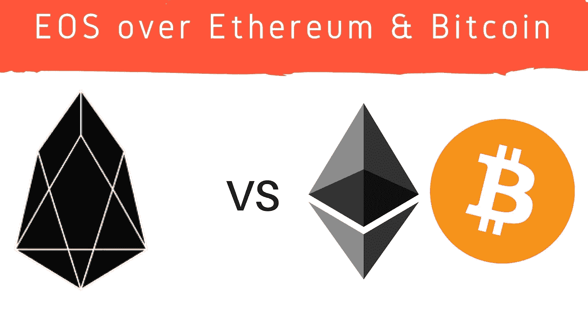

# EOS 是继 ETH 和 BTC 之后的下一个大密码吗？(带音频)

> 原文：<https://medium.datadriveninvestor.com/is-eos-next-big-crypto-after-eth-and-btc-56b73b60c3af?source=collection_archive---------15----------------------->

**EOS 历史:**

*   “阻止。one”位于开曼群岛，是 EOS 背后的关键团队。
*   自 2014 年以来，首席执行官布兰登·布鲁默(Brendon Blumer)一直与区块链交往。他以前活跃于 MMORPGs 和房地产货币交易所的交易业务。
*   首席技术官是丹·拉里默。他是 DAOs 的创始人，DAOs 也被称为授权的利害关系证明和自治的独立组织。他是 BitShares 和 Steem 的幕后黑手。

**EOS 简介:**

*   最新的 CoinMarketCap 排名是第 13 位。
*   EOS 是一个允许开发者创建分散应用的框架。
*   该项目的目标相对简单:让程序员尽可能简单地采用区块链技术，并让网络比竞争对手更容易使用。
*   其他目标包括比其他区块链具有更高的可伸缩性，其中一些每秒只能处理不到 12 个事务。
*   EOS 还寻求增强消费者和公司的体验。虽然该计划旨在为客户提供更好的保护和更少的不确定性，但它也旨在释放企业的稳定性和合规性。

**EOS 主要目标:**

*   它的目标是成为一个模块化的操作系统，可以支持工业规模的分散应用程序。
*   它有每秒进行数百万次交易的潜力。
*   社区的目标是完全取消加工费。

如果把 EOS 和它的竞争对手划等号， ***EOS 比比特币和以太坊更具扩展性。*** 在另一边， ***以太坊和比特币比 EOS 更去中心化。******EOS 智能合约也是用 C++写的。***

**委托股权证明(DPOS):**

*   通过使用委托利益证明(DPOS)机制(传统利益证明的变体)，EOS 可以实现其可伸缩性。
*   这是典型的 DPOS 的工作方式；通过锁定一些硬币，验证者参与进来。之后，这些块将被验证。换句话说，他们将通过在一个他们认为可能与链条相连的方块上下注来证实这一点。如果添加了该块，验证者将获得与其赌注成比例的奖励。
*   首先，通过一个连续的接受投票系统，任何在嵌入 EOS 平台的区块链上拥有代币的人都将选择块生产者。
*   任何人都将有机会参加区块生产者选举，并产生与所有其他生产者相比，他们赢得的总票数相等的区块。

**逐步程序:**

第一；在 21 轮中，每轮开始时共选出 21 个区块生产商。

*其次；*前 20 名是随机选出的，而第 21 名是根据他们与其他制作人相比获得的票数选出的。然后，使用从阻止时间获得的伪随机数，生产者已经四处洗牌。这是为了确保所有其他供应商保持一定程度的沟通。

*第三*；为了确保正常的块输出持续，并且块时间保持在 3 秒，生产者被罚款，因为他们不参与。要获得资格，生产商必须每 24 小时至少生产一个区块。

**费用:**

*   如果我们谈论以太坊的话，在 Gas 中有交易费。
*   另一边是 EOS 租赁模式。我们租用计算资源(如 CPU、网络、内存等。)在这种模式中，通过将我们的硬币(在特殊合同中锁定硬币)用于资源委托。
*   硬币赌注越大，份额越高。内存几乎经常被使用，尽管网络和 CPU 并非如此。

希望你喜欢。

希望得到积极的回应。

请关注我的@Medium 简介 [Yash Kamal Chaturvedi](https://yashkamalchaturvedi.medium.com/)