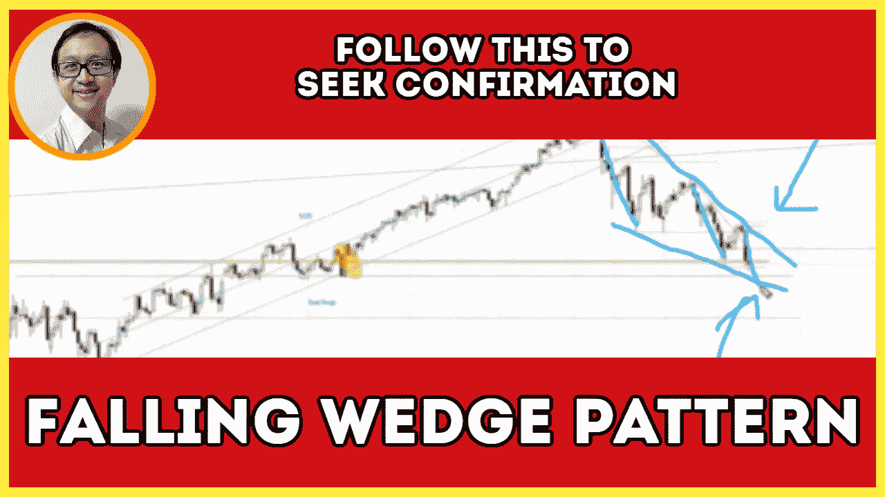

# 如何确认和交易下跌楔形模式(没人告诉你)——标准普尔 500 日交易

> 原文：<https://medium.datadriveninvestor.com/is-falling-wedge-forming-in-s-p-500-daily-market-analysis-5614745b019e?source=collection_archive---------30----------------------->

在市场展望部分，找出如何确认和交易下降的楔形形态(大多数交易者忽略了这一点)。

观看视频，了解 2020 年 9 月 24 日交易时段标准普尔 500 指数期货的**每日市场分析。在这段视频中，我将向大家展示上一个交易日的市场回顾和三分钟内的交易回顾(包括进场、出场和背后的原理)。展望未来，我将涵盖偏见，要注意的关键水平，我稍后的交易计划。**

## 时间戳

*   [1:10](https://www.youtube.com/watch?v=ZFGn3nC5bVY&t=70s) 昨日市场回顾
*   [7:03](https://www.youtube.com/watch?v=ZFGn3nC5bVY&t=423s) 贸易回顾
*   [10:00](https://www.youtube.com/watch?v=ZFGn3nC5bVY&t=600s) 努力与结果
*   [12:50](https://www.youtube.com/watch?v=ZFGn3nC5bVY&t=770s) 备用电源故障的迹象
*   当前的市场状况
*   [15:15](https://www.youtube.com/watch?v=ZFGn3nC5bVY&t=915s) 下降楔(下降楔)

如果你还没有看我在上一期的[每日市场分析视频](https://www.youtube.com/watch?v=WmrnNvhEUbw)，以便更好地了解市场回顾和交易回顾。

**偏向** —做空(日内交易)；看涨(长期)

**关键点位** —阻力:3260，3290–3300，3320，3360，3425，3450；支持:3200–3230

**潜在设置** —在关键级别寻找潜在反转。

# 资源

**每周市场展望&最佳交易建议**直达您的收件箱:[https://www.tradeprecise.com/](https://www.tradeprecise.com/)

**职业免费**制图平台:创建账户→[www.TradingView.com](https://bit.ly/2U2Femd)

**非美国居民？** ( **马来西亚、新加坡**、澳大利亚、新西兰、欧洲等):[点击此处，存款 2000 新加坡元](https://ji.hn/sgtiger)即可获得**免费股票(价值 100++美元&老虎经纪**的欢迎礼物)

美国居民？[点击此处，存款 1500 美元](https://ji.hn/ustradeup)，就有机会在 TradeUP 获得**份免费的 AMZN(价值 3000++** ) & **份欢迎礼物**

**从媒体获取无限文章** —加入以下:[https://priceactiontrading.medium.com/membership](https://priceactiontrading.medium.com/membership)

# 进一步阅读

 [## 部门轮换基金流入家具行业-瑞士联邦理工学院，霍夫，腿，TPX

### 虽然纳斯达克和标准普尔 500 已经调整了两个多星期，但家具板块已经走强，而且…

medium.datadriveninvestor.com](/sector-rotation-fund-flows-into-furniture-industry-eth-hoft-leg-tpx-de725bc791d5)  [## 这些银行股逆势而上——建行、凯德、EBC、TBBK、ISBC

### 过去两周，金融板块尤其是银行股跑赢大盘。当纳斯达克领先的时候…

medium.datadriveninvestor.com](/these-banking-stocks-buck-the-trend-ccb-cade-ebc-tbbk-isbc-d95c608692f0)  [## 凯西·伍德警告市场即将调整——标准普尔 500 价格走势分析

### 在 2020 年 12 月 18 日对彭博的采访中，方舟投资公司的首席执行官兼首席信息官凯西·伍德警告说…

medium.datadriveninvestor.com](/cathie-wood-warns-market-correction-soon-price-action-analysis-on-s-p-500-7e621e013310) 

Photo by Author — Ming Jong Tey

披露:如果您点击本文中的链接进行购买或开立账户，并将所需金额存入推荐的经纪人账户，我们将免费为您赚取佣金。

免责声明:本演示中的信息仅用于教育目的，不应作为投资建议。