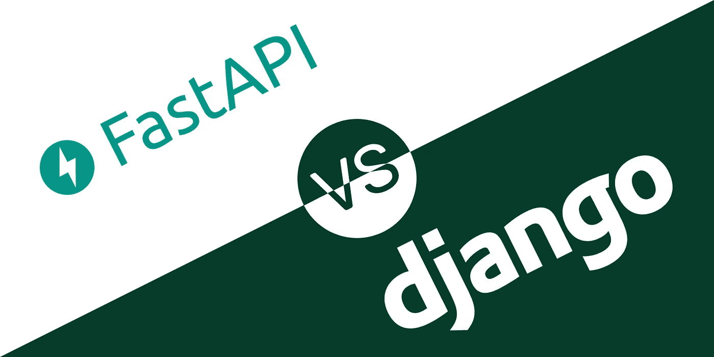
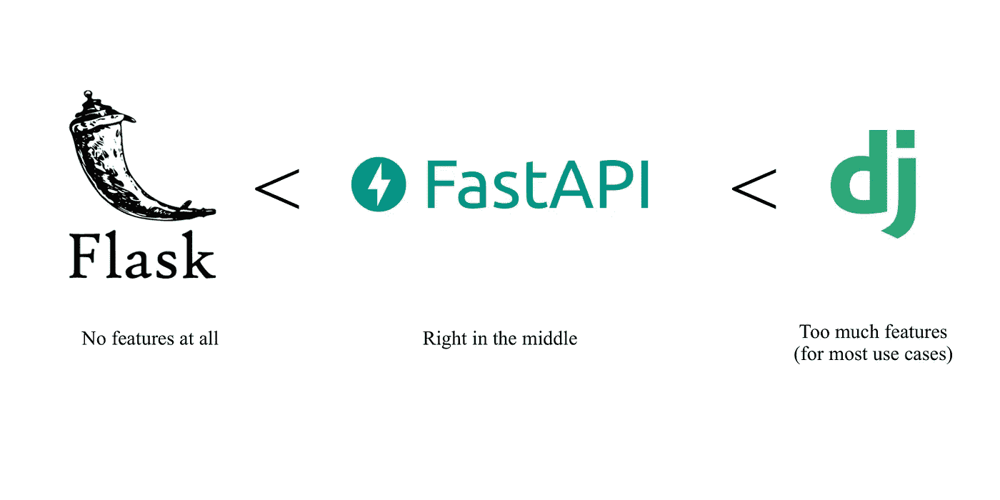

# FastAPI 会取代 Django 吗？

> 原文：<https://medium.datadriveninvestor.com/is-fastapi-going-to-replace-django-87441de76383?source=collection_archive---------0----------------------->

如果你是后端开发人员，那么你不可能没有听说过 Django，它通常是 Python 后端开发的首选框架。但是随着 Django 变得越来越大，我们开始遇到 Django 实现方式的新问题。我很高兴地告诉你，FastAPI 是来帮助解决这些问题的。

# 什么是 FastAPI？

FastAPI 是一个 Python web 框架，用于构建在开发和运行时都注重速度的 API，它构建在[Starlette](https://www.starlette.io)&[Pydantic](https://pydantic-docs.helpmanual.io/)之上，这是其速度的主要原因。它仍然是一个相对较新的项目，总体上比 Django 小得多。

FastAPI 获得了许多框架的最佳实践，并将它们结合在一起，形成了这个集所有优点于一身的大框架。其中一些特性包括 NodeJS，如性能、依赖注入、自动生成的交互式 API 文档和本地异步支持。FastAPI 还支持 openAPI 和 JSON Schema 等行业标准。

# 姜戈的问题

虽然 Django 是一个很好的框架，但主要问题是它变成了一个巨大的项目。因此，实现新功能或改变某些功能需要花费大量的时间和精力。

随着 Django 发展到目前的站点，新的特性要么被添加到主 Django 项目中，要么有人来为它编写一个包。每当我们想使用这个功能时，我们必须从软件包中获取它。虽然 Django 的这种模块化非常棒，但是我们可以看到在 Django 主项目中优先放置的内容和移动到单独的包中的内容之间有一点混合。
这方面的一个例子可以从 Django 至今没有对 RestAPIs 的原生支持中看出，你必须添加 [Django REST 框架](https://www.django-rest-framework.org/)包来获得这样的支持。与此同时，Jinja 是现成的。这主要是因为 Django 是一个老项目，开始于 API 还不像现在这样出名的时代。

这非常适合使用 Django 作为一个全栈应用程序，而无需实现 API，只需使用 Jinja 来呈现您的视图。但我认识的大多数人都不这么做，而是添加 Django Rest 框架，并将 Django 作为一个 API，供 React、Angular 或其他前端应用程序使用。

 [## 数据驱动的投资者|微软比 Chrome 有“优势”

### 简史我从来不是浏览器的粉丝，确切地说，我只是一个浏览器的粉丝，Chrome。这是我的…

www.datadriveninvestor.com](https://www.datadriveninvestor.com/2020/03/29/microsoft-having-an-edge-over-chrome/) 

随着 Django 的成长，它的开发周期已经放缓。添加新功能和赶上行业标准的速度一直很慢。像异步、WebSocket 和 NoSQL 数据库支持这样的特性仍然没有被添加到主项目中。

# 但是为什么是 FastAPI 呢？

FastAPI 试图解决 Django 的大部分问题，并且在很大程度上做到了。它实现了 Django 所缺少的大部分特性，甚至增加了一些新的特性，比如自动验证输入请求、强大的编辑器支持和 GraphQL 支持。对一些人来说，FastAPI 的另一个优点是开发速度更快，因为它是一个新项目。

Django 附带了很多大多数人不使用的特性，但有些人发现这些特性对于特殊用途很有用，这使得它变得有些多余。另一方面，另一个广泛使用的 Python 框架 Flask 恰恰相反。它几乎没有任何功能，你必须自己添加所有的东西。FastAPI 就在中间，它不是一个实现 ORM 的大型项目，也不是一个需要添加许多模块来完成基本工作的裸项目。这就是它如此伟大的原因。

How FastAPI compares to other popular Python Web Frameworks

# 好吧，好吧，如果 FastAPI 是完美的，我们为什么不摆脱姜戈？

不，别等那么快。Django 仍然是一个很棒的框架，我甚至在里面写了自己网站的后端。它的管理页面是最好的之一，它适合许多用例。它拥有强大的功能，比 FastAPI 稳定得多，它已经使用了很多年，一些大型平台都依赖于它#Instagram😅。它不会很快去任何地方，也不应该去。但与此同时，FastAPI 是一个很棒的新框架，它在某些方面比大多数其他框架做得更好。所以这是值得你关注的。你可以在这里访问 FastAPI 的文档[。](https://fastapi.tiangolo.com/)

你对姜戈和法斯特皮有什么看法，我很想听听你的想法。你可以留下评论，也可以通过 twitter @malikalbeik 联系我。

如果你喜欢这篇文章，并且想阅读更多关于 Python、云计算和 FastAPI 新趋势的文章，请到[malikalbeik.com](https://malikalbeik.com)来找我