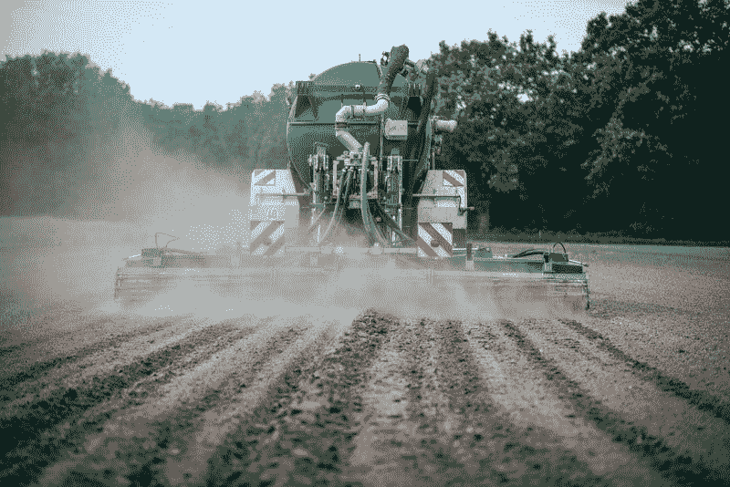

# 化肥在马赛克是价值投资吗？—市场疯人院

> 原文：<https://medium.datadriveninvestor.com/is-fertilizer-a-value-investment-at-mosaic-market-mad-house-ccf4b66a6edc?source=collection_archive---------13----------------------->

马赛克公司(NYSE: **MOS)** 有一些价值特征。例如，Mosaic 为一个可以想象的最无聊的项目挖掘成分；肥料。另外，**马赛克(NYSE: MOS)** 现在便宜了。2020 年 3 月 27 日，市场先生将 Mosaic 股票定价为 9.90 美元。

Mosaic 是全球最大的浓缩磷酸盐和钾盐矿商和市场。碳酸钾和磷酸盐是许多肥料的基本成分。详细来说，Mosaic 开采了 760 万吨钾肥，占全球钾肥产量的 13%？此外，Mosaic 声称它每年可以在北美生产 1170 万吨磷酸盐，在巴西生产 1050 万吨浓缩磷酸盐。

 [## 利用股市相关性的最佳方式|数据驱动的投资者

### 当阿尔弗雷德·温斯洛·琼斯开创了世界上第一个“对冲”基金(后来“d”被去掉了)时，他让其他投资者大吃一惊…

www.datadriveninvestor.com](https://www.datadriveninvestor.com/2020/02/02/the-best-way-to-use-stock-market-correlations/) 

镶嵌图的价值很简单，人们总是需要吃饭，农民总是需要肥料来种植作物。因此，马赛克的产品总会有市场。

# 马赛克赚钱了吗？

不幸的是，Mosaic 从它的生意中赚不到什么钱。例如，Mosaic 报告 2019 年 12 月 31 日的季度毛利为 8070 万美元。相比之下，Mosaic 公布的季度毛利为 4.662 亿美元。

令人震惊的是，Mosaic 在 2019 年 12 月 31 日报告了 11.95 亿美元的季度运营亏损。这意味着同一天的季度普通净亏损为 9 . 21 亿美元。然而，Mosaic 在 2019 年 12 月 31 日报告了 20.76 亿美元的季度收入。

相比之下，Mosaic 报告 2019 年 12 月 31 日的季度运营现金流为 277.60 美元。然而，Mosaic 在同一天报告了 3.46 亿美元的投资现金流、6，590 万美元的融资现金流和 1.263 亿美元的现金流。

# 马赛克有什么价值？

尽管有亏损和负数，Mosaic 还是有一些价值的。例如，Mosaic 报告 2019 年 12 月 31 日总资产为 192.99 亿美元，现金和短期投资为 5.191 亿美元。

然而，Mosaic 报告 2019 年 12 月 31 日的总负债为 99.30 亿美元。因此，Mosaic 可以赚一些钱，但它的发展遇到了困难。

例如，截至 2019 年 12 月 31 日的季度，Mosaic 的收入增长萎缩了 17.62%。我猜，马赛克的收入增长萎缩是因为特朗普总统的贸易战。解释一下，特朗普贸易战的主要目标包括中国、欧洲和墨西哥等大化肥市场。

# 马赛克有什么前途？

我认为马赛克有一个光明的未来，因为世界人口的增长。例如，皮尤研究中心[估计](https://www.pewresearch.org/fact-tank/2019/06/17/worlds-population-is-projected-to-nearly-stop-growing-by-the-end-of-the-century/)世界人口将从 2019 年的 78 亿增长到 2100 年的 109 亿。

因此，将会有更多的人口需要养活，对肥料的需求也会增加。然而，皮尤预计欧洲和拉丁美洲的人口将在 2100 年下降。例如，皮尤预计欧洲人口将在 2021 年达到 7.48 亿的峰值。

然而，皮尤预测亚洲人口将从 2020 年的 46 亿增长到 2055 年的 53 亿。重要的是，国际货币基金组织(IMF) [将](https://www.imf.org/en/News/Articles/2019/10/18/na102319-prolonged-uncertainty-weighs-on-asias-economy)亚洲称为全球增长最快的经济区域，2019 年增长率为 5%。

# 马赛克不断增长的市场

因此，经济增长最快的地区人口也在增长。例如，国际货币基金组织估计，中国对世界经济增长的贡献率为 39.2%。此外，印度对世界经济增长的贡献率为 16.2%。

具体来说，IMF 估计中国 2020 年的经济增长率为 5.8%，印度 2020 年的增长率为 7%。因此，印度和中国不断增长的人口将有更多的钱来购买更多的食物。

因此，马赛克肥料的市场将会越来越大。因此，我认为马赛克是一个股票投机者需要看看。

# 马赛克是好股票吗？

我认为 **Mosaic(纽约证券交易所代码:MOS)** 是一支不错的股票，其安全边际比你想象的要大。为此，马赛克公司于 2020 年 3 月 4 日支付了 5₵季度股息。

总体而言，2020 年 3 月 20 日，每股马赛克股票的股息率为 1.84%，20₵年化支付率为 46.22%。然而，Dividend.com 在同一天将一年的股息增长归功于马赛克。

因此，就其价格而言，马赛克是一只好股票。然而，马赛克并不适合心脏虚弱的人。为了解释这一点，Mosaic 的运营亏损表明一家公司处于风险之中，但 Mosaic 是一家生产我们需要的产品的公司。此外，我认为马赛克冠状病毒是可以预防的，因为无论新冠肺炎发生什么，它都能制造出全世界都需要的产品。

如果你想在具有价值特征的廉价股息股票上冒险。**马赛克公司**值得考察。我认为这家公司尽管存在问题，但会有一个光明的未来。

*原载于 2020 年 3 月 27 日 https://marketmadhouse.com**的* [*。*](https://marketmadhouse.com/is-fertilizer-a-value-investment-at-mosaic/)