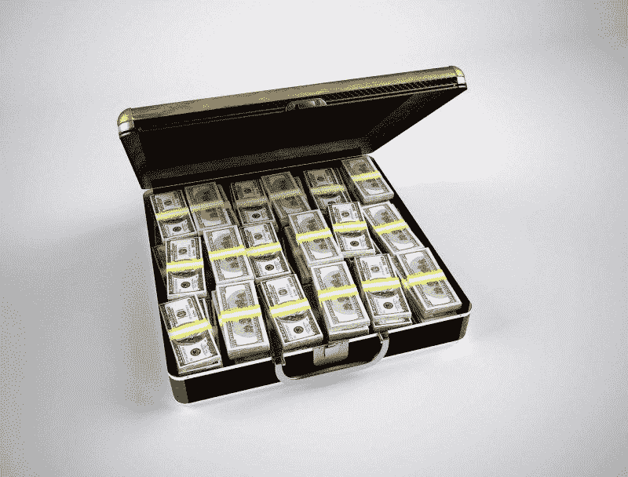
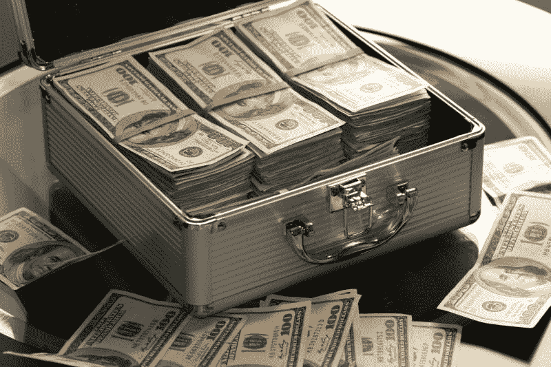

# 第一共和国银行是否从收入不平等中获利？—市场疯人院

> 原文：<https://medium.datadriveninvestor.com/is-first-republic-bank-profiting-from-income-inequality-market-mad-house-9cacb785a0b4?source=collection_archive---------6----------------------->

许多投资者打赌美国的收入不平等将会恶化。例如，第一共和国银行的股价从 2020 年 1 月 17 日的 118.18 美元上涨到 2021 年 1 月 20 日的 155.59 美元。

此外，市场先生于 2021 年 1 月 12 日支付了 163.30 美元收购第一共和国银行(纽约证券交易所代码:FRC) 。我认为收入不平等推动了第一共和的股价，因为第一共和是一家财富管理公司。

具体来说，**【第一共和国(FRC)** 为高净值人群提供个人银行、商业银行、私人财富管理服务；对富人的通俗委婉说法。我认为投资者购买 FRC 股票是因为他们认为富人会有更多的钱，对 First Republic 的服务有更大的需求。

第一共和的唯一顾客似乎是富人。这家[银行在旧金山、棕榈滩、杰克逊(杰克逊洞)、怀俄明州、帕洛阿尔托、曼哈顿、奥兰治县、纳帕、波士顿和圣地亚哥等高收入地区设有办事处。](https://www.firstrepublic.com/locations)

# 乔·拜登的当选解释了第一共和国的成长吗？

投资者看好第一共和国的一个原因可能是乔·拜登在总统选举中获胜。

拜登是一位温和的亲商业民主党人，有推动亲企业政策的历史。比如，拜登长期支持平衡预算、减少福利支出、降低税收和自由贸易。此外，拜登支持法律和秩序，支持帝国主义外交政策。

因此，拜登是美国富人想要的总统。拜登是反种族主义者，支持商业，国际主义者，对法律和秩序强硬，反对社会主义。拜登反对全民医保(单一支付者健康保险)，他对普通人的现金刺激不冷不热。然而，拜登喜欢给大企业减税和联邦现金。

具体来说，投资者认为拜登会支持将更多现金存入富人银行账户的政策。因此，First Republic 和其它财富管理公司可能会有更多业务。

# 有政治关系的银行

相反，第一共和国与即将离任的特朗普政府有联系。

该银行的网站夸口说，“Jim Herbert，(第一共和国的)创始人、董事长兼首席执行官，[已被任命为美国财政部社区发展金融机构(CDFI)基金的社区发展顾问委员会成员。”此外，第一共和国还向 CDFI 基金的社区发展公司和少数族裔存款机构(MDIS)投资了 4 . 43 亿美元。](https://www.firstrepublic.com/frb/shared/repositories/newsroom-folder/2020/12/11/chairman-and-ceo-jim-herbert-named-to-us-treasury-board)

因此，第一共和国有政治关系，这可以帮助它从联邦政府那里赚更多的钱。特别是，如果拜登能说服国会通过他的 1.9 万亿美元刺激计划。

# 第一共和银行赚钱吗？

**第一共和国银行**赚钱。2020 年 12 月 31 日，第一共和国报告季度毛利为 10.8 亿美元，营业收入为 3.7925 亿美元。

值得注意的是，季度毛利从 2019 年 12 月 31 日的 8.7746 亿美元增长，季度营业收入从 2019 年 12 月 31 日的 3.0904 亿美元增长。此外，第一共和国的季度收入从 2019 年 12 月 31 日的 10.94 亿美元增长到一年后的 11.79 亿美元。

然而，Stockrow 估计第一共和国的季度收入增长率从 2019 年 12 月 31 日的 [12.56%降至 2020 年 12 月 31 日的 7.72%](https://stockrow.com/FRC/financials/income/quarterly)。相反，Stockrow 报告第一共和国在 2020 年 12 月 31 日没有季度经营现金流。相比之下，2019 年 12 月 31 日，第一共和国报告的季度运营现金流为负-8.6379 亿美元。

# 第一共和国通过融资赚钱

重要的是，第一共和国从融资中赚钱。2020 年 9 月 30 日，第一共和国(FRC) 报告季度融资现金流为 44.19 亿美元。季度融资现金流从 2019 年 12 月 31 日的 58.87 亿美元下降。

值得注意的是，Stockrow 报告 2020 年 12 月 31 日第一共和国的融资没有现金。第一共和国报告 2020 年 9 月 30 日的季度期末现金流为 5.9198 亿美元，2020 年 12 月 31 日没有季度期末现金流。

第一共和国在 2020 年结束时拥有更多的现金。截至 2020 年 12 月 31 日，First Republic 拥有 50.95 亿美元的现金和短期投资。现金和短期投资从 2019 年 12 月 31 日的 17 亿美元增长。

# 第一共和国银行提供什么价值？

**第一共和国银行(NYSE: FRC)** 在 2020 年 12 月 31 日拥有 1425.02 亿美元的总资产。总资产从 2020 年 12 月 31 日的 1162.64 亿美元。

因此，第一共和国在 2020 年获得了资产和现金。因此，第一共和是一家成长中的公司。

我认为第一共和国是一个安全边际很高的增长和收入投资。例如，第一共和国银行将于 2021 年 1 月 27 日支付 20₵季度股息。

FRC 股息于 2019 年 10 月 30 日从 19₵增长。总体而言，第一共和在 2021 年 1 月 21 日提供了 80₵的远期年化股息和 51%的股息收益率。

如果你担心收入不平等，第一共和国的成功会吓一年。不过，如果你正在寻找财富管理方面的成长型投资，**第一共和国银行(FRC)** 值得考察。

*原载于 2021 年 1 月 20 日*[*【https://marketmadhouse.com】*](https://marketmadhouse.com/is-first-republic-bank-profiting-from-income-inequality/)*。*