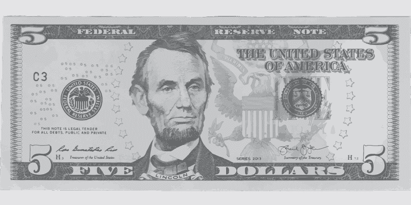

# 五低于美国最贵的股票吗？—市场疯人院

> 原文：<https://medium.datadriveninvestor.com/is-five-below-the-most-overpriced-stock-in-america-market-mad-house-8d67151a1902?source=collection_archive---------20----------------------->

折扣店 **Five Below Inc .(纳斯达克代码:FIVE)** 可能是美国估值最高的股票。

市场先生在 2020 年 12 月 15 日为**支付了 158.15 美元。此外，2020 年，Five Below 的股价从 1 月 2 日的 127.65 美元升至 12 月 15 日的 158.15 美元。**

[Five Below](https://www.fivebelow.com/info/about) 是一家小型零售商，声称在美国经营着 1000 多家店铺。Five Below 有一个不寻常的商业模式，它出售的所有东西的价格都在 1 美元到 10 美元之间。

# 五以下赚钱吗？

从那项业务中赚了一小笔钱。

以下五家公司报告 2020 年 10 月 31 日的季度营业收入为 2425 万美元。该季度运营收入从 2020 年 7 月 31 日的 3314 万美元下降到 2020 年 1 月 31 日的 1.441 亿美元。

冠状病毒几乎摧毁了 Five Below 2020 年的营收。以下五家公司在 2020 年 1 月 31 日的季度收入为 6.8713 亿美元。这些季度收入在 2020 年 4 月 30 日降至 2.009 亿美元，在 2020 年 7 月 31 日升至 4.2611 亿美元。2020 年 10 月 31 日，Five Below 的季度收入增至 4.7661 亿美元。

同样，Five Below 的季度毛利从 2020 年 1 月 31 日的 2.8913 亿美元下降至 2020 年 4 月 30 日的 2046 万美元。季度毛利于 2020 年 7 月 31 日上升至 1.3984 亿美元，于 2020 年 9 月 30 日上升至 1.511 亿美元。

# 下面五个产生多少现金？

我认为市场先生定价过高，因为它只赚很少的钱。例如，2020 年 10 月 31 日的季度净收入为 2043 万美元。

相反，以下五家公司报告 2020 年 10 月 31 日的季度运营现金流为 5984 万美元。季度运营现金流从 2020 年 7 月 31 日的 1.2672 亿美元下降到 2020 年 4 月 30 日的-6，524 万美元。以下五家公司在 2020 年 1 月 31 日的季度运营现金流为 1.8517 亿美元。

以下五家公司报告 2020 年 9 月 30 日季度末现金流为负-4329 万美元。季度期末现金流从 2020 年 7 月 31 日的 9058 万美元和 2020 年 4 月 30 日的 6976 万美元下降。以下五家公司从 2020 年开始，截至 2020 年 1 月 31 日的期末现金流为 1.2499 亿美元。

五岁以下的人很少还债。该公司报告 2020 年 10 月 31 日的季度融资现金流为 560，000 美元。这意味着上个季度 Five Below 的借款超过了其债务偿还额 56 万美元。

但是，五以下有少量债务。以下五家公司报告 2020 年 10 月 31 日负债总额为 14.26 亿美元，没有长期债务。

 [## 10 月份投资的最佳股票|数据驱动型投资者

### 根据最近的回报，这些股票在 10 月份及以后会有不错的表现。随着市场看到一点…

www.datadriveninvestor.com](https://www.datadriveninvestor.com/2020/10/19/the-best-stocks-to-invest-in-october/) 

# 五以下有什么价值？

我认为五个以下(五个)可能会因为资源有限而没钱倒闭。

例如，以下五位在 2020 年万圣节当天的总资产仅为 21.76 亿美元。此外，2020 年 10 月 31 日，以下五家公司有 2.1379 亿美元的现金和短期投资。

所以我觉得下面五个缺乏再一轮冠状病毒生存的资源。具体来说，Five Below 的收入如此之低，几个月的业务损失可能会让该公司无力支付账单或为商店进货。

因此，如果冠状病毒疫情继续，下面的五家可能会陷入零售死亡螺旋。当一家公司无法支付账单或购买库存时，就会出现零售死亡螺旋。

值得注意的是，Stockrow 估计，在截至 2020 年 4 月 30 日的季度中，Five Below 的[收入增长萎缩了 44.92%](https://stockrow.com/FIVE/financials/income/quarterly) 。相比之下，Five Below 的收入在截至 2020 年 7 月 31 日的季度中增长了 2.09%，在截至 2020 年 10 月 31 日的季度中增长了 26.28%。

# 五以下是可怕的股票

我看不出【T4 五低于(纳斯达克代码:五)】如何在这种过山车式的增长中生存。在我看来，五以下不是成长股，因为它的增长可以很快结束。

我建议投资者避开以下五家，因为我认为这家零售商会倒闭。我认为财务数据显示，以下五家公司的盈利不足以维持运营，也不足以支撑 158.15 美元的股价。

我认为五以下的股票很差。我认为任何人都没有理由去买它，因为低于 5 的股票不支付股息。希望投资者远离低于 5 的股票。

*原载于 2020 年 12 月 15 日*[*https://marketmadhouse.com*](https://marketmadhouse.com/is-five-below-the-most-overpriced-stock-in-america/)*。*

**访问专家视图—** [**订阅 DDI 英特尔**](https://datadriveninvestor.com/ddi-intel)