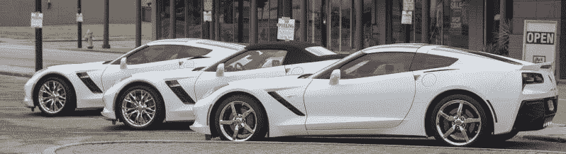
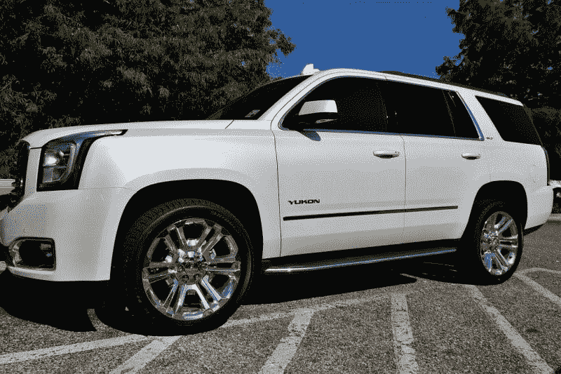
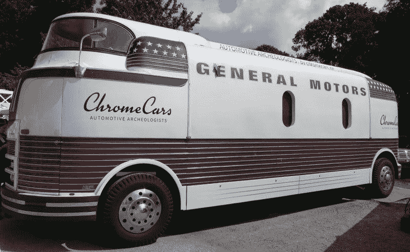
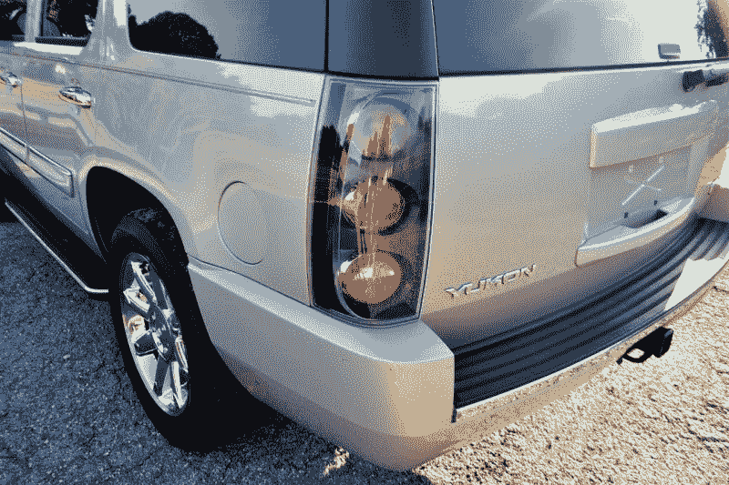
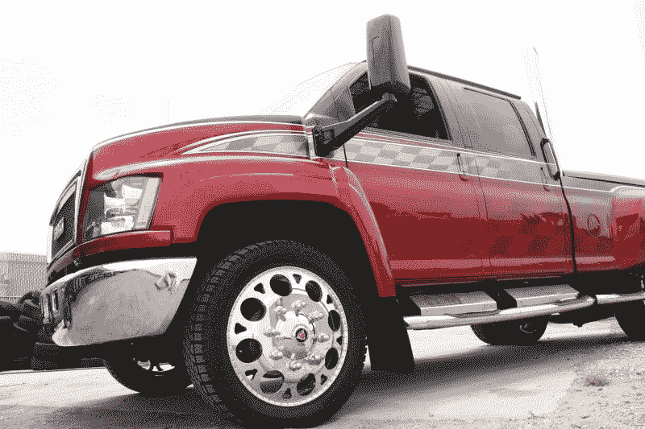
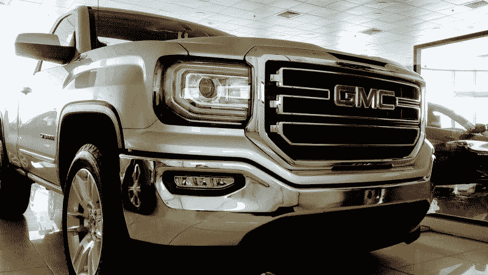

# 通用汽车注定会被遗忘吗？—市场疯人院

> 原文：<https://medium.datadriveninvestor.com/is-gm-doomed-to-oblivion-market-mad-house-f04d206f13e3?source=collection_archive---------5----------------------->

通用汽车公司可能面临厄运，因为它是唯一一家没有国际联盟的美国主要汽车制造商。

意大利菲亚特拥有通用的竞争对手**菲亚特-克莱斯勒(NYSE:FCAU)**；例如，FCAU 正在与法国 PSA 集团(标致和雪铁龙)合并。与此同时，**福特(纽约证券交易所代码:F)** 与世界最大的汽车制造商[建立了日益增长的合作关系](https://media.ford.com/content/fordmedia/fna/us/en/news/2019/07/12/ford-vw.html)；**大众汽车公司**。

相比之下，通用汽车正在从国际关系中抽身。例如，通用[在 2017 年将](https://www.nbcnews.com/business/autos/general-motors-agrees-sale-opel-vauxhall-psa-2-3bn-n729441)欧宝和沃克斯豪尔卖给了 PSA。

因此，在日益全球化的汽车工业中，通用汽车是一家以美国为中心的公司。这可能会让通用汽车在让电动汽车出现在你车道上的竞争中处于劣势。

 [## 在自动驾驶汽车发生事故的情况下，谁应该承担法律责任？数据驱动的投资者

### 我仍然认为自动驾驶汽车是一种奢侈品，而不是必需品…

www.datadriveninvestor.com](https://www.datadriveninvestor.com/2018/11/02/who-is-legally-accountable-in-the-case-of-an-autonomous-vehicle-accident/) 

福特；例如，能接触到大众的电动汽车技术。大众汽车； *CleanTechnica* [声称，该公司是电动汽车领域的领导者，有望在 2025 年生产 300 万辆电动汽车。](https://cleantechnica.com/2019/12/30/volkswagen-group-aiming-to-produce-3-million-electric-vehicles-in-2025-how-might-it-get-there/)

# 通用汽车要死了吗？

然而，通用汽车正试图通过大刀阔斧的重组来适应形势。美国消费者新闻与商业频道[报道](https://www.cnbc.com/2019/12/23/automakers-cut-jobs-close-factories-to-save-billions-in-2019.html)通用汽车在 2019 年裁员 14000 人并关闭 7 家工厂。

此外，据今日美国 T22 报道，通用汽车计划在其密歇根州哈姆川克的装配厂解雇 814 名工人。裁员是为了让通用汽车重组工厂，生产电动汽车。

通用汽车的部分业务正在增长；然而。据底特律自由新闻 [报道](https://www.freep.com/story/money/cars/general-motors/2019/12/18/gm-military-vehicles-self-driving/2631919001/)，通用防务公司是为美国陆军制造 2065 辆步兵车的价值 1.55 亿美元合同的三个最终候选人之一。步兵车是一种装甲 SUV，可以在战场上运送士兵。

# 通用汽车在增长吗？

通用防务公司将对雪佛兰科罗拉多 ZR2 中型皮卡车进行改装和装甲，以制造步兵车。

通用防务公司正在与奥什科什防务公司和弗莱尔防务公司、科学应用国际公司以及北极星政府和国防部竞争步兵车合同。通用防务公司的未来计划包括为军方制造电动汽车。

除了国防，通用汽车公司计划投资 10 亿美元在密苏里州的温茨维尔建造新版本的雪佛兰科罗拉多和 GMC 峡谷中型皮卡。*底特律自由报*报道通用汽车计划花费 5 亿美元购买供应商工具和机械来支持温茨维尔工厂。

皮卡对通用汽车的未来至关重要，因为美国最畅销的两款车是福特 F 系列和 Ram 皮卡。福特在 2019 年 1 月至 9 月期间销售了 661，574 辆 F 系列，菲亚特-克莱斯勒销售了 461，115 辆 Ram 皮卡，*汽车和司机* [估计](https://www.caranddriver.com/news/g27041933/best-selling-cars-2019/?slide=24)

此外，在此期间，美国第三大畅销车型是通用汽车的雪佛兰 Silverado 皮卡。通用汽车公司在 2019 年 1 月至 9 月期间销售了 412，259 辆 Silverados。

通用汽车需要升级其皮卡，以便在当今的汽车市场上生存和赚钱。特别是，通用汽车需要找到新的方式向普通美国人推销其皮卡。

# 通用汽车赚钱了吗？

**通用汽车(纽约证券交易所代码:GM)** 正在赚钱。事实上，通用汽车在 2019 年 9 月 30 日报告了 43.12 亿美元的季度毛利。值得注意的是，该季度利润低于 2019 年 9 月 30 日的 45.89 亿美元。

相比之下，通用汽车公司报告 2019 年 9 月 30 日的季度收入为 354.73 亿美元。这些收入从 2019 年 9 月 30 日的 360.6 亿美元和 2018 年 9 月 30 日的 357.91 亿美元下降。

此外，通用汽车报告 2019 年 9 月 30 日的营业收入为 23.04 亿美元，税后收入为 23.11 亿美元。

# 通用汽车是一家现金充裕的公司吗？

通用汽车是一家现金充裕的公司，2019 年 9 月 30 日报告的运营现金流为 65.53 亿美元。通用汽车的季度营业收入从 2019 年 6 月 30 日的 50.76 亿美元上升。

此外，通用汽车报告称，9 月末季度现金流为 27.18 亿美元，高于 6 月份的-6 亿美元。然而，通用汽车公司在 2019 年 9 月 30 日报告了负融资现金流-21.33 亿美元。

因此，通用汽车公司产生了大量的现金。因此，通用汽车具有汽车制造商的属性之一，我喜欢它产生大量的现金。

汽车制造商产生大量现金，因为人们需要每月支付现金，以防止他们的汽车被收回。因此，通用汽车拥有源源不断的现金流，这也是沃伦巴菲特喜欢它的原因。

伯克希尔哈撒韦公司(纽约证券交易所代码:BRK。B) 拥有通用汽车 5.1%的股份；72，269，696 股，2019 年 10 月 10 日，美国消费者新闻与商业频道[报道](https://www.cnbc.com/berkshire-hathaway-portfolio/)。巴菲特持有通用汽车的股票，因为通用汽车从其业务中产生现金。

巴菲特喜欢通用汽车的另一个原因是，它在季度末有剩余现金。因此，通用汽车公司在 2019 年 9 月 30 日报告了 267.76 亿美元的现金和短期投资。这一数字高于 2019 年 6 月 30 日的 241.21 亿美元。

# 通用汽车是一家成长中的公司吗？

通用汽车的收入和利润在增长，但增长率在下降。斯托克罗[估计](https://stockrow.com/GM/financials/income/quarterly)通用汽车 2019 年前三个季度的收入增长率萎缩。

具体而言，通用汽车报告这几个季度的收入增长率分别为-3.38%、-1.9%和-0.89%。因此，通用汽车赚了更多的钱，但业务却在萎缩。

然而，通用汽车有一些有趣的增长机会，包括皮卡，电动汽车和军用车辆。此外，通用汽车还有一个名为 Cruise 的自动驾驶汽车项目。

Cruise 从投资者那里筹集了 72.5 亿美元，投资者包括**软银**和**本田汽车(纽约证券交易所:HMC)** ，*连线* [报道](https://www.wired.com/story/gms-cruise-rolls-back-target-self-driving-cars/)。然而，Cruise 推迟了其自主出租车服务的计划。因此，Cruise 落后于正在进行真实世界自动驾驶汽车测试的[福特](https://www.citylab.com/transportation/2018/12/ford-argo-self-driving-cars-autonomous-vehicles-testing-miami/577303/)和 **Alphabet(纳斯达克股票代码:GOOGL)** [Waymo](https://waymo.com/) 。

因此，通用汽车有一些重要的增长机会，可以维持到未来。然而，通用汽车似乎落后于其主要竞争对手。

# 通用汽车是价值投资吗？

我认为通用汽车是一个价值投资，因为它有便宜的股票，大量的现金，非常有价值。

例如，通用汽车在 2019 年 9 月 30 日的总资产为 1509.64 亿美元。相反，通用汽车的总资产从 2019 年 6 月 30 日的 1524.31 亿美元下降。

相比之下，市场先生在 2020 年 1 月 6 日以 35.84 美元的价格收购了通用汽车公司(纽约证券交易所代码:GM)。然而，与福特相比，通用汽车的价格很高，市场先生在 2020 年 1 月 6 日为福特支付了每股 9.16 美元。

# 通用汽车是一个很好的股息股

通用汽车既是一个价值投资，也是一个很好的股息股。例如，通用汽车公司于 2019 年 12 月 5 日支付了 38₵季度股息。

总体而言，Dividend.com 报告称，2020 年 1 月 6 日，通用汽车股票的股息收益率为 4.07%，年化股息为 1.52 美元，股息支付率为 31.19%。然而，通用汽车公司最近没有经历股息增长。

我认为**通用汽车(纽约证券交易所代码:GM)** 是一只很好的廉价股息、收益和价值股票。相反，通用汽车是一只高风险股票，因为其北美业务限制了其增长潜力。因此，我认为规避风险的人需要避开通用汽车。

【https://marketmadhouse.com】原载于 2020 年 1 月 6 日**。**