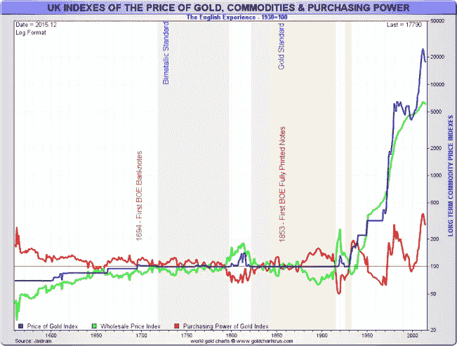

# 上帝的钱是好的投资吗…

> 原文：<https://medium.datadriveninvestor.com/is-gods-money-a-good-investment-ba2d4ab25f30?source=collection_archive---------8----------------------->

## …或者这只是人类制造的一个巨大的泡沫？

Source: Canva Pro

《假的》——罗伯特·京崎几乎两年前出版的书——大力宣传购买上帝的钱。

在书中，他称黄金为上帝的钱，无论全球发生什么，黄金都将永远存在。

巧合的是，罗伯特·京崎在 2019 年春天表达了对当前金融系统的极度不信任。声明说纸币是假的，因为它是凭空印刷的——基本上什么都没有。

政府发行没有实际价值的货币，总有一天印更多的钱会导致恶性通货膨胀，摧毁所有纸质资产类别的全部价值。

他说这同样适用于股票市场——股票是没有实际价值的账面资产。

显然，他不知道仅仅一年后，一种新的病毒引发了疫情病毒，政府在世界范围内的反应是尽可能多地印刷钞票。

他极力主张购买房地产或黄金等实物资产——他认为这是上帝的钱。

但是黄金真的是投资吗？

# 黄金的目的是什么？

如今，[黄金年产量主要用于](https://goldprice.com/project/facts-about-gold/#:~:text=Jewelry%3A%20Jewelry%20is%20still%20the,materials%2C%20dental%20work%20and%20electronics)珠宝(78%)，购买和持有(19%)，3%用于电子等行业。金是一种高效的导体，可以承载微小的电流，并且不会腐蚀。

但是现代就是现代，我们最多谈论 50-70 年。

大约 20 万年前，智人来到地球上的非洲，东南亚的考古发现显示智人的骨骼可以追溯到大约 10 万年前。

那些早期人类在没有金钱和黄金的情况下也过得很好。

当时一定发生了什么事情，因为在公元前 700 年，吕底亚人开始用黄金印刷货币。

在此之前，早在 6000 年前，闪亮的物体就被用于珠宝。许多文学文献显示了黄金的荣耀，这意味着黄金是上帝的货币。

荷马在《伊利亚特》和《奥德赛》(公元前 800-700 年)中提到黄金是不朽的荣耀，也是普通人财富的象征。

那么黄金的真正目的是什么？

这是我的理论:

> 交配

直到今天，女人仍然喜欢闪亮的东西。金子是磨光的，闪闪发光的东西。男人需要传播自己的精子来繁衍后代，需要女人来生孩子。

那么男人如何才能打动女人呢？没错。像金子一样闪闪发光的东西。

这是我对大约 6000 年前开始的对黄金的赞美的解释。它是生命的象征。几千年前，这个世界是一个稀缺和充满敌意的地方，对人类来说有许多危险。

如果大自然没有杀死它们，它们就开始自相残杀，以确保只有适者生存。

儿童是我们种族生存问题的解决之道。多生孩子增加了自己部落的生存风险。

因此，任何有助于交配过程的东西都被大大地美化了——比如黄金，因为它允许男人打开女人的子宫进行繁殖。

自从发现一个男人可以用许多珠宝、黄金和钻石打动一个或多个女人后，对他们的赞美就开始了。

# 黄金是最大的泡沫吗？

乔治·索罗斯有句名言:“黄金是终极泡沫。”他提到了当投机者哄抬投资价格超过其内在价值时出现的资产泡沫。

如前所述，黄金不像其他商品或资产那样有太多的内在价值。房子的内在价值是我可以住在里面，也可以出租给需要的人。

像汽油一样，我需要它来使用我的汽车或乘飞机去世界上一个遥远的地方。

此外，公司的股份代表了他们对社会功能的宝贵贡献。

黄金没有任何价值，就像法定货币一样，法定货币是由官方印制的货币。

想想吧。所有古代货币都消失了。你不相信？让我们问问维基百科:

> 过去的国际货币包括公元前五世纪创造的希腊德拉克马、罗马 T2 的德纳里、中世纪的拜占庭、中世纪的阿拉伯第纳尔、文艺复兴时期的威尼斯、佛罗伦萨、17 世纪的荷兰盾和法国法郎。

研究表明，平均每 100 年，像美元这样的主要货币就会消失。

除了黄金。使用黄金作为货币的第一个起源可以追溯到公元前 700 年，但当我们把它视为开始创造价值的珠宝时，它已经有 6000 多年的历史了。

没有任何其他资产类别可以显示这样的记录。

# 黄金作为社会契约的内在价值

似乎人类已经同意黄金是一种具有永恒价值的资产类别。

在古代，人们将黄金作为珠宝佩戴，以使自己看起来漂亮，并在搬家时携带一些有价值的东西。

想象一个没有信用卡和法定货币的世界，你想从欧洲搬到东南亚。是的，这是一个虚构的例子。

你会怎么做？我会卖掉我所拥有的一切，把它变成珠宝，环游世界，再把它兑换成房地产、购买杂货的钱，以及开始建立新企业的资本。

Source: [Bullionstar](https://www.bullionstar.com/blogs/koos-jansen/how-constant-is-golds-purchasing-power/)

黄金的惊人之处在于它的价格在短期和中期波动，但是

> 从长期来看，黄金的购买力像山一样不可动摇

这个图形的红线表示从 1600 年前到大约 2015 年测量的黄金购买力。

令人惊讶的是，红线总是非常接近 100，这意味着 1600 年购买的一公斤黄金今天仍然可以购买相同数量的商品。

没有膨胀，没有消失，什么都没有——像岩石一样稳定。

过去购买黄金并代代相传的人可以肯定，他的曾-曾-某事-的孩子手中仍有一些有价值的东西。

回到公司、货币和一切都会消失的说法，即使是房地产，黄金似乎是个例外。

在生活中，我最重要的学习之一是

> 看事物的本来面目，而不是我所希望的样子

生命中的一切都消失了，它的价值只是风中的尘埃。

除了黄金。用黄金来积累财富可能不是一个好主意，但它绝对能以很少的维护成本让财富代代相传。

有保障吗？不会，但它有很大概率在 100 年后仍像今天一样有同样的购买力。

**更多关于理财素养的故事:** [**点击此处**](https://christian-soschner.medium.com/17-great-stories-on-financial-literacy-4c7cbe5dbb10)

自 1999 年以来，我是各行各业公司的执行官、顾问和教练。我专攻企业发展和金融，从种子轮到 IPO 级别，从 2006 年开始专注于生命科学。

加入我的电子邮件列表，保持联系！

*本文仅供参考。不应将其视为财务或法律建议。在做出任何重大财务决定之前，请咨询财务专家。*

# 读者:

 [## 黄金是“上帝的钱”吗？-金钱上的玛雅

### 罗伯特清崎认为，我们都应该购买大量的黄金和白银，因为金融系统无疑将…

mayaonmoney.co.za](https://mayaonmoney.co.za/2019/06/is-gold-gods-money/) 

https://www . mec mining . com . au/top-5-uses-of-gold-one-the-world ' s-most-wanted-metals/#:~:text = probably % 20 the % 20 most % 20 important % 20 industrial，connecting % 20 wires % 20 and % 20 connection % 20 strips。

 [## 当美元由黄金支撑时

### 历史上，黄金一直被用作首选货币。已知最早的使用是在公元前 600 年的吕底亚

www.thebalance.com](https://www.thebalance.com/what-is-the-history-of-the-gold-standard-3306136) 

[https://www2 . palomar . edu/anthro/homo 2/mod _ homo _ 4 . htm #:~:text = So % 20 far % 2C % 20 the % 20 earliest % 20 finds，% 2d 40% 2C 000% 20 years % 20 affore](https://www2.palomar.edu/anthro/homo2/mod_homo_4.htm#:~:text=So%20far%2C%20the%20earliest%20finds,%2D40%2C000%20years%20ago)。

 [## 黄金的历史

### 黄金的历史。黄金的发现。黄金是如何被发现的。发现黄金的地方。当黄金被发现时…

onlygold.com](https://onlygold.com/facts-statistics/history-of-gold/)  [## 黄金的真正长期价值

### 随着西班牙王位继承战争的结束，法国国王路易十四承认他“太热爱战争了”…

www.bullionvault.com](https://www.bullionvault.com/gold-news/gold_value_real_020320094) 

[https://www . the balance . com/gold-the ultimate-bubble-has-burst-3970478 #:~:text = In % 202010% 2C % 20 commodities % 20 trader % 20 George，is % 20 the % 20 ultimate % 20 bubble % 20 asset](https://www.thebalance.com/gold-the-ultimate-bubble-has-burst-3970478#:~:text=In%202010%2C%20commodities%20trader%20George,is%20the%20ultimate%20bubble%20asset)。

 [## 黄金生产成本

### 黄金值多少钱？你为什么问这个？看着 kitco.com，不要打扰我们！是的，当然，我们知道…

www.sunshineprofits.com](https://www.sunshineprofits.com/gold-silver/dictionary/gold-production-cost/)  [## 投资:选择黄金和白银，而不是绿色

### 多年来，我一直非常看空美元。原因是我是学历史的学生…

www.richdad.com](https://www.richdad.com/resources/articles/investing-go-for-gold-and-silver-not-green) 

[https://gold price . com/project/facts-about-gold/#:~:text = Jewelry % 3A % 20 Jewelry % 20 is % 20 still % 20 the、materials % 2C % 20 dental % 20 work % 20 和%20electronics](https://goldprice.com/project/facts-about-gold/#:~:text=Jewelry%3A%20Jewelry%20is%20still%20the,materials%2C%20dental%20work%20and%20electronics) 。