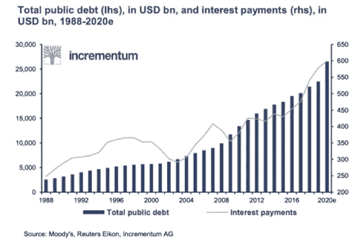
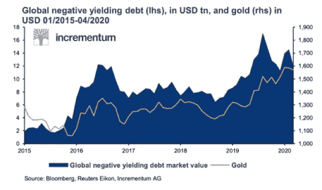
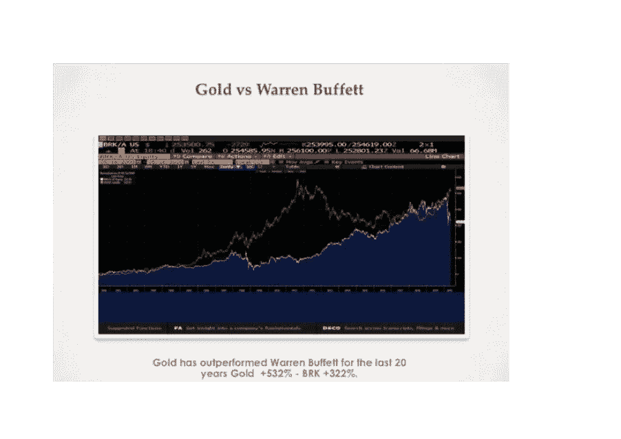
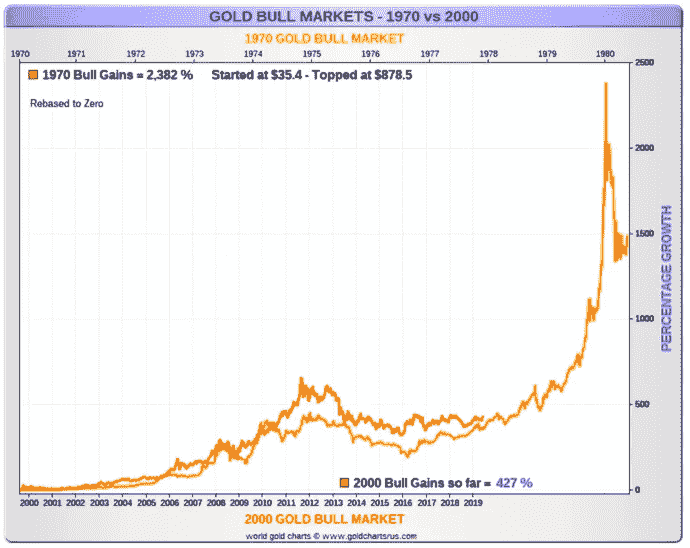

# 黄金正在成为主流吗？

> 原文：<https://medium.datadriveninvestor.com/is-gold-going-mainstream-c87042013b1c?source=collection_archive---------17----------------------->

黄金作为一种资产类别，有很多批评者，尤其是在机构群体中，但这种情况会改变吗？

俄亥俄州 160 亿美元的警察和消防养老基金正在步沃伦·巴菲特的后尘(伯克希尔·哈撒韦公司最近入股巴里克)，并对拥有黄金发表了重要声明。根据彭博的说法，它已经批准了 5%的黄金配置，以帮助基金的投资组合多样化，并“对冲通胀风险”。

问题是这是暂时现象还是一个大趋势的开始。现在，我认为投资一个新的资产类别，更多的是 FOMU(害怕搞砸)而不是 FOMO(害怕错过)。

让我谈谈你应该考虑黄金的三个理由。

**1)不断攀升的全球债务**

随着全球债务扶摇直上，偿还债务的成本也随之上升。以至于要实现这一点，利率需要很低，甚至在很多情况下为负。否则利息无法支付，我们就会违约。看一下这张图表…你不需要成为火箭科学家也能看到这个趋势。

看起来负收益债务还将持续一段时间。

这使得很多固定收益产品对投资者非常没有吸引力。尤其是那些经常寻求收入的机构。他们根本得不到他们需要的产量。

许多人决定“追逐收益”,这导致他们进入风险远高于他们所希望的资产类别。高产就是一个恰当的例子。

其他人将注意力转向了股票市场。但是，由于新冠肺炎事件，许多公司削减或停止派息，派息可能不是解决问题的办法。

同样值得指出的是，不持有黄金的主要原因——“它不产生任何收益”现在已经过时了。因为很多固定收益工具也没有。

**2)金价表现强劲**

这张图表会让你大吃一惊。这确实让我震惊。

如你所见，20 年来，黄金的表现超过了伯克希尔·哈撒韦公司。

这很可能是沃伦·巴菲特决定购买巴里克股票的一个原因。我们显然不知道，但这有一些令人信服的逻辑。

要知道，一些投资者可能会觉得他们已经“错失良机”，因为金价已经破纪录了。但如果你看看这张对比当前牛市和 20 世纪 70 年代牛市的图表，那么如果历史重演，黄金价格仍可能上涨很多(看红线)。

来源:Goldchartsrus—2020 年 2 月

**3)改善 ESG**

环境、社会和公司治理问题对机构投资者越来越重要。我认为公平地说，采矿可能是许多投资者在考虑 ESG 时想到的最后一个行业。从 ESG 的角度来看，很多人可能会将其视为“毫无希望”。

然而，一场悄然发生的革命正在带来改变。现在，我会说这是一个公司一个公司的基础上。但是当你从这个角度看待机会时，你会感到惊喜。

由于过去麻烦不断，人们普遍认为采矿业是一个“肮脏的行业”。但是许多投资者并不知道这个行业正在经历的转变。它需要洗清自己的名声，而且似乎正朝着正确的方向前进。

随着世界变得比以往任何时候都更加资源密集，该行业需要资本，现在它似乎正在跨越许多机构投资者所要求的 ESG 障碍。

最近，由于管理文化的改变，拥抱新技术并最终满足投资者需求的需要，该行业一直在进行无声但意义重大的飞跃。

矿业继续在环境、社会和治理的各个领域快速创新，而技术进步是这些努力的关键。在诸如在矿山规划中使用[人工智能](https://esgclarity.com/firms-use-artificial-intelligence-for-esg-index-range/)(减少矿山足迹)、改进安全实践和增加太阳能等可再生能源的使用等领域，进步正在显现。

主要的环境变化如下:

1)目前，矿山设计旨在将对环境的影响降至最低。[采矿公司在没有认真考虑环境和监管因素的情况下寻找和开采材料，这种做法已不再被接受。](https://esgclarity.com/achieving-sdgs-62-years-behind-schedule/)

2)有计划在矿区建设可再生能源发电站，不仅为采矿作业，也为当地社区提供负担得起的清洁电力，这对于任何开采企业来说都是一个重大举措，可以立即创造社会经济效益。

社会的

最重要的发展可能是引入了“社会作业许可证”，每个矿业公司在开采前必须获得该许可证。这是东道国和公司之间的合同，概述了公司保持良好做法的责任，否则将面临失去开采权的风险。

他们也越来越多地雇佣本地劳动力来支持地方计划和促进个体经济。矿业公司曾经是一个非常危险的职业，现在已经开始寻求对劳动力的零伤害。

管理

从投资者的角度来看，[治理](https://esgclarity.com/what-the-return-of-the-state-means-for-corporates-and-the-issue-of-governance/)可能是三个 ESG 元素中最难定义的。[采矿业的公司治理](https://esgclarity.com/what-we-can-learn-from-a-companys-governance-in-a-crisis/)包括公平对待所有少数族裔，将高管薪酬与包括工人和当地社区在内的所有利益相关方挂钩，以及制定强有力的政策和流程来打击腐败行为。它还涉及尽量减少避税计划和强大的网络安全等领域。

**结论**

虽然现在说这三个驱动因素是否会让机构对黄金矿业产生更大兴趣还为时过早，但加大参与是有一定逻辑的。就个人而言，在这个充满挑战的时代，我认为多样化是关键。如果你的投资组合中没有黄金，这当然值得考虑。

现在，我不认为投资组合中至少有 1%是黄金是荒谬的。

你怎么想呢?