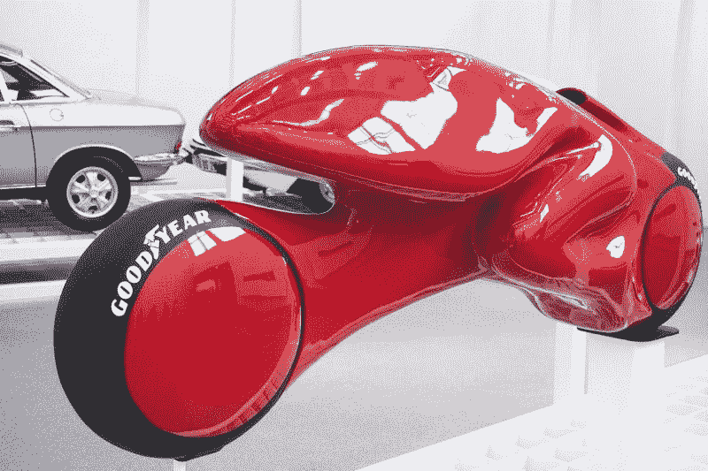
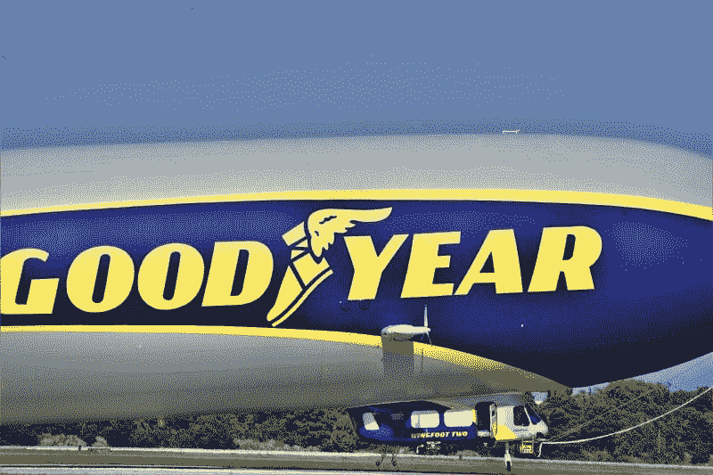
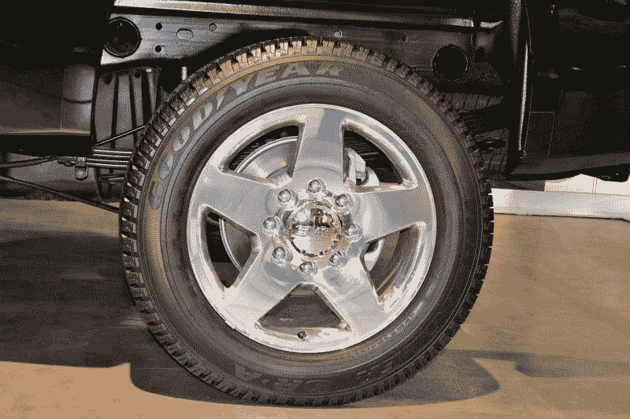
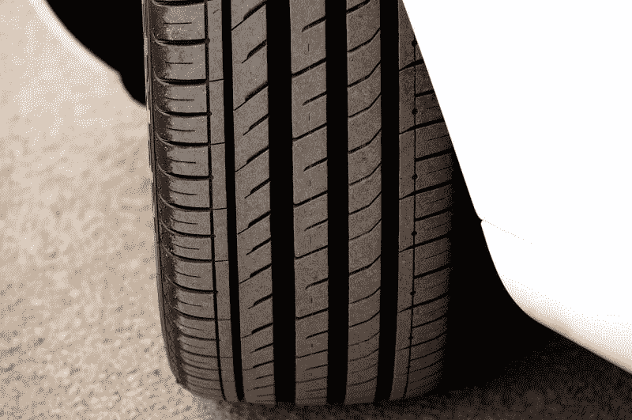
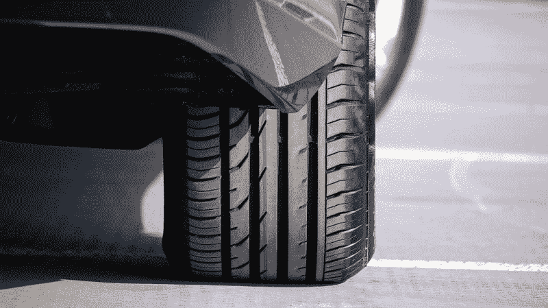

# 固特异是价值投资吗？—市场疯人院

> 原文：<https://medium.datadriveninvestor.com/is-goodyear-a-value-investment-market-mad-house-b60d42ca1ae?source=collection_archive---------10----------------------->

固特异轮胎橡胶公司可能是一个价值投资，因为它很便宜。

Statista [估计](https://www.statista.com/statistics/225677/revenue-of-the-leading-tire-producers-worldwide/)，固特异是世界第三大轮胎制造商，2018 年轮胎相关销售额为 150 亿美元。然而，市场先生在 2019 年 1 月 17 日为固特异股票支付了每股 14.93 美元。

固特异的价值案例很简单。未来的汽车无论是用柴油、汽油还是电力驱动，都需要轮胎。此外，自动驾驶汽车仍然需要轮胎。

 [## 数据驱动投资的兴起|数据驱动投资者

### 当 JCPenney 报告其 2015 年 2Q 的财务结果时，市场感到非常震惊。美国零售巨头…

www.datadriveninvestor.com](https://www.datadriveninvestor.com/2019/02/28/the-rise-of-data-driven-investing/) 

如果人们驾驶不同的车辆，固特异将提供轮胎。例如，今天的皮卡和 SUV 需要轮胎，就像 20 世纪 70 年代的乘用车和旅行车一样。

因此，无论汽车行业走向何方，固特异的标志性产品都会有市场。**亚马逊(纳斯达克股票代码:AMZN)** 送货车和**特斯拉(纳斯达克股票代码:TSLA)** 汽车和网络卡车将需要轮胎。

# 固特异赚钱了吗？

固特异开始赚钱了。该轮胎制造商于 2019 年 9 月 30 日报告了 8.37 亿美元的季度毛利。

此外，固特异当天公布的季度营业收入为 2.65 亿美元，季度净收入为 9000 万美元。然而，固特异报告称，截至 2019 年 9 月 30 日，季度末现金流为-5400 万美元。

这意味着固特异没有从其业务中产生现金，尽管截至 2019 年 9 月 30 日的季度运营现金流为 1.65 亿美元。固特异报告称，该期间的融资现金流为-2200 万美元。这意味着固特异可以借钱支付账单。

因此，固特异在 2019 年 9 月 30 日报告了 8.68 亿美元的现金和短期投资。这一数字低于 2019 年 6 月 30 日的 9.17 亿美元和 2018 年 9 月 30 日的 8.96 亿美元。

# 制造商为什么出售自己

因此，固特异正在努力产生足够的现金来维持运营。有趣的是，许多其他美国制造商发现自己处于同样的境地。

许多制造商通过将自己出售给私人公司来解决这个问题，如 Cerebus 资本管理公司或沃伦 T2 的伯克希尔哈撒韦公司(纽约证券交易所代码:BRK)。b)。其他公司；如**菲亚特-克莱斯勒**与外国公司合并。克莱斯勒先是与菲亚特合并，然后又与法国的 PSA 集团合并。

制造商采取这些举措的原因是显而易见的；现金。Cerebus 声称在 2020 年 1 月 15 日拥有 420 亿美元的资产。与此同时，斯托克罗估计伯克希尔哈撒韦公司(纽约证券交易所代码:BRK。A 在 2019 年 9 月 30 日的总资产为 7884.82 亿美元，现金和短期投资为 747.76 亿美元。

# 固特异会出售自己吗？

鉴于这些现实，固特异可以将自己出售给伯克希尔哈撒韦公司或一家私募股权公司。此外，固特异可能会与竞争对手合并，如日本的普利司通、德国的大陆集团、法国的米其林或日本的住友橡胶工业。

鉴于这些现实，固特异可以将自己出售给伯克希尔哈撒韦公司或一家私募股权公司。此外，固特异可能会与竞争对手合并，如日本的普利司通、德国的大陆集团、法国的米其林或日本的住友橡胶工业。

可能迫使固特异出售自己的事件是利率上升。目前，利率很低，因为美联储一直在降息。然而，堪萨斯城联邦储备银行行长埃丝特·乔治认为美国中央银行明年将不得不提高利率。

美联储在 2019 年秋季和夏季将利率从 1.5%下调至 1.75%。然而，如果美国陷入衰退，债务可能会变得便宜。

# 负利率对工业不利

**高盛(纽约证券交易所:GS)** 美国消费者新闻与商业频道[声称](https://www.cnbc.com/2020/01/15/fed-could-use-negative-rates-if-us-recession-hits-goldman-sachs-says.html)首席经济学家 Jan Hatzius 认为美联储可以在衰退期间实施负利率。在负利率的情况下，央行付钱给放贷者发行债务，付钱给借款者。

我认为负利率会让事情变得更糟，因为像固特异这样的公司会借更多的钱，而这些钱是他们无法偿还的。因此，它将加速向外国公司、私人股本或沃伦巴菲特(Warren Buffett)等大牌投资者出售工业。

我认为直接支付现金给普通美国人；如增加基本收入或社会保障，可能是更好的刺激手段。不幸的是，零利率是为数不多的不需要国会法案的刺激手段之一。

# 零利率在美国是可能的

解释一下，基本收入或社会保障的增加需要在国会两院通过，并由总统签署。我认为在今天的政治气候下，批准基本收入是不可能的，而 T2 的社会保障增加也不太可能。

然而，美联储可以通过其理事会的简单投票来实施零利率。鉴于国会山的僵局，我认为零利率在美国是可能的，这可能会导致灾难。

例如，我认为零利率将导致美国企业背负大量他们永远无法偿还的新债务。此外，许多企业将拒绝借钱或消费，这不会导致刺激。

当零利率结束时，企业将破产或出售自己以避免破产，因为他们无法支付更高的利率。愤世嫉俗者会声称，私募股权、华尔街和伯克希尔哈撒韦公司可以从中获利，但普通大众将遭受损失。

一个主要问题是，大部分零利率资金将直接进入私人股本投资者或企业高管的口袋。解释一下，一家企业可以利用零利率贷款购买机器人来取代工人，减少就业机会。因此，当越来越少的美国人有收入的时候，企业可以赚更多的钱。

# 固特异是一个好的投资吗？

**固特异(NYSE: GT)** 是一项很好的收益投资，因为它在 2019 年 10 月 31 日支付了一笔 16₵价值投资。

此外，Dividend.com 认为固特异连续五年实现了股息增长。2020 年 1 月 17 日，固特异股票的股息收益率为 4.26%，年化 64₵派息率为 27.7%。

此外，我认为固特异可以成为一个收购目标，从而提高其股票价值。因此，固特异是一种有趣的价值投资，尽管它产生现金的能力有限。

投资者可以从固特异股票中赚钱，但他们需要小心，因为该公司赚钱的能力有限。

*原载于 2020 年 1 月 17 日 https://marketmadhouse.com**[*。*](https://marketmadhouse.com/is-goodyear-a-value-investment/)*