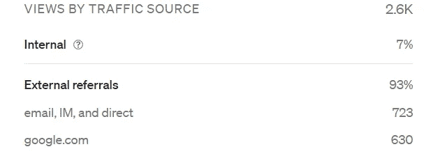
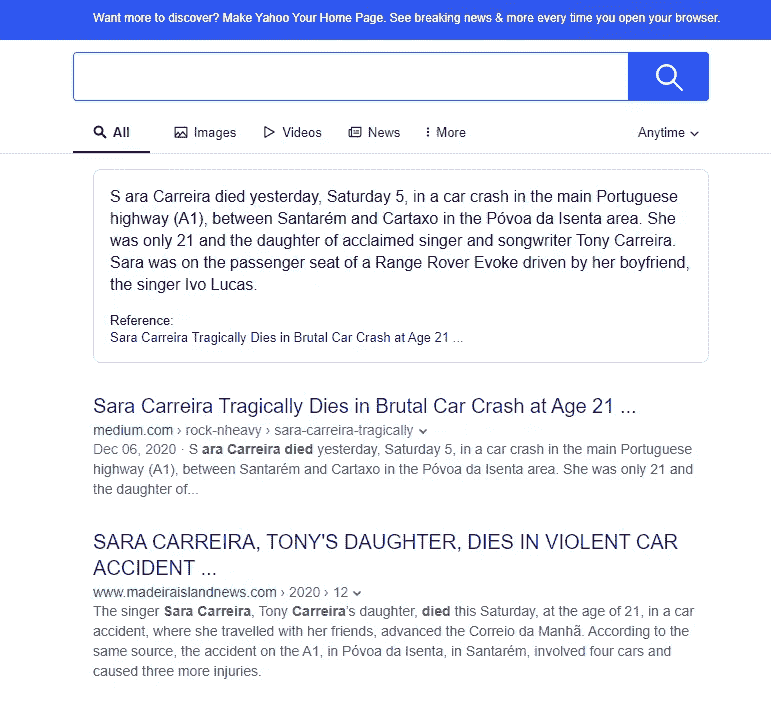
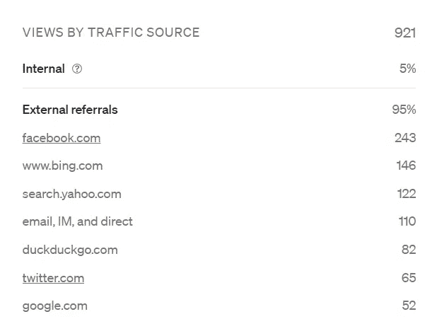

# 糟糕的搜索引擎优化实践会阻碍文章在谷歌上的排名

> 原文：<https://medium.datadriveninvestor.com/is-google-stewing-your-medium-views-score-fb30859c62b6?source=collection_archive---------7----------------------->

## 谷歌搜索引擎优化

## 我还没有破解谷歌搜索引擎优化算法，但我会分享我关于最佳搜索引擎优化实践的发现

Photo by [George Morina](https://www.pexels.com/@georgemorina?utm_content=attributionCopyText&utm_medium=referral&utm_source=pexels) from [Pexels](https://www.pexels.com/photo/desk-laptop-office-friends-4960464/?utm_content=attributionCopyText&utm_medium=referral&utm_source=pexels)

像你们中的许多人一样，我最近感觉到谷歌有机搜索的直接流量的浏览量大幅下降。

这种现象并不新鲜，据我所知，许多经验丰富的用户注意到最近对 Medium 算法的修改可能会导致视图数量的大幅下降。

我是一个谷歌狂热者，我花费数小时[检查统计数据和优化我的故事](https://moz.com/)来寻找完美的 SEO 模式。我已经尝试了几乎所有的方法，阅读了几十篇关于这个话题的文章。

Medium 拥有强大的页面权限(PA)和域名权限(DA ),这意味着当我们在 Medium 博客上发表文章时，任何帖子都会很快被 Google 抓取。因此，我们不需要通过[谷歌搜索控制台](https://search.google.com/search-console/welcome?hl=pt-PT)来完成所有优化链接的辛苦工作。

PA 和 DA 加上广大的受众，是我从自我管理的博客发展成为一种更具关系性的媒介体验的主要原因。

我在这里的经历是独一无二的，不要误解我，我已经写了这种变化如何改变了我的写作视角，使我成为一个更好的人。

九月底，我加入了 Medium，当时 Medium 正在进行一次大改造，发行标准也在更新。

在最后的调整发生之前，我仍然能够在上写我的第一篇文章，正如[在这里](https://byrslf.co/how-my-first-story-reached-2k-views-after-4-days-on-medium-9aee6f250c16)所解释的，它像病毒一样传播开来，因为有效的外部推荐，谷歌拿走了大部分份额:

旅程是带着很高的期望开始的。也许我有初学者的运气，用我的第一个媒体故事中了大奖。然而，从那一刻起，它就开始走下坡路了。

# 问题是

正如许多其他用户报告的那样，我每次查看自己的统计数据时都找不到任何来自谷歌的流量，这让我感到困惑。在过去的十年里，我一直在认真地写博客，搜索引擎的直接流量一直是浏览量的大头。

然而，至少对我来说，情况并非如此。每当我想让一个故事有一个良好的传播——对于一个新手来说，这意味着在头 24 小时内超过 100 次浏览——我必须把我的生意带到社交媒体上，并通过我所有的媒体渠道推广它。

最近我写了一篇关于葡萄牙歌手萨拉·卡雷拉悲惨死亡的文章。这是一篇新闻类型的文章，因此不适合在媒体上发布。

尽管如此，我觉得这是一个必须讲述的故事，因为每天有太多年轻的生命在世界各地的高速公路上丧生。我们都有责任为此做些什么。

 [## 萨拉·卡雷拉悲惨地死于残酷的车祸，年仅 21 岁

### 葡萄牙著名歌手托尼·卡雷拉的女儿，大卫·卡雷拉的妹妹萨拉当场死亡

medium.com](https://medium.com/rock-nheavy/sara-carreira-tragically-dies-in-brutal-car-crash-at-age-21-30b4e518b0cc) 

我一眨眼就写好了。这是一首发自内心的曲子。因此，我犯了几个 SEO 错误，因为我想尽快把它从我的系统中取出来，投入到这个世界中。

在那一点上，我没有把注意力放在结果上，而是只关注故事人性化的一面。

我大概是在 SEO 方面优化失败了。对于谷歌的标准来说，这个标题显得有点长。否则，我会一直牢记媒体创作者 SEO 指南。

> 在大多数情况下，如果你输入超过 60 个字符，谷歌会截断你的搜索引擎优化标题。你的潜在读者在谷歌搜索中只能看到前 60 个字符。让它有价值。它应该提供丰富的信息，并吸引点击。字面意思。文章内容要清晰准确。使用人们可能会在谷歌中搜索的单词和短语，并将它们放在你的 SEO 标题的开头。把不太重要的放在最后。

因此，这不是一个优秀优化的例子，但它在任何情况下都得到了显著的扩展。

> 可惜不是 Google 直接流量！

现在，从 SEO 的角度分析性能。我有一些有趣的发现。

# 洞察力

关于这个案例研究，只有外部推荐是相关的，因为我们专注于搜索引擎优化。

## 外部推荐

我一直在关注搜索引擎是如何抓取这篇文章的，我惊讶地发现必应、雅虎和 Duckduckgo 是第一个抓取这篇文章的。很长一段时间，谷歌对此一无所知。

进一步研究这个案例，我注意到这篇文章是如何迅速出现在推荐的搜索引擎的第一页上的:

Article rank on Yahoo

这些结果符合我们对像 Medium 这样值得信赖的平台的期望，也是我放弃以前的博客经历，加入 Medium magic 的主要原因。

我们都知道中型 SEO 开发者是如何努力给我们最好的写作体验和有用的 SEO 特性的。因此，我尽量遵守他们的[最佳实践指南](https://help.medium.com/hc/en-us/articles/360046058154-SEO-Best-Practices)。

> 如果你的故事在谷歌上看起来很棒，更多的读者会发现它。这里的 SEO 团队一直在努力改进，让你的故事更加引人注目。

Medium 甚至允许作者在其他平台上发布他们的作品，努力确保他们的[内容不会受到处罚](https://help.medium.com/hc/en-us/articles/217991468-About-SEO-and-duplicate-content)。

> Medium 的发布和交叉发布途径会自动添加规范链接，以保护您在异地发布的原始内容。这意味着如果内容发布在多个网站上，将不会受到处罚。

## 搜索引擎统计

让我们来看看关于视图的传入流量统计:

*   【bing.com **146(递增；昨天 138)**
*   **122(递增；昨天 14)**
*   ****duckduckgo.com**
    82(递增；昨天 77)**
*   ****google.com**
    52(焖；和以前一样)**

**如果搜索引擎优化之神宽大为怀，谷歌应该在搜索引擎中排名第一。然而，事实并非如此。**

**直到今天，我都无法通过谷歌搜索快速找到这篇文章。不管我用什么关键词都不显示。只有当我搜索完整标题和 edium.com 时，它才会出现在最上面。**

**我不是 SEO 专家；因此，如果有一个*技术* *忍者*能够研究它并提供进一步的数据来阐明这个话题，我将不胜感激。**

**然而，我认为关于谷歌如何抓取我们的媒体文章，还有一些我们还没有完全弄清楚的东西。一篇文章在每个搜索引擎上都名列前茅，但在谷歌上却没有显示出来，这是不合理的。**

**为了进一步分析这个案例，我有了另一种见解。我在 [Vocal.media](https://vocal.media/beat/singer-sara-carreira-david-carreira-s-sister-died-in-traffic-accident) 上发表了同一篇文章，对标题做了一些小改动，但没有影响主要关键词。**

** [## 歌手莎拉·卡雷拉，大卫·卡雷拉的妹妹，死于交通事故

### 萨拉·卡雷拉于昨天，也就是 5 号星期六，在葡萄牙主要高速公路(A1)上的一场车祸中丧生，地点在圣塔伦和…

有声媒体](https://vocal.media/beat/singer-sara-carreira-david-carreira-s-sister-died-in-traffic-accident) 

> 嘣！它很快就被谷歌抓取了。

Mozbar stats for Vocal.media homepage

查看 Moz 的数据，我们注意到 Vocal.media 和 Medium 具有相似的 DA (95)。然而，就 PA 而言，媒体(81)粉碎了有声媒体(46)。因此，如何解释爬行性能的差异呢？

> 谷歌在‘炖’中等链接吗？** 

# **最后的想法**

**不幸的是，我无法明确回答这个问题。我缺乏进一步调查的知识和数据。然而，我们有一些数据科学大师在这个平台上写作。**

**因此，知道了我是如何与世界上最好的数据探索者同行的，我希望这篇文章可以找到一个人，他可以提供真实的数据，说明如何通过 Medium 算法呈现我们的故事，对 Google 爬虫更有吸引力。**

**在过去的几个月里，我们中的许多人已经看到我们的故事外联转错了弯，从过山车上跌了下来。因此，我认为围绕这个共同的目标 [*将我们非凡的作家聚集到一个更相关的媒介*](https://ev.medium.com/toward-a-more-relational-medium-e801ff4653a4) 是至关重要的。**

## **附:2021 年 2 月更新**

**我目前正在修改我以前发表的故事 SEO，以确定 SEO 差异是如何造成这个问题的。当我收集到新的数据时，我会带着新的数据回到这个话题。**

> **大数据就像青少年性行为:每个人都在谈论它，没有人真正知道如何做，每个人都认为其他人都在做，所以每个人都声称自己在做。— *丹·艾瑞里***

****** [## 我的第一个故事如何在媒体上发布 4 天后达到 2K 浏览量

### 以及它迄今为止赚到的惊人的钱数。

byrslf.co](https://byrslf.co/how-my-first-story-reached-2k-views-after-4-days-on-medium-9aee6f250c16)  [## 走进兔子洞:2020 年芮迷宫指南

### 我是如何决定做一朵野花而不是壁花，跟随白兔进入仙境的

rui-alves.medium.com](https://rui-alves.medium.com/down-the-rabbit-hole-the-2020-guide-to-ruis-labyrinth-of-contents-caec452b0922)**